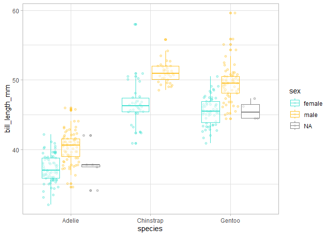
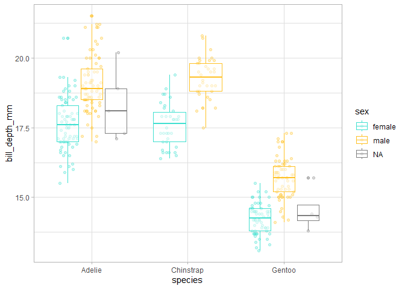
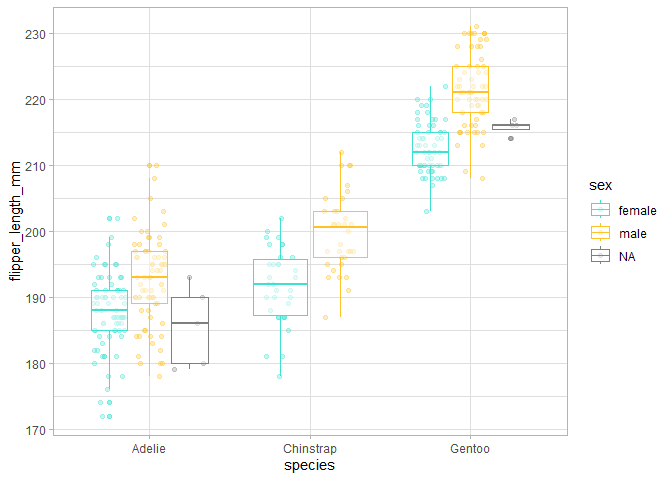
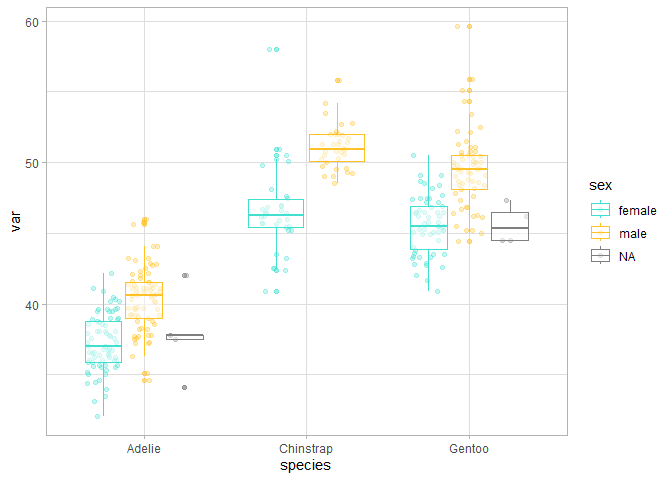
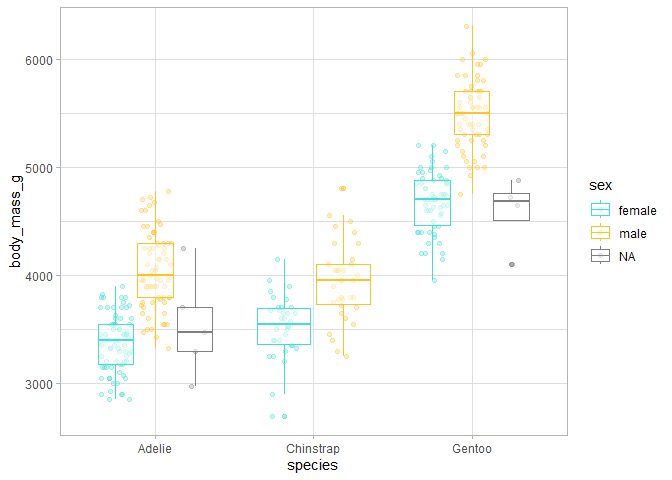
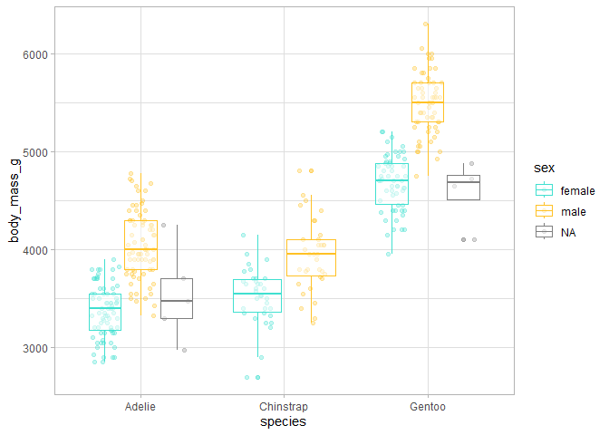

# Programación funcional en R
Julen Astigarraga y Verónica Cruz-Alonso
15/05/2024

- [<span class="toc-section-number">1</span>
  Presentación](#presentación)
  - [<span class="toc-section-number">1.1</span> Estructura del
    curso](#estructura-del-curso)
  - [<span class="toc-section-number">1.2</span> Quiénes
    somos](#quiénes-somos)
- [<span class="toc-section-number">2</span> Introducción a la
  programación en R](#introducción-a-la-programación-en-r)
  - [<span class="toc-section-number">2.1</span> Conceptos muy
    básicos](#conceptos-muy-básicos)
  - [<span class="toc-section-number">2.2</span> Tidyverse](#tidyverse)
- [<span class="toc-section-number">3</span> Introducción a la
  programación funcional](#introducción-a-la-programación-funcional)
  - [<span class="toc-section-number">3.1</span> ¿Cuándo hay que usar
    una función?](#cuándo-hay-que-usar-una-función)
- [<span class="toc-section-number">4</span> Teoría sobre funciones en
  R](#teoría-sobre-funciones-en-r)
- [<span class="toc-section-number">5</span> Cómo escribir
  funciones](#cómo-escribir-funciones)
  - [<span class="toc-section-number">5.1</span>
    Argumentos](#argumentos)
  - [<span class="toc-section-number">5.2</span> Valores de
    retorno](#valores-de-retorno)
- [<span class="toc-section-number">6</span> Programación
  imperativa](#programación-imperativa)
- [<span class="toc-section-number">7</span> Programación
  funcional](#programación-funcional)
- [<span class="toc-section-number">8</span> Iteraciones sobre un
  argumento](#iteraciones-sobre-un-argumento)
  - [<span class="toc-section-number">8.1</span> Nuestro primer
    funcional: generando listas,
    `map()`](#nuestro-primer-funcional-generando-listas-map)
  - [<span class="toc-section-number">8.2</span> Nuestro segundo
    funcional: generando vectores,
    `map_*()`](#nuestro-segundo-funcional-generando-vectores-map_)
- [<span class="toc-section-number">9</span> Iteraciones sobre múltiples
  argumentos](#iteraciones-sobre-múltiples-argumentos)
  - [<span class="toc-section-number">9.1</span> Nuestro tercer
    funcional: dos entradas,
    `map2()`](#nuestro-tercer-funcional-dos-entradas-map2)
  - [<span class="toc-section-number">9.2</span> Nuestro cuarto
    funcional: múltiples entradas,
    `pmap()`](#nuestro-cuarto-funcional-múltiples-entradas-pmap)
- [<span class="toc-section-number">10</span> Sin salida](#sin-salida)
  - [<span class="toc-section-number">10.1</span> Nuestro quinto
    funcional: `walk()`, `walk2()` y
    `pwalk()`](#nuestro-quinto-funcional-walk-walk2-y-pwalk)
- [<span class="toc-section-number">11</span> Más variantes de
  `map()`](#más-variantes-de-map)
  - [<span class="toc-section-number">11.1</span> `modify()` e
    `imap()`](#modify-e-imap)
- [<span class="toc-section-number">12</span> Funcionales predicate y
  demás](#funcionales-predicate-y-demás)
  - [<span class="toc-section-number">12.1</span> Operadores
    funcionales](#operadores-funcionales)
- [<span class="toc-section-number">13</span> Más
  información](#más-información)
  - [<span class="toc-section-number">13.1</span>
    Paralelización](#paralelización)
  - [<span class="toc-section-number">13.2</span> Programación orientada
    a objetos (POO)](#sec-POO)
  - [<span class="toc-section-number">13.3</span> Enlaces de
    interés](#enlaces-de-interés)

## Presentación

Los **objetivos** de este taller son:

- aprender las bases de la programación en R

- aprender a escribir funciones

- aplicar funciones en programación iterativa mediante el paquete
  {purrr} de {tidyverse}

- aprender estilos de código que facilitan su comprensión (📝)

Dentro del modelo de ciencia de datos de Hadley Wickham
([Figure 1](#fig-datascience)), el curso de centra en el marco que
envuelve todo el proceso, es decir, la programación.


### Estructura del curso

<table style="width:75%;">
<colgroup>
<col style="width: 59%" />
<col style="width: 15%" />
</colgroup>
<thead>
<tr class="header">
<th>Bloques</th>
<th>Día</th>
</tr>
</thead>
<tbody>
<tr class="odd">
<td><p>Presentación del curso</p>
<p>Introducción a la programación en R</p>
<p>Introducción a la programación funcional</p></td>
<td>13/05/24</td>
</tr>
<tr class="even">
<td><p>Teoría sobre funciones en R</p>
<p>Cómo escribir funciones</p></td>
<td>15/05/24</td>
</tr>
<tr class="odd">
<td><p>Programación imperativa</p>
<p>Programación funcional</p>
<p>Iteraciones sobre uno y dos argumentos</p></td>
<td>20/05/24</td>
</tr>
<tr class="even">
<td><p>Iteraciones sobre múltiples argumentos</p>
<p>Iteraciones sin salida</p>
<p>Más variantes de <code>map()</code></p>
<p>Funcionales predicate y demás</p></td>
<td>22/05/24</td>
</tr>
</tbody>
</table>

<!--# Vero: yo llamaría a más variantes y funcionales predicate como "Operadores y otros funcionales" -->

### Quiénes somos


Coordinamos el [grupo de trabajo de
Ecoinformática](https://ecoinfaeet.github.io/website/index.html) de la
Asociación Española de Ecología Terrestre.

Y vosotros ¿quiénes sois?

<https://www.menti.com/al2sdohesi5u>

## Introducción a la programación en R


### Conceptos muy básicos

- R: lenguaje de programación dinámico (se interpreta el código en el
  momento que se ejecuta).

- RStudio: es un entorno de desarrollo integrado para programar en R.
  Tiene cuatro zonas diferenciadas: el editor de código, la consola
  (donde se ejecuta el código), el navegador del espacio de trabajo (con
  el entorno –*environment-* y el historial de comandos) y el mix de
  abajo a la derecha (Archivos, Gráficos, Paquetes, Ayuda).

- Objetos: cualquier elemento almacenado con un nombre específico.
  Pueden ser de muchos tipos: `numeric`, `integer`, `logical`,
  `data.frame`, `SpatVector`, etc.

- Funciones: objetos de R que toman un vector de entrada y dan como
  resultado otro vector haciendo una acción concreta (funcionalidad
  específica). Son los *bloques de construcción* fundamentales en
  cualquier script de R que es un lenguaje funcional.

  

> Para comprender la computación en R, resultan útiles dos lemas:
>
> \- Todo lo que existe es un objeto.
>
> \- Todo lo que sucede es una llamada a función.
>
> — John Chambers ([Advanced R](https://adv-r.hadley.nz/index.html))

- Paquetes o librerias: contienen funciones reutilizables, documentación
  sobre cómo usarlas y datos de ejemplo. Son las unidades fundamentales
  de código reproducible en R.

- CRAN: the Comprehensive R Archive Network.

``` r
3 + 2 # ejecuto un comando con CTRL+ENTER (CTRL+R)
```

    [1] 5

``` r
15 / 20 * 100
```

    [1] 75

``` r
1:50
```

     [1]  1  2  3  4  5  6  7  8  9 10 11 12 13 14 15 16 17 18 19 20 21 22 23 24 25
    [26] 26 27 28 29 30 31 32 33 34 35 36 37 38 39 40 41 42 43 44 45 46 47 48 49 50

``` r
sum(1:3) # función y argumentos
```

    [1] 6

``` r
?sum
```

    starting httpd help server ... done

``` r
# install.packages("palmerpenguins")
library(palmerpenguins) # la funcion library carga paquetes

palmerpenguins::penguins # :: permite explorar que hay dentro de los paquetes
```

    # A tibble: 344 × 8
       species island    bill_length_mm bill_depth_mm flipper_length_mm body_mass_g
       <fct>   <fct>              <dbl>         <dbl>             <int>       <int>
     1 Adelie  Torgersen           39.1          18.7               181        3750
     2 Adelie  Torgersen           39.5          17.4               186        3800
     3 Adelie  Torgersen           40.3          18                 195        3250
     4 Adelie  Torgersen           NA            NA                  NA          NA
     5 Adelie  Torgersen           36.7          19.3               193        3450
     6 Adelie  Torgersen           39.3          20.6               190        3650
     7 Adelie  Torgersen           38.9          17.8               181        3625
     8 Adelie  Torgersen           39.2          19.6               195        4675
     9 Adelie  Torgersen           34.1          18.1               193        3475
    10 Adelie  Torgersen           42            20.2               190        4250
    # ℹ 334 more rows
    # ℹ 2 more variables: sex <fct>, year <int>

``` r
# loadedNamespaces()

guau <- 2 # flecha de asignacion
guau # al ejecutar un objeto el nombre se sustituye por su contenido
```

    [1] 2

``` r
guau + 4
```

    [1] 6

``` r
miau <- guau + 4 + guau
miau
```

    [1] 8

``` r
str(miau)
```

     num 8

``` r
# objetos un poco más complejos
miprimerdataframe <- data.frame(columna1 = guau,
  columna2 = miau)
str(miprimerdataframe)
```

    'data.frame':   1 obs. of  2 variables:
     $ columna1: num 2
     $ columna2: num 8

``` r
miprimeralista <- list(elemento1 = guau,
  elemento2 = miau)
str(miprimeralista)
```

    List of 2
     $ elemento1: num 2
     $ elemento2: num 8

#### Ejercicio

1.  Elije un número y multiplicalo por 3

2.  Crea un objeto que contenga 100 valores entre 1900 y 2000

3.  Suma un número a tu objeto

4.  Multiplica tu objeto por sí mismo

📝Los nombre de los objetos deben ser descriptivos y no pueden contener
símbolos especiales (`^`, `!`, `$`, `@`, `+`, `-`, `/`, `*`).

📝R es sensible a las mayúsculas. Mejor no usarlas.

### Tidyverse

[*Tidyverse*](https://www.tidyverse.org/) es una colección de paquetes
(meta-paquete) de R desarrollado por Hadley Wickham. Contiene ocho
paquetes principales: `readr`, `tibble`, `dplyr`, `tidyr`, `stringr`,
`forcats`, `ggplot2` y `purrr`. *Tidyverse* puede considerarse un
dialecto del lenguaje de programación de R y, por ello, puede resultar
difícil de aprender para gente con experiencia en el lenguaje
tradicional de R base. Sin embargo, en este curso queremos enseñar las
bases de programación utilizando *tidyverse* ya que en las secciones de
iteración utilizaremos fundamentalmente `purrr` por razones que
explicaremos más adelante.

*Tidyverse* está diseñado para respaldar las actividades de un analista
de datos humano por lo que sus estructuras de programación resultan más
lógicas para la mente humana. Todos los paquetes están diseñados para
trabajar con datos ordenados ([*tidy
data*](https://cran.r-project.org/web/packages/tidyr/vignettes/tidy-data.html)),
es decir, aquellos donde cada columna es una variable, cada fila una
observación y cada celda tiene un valor. Además, las funciones están
preparadas para concatenarse a través del operador *pipe* (`%>%` del
paquete `magrittr` o `|>` de R base), que coge lo que está en su
izquierda y lo utiliza como el primer argumento de la función que está
en su derecha. Esto permite seguir un flujo de lectura de izquierda a
derecha, más cómodo para la mayoría de la gente.

💡Los dos operador *pipe* tienen pequeñas
[diferencias](https://www.tidyverse.org/blog/2023/04/base-vs-magrittr-pipe/)
pero en general el comportamiento es el mismo.

``` r
mivector <- c(6, 4)
mean(mivector)
```

    [1] 5

``` r
mivector |> mean() # CTRL+SHIFT+M para poner un pipe
```

    [1] 5

``` r
length
```

    function (x)  .Primitive("length")

``` r
# install.packages("tidyverse")
library(tidyverse)

penguins <- palmerpenguins::penguins
penguins
```

    # A tibble: 344 × 8
       species island    bill_length_mm bill_depth_mm flipper_length_mm body_mass_g
       <fct>   <fct>              <dbl>         <dbl>             <int>       <int>
     1 Adelie  Torgersen           39.1          18.7               181        3750
     2 Adelie  Torgersen           39.5          17.4               186        3800
     3 Adelie  Torgersen           40.3          18                 195        3250
     4 Adelie  Torgersen           NA            NA                  NA          NA
     5 Adelie  Torgersen           36.7          19.3               193        3450
     6 Adelie  Torgersen           39.3          20.6               190        3650
     7 Adelie  Torgersen           38.9          17.8               181        3625
     8 Adelie  Torgersen           39.2          19.6               195        4675
     9 Adelie  Torgersen           34.1          18.1               193        3475
    10 Adelie  Torgersen           42            20.2               190        4250
    # ℹ 334 more rows
    # ℹ 2 more variables: sex <fct>, year <int>

``` r
summary(penguins)
```

          species          island    bill_length_mm  bill_depth_mm  
     Adelie   :152   Biscoe   :168   Min.   :32.10   Min.   :13.10  
     Chinstrap: 68   Dream    :124   1st Qu.:39.23   1st Qu.:15.60  
     Gentoo   :124   Torgersen: 52   Median :44.45   Median :17.30  
                                     Mean   :43.92   Mean   :17.15  
                                     3rd Qu.:48.50   3rd Qu.:18.70  
                                     Max.   :59.60   Max.   :21.50  
                                     NA's   :2       NA's   :2      
     flipper_length_mm  body_mass_g       sex           year     
     Min.   :172.0     Min.   :2700   female:165   Min.   :2007  
     1st Qu.:190.0     1st Qu.:3550   male  :168   1st Qu.:2007  
     Median :197.0     Median :4050   NA's  : 11   Median :2008  
     Mean   :200.9     Mean   :4202                Mean   :2008  
     3rd Qu.:213.0     3rd Qu.:4750                3rd Qu.:2009  
     Max.   :231.0     Max.   :6300                Max.   :2009  
     NA's   :2         NA's   :2                                 

``` r
glimpse(penguins)
```

    Rows: 344
    Columns: 8
    $ species           <fct> Adelie, Adelie, Adelie, Adelie, Adelie, Adelie, Adel…
    $ island            <fct> Torgersen, Torgersen, Torgersen, Torgersen, Torgerse…
    $ bill_length_mm    <dbl> 39.1, 39.5, 40.3, NA, 36.7, 39.3, 38.9, 39.2, 34.1, …
    $ bill_depth_mm     <dbl> 18.7, 17.4, 18.0, NA, 19.3, 20.6, 17.8, 19.6, 18.1, …
    $ flipper_length_mm <int> 181, 186, 195, NA, 193, 190, 181, 195, 193, 190, 186…
    $ body_mass_g       <int> 3750, 3800, 3250, NA, 3450, 3650, 3625, 4675, 3475, …
    $ sex               <fct> male, female, female, NA, female, male, female, male…
    $ year              <int> 2007, 2007, 2007, 2007, 2007, 2007, 2007, 2007, 2007…

``` r
View(penguins)

# filter
penguins |> 
  filter(island == "Dream") 
```

    # A tibble: 124 × 8
       species island bill_length_mm bill_depth_mm flipper_length_mm body_mass_g
       <fct>   <fct>           <dbl>         <dbl>             <int>       <int>
     1 Adelie  Dream            39.5          16.7               178        3250
     2 Adelie  Dream            37.2          18.1               178        3900
     3 Adelie  Dream            39.5          17.8               188        3300
     4 Adelie  Dream            40.9          18.9               184        3900
     5 Adelie  Dream            36.4          17                 195        3325
     6 Adelie  Dream            39.2          21.1               196        4150
     7 Adelie  Dream            38.8          20                 190        3950
     8 Adelie  Dream            42.2          18.5               180        3550
     9 Adelie  Dream            37.6          19.3               181        3300
    10 Adelie  Dream            39.8          19.1               184        4650
    # ℹ 114 more rows
    # ℹ 2 more variables: sex <fct>, year <int>

``` r
penguins |> 
  filter(island == "Dream" & body_mass_g > 4500) # se pueden combinar criterios
```

    # A tibble: 4 × 8
      species   island bill_length_mm bill_depth_mm flipper_length_mm body_mass_g
      <fct>     <fct>           <dbl>         <dbl>             <int>       <int>
    1 Adelie    Dream            39.8          19.1               184        4650
    2 Adelie    Dream            39.6          18.8               190        4600
    3 Chinstrap Dream            52.8          20                 205        4550
    4 Chinstrap Dream            52            20.7               210        4800
    # ℹ 2 more variables: sex <fct>, year <int>

``` r
penguins |> 
  filter(island == "Dream" | body_mass_g > 4500) 
```

    # A tibble: 235 × 8
       species island    bill_length_mm bill_depth_mm flipper_length_mm body_mass_g
       <fct>   <fct>              <dbl>         <dbl>             <int>       <int>
     1 Adelie  Torgersen           39.2          19.6               195        4675
     2 Adelie  Dream               39.5          16.7               178        3250
     3 Adelie  Dream               37.2          18.1               178        3900
     4 Adelie  Dream               39.5          17.8               188        3300
     5 Adelie  Dream               40.9          18.9               184        3900
     6 Adelie  Dream               36.4          17                 195        3325
     7 Adelie  Dream               39.2          21.1               196        4150
     8 Adelie  Dream               38.8          20                 190        3950
     9 Adelie  Dream               42.2          18.5               180        3550
    10 Adelie  Dream               37.6          19.3               181        3300
    # ℹ 225 more rows
    # ℹ 2 more variables: sex <fct>, year <int>

``` r
penguins |> 
  filter(island %in% c("Dream", "Torgersen"))
```

    # A tibble: 176 × 8
       species island    bill_length_mm bill_depth_mm flipper_length_mm body_mass_g
       <fct>   <fct>              <dbl>         <dbl>             <int>       <int>
     1 Adelie  Torgersen           39.1          18.7               181        3750
     2 Adelie  Torgersen           39.5          17.4               186        3800
     3 Adelie  Torgersen           40.3          18                 195        3250
     4 Adelie  Torgersen           NA            NA                  NA          NA
     5 Adelie  Torgersen           36.7          19.3               193        3450
     6 Adelie  Torgersen           39.3          20.6               190        3650
     7 Adelie  Torgersen           38.9          17.8               181        3625
     8 Adelie  Torgersen           39.2          19.6               195        4675
     9 Adelie  Torgersen           34.1          18.1               193        3475
    10 Adelie  Torgersen           42            20.2               190        4250
    # ℹ 166 more rows
    # ℹ 2 more variables: sex <fct>, year <int>

``` r
# select
penguins |> 
  select(sex, body_mass_g)
```

    # A tibble: 344 × 2
       sex    body_mass_g
       <fct>        <int>
     1 male          3750
     2 female        3800
     3 female        3250
     4 <NA>            NA
     5 female        3450
     6 male          3650
     7 female        3625
     8 male          4675
     9 <NA>          3475
    10 <NA>          4250
    # ℹ 334 more rows

``` r
penguins |> 
  select(ends_with("mm")) # seleccionar variables que tienen un patrón
```

    # A tibble: 344 × 3
       bill_length_mm bill_depth_mm flipper_length_mm
                <dbl>         <dbl>             <int>
     1           39.1          18.7               181
     2           39.5          17.4               186
     3           40.3          18                 195
     4           NA            NA                  NA
     5           36.7          19.3               193
     6           39.3          20.6               190
     7           38.9          17.8               181
     8           39.2          19.6               195
     9           34.1          18.1               193
    10           42            20.2               190
    # ℹ 334 more rows

``` r
penguins |> 
  select(ends_with(c("mm", "g"))) 
```

    # A tibble: 344 × 4
       bill_length_mm bill_depth_mm flipper_length_mm body_mass_g
                <dbl>         <dbl>             <int>       <int>
     1           39.1          18.7               181        3750
     2           39.5          17.4               186        3800
     3           40.3          18                 195        3250
     4           NA            NA                  NA          NA
     5           36.7          19.3               193        3450
     6           39.3          20.6               190        3650
     7           38.9          17.8               181        3625
     8           39.2          19.6               195        4675
     9           34.1          18.1               193        3475
    10           42            20.2               190        4250
    # ℹ 334 more rows

``` r
# se pueden utilizar todo tipo de patrones de texto: https://rstudio.github.io/cheatsheets/strings.pdf

penguins |> 
  select(sex, body_mass_g, everything()) # se puede usar para reordenar variables
```

    # A tibble: 344 × 8
       sex    body_mass_g species island    bill_length_mm bill_depth_mm
       <fct>        <int> <fct>   <fct>              <dbl>         <dbl>
     1 male          3750 Adelie  Torgersen           39.1          18.7
     2 female        3800 Adelie  Torgersen           39.5          17.4
     3 female        3250 Adelie  Torgersen           40.3          18  
     4 <NA>            NA Adelie  Torgersen           NA            NA  
     5 female        3450 Adelie  Torgersen           36.7          19.3
     6 male          3650 Adelie  Torgersen           39.3          20.6
     7 female        3625 Adelie  Torgersen           38.9          17.8
     8 male          4675 Adelie  Torgersen           39.2          19.6
     9 <NA>          3475 Adelie  Torgersen           34.1          18.1
    10 <NA>          4250 Adelie  Torgersen           42            20.2
    # ℹ 334 more rows
    # ℹ 2 more variables: flipper_length_mm <int>, year <int>

``` r
# arrange
penguins |> 
  select(sex, body_mass_g) |> 
  arrange(body_mass_g)
```

    # A tibble: 344 × 2
       sex    body_mass_g
       <fct>        <int>
     1 female        2700
     2 female        2850
     3 female        2850
     4 female        2900
     5 female        2900
     6 female        2900
     7 female        2900
     8 female        2925
     9 <NA>          2975
    10 female        3000
    # ℹ 334 more rows

``` r
penguins |> 
  select(sex, body_mass_g) |> 
  arrange(desc(body_mass_g))
```

    # A tibble: 344 × 2
       sex   body_mass_g
       <fct>       <int>
     1 male         6300
     2 male         6050
     3 male         6000
     4 male         6000
     5 male         5950
     6 male         5950
     7 male         5850
     8 male         5850
     9 male         5850
    10 male         5800
    # ℹ 334 more rows

#### Ejercicio

1.  Crea un objeto con los pingüinos de la especie Adelie y ordena la
    tabla según la longitud del ala de los individuos.

2.  Crea un objeto a partir del anterior donde selecciones la isla y las
    variables relacionadas con el pico.

3.  Crea un objeto a partir del creado en el punto 1 donde selecciones
    todo menos la especie.

``` r
# mutate
penguins |> 
  mutate(bill_volume_mm2 = (bill_length_mm * bill_depth_mm) / 2) |> 
  select(bill_volume_mm2, everything())
```

    # A tibble: 344 × 9
       bill_volume_mm2 species island bill_length_mm bill_depth_mm flipper_length_mm
                 <dbl> <fct>   <fct>           <dbl>         <dbl>             <int>
     1            366. Adelie  Torge…           39.1          18.7               181
     2            344. Adelie  Torge…           39.5          17.4               186
     3            363. Adelie  Torge…           40.3          18                 195
     4             NA  Adelie  Torge…           NA            NA                  NA
     5            354. Adelie  Torge…           36.7          19.3               193
     6            405. Adelie  Torge…           39.3          20.6               190
     7            346. Adelie  Torge…           38.9          17.8               181
     8            384. Adelie  Torge…           39.2          19.6               195
     9            309. Adelie  Torge…           34.1          18.1               193
    10            424. Adelie  Torge…           42            20.2               190
    # ℹ 334 more rows
    # ℹ 3 more variables: body_mass_g <int>, sex <fct>, year <int>

``` r
penguins |>
  mutate(female_penguin = case_when(
    sex == "female" & body_mass_g < 3600 ~ "small female",
    sex == "female" & body_mass_g >= 3600 ~ "big female",
    TRUE ~ NA)) |>
  select(female_penguin, sex, body_mass_g)
```

    # A tibble: 344 × 3
       female_penguin sex    body_mass_g
       <chr>          <fct>        <int>
     1 <NA>           male          3750
     2 big female     female        3800
     3 small female   female        3250
     4 <NA>           <NA>            NA
     5 small female   female        3450
     6 <NA>           male          3650
     7 big female     female        3625
     8 <NA>           male          4675
     9 <NA>           <NA>          3475
    10 <NA>           <NA>          4250
    # ℹ 334 more rows

``` r
# summarise
# se utiliza con funciones que resumen: n, n_distinct, mean, etc.
# ver ?summarise

penguins |> 
  summarise(
    body_min = min(body_mass_g, na.rm = TRUE),
    body_max = max(body_mass_g, na.rm = TRUE)
  )
```

    # A tibble: 1 × 2
      body_min body_max
         <int>    <int>
    1     2700     6300

``` r
penguins |> 
  group_by(sex) |> 
  summarise(body_min = min(body_mass_g, na.rm = TRUE),
  body_max = max(body_mass_g, na.rm = TRUE))
```

    # A tibble: 3 × 3
      sex    body_min body_max
      <fct>     <int>    <int>
    1 female     2700     5200
    2 male       3250     6300
    3 <NA>       2975     4875

#### Ejercicio

1.  Con el `data.frame` creado en [Section 2.2.1](#sec-ejfilter), cuenta
    el número de casos que hay en cada isla y calcula la media de la
    longitud del ala en cada isla.

2.  Con el mismo `data.frame` calcula la relación entre el peso en kg y
    la longitud del ala.

``` r
mypenguins <- penguins |> 
  mutate(bill_volume_mm2 = (bill_length_mm * bill_depth_mm) / 2,
    female_penguin = case_when(
      sex == "female" & body_mass_g < 3600 ~ "small female",
      sex == "female" & body_mass_g >= 3600 ~ "big female",
      TRUE ~ NA)) 

write_delim(mypenguins, file = "mypenguins.csv", delim = ";")
# en file hay que especificar el directorio donde queremos que se guarde. Si no, se guardará en el directorio de trabajo (getwd())

misdatos <- read_delim(file = "mypenguins.csv")
View(misdatos)
```

Una diferencia fundamental entre R base y *tidyverse* importante para
avanzar en este curso es que el *name masking* es diferente. En R, si un
argumento no está definido en una función, R buscará ese nombre en el
nivel del entorno inmediatamente superior. En general, con R base sólo
podemos llamar a objetos que forman parte del entorno (env-variables);
en cambio, con tidyverse se puede llamar también a las variables dentro
de las tablas (data-variables). Esta característica simplifica el código
en tidyverse, pero la ventaja no tiene coste cero y tiene implicaciones
en la gramática de las funciones como veremos más adelante.

💡El [*lexical scoping* (ámbito
léxico)](https://adv-r.hadley.nz/functions.html?q=lexica#lexical-scoping)
son el conjunto de normas sobre cómo los valores de las variables son
extraidos del entorno en cada lenguaje de programación, es decir, como
se asocia una variable a un valor. En R tiene cuatro normas básicas,
pero la más importante para empezar con programación funcional es el
*name masking*.

``` r
mean(x = 1:10)
```

    [1] 5.5

``` r
mean(x = valores)
```

    Error in eval(expr, envir, enclos): object 'valores' not found

``` r
misdatos <- data.frame(valores = 1:10)
mean(x = valores)
```

    Error in eval(expr, envir, enclos): object 'valores' not found

``` r
mean(x = misdatos$valores)
```

    [1] 5.5

``` r
misdatos |> 
  summarise(mean = mean(valores))
```

      mean
    1  5.5

``` r
penguins |> filter(island == "Dream", species == "Chinstrap") |> select(flipper_length_mm)
```

    # A tibble: 68 × 1
       flipper_length_mm
                   <int>
     1               192
     2               196
     3               193
     4               188
     5               197
     6               198
     7               178
     8               197
     9               195
    10               198
    # ℹ 58 more rows

``` r
penguins[penguins$island == "Dream" & penguins$species == "Chinstrap", "flipper_length_mm"]
```

    # A tibble: 68 × 1
       flipper_length_mm
                   <int>
     1               192
     2               196
     3               193
     4               188
     5               197
     6               198
     7               178
     8               197
     9               195
    10               198
    # ℹ 58 more rows

## Introducción a la programación funcional

La creciente disponibilidad de datos y de versatilidad de los programas
de análisis han provocado el incremento en la cantidad y complejidad de
los análisis que realizamos en ecología. Esto hace cada vez más
necesaria la eficiencia en el proceso de gestión y análisis de datos.
Una de las posibles formas para optimizar estos procesos y acortar los
tiempos de trabajo para los usuarios de R es la programación basada en
funciones. Las funciones permiten automatizar tareas comunes (por
ejemplo, leer diferentes bases de datos) simplificando el código.

Se puede llamar a una función a través de otra función e iterar el
proceso lo que hace que R sea una herramienta muy potente. Las
**iteraciones** sirven para realizar la misma acción a múltiples
entradas. Existen dos grandes paradigmas de iteración: la programación
imperativa y la programación funcional. En este taller, nos centraremos
principalmente en la **programación funcional** y aprenderemos a
utilizar el paquete {purrr}, que proporciona funciones para eliminar
muchos bucles comunes.

``` r
df <- penguins |> 
  select(bill_length_mm, bill_depth_mm, flipper_length_mm, body_mass_g)

df_rescaled1 <- df |> 
  mutate(bill_length_mm = (bill_length_mm - min(bill_length_mm, na.rm = TRUE)) / (max(bill_length_mm, na.rm = TRUE) - min(bill_length_mm, na.rm = TRUE)),
    bill_depth_mm = (bill_depth_mm - min(bill_depth_mm, na.rm = TRUE)) / (max(bill_depth_mm, na.rm = TRUE) - min(bill_length_mm, na.rm = TRUE)),
    flipper_length_mm = (flipper_length_mm - min(flipper_length_mm, na.rm = TRUE)) / (max(flipper_length_mm, na.rm = TRUE) - min(flipper_length_mm, na.rm = TRUE)),
    body_mass_g = (body_mass_g - min(body_mass_g, na.rm = TRUE)) / (max(body_mass_g, na.rm = TRUE) - min(body_mass_g, na.rm = TRUE)))
    
View(df_rescaled1)

#
rescale01 <- function(x) {
  rng <- range(x, na.rm = TRUE)   
  (x - rng[1]) / (rng[2] - rng[1]) 
} 

df_rescaled2 <- df |> 
  mutate(bill_length_mm = rescale01(bill_length_mm),
    bill_depth_mm = rescale01(bill_depth_mm),
    flipper_length_mm = rescale01(flipper_length_mm), 
    body_mass_g = rescale01(body_mass_g))  

View(df_rescaled2)

#
df_rescaled3 <- lapply(df, rescale01)

head(df_rescaled3$bill_length_mm)
```

    [1] 0.2545455 0.2690909 0.2981818        NA 0.1672727 0.2618182

Las principales **ventajas de la programación funcional** (uso de
funciones e iteraciones) son:

- Facilidad para ver la intención del código y, por tanto, mejorar la
  **comprensión** para uno mismo, colaboradores y revisores:
  - Las funciones tienen un nombre evocativo.
  - El código queda más ordenado.
- **Rapidez** si se necesitan hacer cambios ya que las funciones son
  piezas independientes que resuelven un problema concreto.
- **Disminuye la probabilidad de error**.

### ¿Cuándo hay que usar una función?

Se recomienda seguir el principio “do not repeat yourself” ([DRY
principle](https://en.wikipedia.org/wiki/Don%27t_repeat_yourself#:~:text=%22Don't%20repeat%20yourself%22,redundancy%20in%20the%20first%20place.)):
cada unidad de conocimiento o información debe tener una representación
única, inequívoca y autoritativa en un sistema.

Escribir una función ya merece la pena cuando has copiado y pegado más
de dos veces lo mismo. Cuantas más veces esté repetido un código en más
sitios necesitarás actualizarlo si hay algun cambio y más aumenta la
probabilidad de error.

## Teoría sobre funciones en R

Las funciones tienen tres componentes:

- `body()` (*cuerpo*): código dentro de la función.
- `formals()`: lista de *argumentos* que controlan como se ejecuta la
  función.
- `environment()`: la estructura que alimenta el *scoping* de la
  función, es decir, el *entorno* donde se ubica la función.

``` r
body(rescale01)
```

    {
        rng <- range(x, na.rm = TRUE)
        (x - rng[1])/(rng[2] - rng[1])
    }

``` r
formals(rescale01)
```

    $x

``` r
environment(rescale01)
```

    <environment: R_GlobalEnv>

``` r
f <- function(x) {
  x + y
}

y <- 100
f(x = 10)
```

    [1] 110

``` r
y <- 1000
f(10)
```

    [1] 1010

Las **funciones primitivas** son la excepción ya que no tienen los
citados componentes. Están escritas en C en lugar de en R y sólo
aparecen en el paquete *base*. Son más eficientes pero se comportan
diferente a otras funciones, así que R Core Team intenta no crear nuevas
funciones primitivas. El resto de funciones siguen la estructura
indicada arriba.

``` r
sum
```

    function (..., na.rm = FALSE)  .Primitive("sum")

``` r
body(sum)
```

    NULL

Según el tipo de output generado hay dos tipos de funciones:

- Las **funciones de transformación** transforman el objeto que entra en
  la función (primer argumento) y devuelven otro objeto o el anterior
  modificado. Los funcionales son tipos especiales de funciones de
  transformación.

- Las **funciones secundarias** (*side-effect functions*) tienen efectos
  colaterales y ejecutan una acción, como guardar un archivo o dibujar
  un plot. Algunos ejemplos que se usan comunmente son: `library()`,
  `setwd()`, `plot()`, `write_delim()`… Estas funciones retornan *de
  forma invisible* el primer argumento, que no se guarda, pero puede ser
  usado en un *pipeline*.

En general, sintácticamente, las funciones tienen tres componentes:

- Función `function()` (primitiva)
- Argumentos: lista de entradas.
- Cuerpo: trozo de código que sigue a `function()`, tradicionalmente
  entre llaves.

``` r
nombre1_v1 <- function(x, y) {
  paste(x, y, sep = "_")
}  

nombre1_v2 <- function(x, y) paste(x, y, sep = "_")  

nombre1_v3 <- \(x, y) paste(x, y, sep = "_")  

nombre1_v1("Vero", "Cruz") 
```

    [1] "Vero_Cruz"

``` r
nombre1_v2("Vero", "Cruz") 
```

    [1] "Vero_Cruz"

``` r
nombre1_v3("Vero", "Cruz") 
```

    [1] "Vero_Cruz"

📝 Si la función tiene más de dos lineas es mejor usar llaves siempre
para que quede bien delimitada. La llave de apertura nunca debe ir sola
pero sí la de cierre (excepto con *else*). Las sangrías también ayudan
mucho a entender la jerarquía del código dentro de las funciones. En
este sentido recomendamos usar *Code \> Reindent lines/Reformat code* en
el menú de RStudio.

💡Los operadores infijos (`+`), de flujo (`for`, `if`), de subdivisión
(`[ ]`, `$`), de reemplazo (`<-`) o incluso las llaves (`{ }`) también
son funciones. La tilde invertida “\`” permite referirse a funciones o
variables que de otro modo tienen “nombre ilegales”.

``` r
3 + 2 
```

    [1] 5

``` r
`+`(3, 2)  
```

    [1] 5

``` r
for (i in 1:2) print(i) 
```

    [1] 1
    [1] 2

``` r
`for`(i, 1:2, print(i)) 
```

    [1] 1
    [1] 2

En general las funciones tienen un nombre que se ejecuta cuando se
necesita como hemos visto hasta ahora, pero esto no es obligatorio.
Algunos paquetes como {purrr} o las funciones de la familia `apply`
permiten el uso de **funciones anónimas** para iterar.

``` r
nxcaso <- lapply(penguins, function(x) length(unique(x)))

models <- penguins|>
  group_split(species) |>
  map(\(df) lm(body_mass_g ~ bill_length_mm, data = df)) 
```

📝 Mejor reservar el uso de funciones anónimas para funciones cortas y
simples. Si la función es larga y ocupa varias líneas mejor darle un
nombre.

## Cómo escribir funciones

#### Ejercicio

Genera tu primera función que divida un valor siempre entre 100.

Imaginad que para un set de datos quisieramos hacer un gráfico de
distribución de cada variable numérica, en función de otra variable
categórica que nos interese especialmente, para ver cómo se distribuye.

``` r
penguins_num <- penguins |> select(species, sex, where(is.numeric))

# nos interesan las diferencias entre especie y sexo

ggplot(penguins_num, aes(x = species, y = bill_length_mm, color = sex)) +
  geom_point(position = position_jitterdodge(), alpha = 0.3) +
  geom_boxplot(alpha = 0.5) +
  scale_color_manual(values = c("turquoise", "goldenrod1")) +
  theme_light()
```



``` r
ggplot(penguins_num, aes(x = species, y = bill_depth_mm, color = sex)) +
  geom_point(position = position_jitterdodge(), alpha = 0.3) +
  geom_boxplot(alpha = 0.5) +
  scale_color_manual(values = c("turquoise", "goldenrod1")) +
  theme_light()
```



``` r
ggplot(penguins_num, aes(x = species, y = flipper_length_mm, color = sex)) +
  geom_point(position = position_jitterdodge(), alpha = 0.3) +
  geom_boxplot(alpha = 0.5) +
  scale_color_manual(values = c("turquoise", "goldenrod1")) +
  theme_light()
```



``` r
# etc
```

Hemos copiado un código más de dos veces para realizar una misma acción
(es decir, un gráfico para ver como se distribuye una variable en
función de otras dos que se mantienen constantes) así que hay que
considerar la posibilidad de que estamos necesitando una función. A
continuación vamos a seguir unos sencillos pasos para transformar
cualquier código repetido en función.

1.  Analizar el código: ¿cuáles son las partes replicadas? ¿cuantas
    entradas tenemos? ¿cuáles varían y cuáles no?

2.  Simplificar y reanalizar duplicaciones

``` r
var <- penguins_num$bill_length_mm

ggplot(penguins_num, aes(x = species, y = var, color = sex)) +
  geom_point(position = position_jitterdodge(), alpha = 0.3) +
  geom_boxplot(alpha = 0.5) +
  scale_color_manual(values = c("turquoise", "goldenrod1")) +
  theme_light()
```



``` r
var <- body_mass_g
```

    Error in eval(expr, envir, enclos): object 'body_mass_g' not found

``` r
var <- "body_mass_g"

ggplot(penguins_num, aes(x = species, y = .data[[var]], color = sex)) +
  geom_point(position = position_jitterdodge(), alpha = 0.3) +
  geom_boxplot(alpha = 0.5) +
  scale_color_manual(values = c("turquoise", "goldenrod1")) +
  theme_light()
```



👀 La función ggplot necesita argumentos (data-variable) que estén
dentro del `data.frame` que va a representar. Para poder generalizar la
función hemos guardado el nombre de la variable en un objeto (tipo
*character*), pero ggplot no acepta “characters”. Por ello necesitamos
utilizar una función intermedia que sí los acepte.

📝 Crear objetos con cálculos intermedios dentro de una función, es una
buena práctica porque deja más claro lo que el código está haciendo.

3.  Elegir un nombre para la función (📝). Idealmente tiene que ser
    corto y evocar lo que la función hace. En general, debe ser un verbo
    (p.e. imputar_valores) mientras que los argumentos son sustantivos
    (p.e. data, variable, etc.). Usar un sustantivo para una función
    está permitido si la función calcula algo muy conocido (p.e.
    `mean()`) o si sirve para acceder a partes de un objeto (p.e.
    `residuals()`). También se recomienda evitar verbos muy genéricos
    (p.e. calcular) y si el nombre tiene varias palabras separarlas con
    guión bajo o mayúsculas, pero ser consistente. Si programas varias
    funciones que hacen cosas parecidas se recomienda usar el mismo
    prefijo para todas (p.e. “str\_” en el paquete {stringr}).

Cuanto más claramente puedas expresar la intención de tu código a través
de los nombres de funciones, más fácilmente otros e incluyendo tu mismo
en el futuro podrán leer y comprender el código.

``` r
# Ejemplos de nombres que no hay que usar

T <- FALSE
c <- 10
mean <- function(x) sum(x)

rm(T, c, mean)
```

4.  Enumerar los argumentos dentro de `function()` y poner el código
    simplificado dentro de las llaves.

``` r
# Varias opciones

explorar_penguins <- function (var) {
  ggplot(penguins, aes(x = species, y = .data[[var]], color = sex)) +
    geom_point(position = position_jitterdodge(), alpha = 0.3) +
    geom_boxplot(alpha = 0.5) +
    scale_color_manual(values = c("turquoise", "goldenrod1")) +
    theme_light() +
    ylab(var) 
}
```

📝 Utiliza comentarios (#) para explicar el razonamiento detrás de tus
funciones. Se debe evitar explicar qué se está haciendo o cómo, ya que
el propio código ya lo comunica. También se recomienda usar \# para
separar apartados (Cmd/Ctrl + Shift + R).

5.  Probar con entradas diferentes

``` r
explorar_penguins(var = "body_mass_g") 
```

    Warning: Removed 2 rows containing non-finite outside the scale range
    (`stat_boxplot()`).

    Warning: Removed 2 rows containing missing values or values outside the scale range
    (`geom_point()`).



``` r
explorar_penguins(var = "flipper_length_mm") 
```

    Warning: Removed 2 rows containing non-finite outside the scale range
    (`stat_boxplot()`).
    Removed 2 rows containing missing values or values outside the scale range
    (`geom_point()`).


💡Puedes querer convertir estas pruebas en **test** formales. En
funciones complejas sirven para que, aunque hagas cambios, se pueda
comprobar que la funcionalidad no se ha roto. Si estás interesado mira
este enlace:
<a href="#0" class="uri">https://r-pkgs.org/testing-basics.html</a>

#### Ejercicio

Genera una función para estandarizar (es decir, restar la media y
dividir por la desviación típica) las variables numéricas de penguins.

💡Atajo para escribir funciones: escribir la palabra fun + tabulador

### Argumentos

En general hay dos grupos: los que especifican los **datos** y los que
especifican **detalles** de la ejecución de la función. Normalmente los
que especifican datos se colocan primero y los de detalle después. Estos
últimos suelen tener valores por defecto (los más comunes), para cuando
no se especifique nada.

<!--# Ver ayuda de quantile -->

📝 Los nombres de los argumentos deben ser cortos y descriptivos. Hay
algunos comunes pero poco descriptivos que ya son conocidos para la
mayoría de los usuarios y está bien aprovecharlos:

`x, y, z`: vectores

`w`: vector de pesos

`df`: data frame

`i, j`: indices numericos, filas y columnas respectivamente

`n`: longitud o número de filas

`p`: numero de columnas

`na.rm`: valores faltantes

A la hora de ejecutar la función los argumentos se pueden
**especificar** utilizando el nombre completo, una abreviatura
unequívoca o el órden de su posición (*unnamed arguments*), siendo esta
secuencia (nombre \> abreviatura \> posición) el órden de prioridad a la
hora de hacer corresponder los argumentos con lo que se escribe.

📝 Generalmente sólo se usa el orden de posición para especificar los
primeros argumentos, los más comunes que todo el mundo conoce. Si se
cambia un argumento de detalle con valor por defecto conviene poner
siempre el combre completo.

📝 Usar espacios antes y después de `=` y después de `,` hace mucho más
fácil identificar los argumentos de la función y, en general, todos los
componentes.

``` r
average <- mean(rnorm(10, mean = 50, sd = 25) / 12, trim = 0.2)

average <- mean(rnorm(10,mean=50,sd=25)/12,trim=0.2)
```

Hay un argumento especial llamado `…`, que captura cualquier otro
argumento que no se corresponde con los nombrados en la función. Se
utiliza para transmitir argumentos a otras funciones incluidas en
nuestra función.

``` r
?plot

plot(1:5, 1:5)

plot(1:5, 1:5, main = "Estoy usando argumentos de title()")
```

📝 Usar `…` hace que las funciones sean muy flexibles, pero hace
necesario leer cuidadosamente la documentación para poder usarlo.
Además, si se escribe mal un argumento no sale error.

``` r
sum(1, 2, 5, na.mr = TRUE)
```

    [1] 9

``` r
sum(1, 2, NA, na.mr = TRUE)
```

    [1] NA

### Valores de retorno

La última expresión ejecutada en una función es el valor de retorno. Es
el resultado de ejecutar la función, a no ser que se especifique
`invisible()`. Las funciones arrojan un sólo objeto. Si se quieren
obtener más, tendrá que ser en formato de lista.

<!--# Se os ocurre algún caso donde usar invisible? -->

📝 La función `return()` se usa para indicar explicitamente qué se
quiere obtener en una función. Se recomienda su uso cuando el retorno no
se espera al final de la función. P.e. en las ramas de una estructura
`if/else()` sobre todo hay alguna rama larga y compleja.

#### Ejercicio

¿Cómo generalizarías la función `explorar_penguins()` para que te
sirviera para cualquier base de datos?

## Programación imperativa

<!--# Vero: quizás pondría algo de qué es iterar primero, a lo mejor con un dibujo?  -->

La mayoría de las personas tiende a programar de forma imperativa, en
gran parte debido a que es la metodología que se enseña con más
frecuencia en los centros de educación.
<!--# Vero: la segunda parte de la frase la quitaría... si estás seguro de que es por eso guay, epro me parece raro -->
En la programación imperativa, los scripts tienden a ser largos y
cambian gradualmente el estado del programa.
<!--# Vero: no entiendo que quieres decir -->Esto a menudo implica el
uso de bases de datos temporales que se modifican a lo largo del proceso
de análisis. Como resultado, puede resultar más difícil comprender qué
se está haciendo en cada paso del script.

Los bucles for y bucles while (*for loops* y *while loops*) son
recomendables para adentrarse en el mundo de las iteraciones porque
hacen que cada iteración sea muy explícita por lo que está claro lo que
está ocurriendo.

``` r
#Vero: creo que pondría antes un ejemplo mas sencillo. Por ej: sin usar rnorm, ni ncol si no poner un 3 y ya y sin poner seq_along, si no 1:3. Luego ya este ejemplo generalizando me parece bien. En general intentaría ahorrar cualquier función que no sea necesaria para este curso, por ejemplo, rnorm
df_ej <- data.frame(
  a = rnorm(5),
  b = rnorm(5),
  c = rnorm(5)
)

salida <- vector("double", ncol(df_ej)) # 1. salida
for (i in seq_along(df_ej)) {           # 2. secuencia
  salida[[i]] <- max(df_ej[[i]])        # 3. cuerpo
}
salida
```

    [1] 1.5560187 0.4742769 0.9262426

1.  Salida: aquí determinamos el espacio de la salida. Esto es muy
    importante para la eficiencia puesto que si aumentamos el tamaño del
    *for loop* en cada iteración con `c()` u otra función que vaya
    añadiendo elementos, el bucle for será mucho más lento.

``` r
x <- c()
system.time(
  for(i in 1:20000) {
    x <- c(x, i)
  }
)
```

       user  system elapsed 
       0.23    0.22    0.47 

``` r
y <- vector("double", length = 20000)
system.time(
  for(i in seq_along(y)) {
    y[i] <- i
  }
)
```

       user  system elapsed 
          0       0       0 

2.  Secuencia: aquí determinamos sobre lo que queremos iterar. Cada
    ejecución del bucle for asignará
    <!--# Vero: sería asignará un valor diferente de seq_along(y) a i no? -->
    *i* a un valor diferente de `seq_along(y)`. Si generamos un vector
    de longitud cero accidentalmente, si utilizamos `1:length(x)`,
    podemos obtener un error.

3.  Cuerpo: aquí determinamos lo que queremos que haga cada iteración.
    Se ejecuta repetidamente, cada vez con un valor diferente para `i`.

Existen distintas [variaciones de los bucles
for](https://r4ds.had.co.nz/iteration.html#for-loop-variations): (i)
modificar un objeto existente; (ii) bucles sobre nombres o valores;
(iii) bucles cuando desconocemos la longitud de la salida; (iv) bucles
cuando desconocemos la longitud de la secuencia de entrada,
<!--# es decir, bucles while? -->bucles while.

👀 Algunos [errores comunes](https://adv-r.hadley.nz/control-flow.html)
cuando se utilizan bucles for (ver 5.3.1 Common pitfalls).
<!--# Poner iconitos para estas cosas :) -->

A pesar de ser muy utilizados en R, los bucles for no son tan
importantes como pueden ser en otros lenguajes porque R es un lenguaje
de programación funcional. Esto significa que *es posible envolver los
bucles for en una función* y llamar a esa función en vez de utilizar el
bucle.

Existe la creencia de que los bucles for son lentos, pero la desventaja
real de *los bucles for es que son demasiado flexibles*. Cada funcional
<!--# Vero: recordar que es? --> está diseñado para una tarea
específica, por lo que en cuanto lo ves en el código, inmediatamente
sabes por qué se está utilizando. Es decir, la principal ventaja es su
claridad al hacer que el código sea más fácil de escribir y de leer (ver
este ejemplo avanzado para entenderlo:
<https://adv-r.hadley.nz/functionals.html>, 9.3 Purrr style).

💡Los bucles pueden ser más explícitos en cuanto a que se ve claramente
la iteración, pero se necesita más tiempo para entender qué se está
haciendo.

De todas formas, nunca os sintáis mal por utilizar un bucle en vez de un
funcional.
<!--# Vero: yo quitaría la primera frase y añadría ahora un: "por el contrario, los funcionales... -->Los
funcionales necesitan un paso más de abstracción y pueden requerir
tiempo hasta que los comprendamos. Lo más importante es que soluciones
el problema y poco a poco ir escribiendo código cada vez más sencillo y
elegante. Ver [Section 13.2](#sec-POO) para obtener más información
sobre programación imperativa o orientada a objetos.

> Para ser significativamente más fiable, el código debe ser más
> transparente. En particular, las condiciones anidadas y los bucles
> deben considerarse con gran recelo. Las esctructuras de control
> complicados confunden a los programadores. El código desordenado suele
> ocultar errores.
>
> — Bjarne Stroustrup ([Advanced R](https://adv-r.hadley.nz/index.html))
>
> <!--# Vero: quizás se pueden poner estas dos figuras de debajo al principio como para introducir iteraciones -->


## Programación funcional

En la programación funcional, las funciones están diseñadas para
realizar una única tarea específica, y luego se combinan llamando a
estas funciones sucesivamente en el conjunto de datos. Una ventaja
significativa de este enfoque es que estas funciones pueden ser
reutilizadas en cualquier otro proyecto, lo que facilita la modularidad
del código. Además,
<!--# Vero: cuando están bien documentadas y son fácilmente testables... -->al
estar bien documentadas y ser fácilmente testables, resulta sencillo
comprender y mantener el programa.

R es un lenguaje de programación funcional por lo que se basa
principalmente en un estilo de resolución de problemas centrado en
funciones (<https://adv-r.hadley.nz/fp.html>). Un funcional es una
función que toma una función como entrada y devuelve un vector
<!--# Vero: un vector u otro tipo de objeto no? -->como salida.

``` r
aleatorizacion <- function(f) {
  f(rnorm(5))
}
aleatorizacion(median)
```

    [1] -0.4509699

<!--# Para programar un funcional, primero... -->

Estilo funcional: primero, solucionamos el problema para un elemento.
Después, generamos una función que nos permita envolver la solución en
una función. Por último, *aplicamos la función a todos los elementos que
estamos interesados.* Es decir, dividimos los problemas grandes en
problemas más pequeños y resolvemos cada tarea con una o más funciones.

La ventaja de utilizar {purrr} en vez de bucles for es que nos permiten
distinguir en funciones los desafíos comunes de manipulación de listas,
y por lo tanto cada bucle for tiene su propia función
<!--# Vero: no entiendo bien que quieres decir en esta primera frase -->.
La familia `apply` de R base soluciona problemas similares, pero {purrr}
es más consistente y, por lo tanto, más fácil de aprender. Una vez que
dominemos la programación funcional, podremos solventar muchos problemas
de iteración con menos código, más facilidad y menos errores.
<!--# Esta ultima frase la subiria arriba cuando hablas de diferencias entre loops y funcionales, pero aqui es más de diferencias entre purrr y otros -->

Iteracionar sobre un vector es tan común que el paquete {purrr}
proporciona una familia de funciones (la familia `map()`) para ello.
Recordad que los data frames son listas de vectores de la misma longitud
por lo que cualquier cálculo por filas o columnas supone iteracionar
sobre un vector. Existe una función en {purrr} para cada tipo de salida.
Los sufijos indican el tipo de salida que queremos:

- `map()` genera una lista.
- `map_lgl()` genera un vector lógico.
- `map_int()` genera un vector de números enteros.
- `map_dbl()` genera un vector de números decimales.
- `map_chr()` genera un vector de caracteres.
- `map_vec()` genera un tipo arbitrario de vector, como fechas y
  factores.

💡¿[Por qué está función se llama
*map*](https://adv-r.hadley.nz/functionals.html#map)?

``` r
map_dbl(df_ej, mean)
```

               a            b            c 
    -0.161883901 -0.191528975 -0.001248619 

``` r
df_ej |> 
  map_dbl(mean)
```

               a            b            c 
    -0.161883901 -0.191528975 -0.001248619 

Comparando con un bucle el foco está en la operación que se está
ejecutando (`mean()`), y no en el código necesario para iterar sobre
cada elemento y guardar la salida.

## Iteraciones sobre un argumento

`map_*()` está vectorizado sobre un argumento, e.g. `(x)`, es decir, la
función operará en todos los elementos del vector `x`.

### Nuestro primer funcional: generando listas, `map()`

Toma un vector y una función, llama a la función una vez por cada
elemento del vector y devuelve los resultados en una lista.
`map(1:3, f)` es equivalente a `list(f(1), f(2), f(3))`. Es el
equivalente de `lapply()` de R base.

``` r
cuadratica <- function(x) {
  x ^ 2
}

map(1:4, cuadratica)
```

    [[1]]
    [1] 1

    [[2]]
    [1] 4

    [[3]]
    [1] 9

    [[4]]
    [1] 16

``` r
lapply(X = 1:4, FUN = cuadratica)
```

    [[1]]
    [1] 1

    [[2]]
    [1] 4

    [[3]]
    [1] 9

    [[4]]
    [1] 16

``` r
# algun uso mas interesante
glimpse(penguins)
```

    Rows: 344
    Columns: 8
    $ species           <fct> Adelie, Adelie, Adelie, Adelie, Adelie, Adelie, Adel…
    $ island            <fct> Torgersen, Torgersen, Torgersen, Torgersen, Torgerse…
    $ bill_length_mm    <dbl> 39.1, 39.5, 40.3, NA, 36.7, 39.3, 38.9, 39.2, 34.1, …
    $ bill_depth_mm     <dbl> 18.7, 17.4, 18.0, NA, 19.3, 20.6, 17.8, 19.6, 18.1, …
    $ flipper_length_mm <int> 181, 186, 195, NA, 193, 190, 181, 195, 193, 190, 186…
    $ body_mass_g       <int> 3750, 3800, 3250, NA, 3450, 3650, 3625, 4675, 3475, …
    $ sex               <fct> male, female, female, NA, female, male, female, male…
    $ year              <int> 2007, 2007, 2007, 2007, 2007, 2007, 2007, 2007, 2007…

``` r
# atajo para generar una funcion anonima
map(penguins, \(x) length(unique(x)))
```

    $species
    [1] 3

    $island
    [1] 3

    $bill_length_mm
    [1] 165

    $bill_depth_mm
    [1] 81

    $flipper_length_mm
    [1] 56

    $body_mass_g
    [1] 95

    $sex
    [1] 3

    $year
    [1] 3

``` r
# salida dataframe
map_df(penguins, \(x) length(unique(x)))
```

    # A tibble: 1 × 8
      species island bill_length_mm bill_depth_mm flipper_length_mm body_mass_g
        <int>  <int>          <int>         <int>             <int>       <int>
    1       3      3            165            81                56          95
    # ℹ 2 more variables: sex <int>, year <int>


#### Ejercicio

Generad un vector, una función y aplicarle la función a cada uno de los
elementos del vector utilizando `map()`. \#### Implementación de map()

``` r
imple_map <- function(x, f, ...) {
  out <- vector("list", length(x))
  for (i in seq_along(x)) {
    out[[i]] <- f(x[[i]], ...)
  }
  out
}

imple_map(1:4, cuadratica)
```

    [[1]]
    [1] 1

    [[2]]
    [1] 4

    [[3]]
    [1] 9

    [[4]]
    [1] 16

La función de {purrr} está escrita en C para maximizar el rendimiento,
conserva los nombres y admite algunos atajos (e.g. `\(x)`).

#### Ejercicio

Ahora que habéis entendido la lógica de `map()`, detectar las
diferencias entre las tres líneas de código siguientes:

``` r
map(penguins, \(x) mean(x))
```

    Warning in mean.default(x): argument is not numeric or logical: returning NA

    Warning in mean.default(x): argument is not numeric or logical: returning NA

    Warning in mean.default(x): argument is not numeric or logical: returning NA

    $species
    [1] NA

    $island
    [1] NA

    $bill_length_mm
    [1] NA

    $bill_depth_mm
    [1] NA

    $flipper_length_mm
    [1] NA

    $body_mass_g
    [1] NA

    $sex
    [1] NA

    $year
    [1] 2008.029

``` r
map(penguins, \(x) mean(x, na.rm = T)) # opcion 1
```

    Warning in mean.default(x, na.rm = T): argument is not numeric or logical:
    returning NA

    Warning in mean.default(x, na.rm = T): argument is not numeric or logical:
    returning NA

    Warning in mean.default(x, na.rm = T): argument is not numeric or logical:
    returning NA

    $species
    [1] NA

    $island
    [1] NA

    $bill_length_mm
    [1] 43.92193

    $bill_depth_mm
    [1] 17.15117

    $flipper_length_mm
    [1] 200.9152

    $body_mass_g
    [1] 4201.754

    $sex
    [1] NA

    $year
    [1] 2008.029

``` r
map(penguins, mean, na.rm = T) # opcion 2
```

    Warning in mean.default(.x[[i]], ...): argument is not numeric or logical:
    returning NA

    Warning in mean.default(.x[[i]], ...): argument is not numeric or logical:
    returning NA

    Warning in mean.default(.x[[i]], ...): argument is not numeric or logical:
    returning NA

    $species
    [1] NA

    $island
    [1] NA

    $bill_length_mm
    [1] 43.92193

    $bill_depth_mm
    [1] 17.15117

    $flipper_length_mm
    [1] 200.9152

    $body_mass_g
    [1] 4201.754

    $sex
    [1] NA

    $year
    [1] 2008.029

Como lo hemos visto en el ejercicio anterior, si quisiéramos pasar
argumentos adicionales a la función que estamos utilizando dentro de
`map()`, una opción sería mediante una función anónima (ver opción 1 del
ejercicio anterior). Sin embargo, puesto que `map()` utiliza `...`,
también podemos incluir los argumentos adicionales después de la función
que está dentro de `map()` de una forma mucho más sencilla (ver opción 2
del ejercicio anterior).

### Nuestro segundo funcional: generando vectores, `map_*()`

#### Ejercicio

Dedicadle un par de minutos a entender lo que hacen las siguientes
funciones:

``` r
map_lgl(penguins, is.numeric)
```

              species            island    bill_length_mm     bill_depth_mm 
                FALSE             FALSE              TRUE              TRUE 
    flipper_length_mm       body_mass_g               sex              year 
                 TRUE              TRUE             FALSE              TRUE 

``` r
penguins_num <- penguins[ , map_lgl(penguins, is.numeric)]
map_dbl(penguins_num, median, na.rm = T)
```

       bill_length_mm     bill_depth_mm flipper_length_mm       body_mass_g 
                44.45             17.30            197.00           4050.00 
                 year 
              2008.00 

``` r
map_chr(penguins, class)
```

              species            island    bill_length_mm     bill_depth_mm 
             "factor"          "factor"         "numeric"         "numeric" 
    flipper_length_mm       body_mass_g               sex              year 
            "integer"         "integer"          "factor"         "integer" 

``` r
map_int(penguins, \(x) length(unique(x)))
```

              species            island    bill_length_mm     bill_depth_mm 
                    3                 3               165                81 
    flipper_length_mm       body_mass_g               sex              year 
                   56                95                 3                 3 

``` r
1:4 |> 
  map_vec(\(x) as.Date(ISOdate(x + 2024, 05, 13)))
```

    [1] "2025-05-13" "2026-05-13" "2027-05-13" "2028-05-13"

Los argumentos que varían para cada ejecución vienen antes de la función
y los argumentos que son los mismos para cada ejecución vienen después
(`na.rm = T`).


R base tiene dos funciones de la familia `apply()` que pueden devolver
vectores atómicos: `sapply()` y `vapply()`. Recomendamos evitar
`sapply()` porque intenta simplificar el resultado y elige un formato de
salida por defecto, pudiendo devolver una lista, un vector o una matriz.
`vapply()` es más seguro porque permite indicar el formato de salida con
FUN.VALUE. La principal desventaja de `vapply()` es que se necesitan
especificar más argumentos que en `map_*()`.

``` r
vapply(penguins_num, median, na.rm = T, FUN.VALUE = double(1))
```

       bill_length_mm     bill_depth_mm flipper_length_mm       body_mass_g 
                44.45             17.30            197.00           4050.00 
                 year 
              2008.00 

``` r
map(penguins, class)
```

    $species
    [1] "factor"

    $island
    [1] "factor"

    $bill_length_mm
    [1] "numeric"

    $bill_depth_mm
    [1] "numeric"

    $flipper_length_mm
    [1] "integer"

    $body_mass_g
    [1] "integer"

    $sex
    [1] "factor"

    $year
    [1] "integer"

``` r
glimpse(penguins)
```

    Rows: 344
    Columns: 8
    $ species           <fct> Adelie, Adelie, Adelie, Adelie, Adelie, Adelie, Adel…
    $ island            <fct> Torgersen, Torgersen, Torgersen, Torgersen, Torgerse…
    $ bill_length_mm    <dbl> 39.1, 39.5, 40.3, NA, 36.7, 39.3, 38.9, 39.2, 34.1, …
    $ bill_depth_mm     <dbl> 18.7, 17.4, 18.0, NA, 19.3, 20.6, 17.8, 19.6, 18.1, …
    $ flipper_length_mm <int> 181, 186, 195, NA, 193, 190, 181, 195, 193, 190, 186…
    $ body_mass_g       <int> 3750, 3800, 3250, NA, 3450, 3650, 3625, 4675, 3475, …
    $ sex               <fct> male, female, female, NA, female, male, female, male…
    $ year              <int> 2007, 2007, 2007, 2007, 2007, 2007, 2007, 2007, 2007…

``` r
# quitamos na's
penguins <- penguins |> 
  drop_na()

penguins_nested <- penguins |>
  group_by(species) |>
  nest() |> 
  mutate(
    lm_obj = map(data, \(df) lm(
      bill_length_mm ~ body_mass_g,
      data = df))
  )

# seleccionar cada elemento de la lista
penguins_nested[["lm_obj"]]
```

    [[1]]

    Call:
    lm(formula = bill_length_mm ~ body_mass_g, data = df)

    Coefficients:
    (Intercept)  body_mass_g  
       27.11291      0.00316  


    [[2]]

    Call:
    lm(formula = bill_length_mm ~ body_mass_g, data = df)

    Coefficients:
    (Intercept)  body_mass_g  
       26.53788      0.00413  


    [[3]]

    Call:
    lm(formula = bill_length_mm ~ body_mass_g, data = df)

    Coefficients:
    (Intercept)  body_mass_g  
      32.174193     0.004463  

``` r
penguins_nested |>
  pluck("lm_obj")
```

    [[1]]

    Call:
    lm(formula = bill_length_mm ~ body_mass_g, data = df)

    Coefficients:
    (Intercept)  body_mass_g  
       27.11291      0.00316  


    [[2]]

    Call:
    lm(formula = bill_length_mm ~ body_mass_g, data = df)

    Coefficients:
    (Intercept)  body_mass_g  
       26.53788      0.00413  


    [[3]]

    Call:
    lm(formula = bill_length_mm ~ body_mass_g, data = df)

    Coefficients:
    (Intercept)  body_mass_g  
      32.174193     0.004463  

## Iteraciones sobre múltiples argumentos

### Nuestro tercer funcional: dos entradas, `map2()`

`map2()` está vectorizado sobre dos argumentos, e.g. `(x, y)`

``` r
potencia <- function(base, exponente) {
  base ^ exponente
}

x <- map(1:4, \(x) sample(5))
y <- map(1:4, \(x) sample(5))

map2(x, y, potencia)
```

    [[1]]
    [1]   16 3125    9   64    1

    [[2]]
    [1]   27    2  256 3125    1

    [[3]]
    [1]  16   3   1 125  16

    [[4]]
    [1]    1   64    4    3 3125

⚡¡Importante! La primera iteración corresponde al primer valor del
vector `x` y al primer valor del vector `y`. La segunda iteración
corresponde al segundo valor del vector `x` y al segundo valor del
vector `y`. No se hacen todas las combinaciones posibles entre ambos
vectores.


``` r
imple_map2 <- function(x, y, f, ...) {
  out <- vector("list", length(x))
  for (i in seq_along(x)) {
    out[[i]] <- f(x[[i]], y[[i]], ...)
  }
  out
}

imple_map2(x, y, potencia)
```

    [[1]]
    [1]   16 3125    9   64    1

    [[2]]
    [1]   27    2  256 3125    1

    [[3]]
    [1]  16   3   1 125  16

    [[4]]
    [1]    1   64    4    3 3125

#### Ejercicio

A partir del código que se muestra a continuación calculad la
correlación entre `bill_length_mm` y `bill_depth_mm` para cada especie
de pingüino. Pista: 1-primero tenéis que eliminar los NA’s de la lista;
2-luego hay que utilizar `map2_dbl()` para calcular la correlación.

``` r
penguins_list <- penguins |>
  group_split(species) 

# asi se haria para una sola lista
cor(penguins_list[[2]]$bill_length_mm, penguins_list[[2]]$bill_depth_mm)
```

    [1] 0.6535362

``` r
penguins_nested <- penguins |>
  group_by(species) |>
  nest() |> 
  mutate(
    lm_obj = map(data, \(df) lm(
      bill_length_mm ~ body_mass_g,
      data = df)),
    pred = map2(lm_obj, data,
                \(x, y) predict(x, y))
  )

# unnest()
penguins_nested |> 
  unnest(pred) |> 
  select(!c(data, lm_obj))
```

    # A tibble: 333 × 2
    # Groups:   species [3]
       species  pred
       <fct>   <dbl>
     1 Adelie   39.0
     2 Adelie   39.1
     3 Adelie   37.4
     4 Adelie   38.0
     5 Adelie   38.6
     6 Adelie   38.6
     7 Adelie   41.9
     8 Adelie   37.2
     9 Adelie   39.1
    10 Adelie   41.0
    # ℹ 323 more rows

#### Ejercicio avanzado

Calculad la correlación entre las predicciones y `bill_length_mm`.

### Nuestro cuarto funcional: múltiples entradas, `pmap()`

Toma una lista con cualquier número de argumentos de entrada.

``` r
# son analogos
map2(x, y, potencia)
```

    [[1]]
    [1]   16 3125    9   64    1

    [[2]]
    [1]   27    2  256 3125    1

    [[3]]
    [1]  16   3   1 125  16

    [[4]]
    [1]    1   64    4    3 3125

``` r
pmap(list(x, y), potencia)
```

    [[1]]
    [1]   16 3125    9   64    1

    [[2]]
    [1]   27    2  256 3125    1

    [[3]]
    [1]  16   3   1 125  16

    [[4]]
    [1]    1   64    4    3 3125

``` r
z <- map(1:4, \(x) sample(5))

pmap(list(x, y, z), rnorm)
```

    [[1]]
    [1]  5.309796  1.995950  5.340964 -3.438522  5.883308

    [[2]]
    [1]  1.7934096  0.2864659  9.0841374 10.0353841  3.2831490

    [[3]]
    [1] -0.2238245  7.9817505  6.0526414  6.3569587  3.1115062

    [[4]]
    [1] 8.810930 2.640332 1.800291 5.969212 6.668553

Si no nombramos los elementos de la lista, `pmap()` usará los elementos
de la lista en su orden para los argumentos consecutivos de la función.
De todas formas, creemos que es una buena práctica nombrarlos para que
quede muy claro lo que hará la función.

``` r
args3 <- list(mean = x, sd = y, n = z)
args3 |> 
  pmap(rnorm)
```

    [[1]]
    [1]  0.07083801  6.73980417 -3.61062886  0.95867581  0.25789596

    [[2]]
    [1]  1.7426036  1.5804795  1.4803170 -0.6616576  3.9428600

    [[3]]
    [1]  1.9054840  3.6223085 -1.5436971  8.6122601  0.2803588

    [[4]]
    [1] -0.7807405  4.5711533  2.8898906  1.8354217  0.9428280


#### Ejercicio

Transformad el `map2()` que habéis generado en el ejercicio
[Section 9.1.1](#sec-ejercicio-map2) a `pmap()`.

## Sin salida

### Nuestro quinto funcional: `walk()`, `walk2()` y `pwalk()`

Cuando queremos utilizar funciones por sus efectos secundarios/side
effects (e.g. `ggsave()`) y no por su valor resultante. Lo importante es
la acción y no el valor u objeto resultante en R.

#### Ejercicio

En base a lo que dice en la definición sobre la familia `walk()`, corred
este código y entended lo que hace.

``` r
penguins_nested <- penguins_nested |> 
  mutate(path = str_glue("results/penguins_{species}.csv"))

penguins_nested
```

    # A tibble: 3 × 5
    # Groups:   species [3]
      species   data               lm_obj pred        path                          
      <fct>     <list>             <list> <list>      <glue>                        
    1 Adelie    <tibble [146 × 7]> <lm>   <dbl [146]> results/penguins_Adelie.csv   
    2 Gentoo    <tibble [119 × 7]> <lm>   <dbl [119]> results/penguins_Gentoo.csv   
    3 Chinstrap <tibble [68 × 7]>  <lm>   <dbl [68]>  results/penguins_Chinstrap.csv

``` r
walk2(penguins_nested$data, penguins_nested$path, write_csv)
```

#### Ejercicio avanzado

Generad un ejemplo donde utiliceis `walk2()` para guardar múltiples
ggplots. Pista: la primera entrada será el plot que queréis guardar y la
segunda el nombre del archivo que le queréis dar.

## Más variantes de `map()`

### `modify()` e `imap()`

`modify()` e `imap()` también son funcionales de la familia map.
`modify()` es análogo a `map()` pero devuelve el mismo tipo de resultado
que el tipo de entrada.

`imap()` sirve para iterar sobre indices, tanto indices numéricos como
nombres. `imap(x, f)` es análogo a `map2(x, names(x), f)` cuando `x`
tiene nombres y `map2(x, seq_along(x), f)` cuando no los tiene.

``` r
# modify
map(1:4, cuadratica)
```

    [[1]]
    [1] 1

    [[2]]
    [1] 4

    [[3]]
    [1] 9

    [[4]]
    [1] 16

``` r
modify(1:4, cuadratica)
```

    [1]  1  4  9 16

``` r
# imap
map2(penguins, names(penguins), \(x, y) paste("La columna", y, "tiene", length(unique(x)), "valores unicos contando los NA's"))
```

    $species
    [1] "La columna species tiene 3 valores unicos contando los NA's"

    $island
    [1] "La columna island tiene 3 valores unicos contando los NA's"

    $bill_length_mm
    [1] "La columna bill_length_mm tiene 163 valores unicos contando los NA's"

    $bill_depth_mm
    [1] "La columna bill_depth_mm tiene 79 valores unicos contando los NA's"

    $flipper_length_mm
    [1] "La columna flipper_length_mm tiene 54 valores unicos contando los NA's"

    $body_mass_g
    [1] "La columna body_mass_g tiene 93 valores unicos contando los NA's"

    $sex
    [1] "La columna sex tiene 2 valores unicos contando los NA's"

    $year
    [1] "La columna year tiene 3 valores unicos contando los NA's"

``` r
imap(penguins, \(x, y) paste("La columna", y, "tiene", length(unique(x)), "valores unicos contando los NA's"))
```

    $species
    [1] "La columna species tiene 3 valores unicos contando los NA's"

    $island
    [1] "La columna island tiene 3 valores unicos contando los NA's"

    $bill_length_mm
    [1] "La columna bill_length_mm tiene 163 valores unicos contando los NA's"

    $bill_depth_mm
    [1] "La columna bill_depth_mm tiene 79 valores unicos contando los NA's"

    $flipper_length_mm
    [1] "La columna flipper_length_mm tiene 54 valores unicos contando los NA's"

    $body_mass_g
    [1] "La columna body_mass_g tiene 93 valores unicos contando los NA's"

    $sex
    [1] "La columna sex tiene 2 valores unicos contando los NA's"

    $year
    [1] "La columna year tiene 3 valores unicos contando los NA's"

En este curso no los vemos más al detalle porque con los demás
funcionales que hemos visto podemos abordar prácticamente todos los
problemas sin necesidad de `modify()` e `imap()`, y creemos que es mejor
primero aprender los funcionales más utilizados bien. Sin embargo, si
alguien está interesado puede consultarlos en:
[https://adv-r.hadley.nz/functionals.html](#0), 9.4 Map variants.

💡Ejemplos de algunas tareas específicas con {purrr}:
<https://r4ds.hadley.nz/iteration>

## Funcionales predicate y demás

Los predicados son funciones que devuelven un solo TRUE o FALSE (e.g.,
`is.character()`). Así, un predicado funcional aplica un predicado a
cada elemento de un vector: `keep()`, `discard()`, `some()`, `every()`,
`detect()`, `detect_index()`… Para más información ver:
<https://r4ds.had.co.nz/iteration.html>, 21.9.1 Predicate functions.

``` r
penguins |> 
  keep(is.numeric)
```

    # A tibble: 333 × 5
       bill_length_mm bill_depth_mm flipper_length_mm body_mass_g  year
                <dbl>         <dbl>             <int>       <int> <int>
     1           39.1          18.7               181        3750  2007
     2           39.5          17.4               186        3800  2007
     3           40.3          18                 195        3250  2007
     4           36.7          19.3               193        3450  2007
     5           39.3          20.6               190        3650  2007
     6           38.9          17.8               181        3625  2007
     7           39.2          19.6               195        4675  2007
     8           41.1          17.6               182        3200  2007
     9           38.6          21.2               191        3800  2007
    10           34.6          21.1               198        4400  2007
    # ℹ 323 more rows

``` r
penguins |> 
  discard(is.numeric)
```

    # A tibble: 333 × 3
       species island    sex   
       <fct>   <fct>     <fct> 
     1 Adelie  Torgersen male  
     2 Adelie  Torgersen female
     3 Adelie  Torgersen female
     4 Adelie  Torgersen female
     5 Adelie  Torgersen male  
     6 Adelie  Torgersen female
     7 Adelie  Torgersen male  
     8 Adelie  Torgersen female
     9 Adelie  Torgersen male  
    10 Adelie  Torgersen male  
    # ℹ 323 more rows

``` r
penguins |> 
  every(is.numeric)
```

    [1] FALSE

`dplyr::across()` es similar a `map()` pero en lugar de hacer algo con
cada elemento de un vector, hace algo con cada columna en un data frame.

`reduce()` es una forma útil de generalizar una función que funciona con
dos entradas (función binaria) para trabajar con cualquier número de
entradas.

``` r
penguins_scaled <- penguins |>
  mutate(across(where(is.numeric), scale))

ls <- list(
  age = tibble(name = c("Vero", "Julen"), age = c(100, 140)),
  sex = tibble(name = c("Vero", "Julen"), sex = c("F", "M")),
  height = tibble(name = c("Vero", "Julen"), height = c("180", "150"))
)

ls |> 
  reduce(full_join, by = "name")
```

    # A tibble: 2 × 4
      name    age sex   height
      <chr> <dbl> <chr> <chr> 
    1 Vero    100 F     180   
    2 Julen   140 M     150   

### Operadores funcionales

Cuando utilizamos las funciones `map()` para repetir muchas operaciones,
aumenta la probabilidad de que una de esas operaciones falle y no
obtenamos ninguna salida. {purrr} proporciona algunos operadores
funcionales (function operators) en forma de adverbios para asegurar que
un error no arruine todo el proceso: `safely()`, `possibly()`,
`quietly()`. Para más información ver:
<https://r4ds.had.co.nz/iteration.html>, 21.6 Dealing with failure.

``` r
x <- list(10, "b", 3)

x |> 
  map(log)
```

    Error in `map()`:
    ℹ In index: 2.
    Caused by error:
    ! non-numeric argument to mathematical function

``` r
x |> 
  map(safely(log))
```

    [[1]]
    [[1]]$result
    [1] 2.302585

    [[1]]$error
    NULL


    [[2]]
    [[2]]$result
    NULL

    [[2]]$error
    <simpleError in .Primitive("log")(x, base): non-numeric argument to mathematical function>


    [[3]]
    [[3]]$result
    [1] 1.098612

    [[3]]$error
    NULL

``` r
x |> 
  map(safely(log)) |> 
  transpose()
```

    $result
    $result[[1]]
    [1] 2.302585

    $result[[2]]
    NULL

    $result[[3]]
    [1] 1.098612


    $error
    $error[[1]]
    NULL

    $error[[2]]
    <simpleError in .Primitive("log")(x, base): non-numeric argument to mathematical function>

    $error[[3]]
    NULL

``` r
x |> 
  map(possibly(log, NA_real_))
```

    [[1]]
    [1] 2.302585

    [[2]]
    [1] NA

    [[3]]
    [1] 1.098612

#### Ejercicio

Aplicad cualquier variante de `map()` junto con un operador funcional a
la base de datos penguins.

## Más información

### Paralelización

Se pueden emplear distintos núcleos de la CPU (Central Processing Unit)
para ejecutar el mismo proceso con diferentes conjuntos de datos en
paralelo, lo que acelera tareas largas. Algunas tareas son especialmente
adecuadas para la paralelización, como aquellas que son repetitivas y
tienen poca o ninguna dependencia entre sí, salvo el origen de los datos
de entrada, lo que permite dividirlas fácilmente en tareas paralelas.
Estas tareas suelen ser aquellas que pueden ser resueltas mediante
iteraciones como las que hemos visto anteriormente. En teoría, el
proceso se acelera en proporción a 1/número de núcleos disponibles, pero
en la práctica, hay que tener en cuenta otros factores como el tiempo
consumido en transferir datos a cada proceso y el tiempo dedicado a
reunir los resultados de los diferentes procesos.

R fue diseñado originalmente para ejecutarse en un solo proceso de CPU
debido a que cuando se desarrolló, las CPU en general tenían un único
núcleo y la computación paralela no era tan común o no estaba tan
desarrollada como lo está hoy en día. Por lo tanto, para aprovechar la
paralelización en R, necesitamos recurrir a paquetes adicionales. Sin
embargo, es importante tener en cuenta que estos paquetes pueden estar
limitados en su uso a casos y tipos de datos específicos.

``` r
library(parallel) # detectar numero de cores
library(future) # establecer numero de cores
library(furrr) # paralelizacion con map

detectCores()

# funcion para elevar al cubo un numero
cubo <- function(x) {
  Sys.sleep(1) # simulacion tarea computacionalmente intensiva
  return(x ^ 3)
}

# secuencial
tiempo_inicio <- Sys.time()
resultado <- map(1:10, cubo)
tiempo_final <- Sys.time()
cat("Tiempo de computación:", round(tiempo_final - tiempo_inicio, 1), "seconds\n")

# establecer como vamos a resolver el proceso
# aqui utilizaremos 3 nucleos pero en funcion del numero de nucleos disponibles en tu pc modificad este numero
plan(multisession, workers = 3)

# future_map para ejecutarlo paralelamente
tiempo_inicio <- Sys.time()
resultado <- future_map(1:10, cubo)
tiempo_final <- Sys.time()
cat("Tiempo de computación:", round(tiempo_final - tiempo_inicio, 1), "seconds\n")

# vemos que el tiempo de computacion se ha reducido casi a un 1/3 (aprox. 1/numero de cores)
```

La información aquí expuesta sobre programación paralela está obtenida y
mucho más ampliamente explicada en:
<https://emf.creaf.cat/workflows/r_parallel_computing_tech_doc/>

### Programación orientada a objetos (POO)

> \- Todo lo que existe es un objeto.
>
> — John Chambers
>
> \- Sin embargo, no todo es orientado a objetos

En R, la programación funcional suele ser más relevante que la
programación imperativa o la POO, ya que frecuentemente se abordan
problemas complejos descomponiéndolos en funciones simples en lugar de
objetos simples.

La principal razón para utilizar la POO es el polimorfismo (del latín
“muchas formas”). El polimorfismo permite a un desarrollador considerar
la interfaz de una función por separado de su implementación, lo que
facilita el uso de la misma función con diferentes tipos de entrada.
Para entender esto probar a correr el siguiente código.

``` r
summary(penguins$bill_depth_mm)
```

       Min. 1st Qu.  Median    Mean 3rd Qu.    Max. 
      13.10   15.60   17.30   17.16   18.70   21.50 

``` r
summary(penguins$sex)
```

    female   male 
       165    168 

Podrías pensar que `summary()` utilizara una serie de declaraciones
`if-else` pero en este caso solo el autor original podría añadir nuevas
implementaciones. Sin embargo, un sistema de POO permite que cualquier
desarrollador extienda la interfaz mediante la creación de
implementaciones para nuevos tipos de entrada.

En los sistemas de POO, el tipo de un objeto se denomina su clase, y una
implementación específica para una clase se conoce como método. En
términos generales, una clase define las características de un objeto y
los métodos describen las acciones que ese objeto puede realizar. La
clase también especifica los campos de datos que cada instancia de esa
clase posee.

R base proporciona tres sistemas de POO (S3–que es la más utilizada–, S4
y RC), aunque también existen otros sistemas POO proporcionados por
diferentes paquetes CRAN.

``` r
library(sloop)
```

    Warning: package 'sloop' was built under R version 4.3.3

``` r
is.object(1:5) # objeto base pero no orientada a objetos
```

    [1] FALSE

``` r
otype(1:5) # objeto base 
```

    [1] "base"

``` r
attr(1:5, "class") # no tienen clase
```

    NULL

``` r
is.object(penguins) # orientada a objetos
```

    [1] TRUE

``` r
otype(penguins) # S3
```

    [1] "S3"

``` r
attr(penguins, "class") # tienen una clase
```

    [1] "tbl_df"     "tbl"        "data.frame"

``` r
ftype(summary) # funcion generica S3
```

    [1] "S3"      "generic"

``` r
# una funcion generica define la interfaz, que utiliza una implementacion (metodo) diferente dependiendo de la clase del argumento. Acuerdate de la idea del polimorfismo que hemos visto antes ;)
```

Información más detallada sobre [POO](https://adv-r.hadley.nz/oo.html) y
[compromisos entre algunos sistemas de
POO](https://adv-r.hadley.nz/oo-tradeoffs.html)

Este taller está principalmente basado en la primera edición del libro
[R for Data Science](https://r4ds.had.co.nz/) de Hadley Wickham &
Garrett Grolemund y la segunda edición del libro [Advanced
R](https://adv-r.hadley.nz/index.html) de Hadley Wickham.

### Enlaces de interés

- [Hands-On Programming with R
  (basics)](https://rstudio-education.github.io/hopr/basics.html)

- [R for data Science
  (functions)](https://r4ds.had.co.nz/functions.html)

- [Advanced R (functions)](https://adv-r.hadley.nz/functions.html)

- [R for data Science
  (iteration)](https://r4ds.had.co.nz/iteration.html)

- [Advanced R (functionals)](https://adv-r.hadley.nz/functionals.html)

- [purrr 1.0.0](https://www.tidyverse.org/blog/2022/12/purrr-1-0-0/)

- [Learn to purrr (Rebecca
  Barter)](https://www.rebeccabarter.com/blog/2019-08-19_purrr)

- [Style guide](http://adv-r.had.co.nz/Style.html)

- [Quince consejos para mejorar nuestro código y flujo de trabajo con
  R](https://www.revistaecosistemas.net/index.php/ecosistemas/article/view/2129)

- [Parallel computation in
  R](https://emf.creaf.cat/workflows/r_parallel_computing_tech_doc/)

- [Advanced R (Object-oriented
  programming)](https://adv-r.hadley.nz/oo.html)

------------------------------------------------------------------------

<details>
<summary>
Session Info
</summary>

``` r
Sys.time()
```

    [1] "2024-05-15 17:02:46 CEST"

``` r
sessionInfo()
```

    R version 4.3.1 (2023-06-16 ucrt)
    Platform: x86_64-w64-mingw32/x64 (64-bit)
    Running under: Windows 11 x64 (build 22631)

    Matrix products: default


    locale:
    [1] LC_COLLATE=English_United States.utf8 
    [2] LC_CTYPE=English_United States.utf8   
    [3] LC_MONETARY=English_United States.utf8
    [4] LC_NUMERIC=C                          
    [5] LC_TIME=English_United States.utf8    

    time zone: Europe/Paris
    tzcode source: internal

    attached base packages:
    [1] stats     graphics  grDevices utils     datasets  methods   base     

    other attached packages:
     [1] sloop_1.0.1          lubridate_1.9.3      forcats_1.0.0       
     [4] stringr_1.5.1        dplyr_1.1.4          purrr_1.0.2         
     [7] readr_2.1.5          tidyr_1.3.1          tibble_3.2.1        
    [10] ggplot2_3.5.0        tidyverse_2.0.0      palmerpenguins_0.1.1

    loaded via a namespace (and not attached):
     [1] utf8_1.2.4        generics_0.1.3    stringi_1.8.3     hms_1.1.3        
     [5] digest_0.6.35     magrittr_2.0.3    evaluate_0.23     grid_4.3.1       
     [9] timechange_0.3.0  fastmap_1.1.1     jsonlite_1.8.8    fansi_1.0.6      
    [13] scales_1.3.0      codetools_0.2-19  cli_3.6.1         rlang_1.1.3      
    [17] crayon_1.5.2      bit64_4.0.5       munsell_0.5.0     withr_3.0.0      
    [21] yaml_2.3.8        tools_4.3.1       parallel_4.3.1    tzdb_0.4.0       
    [25] colorspace_2.1-0  vctrs_0.6.5       R6_2.5.1          lifecycle_1.0.4  
    [29] bit_4.0.5         vroom_1.6.5       pkgconfig_2.0.3   pillar_1.9.0     
    [33] gtable_0.3.4      glue_1.7.0        xfun_0.42         tidyselect_1.2.1 
    [37] rstudioapi_0.15.0 knitr_1.45        farver_2.1.1      htmltools_0.5.7  
    [41] rmarkdown_2.26    labeling_0.4.3    compiler_4.3.1   

</details>
