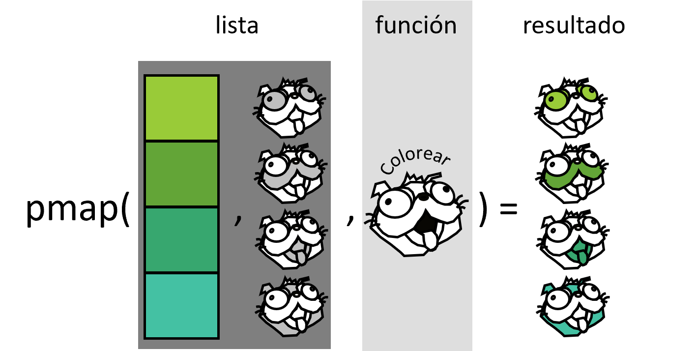

Iteraciones
================
Julen Astigarraga y Verónica Cruz-Alonso
10/16/23

- <a href="#programación-imperativa"
  id="toc-programación-imperativa">Programación imperativa</a>
- <a href="#programación-funcional"
  id="toc-programación-funcional">Programación funcional</a>
- <a href="#iteraciones-sobre-un-argumento"
  id="toc-iteraciones-sobre-un-argumento">Iteraciones sobre un
  argumento</a>
  - <a href="#nuestro-primer-funcional-generando-listas-map"
    id="toc-nuestro-primer-funcional-generando-listas-map">Nuestro primer
    funcional: generando listas, <code>map()</code></a>
  - <a href="#nuestro-segundo-funcional-generando-vectores-map_"
    id="toc-nuestro-segundo-funcional-generando-vectores-map_">Nuestro
    segundo funcional: generando vectores, <code>map_*()</code></a>
- <a href="#iteraciones-sobre-múltiples-argumentos"
  id="toc-iteraciones-sobre-múltiples-argumentos">Iteraciones sobre
  múltiples argumentos</a>
  - <a href="#nuestro-tercer-funcional-dos-entradas-map2"
    id="toc-nuestro-tercer-funcional-dos-entradas-map2">Nuestro tercer
    funcional: dos entradas, <code>map2()</code></a>
  - <a href="#nuestro-cuarto-funcional-múltiples-entradas-pmap"
    id="toc-nuestro-cuarto-funcional-múltiples-entradas-pmap">Nuestro cuarto
    funcional: múltiples entradas, <code>pmap()</code></a>
- <a href="#sin-salida" id="toc-sin-salida">Sin salida</a>
  - <a href="#nuestro-quinto-funcional-walk-walk2-y-pwalk"
    id="toc-nuestro-quinto-funcional-walk-walk2-y-pwalk">Nuestro quinto
    funcional: <code>walk()</code>, <code>walk2()</code> y
    <code>pwalk()</code></a>
- <a href="#operadores-funcionales"
  id="toc-operadores-funcionales">Operadores funcionales</a>
- <a href="#funcionales-predicate-y-demás"
  id="toc-funcionales-predicate-y-demás">Funcionales predicate y demás</a>
- <a href="#más-información" id="toc-más-información">Más información</a>
  - <a href="#no-directamente-relacionado-pero-útil"
    id="toc-no-directamente-relacionado-pero-útil">No directamente
    relacionado pero útil</a>

``` r
# vero quitalo pero lo necesito para renderizar ahora
library(tidyverse)
```

    ── Attaching packages ─────────────────────────────────────── tidyverse 1.3.2 ──
    ✔ ggplot2 3.4.2     ✔ purrr   1.0.1
    ✔ tibble  3.2.1     ✔ dplyr   1.1.2
    ✔ tidyr   1.3.0     ✔ stringr 1.5.0
    ✔ readr   2.1.2     ✔ forcats 0.5.1

    Warning: package 'ggplot2' was built under R version 4.2.3

    Warning: package 'tibble' was built under R version 4.2.3

    Warning: package 'tidyr' was built under R version 4.2.3

    Warning: package 'purrr' was built under R version 4.2.3

    Warning: package 'dplyr' was built under R version 4.2.3

    Warning: package 'stringr' was built under R version 4.2.3

    ── Conflicts ────────────────────────────────────────── tidyverse_conflicts() ──
    ✖ dplyr::filter() masks stats::filter()
    ✖ dplyr::lag()    masks stats::lag()

``` r
library(palmerpenguins)
```

## Programación imperativa

Los bucles for y bucles while (for loops y while loops) son
recomendables para adentrarse en el mundo de las iteraciones porque
hacen que cada iteración sea muy explícita por lo que está claro lo que
está ocurriendo.

``` r
df_ej <- data.frame(
  a = rnorm(5),
  b = rnorm(5),
  c = rnorm(5)
)

salida <- vector("double", ncol(df_ej)) # 1. salida
for (i in seq_along(df_ej)) {           # 2. secuencia
  salida[[i]] <- max(df_ej[[i]])        # 3. cuerpo
}
salida
```

    [1] 1.4212510 0.6625917 0.8629171

1.  Salida: aquí determinamos el espacio de la salida. Esto es muy
    importante para la eficiencia puesto que si aumentamos el tamaño del
    for loop en cada iteración con `c()`, el bucle for será mucho más
    lento.

``` r
x <- c()
system.time(
  for(i in 1:20000) {
    x <- c(x, i)
  }
)
```

       user  system elapsed 
       0.51    0.21    0.72 

``` r
y <- vector("double", length = 20000)
system.time(
  for(i in seq_along(y)) {
    y[i] <- i
  }
)
```

       user  system elapsed 
          0       0       0 

2.  Secuencia: aquí determinamos sobre lo que queremos iterar. Cada
    ejecución del bucle for asignará i a un valor diferente de
    `seq_along(df)`. Si generamos un vector de longitud cero
    accidentalmente, si utilizamos `1:length(x)`, podemos obtener un
    error.

3.  Cuerpo: aquí determinamos lo que queremos que haga cada iteración.
    Se ejecuta repetidamente, cada vez con un valor diferente para `i`.

Existen distintas [variaciones de los bucles
for](https://r4ds.had.co.nz/iteration.html#for-loop-variations): (i)
modificar un objeto existente; (ii) bucles sobre nombres o valores;
(iii) bucles cuando desconocemos la longitud de la salida; (iv) bucles
cuando desconocemos la longitud de la secuencia de entrada, bucles
while.

Algunos [errores comunes](https://adv-r.hadley.nz/control-flow.html)
cuando se utilizan bucles for (ver 5.3.1 Common pitfalls).

Sin embargo, en R los bucles for no son tan importantes como pueden ser
en otros lenguajes porque R es un lenguaje de programación funcional.
Esto significa que *es posible envolver los bucles for en una función* y
llamar a esa función en vez de utilizar el bucle.

Existe la creencia de que los bucles for son lentos, pero la desventaja
real de *los bucles for es que son demasiado flexibles*. Cada funcional
está diseñado para una tarea específica, por lo que en cuanto lo ves en
el código, inmediatamente sabes por qué se está utilizando. Es decir, la
principal ventaja es su claridad al hacer que el código sea más fácil de
escribir y de leer (ver este ejemplo avanzado para entenderlo:
<https://adv-r.hadley.nz/functionals.html>, 9.3 Purrr style).

De todas formas, nunca os sintáis mal por utilizar un bucle en vez de un
funcional. Los funcionales necesitan un paso más de abstracción y pueden
requerir tiempo hasta que los comprendamos. Lo más importante es que
soluciones el problema y poco a poco ir escribiendo código cada vez más
sencillo y elegante.

> Para ser significativamente más fiable, el código debe ser más
> transparente. En particular, las condiciones anidadas y los bucles
> deben considerarse con gran recelo. Los flujos de control complicados
> confunden a los programadores. El código desordenado suele ocultar
> errores.
>
> — Bjarne Stroustrup ([Advanced R](https://adv-r.hadley.nz/index.html))


## Programación funcional

R es un lenguaje de programación funcional. Esto significa que se basa
principalmente en un estilo de resolución de problemas centrado en
funciones (<https://adv-r.hadley.nz/fp.html>). Un funcional es una
función que toma una función como entrada y devuelve un vector como
salida.

``` r
aleatorizacion <- function(f) {
  f(rnorm(5))
}
aleatorizacion(median)
```

    [1] 0.9822704

Primero, solucionamos el problema para un elemento. Después, generamos
una función que nos permita envolver la solución en una función. Por
último, *aplicamos la función a todos los elementos que estamos
interesados.*

La ventaja de utilizar {purrr} en vez de bucles for es que nos permiten
distinguir en funciones los desafíos comunes de manipulación de listas,
y por lo tanto cada bucle for tiene su propia función. La familia apply
de R base soluciona problemas similares, pero purrr es más consistente
y, por lo tanto, más fácil de aprender. Una vez que dominemos la
programación funcional, podremos solventar muchos problemas de iteración
con menos código, más facilidad y menos errores.

Iteracionar sobre un vector es tan común que el paquete {purrr}
proporciona una familia de funciones (la familia `map()`) para ello.
Recordad que los data frames son listas de vectores de la misma longitud
por lo que cualquier cálculo por filas o columnas supone iteracionar
sobre un vector. Existe una función en {purrr} para cada tipo de salida.
Los sufijos indican el tipo de salida que queremos:

- `map()` genera una lista.
- `map_lgl()` genera un vector lógico.
- `map_int()` genera un vector de números enteros.
- `map_dbl()` genera un vector de números decimales.
- `map_chr()` genera un vector de caracteres.
- `map_vec()` genera un tipo arbitrario de vector, como fechas y
  factores.

💡¿[Por qué está función se llama
*map*](https://adv-r.hadley.nz/functionals.html#map)?

``` r
map_dbl(df_ej, mean)
```

             a          b          c 
    -0.2118144 -0.1544319  0.1759940 

``` r
df_ej |> 
  map_dbl(mean)
```

             a          b          c 
    -0.2118144 -0.1544319  0.1759940 

Comparando con un bucle el foco está en la operación que se está
ejecutando (`mean()`), y no en el código necesario para iterar sobre
cada elemento y guardar la salida.

## Iteraciones sobre un argumento

`map_*()` está vectorizado sobre un argumento, e.g. `(x)`, es decir, la
función operará en todos los elementos del vector `x`.

### Nuestro primer funcional: generando listas, `map()`

Toma un vector y una función, llama a la función una vez por cada
elemento del vector y devuelve los resultados en una lista.
`map(1:3, f)` es equivalente a `list(f(1), f(2), f(3))`. Es el
equivalente de `lapply()` de R base.

``` r
cuadratica <- function(x) {
  x ^ 2
}

map(1:4, cuadratica)
```

    [[1]]
    [1] 1

    [[2]]
    [1] 4

    [[3]]
    [1] 9

    [[4]]
    [1] 16

``` r
lapply(X = 1:4, FUN = cuadratica)
```

    [[1]]
    [1] 1

    [[2]]
    [1] 4

    [[3]]
    [1] 9

    [[4]]
    [1] 16

``` r
# algun uso mas interesante
glimpse(penguins)
```

    Rows: 344
    Columns: 8
    $ species           <fct> Adelie, Adelie, Adelie, Adelie, Adelie, Adelie, Adel…
    $ island            <fct> Torgersen, Torgersen, Torgersen, Torgersen, Torgerse…
    $ bill_length_mm    <dbl> 39.1, 39.5, 40.3, NA, 36.7, 39.3, 38.9, 39.2, 34.1, …
    $ bill_depth_mm     <dbl> 18.7, 17.4, 18.0, NA, 19.3, 20.6, 17.8, 19.6, 18.1, …
    $ flipper_length_mm <int> 181, 186, 195, NA, 193, 190, 181, 195, 193, 190, 186…
    $ body_mass_g       <int> 3750, 3800, 3250, NA, 3450, 3650, 3625, 4675, 3475, …
    $ sex               <fct> male, female, female, NA, female, male, female, male…
    $ year              <int> 2007, 2007, 2007, 2007, 2007, 2007, 2007, 2007, 2007…

``` r
# atajo de para generar una funcion anonima
map(penguins, \(x) length(unique(x)))
```

    $species
    [1] 3

    $island
    [1] 3

    $bill_length_mm
    [1] 165

    $bill_depth_mm
    [1] 81

    $flipper_length_mm
    [1] 56

    $body_mass_g
    [1] 95

    $sex
    [1] 3

    $year
    [1] 3

``` r
# salida dataframe
map_df(penguins, \(x) length(unique(x)))
```

    # A tibble: 1 × 8
      species island bill_length_mm bill_depth_mm flipper_length_mm body_mass_g
        <int>  <int>          <int>         <int>             <int>       <int>
    1       3      3            165            81                56          95
    # ℹ 2 more variables: sex <int>, year <int>


#### Ejercicio

Generad un vector, una función y aplicarle la función a cada uno de los
elementos del vector utilizando `map()`.

#### Implementación de map()

``` r
imple_map <- function(x, f, ...) {
  out <- vector("list", length(x))
  for (i in seq_along(x)) {
    out[[i]] <- f(x[[i]], ...)
  }
  out
}

imple_map(1:4, cuadratica)
```

    [[1]]
    [1] 1

    [[2]]
    [1] 4

    [[3]]
    [1] 9

    [[4]]
    [1] 16

La función de {purrr} está escrita en C para maximizar el rendimiento,
conserva los nombres y admite algunos atajos (e.g. `\(x)`).

### Nuestro segundo funcional: generando vectores, `map_*()`

#### Ejercicio

Dedicadle un par de minutos a entender lo que hacen las siguientes
funciones:

``` r
map_lgl(penguins, is.numeric)
```

              species            island    bill_length_mm     bill_depth_mm 
                FALSE             FALSE              TRUE              TRUE 
    flipper_length_mm       body_mass_g               sex              year 
                 TRUE              TRUE             FALSE              TRUE 

``` r
penguins_num <- penguins[ , map_lgl(penguins, is.numeric)]
map_dbl(penguins_num, median, na.rm = T)
```

       bill_length_mm     bill_depth_mm flipper_length_mm       body_mass_g 
                44.45             17.30            197.00           4050.00 
                 year 
              2008.00 

``` r
map_chr(penguins, class)
```

              species            island    bill_length_mm     bill_depth_mm 
             "factor"          "factor"         "numeric"         "numeric" 
    flipper_length_mm       body_mass_g               sex              year 
            "integer"         "integer"          "factor"         "integer" 

``` r
map_int(penguins, \(x) length(unique(x)))
```

              species            island    bill_length_mm     bill_depth_mm 
                    3                 3               165                81 
    flipper_length_mm       body_mass_g               sex              year 
                   56                95                 3                 3 

``` r
1:4 |> 
  map_vec(\(x) as.Date(ISOdate(x + 2023, 10, 16)))
```

    [1] "2024-10-16" "2025-10-16" "2026-10-16" "2027-10-16"

Los argumentos que varían para cada ejecución vienen antes de la función
y los argumentos que son los mismos para cada ejecución vienen después
(`na.rm = T`).


R base tiene dos funciones de la familia `apply()` que pueden devolver
vectores atómicos: `sapply()` y `vapply()`. Recomendamos evitar
`sapply()` porque intenta simplificar el resultado y elige un formato de
salida por defecto, pudiendo devolver una lista, un vector o una matriz.
`vapply()` es más seguro porque permite indicar el formato de salida con
FUN.VALUE. La principal desventaja de `vapply()` es que se necesitan
especificar más argumentos que en `map_*()`.

``` r
vapply(penguins_num, median, na.rm = T, FUN.VALUE = double(1))
```

       bill_length_mm     bill_depth_mm flipper_length_mm       body_mass_g 
                44.45             17.30            197.00           4050.00 
                 year 
              2008.00 

``` r
map(penguins, \(x) class(x))
```

    $species
    [1] "factor"

    $island
    [1] "factor"

    $bill_length_mm
    [1] "numeric"

    $bill_depth_mm
    [1] "numeric"

    $flipper_length_mm
    [1] "integer"

    $body_mass_g
    [1] "integer"

    $sex
    [1] "factor"

    $year
    [1] "integer"

``` r
glimpse(penguins)
```

    Rows: 344
    Columns: 8
    $ species           <fct> Adelie, Adelie, Adelie, Adelie, Adelie, Adelie, Adel…
    $ island            <fct> Torgersen, Torgersen, Torgersen, Torgersen, Torgerse…
    $ bill_length_mm    <dbl> 39.1, 39.5, 40.3, NA, 36.7, 39.3, 38.9, 39.2, 34.1, …
    $ bill_depth_mm     <dbl> 18.7, 17.4, 18.0, NA, 19.3, 20.6, 17.8, 19.6, 18.1, …
    $ flipper_length_mm <int> 181, 186, 195, NA, 193, 190, 181, 195, 193, 190, 186…
    $ body_mass_g       <int> 3750, 3800, 3250, NA, 3450, 3650, 3625, 4675, 3475, …
    $ sex               <fct> male, female, female, NA, female, male, female, male…
    $ year              <int> 2007, 2007, 2007, 2007, 2007, 2007, 2007, 2007, 2007…

``` r
# quitamos na's
penguins <- penguins |> 
  drop_na()

penguins_nested <- penguins |>
  group_by(species) |>
  nest() |> 
  mutate(
    lm_obj = map(data, \(dat) lm(
      bill_length_mm ~ body_mass_g,
      data = dat))
  )

# seleccionar cada elemento de la lista
penguins_nested[["lm_obj"]]
```

    [[1]]

    Call:
    lm(formula = bill_length_mm ~ body_mass_g, data = dat)

    Coefficients:
    (Intercept)  body_mass_g  
       27.11291      0.00316  


    [[2]]

    Call:
    lm(formula = bill_length_mm ~ body_mass_g, data = dat)

    Coefficients:
    (Intercept)  body_mass_g  
       26.53788      0.00413  


    [[3]]

    Call:
    lm(formula = bill_length_mm ~ body_mass_g, data = dat)

    Coefficients:
    (Intercept)  body_mass_g  
      32.174193     0.004463  

``` r
penguins_nested |>
  pluck("lm_obj")
```

    [[1]]

    Call:
    lm(formula = bill_length_mm ~ body_mass_g, data = dat)

    Coefficients:
    (Intercept)  body_mass_g  
       27.11291      0.00316  


    [[2]]

    Call:
    lm(formula = bill_length_mm ~ body_mass_g, data = dat)

    Coefficients:
    (Intercept)  body_mass_g  
       26.53788      0.00413  


    [[3]]

    Call:
    lm(formula = bill_length_mm ~ body_mass_g, data = dat)

    Coefficients:
    (Intercept)  body_mass_g  
      32.174193     0.004463  

## Iteraciones sobre múltiples argumentos

### Nuestro tercer funcional: dos entradas, `map2()`

`map2()` está vectorizado sobre dos argumentos, e.g. `(x, y)`

``` r
potencia <- function(base, exponente) {
  base ^ exponente
}

x <- map(1:4, \(x) sample(5))
y <- map(1:4, \(x) sample(5))

map2(x, y, potencia)
```

    [[1]]
    [1]    8    4   81    1 3125

    [[2]]
    [1]  32   4 625   9   1

    [[3]]
    [1]    1    4    5 1024   81

    [[4]]
    [1]   64   16    1    3 3125

⚡¡Importante! La primera iteración corresponde al primer valor del
vector `x` y al primer valor del vector `y`. La segunda iteración
corresponde al segundo valor del vector `x` y al segundo valor del
vector `y`. No se hacen todas las combinaciones posibles entre ambos
vectores.


``` r
imple_map2 <- function(x, y, f, ...) {
  out <- vector("list", length(x))
  for (i in seq_along(x)) {
    out[[i]] <- f(x[[i]], y[[i]], ...)
  }
  out
}

imple_map2(x, y, potencia)
```

    [[1]]
    [1]    8    4   81    1 3125

    [[2]]
    [1]  32   4 625   9   1

    [[3]]
    [1]    1    4    5 1024   81

    [[4]]
    [1]   64   16    1    3 3125

``` r
penguins_nested <- penguins |>
  group_by(species) |>
  nest() |> 
  mutate(
    lm_obj = map(data, \(dat) lm(
      bill_length_mm ~ body_mass_g,
      data = dat)),
    pred = map2(lm_obj, data,
                \(x, y) predict(x, y))
  )

# unnest()
penguins_nested |> 
  unnest(pred) |> 
  select(!c(data, lm_obj))
```

    # A tibble: 333 × 2
    # Groups:   species [3]
       species  pred
       <fct>   <dbl>
     1 Adelie   39.0
     2 Adelie   39.1
     3 Adelie   37.4
     4 Adelie   38.0
     5 Adelie   38.6
     6 Adelie   38.6
     7 Adelie   41.9
     8 Adelie   37.2
     9 Adelie   39.1
    10 Adelie   41.0
    # ℹ 323 more rows

#### Ejercicio

Calculad la correlación entre las predicciones y `bill_length_mm`.
Pista: hay que utilizar `map2_dbl()`

### Nuestro cuarto funcional: múltiples entradas, `pmap()`

Toma una lista con cualquier número de argumentos de entrada.

``` r
# son analogos
map2(x, y, potencia)
```

    [[1]]
    [1]    8    4   81    1 3125

    [[2]]
    [1]  32   4 625   9   1

    [[3]]
    [1]    1    4    5 1024   81

    [[4]]
    [1]   64   16    1    3 3125

``` r
pmap(list(x, y), potencia)
```

    [[1]]
    [1]    8    4   81    1 3125

    [[2]]
    [1]  32   4 625   9   1

    [[3]]
    [1]    1    4    5 1024   81

    [[4]]
    [1]   64   16    1    3 3125

``` r
z <- map(1:4, \(x) sample(5))

pmap(list(x, y, z), rnorm)
```

    [[1]]
    [1] 0.74801206 2.70136728 5.22817625 0.03174436 4.14759259

    [[2]]
    [1]  4.252776  2.781602  4.588782  2.560513 -2.564691

    [[3]]
    [1]  5.01006538 -1.14208527 -0.08112755  5.39289303 -0.61627684

    [[4]]
    [1] 3.509050 6.640620 1.967138 1.727867 6.139998

``` r
# si no nombramos los elementos de la lista, pmap() usara los elementos de la lista en su orden para los argumentos consecutivos de la función
args3 <- list(mean = x, sd = y, n = z)
args3 |> 
  pmap(rnorm)
```

    [[1]]
    [1]  1.5347948  4.2401802  8.8131328 -0.7291920 -0.3726244

    [[2]]
    [1]  0.8369058  3.9836470  2.9207355  4.2637195 -1.2496303

    [[3]]
    [1] -1.7418355 -0.2842607  3.9742274  6.6575598  1.9040744

    [[4]]
    [1]  1.7946906 -0.9931485  1.2188878  2.9541638  3.7878468



## Sin salida

### Nuestro quinto funcional: `walk()`, `walk2()` y `pwalk()`

Cuando queremos utilizar funciones por sus efectos secundarios/side
effects (e.g. `ggsave()`) y no por su valor resultante. Lo importante es
la acción y no el valor u objeto resultante en R.

#### Ejercicio

En base a lo que dice en la definición sobre la familia `walk()`, corred
este código y entended lo que hace.

``` r
penguins_nested <- penguins_nested |> 
  mutate(path = str_glue("results/penguins_{species}.csv"))

penguins_nested
```

    # A tibble: 3 × 5
    # Groups:   species [3]
      species   data               lm_obj pred        path                          
      <fct>     <list>             <list> <list>      <glue>                        
    1 Adelie    <tibble [146 × 7]> <lm>   <dbl [146]> results/penguins_Adelie.csv   
    2 Gentoo    <tibble [119 × 7]> <lm>   <dbl [119]> results/penguins_Gentoo.csv   
    3 Chinstrap <tibble [68 × 7]>  <lm>   <dbl [68]>  results/penguins_Chinstrap.csv

``` r
walk2(penguins_nested$data, penguins_nested$path, write_csv)
```

💡Ejemplos de algunas tareas específicas con {purrr}:
<https://r4ds.hadley.nz/iteration>

## Operadores funcionales

Cuando utilizamos las funciones `map()` para repetir muchas operaciones,
aumenta la probabilidad de que una de esas operaciones falle y no
obtenamos ninguna salida. {purrr} proporciona algunos operadores
funcionales (function operators) en forma de adverbios para asegurar que
un error no arruine todo el proceso: `safely()`, `possibly()`,
`quietly()`. Para más información ver:
<https://r4ds.had.co.nz/iteration.html>, 21.6 Dealing with failure.

``` r
x <- list(10, "b", 3)

x |> 
  map(log)
```

    Error in `map()`:
    ℹ In index: 2.
    Caused by error:
    ! non-numeric argument to mathematical function

``` r
x |> 
  map(safely(log))
```

    [[1]]
    [[1]]$result
    [1] 2.302585

    [[1]]$error
    NULL


    [[2]]
    [[2]]$result
    NULL

    [[2]]$error
    <simpleError in .Primitive("log")(x, base): non-numeric argument to mathematical function>


    [[3]]
    [[3]]$result
    [1] 1.098612

    [[3]]$error
    NULL

``` r
x |> 
  map(safely(log)) |> 
  transpose()
```

    $result
    $result[[1]]
    [1] 2.302585

    $result[[2]]
    NULL

    $result[[3]]
    [1] 1.098612


    $error
    $error[[1]]
    NULL

    $error[[2]]
    <simpleError in .Primitive("log")(x, base): non-numeric argument to mathematical function>

    $error[[3]]
    NULL

``` r
x |> 
  map(possibly(log, NA_real_))
```

    [[1]]
    [1] 2.302585

    [[2]]
    [1] NA

    [[3]]
    [1] 1.098612

## Funcionales predicate y demás

Los predicados son funciones que devuelven un solo TRUE o FALSE (e.g.,
`is.character()`). Así, un predicado funcional aplica un predicado a
cada elemento de un vector: `keep()`, `discard()`, `some()`, `every()`,
`detect()`, `detect_index()`… Para más información ver:
<https://r4ds.had.co.nz/iteration.html>, 21.9.1 Predicate functions.

``` r
penguins |> 
  keep(is.numeric)
```

    # A tibble: 333 × 5
       bill_length_mm bill_depth_mm flipper_length_mm body_mass_g  year
                <dbl>         <dbl>             <int>       <int> <int>
     1           39.1          18.7               181        3750  2007
     2           39.5          17.4               186        3800  2007
     3           40.3          18                 195        3250  2007
     4           36.7          19.3               193        3450  2007
     5           39.3          20.6               190        3650  2007
     6           38.9          17.8               181        3625  2007
     7           39.2          19.6               195        4675  2007
     8           41.1          17.6               182        3200  2007
     9           38.6          21.2               191        3800  2007
    10           34.6          21.1               198        4400  2007
    # ℹ 323 more rows

``` r
penguins |> 
  discard(is.numeric)
```

    # A tibble: 333 × 3
       species island    sex   
       <fct>   <fct>     <fct> 
     1 Adelie  Torgersen male  
     2 Adelie  Torgersen female
     3 Adelie  Torgersen female
     4 Adelie  Torgersen female
     5 Adelie  Torgersen male  
     6 Adelie  Torgersen female
     7 Adelie  Torgersen male  
     8 Adelie  Torgersen female
     9 Adelie  Torgersen male  
    10 Adelie  Torgersen male  
    # ℹ 323 more rows

``` r
penguins |> 
  every(is.numeric)
```

    [1] FALSE

`dplyr::across()` es similar a `map()` pero en lugar de hacer algo con
cada elemento de un vector, hace algo con cada columna en un data frame.

`reduce()` es una forma útil de generalizar una función que funciona con
dos entradas (función binaria) para trabajar con cualquier número de
entradas.

``` r
penguins_scaled <- penguins |>
  mutate(across(where(is.numeric), scale))

ls <- list(
  age = tibble(name = c("Vero", "Julen"), age = c(100, 140)),
  sex = tibble(name = c("Vero", "Julen"), sex = c("F", "M")),
  height = tibble(name = c("Vero", "Julen"), height = c("180", "150"))
)

ls |> 
  reduce(full_join, by = "name")
```

    # A tibble: 2 × 4
      name    age sex   height
      <chr> <dbl> <chr> <chr> 
    1 Vero    100 F     180   
    2 Julen   140 M     150   

Este taller está principalmente basado en la primera edición del libro
[R for Data Science](https://r4ds.had.co.nz/) de Hadley Wickham &
Garrett Grolemund y la segunda edición del libro [Advanced
R](https://adv-r.hadley.nz/index.html) de Hadley Wickham.

## Más información

- R for data Science (functions):
  <https://r4ds.had.co.nz/functions.html>

- Advanced R (functions): <https://adv-r.hadley.nz/functions.html>

- R for data Science (iteration):
  <https://r4ds.had.co.nz/iteration.html>

- Advanced R (functionals): <https://adv-r.hadley.nz/functionals.html>

- purrr 1.0.0: <https://www.tidyverse.org/blog/2022/12/purrr-1-0-0/>

- Learn to purrr (Rebecca Barter):
  <https://www.rebeccabarter.com/blog/2019-08-19_purrr>

- Sacando el máximo partido a Tidyverse:
  <https://github.com/Julenasti/intro_tidyverse/blob/main/04-scripts/intro_tidyverse.md>

- R for Data Science (2e): <https://r4ds.hadley.nz/>

### No directamente relacionado pero útil

- Style guide: <http://adv-r.had.co.nz/Style.html>

- Quince consejos para mejorar nuestro código y flujo de trabajo con R:
  <https://www.revistaecosistemas.net/index.php/ecosistemas/article/view/2129>

------------------------------------------------------------------------

<details>
<summary>
Session Info
</summary>

``` r
Sys.time()
```

    [1] "2023-10-13 18:36:58 CEST"

``` r
sessionInfo()
```

    R version 4.2.2 (2022-10-31 ucrt)
    Platform: x86_64-w64-mingw32/x64 (64-bit)
    Running under: Windows 10 x64 (build 19045)

    Matrix products: default

    locale:
    [1] LC_COLLATE=English_United Kingdom.utf8 
    [2] LC_CTYPE=English_United Kingdom.utf8   
    [3] LC_MONETARY=English_United Kingdom.utf8
    [4] LC_NUMERIC=C                           
    [5] LC_TIME=English_United Kingdom.utf8    

    attached base packages:
    [1] stats     graphics  grDevices utils     datasets  methods   base     

    other attached packages:
     [1] palmerpenguins_0.1.1 forcats_0.5.1        stringr_1.5.0       
     [4] dplyr_1.1.2          purrr_1.0.1          readr_2.1.2         
     [7] tidyr_1.3.0          tibble_3.2.1         ggplot2_3.4.2       
    [10] tidyverse_1.3.2     

    loaded via a namespace (and not attached):
     [1] tidyselect_1.2.0    xfun_0.39           haven_2.5.0        
     [4] gargle_1.2.0        colorspace_2.1-0    vctrs_0.6.3        
     [7] generics_0.1.3      htmltools_0.5.3     yaml_2.3.5         
    [10] utf8_1.2.3          rlang_1.1.1         pillar_1.9.0       
    [13] withr_2.5.0         glue_1.6.2          DBI_1.1.3          
    [16] bit64_4.0.5         dbplyr_2.2.1        modelr_0.1.8       
    [19] readxl_1.4.0        lifecycle_1.0.3     munsell_0.5.0      
    [22] gtable_0.3.3        cellranger_1.1.0    rvest_1.0.2        
    [25] evaluate_0.18       knitr_1.40.1        tzdb_0.3.0         
    [28] fastmap_1.1.0       parallel_4.2.2      fansi_1.0.4        
    [31] broom_1.0.0         backports_1.4.1     scales_1.2.1       
    [34] googlesheets4_1.0.0 vroom_1.5.7         jsonlite_1.8.0     
    [37] bit_4.0.5           fs_1.5.2            hms_1.1.1          
    [40] digest_0.6.29       stringi_1.7.12      grid_4.2.2         
    [43] cli_3.6.1           tools_4.2.2         magrittr_2.0.3     
    [46] crayon_1.5.2        pkgconfig_2.0.3     ellipsis_0.3.2     
    [49] xml2_1.3.3          reprex_2.0.1        googledrive_2.0.0  
    [52] lubridate_1.8.0     assertthat_0.2.1    rmarkdown_2.16     
    [55] httr_1.4.3          rstudioapi_0.13     R6_2.5.1           
    [58] compiler_4.2.2     

</details>
