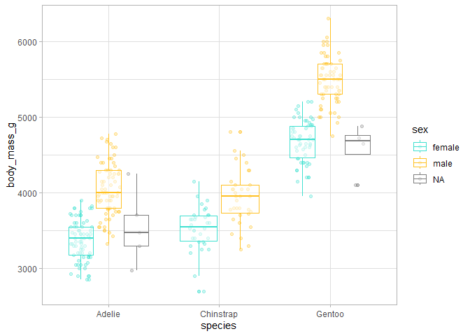
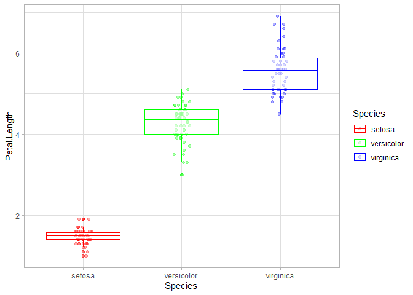

# Programación funcional en R - ejercicios resueltos
Julen Astigarraga y Verónica Cruz-Alonso
18/09/2024

- [2.1.1 Ejercicio](#211-ejercicio)
- [2.2.1 Ejercicio](#221-ejercicio)
- [2.2.2 Ejercicio](#222-ejercicio)
- [5.0.1 Ejercicio](#501-ejercicio)
- [5.0.2 Ejercicio](#502-ejercicio)
- [5.2.1 Ejercicio](#521-ejercicio)
- [8.1.1 Ejercicio](#811-ejercicio)
- [8.1.2 Ejercicio](#812-ejercicio)
- [8.2.1 Ejercicio](#821-ejercicio)
- [9.1.1 Ejercicio](#911-ejercicio)
- [9.1.2 Ejercicio avanzado](#912-ejercicio-avanzado)
- [9.2.1 Ejercicio](#921-ejercicio)
- [10.1.1 Ejercicio](#1011-ejercicio)
- [10.1.2 Ejercicio avanzado](#1012-ejercicio-avanzado)
- [11.2.1.1 Ejercicio](#11211-ejercicio)

## 2.1.1 Ejercicio

1.  Elije un número y multiplicalo por 3

2.  Crea un objeto que contenga 100 valores entre 1901 y 2000

3.  Suma un número a tu objeto

4.  Multiplica tu objeto por sí mismo

``` r
# 1
10 * 3
```

    [1] 30

``` r
# 2
misvalores <- 1901:2000

# 3
misvalores + 5
```

      [1] 1906 1907 1908 1909 1910 1911 1912 1913 1914 1915 1916 1917 1918 1919 1920
     [16] 1921 1922 1923 1924 1925 1926 1927 1928 1929 1930 1931 1932 1933 1934 1935
     [31] 1936 1937 1938 1939 1940 1941 1942 1943 1944 1945 1946 1947 1948 1949 1950
     [46] 1951 1952 1953 1954 1955 1956 1957 1958 1959 1960 1961 1962 1963 1964 1965
     [61] 1966 1967 1968 1969 1970 1971 1972 1973 1974 1975 1976 1977 1978 1979 1980
     [76] 1981 1982 1983 1984 1985 1986 1987 1988 1989 1990 1991 1992 1993 1994 1995
     [91] 1996 1997 1998 1999 2000 2001 2002 2003 2004 2005

``` r
# 4
misvalores * misvalores
```

      [1] 3613801 3617604 3621409 3625216 3629025 3632836 3636649 3640464 3644281
     [10] 3648100 3651921 3655744 3659569 3663396 3667225 3671056 3674889 3678724
     [19] 3682561 3686400 3690241 3694084 3697929 3701776 3705625 3709476 3713329
     [28] 3717184 3721041 3724900 3728761 3732624 3736489 3740356 3744225 3748096
     [37] 3751969 3755844 3759721 3763600 3767481 3771364 3775249 3779136 3783025
     [46] 3786916 3790809 3794704 3798601 3802500 3806401 3810304 3814209 3818116
     [55] 3822025 3825936 3829849 3833764 3837681 3841600 3845521 3849444 3853369
     [64] 3857296 3861225 3865156 3869089 3873024 3876961 3880900 3884841 3888784
     [73] 3892729 3896676 3900625 3904576 3908529 3912484 3916441 3920400 3924361
     [82] 3928324 3932289 3936256 3940225 3944196 3948169 3952144 3956121 3960100
     [91] 3964081 3968064 3972049 3976036 3980025 3984016 3988009 3992004 3996001
    [100] 4000000

## 2.2.1 Ejercicio

1.  Crea un objeto con los pingüinos de la especie Adelie y ordena la
    tabla según la longitud del ala de los individuos.

2.  Crea un objeto a partir del anterior donde selecciones la isla y las
    variables relacionadas con el pico.

3.  Crea un objeto a partir del creado en el punto 1 donde selecciones
    todo menos la especie.

``` r
library(palmerpenguins)
library(tidyverse)
```

    ── Attaching core tidyverse packages ──────────────────────── tidyverse 2.0.0 ──
    ✔ dplyr     1.1.4     ✔ readr     2.1.5
    ✔ forcats   1.0.0     ✔ stringr   1.5.1
    ✔ ggplot2   3.5.1     ✔ tibble    3.2.1
    ✔ lubridate 1.9.3     ✔ tidyr     1.3.1
    ✔ purrr     1.0.2     
    ── Conflicts ────────────────────────────────────────── tidyverse_conflicts() ──
    ✖ dplyr::filter() masks stats::filter()
    ✖ dplyr::lag()    masks stats::lag()
    ℹ Use the conflicted package (<http://conflicted.r-lib.org/>) to force all conflicts to become errors

``` r
# 1
adelie <- penguins |> 
  filter(species == "Adelie") |> 
  arrange(flipper_length_mm)

# 2
adelie_subset <- adelie |> 
  select(island, contains("bill"))

# 3
adelie2 <- adelie |> 
  select(-species)
```

## 2.2.2 Ejercicio

1.  Con el `data.frame` penguins, cuenta el número de casos que hay en
    cada isla y calcula la media de la longitud del ala en cada isla.

2.  Con el mismo `data.frame` calcula la relación entre el peso en kg y
    la longitud del ala para cada individuo.

``` r
# 1
penguins |> 
  group_by(island) |> 
  summarise(
    n = n(),
    mean_flipper_length = mean(flipper_length_mm, na.rm = TRUE)
  )
```

    # A tibble: 3 × 3
      island        n mean_flipper_length
      <fct>     <int>               <dbl>
    1 Biscoe      168                210.
    2 Dream       124                193.
    3 Torgersen    52                191.

``` r
# 2
penguins |> 
  mutate(mass_by_length = (body_mass_g / 1000) / flipper_length_mm) |> 
  select(mass_by_length, everything())
```

    # A tibble: 344 × 9
       mass_by_length species island  bill_length_mm bill_depth_mm flipper_length_mm
                <dbl> <fct>   <fct>            <dbl>         <dbl>             <int>
     1         0.0207 Adelie  Torger…           39.1          18.7               181
     2         0.0204 Adelie  Torger…           39.5          17.4               186
     3         0.0167 Adelie  Torger…           40.3          18                 195
     4        NA      Adelie  Torger…           NA            NA                  NA
     5         0.0179 Adelie  Torger…           36.7          19.3               193
     6         0.0192 Adelie  Torger…           39.3          20.6               190
     7         0.0200 Adelie  Torger…           38.9          17.8               181
     8         0.0240 Adelie  Torger…           39.2          19.6               195
     9         0.0180 Adelie  Torger…           34.1          18.1               193
    10         0.0224 Adelie  Torger…           42            20.2               190
    # ℹ 334 more rows
    # ℹ 3 more variables: body_mass_g <int>, sex <fct>, year <int>

## 5.0.1 Ejercicio

Genera tu primera función que divida un valor siempre entre 100.

``` r
dividirpor100 <- function(x) {
  x / 100
}

dividirpor100(30)
```

    [1] 0.3

## 5.0.2 Ejercicio

Genera una función para estandarizar (es decir, restar la media y
dividir por la desviación típica) las variables numéricas de penguins.

``` r
# R base
estandarizar <- function(x, my.na.rm) {
  (x - mean(x, na.rm = my.na.rm)) / sd(x, na.rm = my.na.rm)
}

estandarizar(penguins$bill_length_mm, my.na.rm = T)
```

      [1] -0.88320467 -0.80993901 -0.66340769          NA -1.32279862 -0.84657184
      [7] -0.91983750 -0.86488825 -1.79902541 -0.35202864 -1.12131806 -1.12131806
     [13] -0.51687637 -0.97478674 -1.70744334 -1.34111504 -0.95647033 -0.26044656
     [19] -1.74407616  0.38062795 -1.12131806 -1.13963448 -1.46932994 -1.04805240
     [25] -0.93815391 -1.57922843 -0.60845845 -0.62677486 -1.10300165 -0.62677486
     [31] -0.80993901 -1.23121655 -0.80993901 -0.55350920 -1.37774787 -0.86488825
     [37] -0.93815391 -0.31539581 -1.15795089 -0.75498976 -1.35943145 -0.57182562
     [43] -1.45101353  0.03261607 -1.26784938 -0.79162259 -0.51687637 -1.17626731
     [49] -1.45101353 -0.29707939 -0.79162259 -0.70004052 -1.63417768 -0.35202864
     [55] -1.72575975 -0.46192713 -0.90152108 -0.60845845 -1.35943145 -1.15795089
     [61] -1.50596277 -0.48024354 -1.15795089 -0.51687637 -1.37774787 -0.42529430
     [67] -1.54259560 -0.51687637 -1.46932994 -0.38866147 -1.90892390 -0.77330618
     [73] -0.79162259  0.34399512 -1.54259560 -0.20549732 -0.55350920 -1.23121655
     [79] -1.41438070 -0.33371222 -1.70744334 -0.18718091 -1.32279862 -1.61586126
     [85] -1.21290014 -0.48024354 -1.39606428 -1.28616579 -1.02973599 -0.91983750
     [91] -1.50596277 -0.51687637 -1.81734182 -0.79162259 -1.41438070 -0.57182562
     [97] -1.06636882 -0.66340769 -1.98218956 -0.13223166 -1.63417768 -0.53519279
    [103] -1.13963448 -1.12131806 -1.10300165 -0.77330618 -0.97478674 -1.04805240
    [109] -1.06636882 -0.13223166 -1.06636882  0.30736229 -0.77330618 -0.31539581
    [115] -0.79162259 -0.22381374 -0.97478674 -1.21290014 -1.50596277 -0.51687637
    [121] -1.41438070 -1.13963448 -0.68172411 -0.46192713 -1.59754485 -0.60845845
    [127] -0.93815391 -0.44361071 -0.90152108  0.03261607 -0.99310316 -0.15054808
    [133] -1.30448221 -1.17626731 -1.06636882 -0.51687637 -1.52427919 -0.68172411
    [139] -1.26784938 -0.77330618 -0.68172411 -0.60845845 -2.16535371 -0.59014203
    [145] -1.21290014 -0.90152108 -0.86488825 -1.34111504 -1.45101353 -1.12131806
    [151] -1.45101353 -0.44361071  0.39894437  1.11328455  0.87517115  1.11328455
    [157]  0.67369059  0.47221003  0.27072946  0.50884286 -0.11391525  0.52715927
    [163] -0.55350920  0.93012040  0.28904588  0.82022191  0.34399512  0.98506964
    [169] -0.35202864  0.96675323  0.41726078  0.87517115  1.14991738  0.21578022
    [175]  0.47221003  0.43557720 -0.18718091  0.39894437  0.10588173  0.71032342
    [181]  0.78358908  1.11328455  0.61874135 -0.20549732  0.21578022  2.87166037
    [187]  0.94843681  0.82022191 -0.24213015  0.08756532  0.01429966  0.87517115
    [193] -0.22381374  1.04001889  0.25241305  1.04001889  1.20486662 -0.05896600
    [199]  0.28904588  1.20486662  0.17914739  0.23409663  0.49052644  0.83853832
    [205]  0.21578022  1.13160096  0.47221003  0.19746381 -0.02233317  0.28904588
    [211] -0.13223166  1.18655021  0.25241305  0.41726078  0.32567871  1.90089038
    [217]  0.34399512  1.07665172  0.41726078  1.02170247 -0.07728242  1.24149945
    [223]  0.69200701  0.45389361  0.78358908  0.47221003  0.45389361  0.85685474
    [229]  0.65537418  1.31476511  0.23409663  0.23409663  0.94843681  1.57119492
    [235]  0.63705776  1.11328455  0.17914739  1.25981586 -0.09559883  1.35139794
    [241]  0.65537418  1.49792926  0.65537418  1.51624567  0.28904588  1.02170247
    [247]  0.10588173  1.25981586  1.00338606  0.54547569  0.82022191  1.31476511
    [253]  0.83853832  2.19395302  0.60042493  0.94843681  0.61874135  0.52715927
    [259] -0.40697788  1.73604265 -0.11391525  0.76527266  1.20486662  1.07665172
    [265] -0.07728242  1.38803077  0.41726078  2.04742170  0.10588173  0.89348757
    [271]  0.60042493          NA  0.52715927  1.18655021  0.23409663  1.09496813
    [277]  0.47221003  1.11328455  1.35139794  0.27072946  1.60782775  0.23409663
    [283]  0.39894437  1.35139794  0.38062795  1.35139794  0.49052644  1.42466360
    [289]  0.56379210  1.47961284  0.36231154  1.20486662  1.16823379  2.57859773
    [295]  0.45389361  0.96675323 -0.27876298  0.83853832 -0.13223166  1.22318303
    [301]  0.50884286  1.47961284  1.20486662  1.02170247  0.45389361  1.62614416
    [307] -0.55350920  1.88257397 -0.26044656  1.29644869  1.05833530  0.65537418
    [313]  0.67369059  1.47961284  0.54547569  1.75435906  0.93012040  0.41726078
    [319]  1.27813228  0.28904588  1.27813228  1.25981586  1.13160096  0.93012040
    [325]  1.38803077  1.07665172  0.76527266  1.36971435  0.32567871  1.24149945
    [331] -0.26044656  1.51624567  0.23409663  0.98506964  1.14991738  0.30736229
    [337]  1.46129643  0.52715927  0.32567871  2.17563660 -0.07728242  1.04001889
    [343]  1.25981586  1.14991738

``` r
# Tidyverse
estandarizar_tidy <- function(x, my.na.rm) {
  ({{ x }} - mean({{ x }}, na.rm = my.na.rm)) / sd({{ x }}, na.rm = my.na.rm)
} 

penguins |> 
  mutate(st_bill_length = estandarizar_tidy(x = bill_length_mm, my.na.rm = T)) |> 
  select(bill_length_mm, st_bill_length)
```

    # A tibble: 344 × 2
       bill_length_mm st_bill_length
                <dbl>          <dbl>
     1           39.1         -0.883
     2           39.5         -0.810
     3           40.3         -0.663
     4           NA           NA    
     5           36.7         -1.32 
     6           39.3         -0.847
     7           38.9         -0.920
     8           39.2         -0.865
     9           34.1         -1.80 
    10           42           -0.352
    # ℹ 334 more rows

## 5.2.1 Ejercicio

¿Cómo generalizarías la función `explorar_penguins()` para que te
sirviera para cualquier base de datos?

``` r
penguins_num <- penguins |> 
  select(species, sex, where(is.numeric))

explorar_penguins <-
  function(var) {
    ggplot(penguins_num, aes(x = species, y = .data[[var]], color = sex)) +
      geom_point(position = position_jitterdodge(), alpha = 0.3) +
      geom_boxplot(alpha = 0.5) +
      scale_color_manual(values = c("turquoise", "goldenrod1")) +
      theme_light() +
      ylab(var)
  }

explorar_penguins(var = "body_mass_g") 
```

    Warning: Removed 2 rows containing non-finite outside the scale range
    (`stat_boxplot()`).

    Warning: Removed 2 rows containing missing values or values outside the scale range
    (`geom_point()`).



``` r
explorar_df <- function(df, x_var, y_var, color) {
  ggplot(data = df, aes(x = .data[[x_var]], y = .data[[y_var]], color = .data[[color]])) + 
    geom_point(position = position_jitterdodge(), alpha = 0.3) +
    geom_boxplot(alpha = 0.5) + 
    scale_color_manual(values = rainbow(n = length(unique(df[[color]])))) +
    theme_light() + 
    ylab(y_var)
}

explorar_df(df = iris, # iris es un dataset cargado en RStudio por defecto
            y_var = "Petal.Length",
            x_var = "Species",
            color = "Species")
```



## 8.1.1 Ejercicio

Generad un vector, una función y aplicadle la función a cada uno de los
elementos del vector utilizando `map()`.

``` r
sum_10 <- function(x) {
  x + 10
}

map(1:4, sum_10)
```

    [[1]]
    [1] 11

    [[2]]
    [1] 12

    [[3]]
    [1] 13

    [[4]]
    [1] 14

## 8.1.2 Ejercicio

Ahora que habéis entendido la lógica de `map()`, detectad las
diferencias entre las tres líneas de código siguientes. ¿Qué es lo que
hace el funcional `map()`? ¿Qué diferencias detectáis en el código? ¿Y
en la salida?

``` r
map(penguins, \(x) mean(x))
```

    Warning in mean.default(x): argument is not numeric or logical: returning NA
    Warning in mean.default(x): argument is not numeric or logical: returning NA
    Warning in mean.default(x): argument is not numeric or logical: returning NA

    $species
    [1] NA

    $island
    [1] NA

    $bill_length_mm
    [1] NA

    $bill_depth_mm
    [1] NA

    $flipper_length_mm
    [1] NA

    $body_mass_g
    [1] NA

    $sex
    [1] NA

    $year
    [1] 2008.029

``` r
map(penguins, \(x) mean(x, na.rm = T)) # opcion 1
```

    Warning in mean.default(x, na.rm = T): argument is not numeric or logical:
    returning NA

    Warning in mean.default(x, na.rm = T): argument is not numeric or logical:
    returning NA
    Warning in mean.default(x, na.rm = T): argument is not numeric or logical:
    returning NA

    $species
    [1] NA

    $island
    [1] NA

    $bill_length_mm
    [1] 43.92193

    $bill_depth_mm
    [1] 17.15117

    $flipper_length_mm
    [1] 200.9152

    $body_mass_g
    [1] 4201.754

    $sex
    [1] NA

    $year
    [1] 2008.029

``` r
map(penguins, mean, na.rm = T) # opcion 2
```

    Warning in mean.default(.x[[i]], ...): argument is not numeric or logical:
    returning NA

    Warning in mean.default(.x[[i]], ...): argument is not numeric or logical:
    returning NA
    Warning in mean.default(.x[[i]], ...): argument is not numeric or logical:
    returning NA

    $species
    [1] NA

    $island
    [1] NA

    $bill_length_mm
    [1] 43.92193

    $bill_depth_mm
    [1] 17.15117

    $flipper_length_mm
    [1] 200.9152

    $body_mass_g
    [1] 4201.754

    $sex
    [1] NA

    $year
    [1] 2008.029

El primer y segundo `map()` utilizan funciones anónimas (`\(x)`)
mientras que el tercero no lo hace. El primero nos devuelve muchos `NA`
porque hay algunas celdas de variables numéricas en la base de datos de
penguins que contienen `NA`, y por defecto, `mean()` devuelve `NA` si
detecta algún `NA` en las variables a las que se aplica el `mean()`. El
resultado del segundo y tercer `map()` es el mismo. Sin embargo, en el
segundo `map()` se añaden argumentos adicionales en `mean()` mediante la
función anónima. En el tercer `map()`, dado que `map()` incluye `...`
entre sus argumentos, se pueden incluir los argumentos adicionales
después de la función dentro de `map()` de una forma mucho más sencilla.

## 8.2.1 Ejercicio

Dedicadle un par de minutos a entender lo que hacen las siguientes
funciones:

``` r
map_lgl(penguins, is.numeric)
```

              species            island    bill_length_mm     bill_depth_mm 
                FALSE             FALSE              TRUE              TRUE 
    flipper_length_mm       body_mass_g               sex              year 
                 TRUE              TRUE             FALSE              TRUE 

``` r
penguins_num <- penguins[ , map_lgl(penguins, is.numeric)] 
map_dbl(penguins_num, median, na.rm = T)
```

       bill_length_mm     bill_depth_mm flipper_length_mm       body_mass_g 
                44.45             17.30            197.00           4050.00 
                 year 
              2008.00 

``` r
map_chr(penguins, class)
```

              species            island    bill_length_mm     bill_depth_mm 
             "factor"          "factor"         "numeric"         "numeric" 
    flipper_length_mm       body_mass_g               sex              year 
            "integer"         "integer"          "factor"         "integer" 

``` r
map_int(penguins, \(x) length(unique(x)))
```

              species            island    bill_length_mm     bill_depth_mm 
                    3                 3               165                81 
    flipper_length_mm       body_mass_g               sex              year 
                   56                95                 3                 3 

``` r
1:4 |> 
  map_vec(\(x) as.Date(ISOdate(x + 2024, 05, 13)))
```

    [1] "2025-05-13" "2026-05-13" "2027-05-13" "2028-05-13"

`map_lgl()` nos devuelve un vector lógico que nos indica si cada una de
las columnas de penguins es numérico o no.

En la siguiente linea utilizamos el vector lógico generado con
`map_lgl()` para seleccionar las variables númericas de penguins.

`map_dbl()` nos devuelve un vector numérico calculando la mediana de
cada variable númerica de penguins.

`map_chr()` nos devuelve un vector de caracteres que nos indica la clase
de cada una de las columnas de penguins.

`map_int()` nos devuelve un vector de números enteros que nos muestra el
número de observaciones únicas que hay en cada variable de penguins
contando los `NA`.

`map_vec()` determina automáticamente el tipo de salida que en este caso
nos devuelve un vector de tipo fecha.

## 9.1.1 Ejercicio

A partir del código que se muestra a continuación generad un
`data.frame`, agregando una columna al `data.frame` con el nombre que le
hemos asignado a cada lista.

``` r
penguins_list <- penguins |>
  group_split(species)

# asignamos nombres a las listas
names(penguins_list) <- c("p1", "p2", "p3")

# solucion al ejercicio
map2(penguins_list, names(penguins_list), \(x, y)
        mutate(x, nombre = y))
```

    $p1
    # A tibble: 152 × 9
       species island    bill_length_mm bill_depth_mm flipper_length_mm body_mass_g
       <fct>   <fct>              <dbl>         <dbl>             <int>       <int>
     1 Adelie  Torgersen           39.1          18.7               181        3750
     2 Adelie  Torgersen           39.5          17.4               186        3800
     3 Adelie  Torgersen           40.3          18                 195        3250
     4 Adelie  Torgersen           NA            NA                  NA          NA
     5 Adelie  Torgersen           36.7          19.3               193        3450
     6 Adelie  Torgersen           39.3          20.6               190        3650
     7 Adelie  Torgersen           38.9          17.8               181        3625
     8 Adelie  Torgersen           39.2          19.6               195        4675
     9 Adelie  Torgersen           34.1          18.1               193        3475
    10 Adelie  Torgersen           42            20.2               190        4250
    # ℹ 142 more rows
    # ℹ 3 more variables: sex <fct>, year <int>, nombre <chr>

    $p2
    # A tibble: 68 × 9
       species   island bill_length_mm bill_depth_mm flipper_length_mm body_mass_g
       <fct>     <fct>           <dbl>         <dbl>             <int>       <int>
     1 Chinstrap Dream            46.5          17.9               192        3500
     2 Chinstrap Dream            50            19.5               196        3900
     3 Chinstrap Dream            51.3          19.2               193        3650
     4 Chinstrap Dream            45.4          18.7               188        3525
     5 Chinstrap Dream            52.7          19.8               197        3725
     6 Chinstrap Dream            45.2          17.8               198        3950
     7 Chinstrap Dream            46.1          18.2               178        3250
     8 Chinstrap Dream            51.3          18.2               197        3750
     9 Chinstrap Dream            46            18.9               195        4150
    10 Chinstrap Dream            51.3          19.9               198        3700
    # ℹ 58 more rows
    # ℹ 3 more variables: sex <fct>, year <int>, nombre <chr>

    $p3
    # A tibble: 124 × 9
       species island bill_length_mm bill_depth_mm flipper_length_mm body_mass_g
       <fct>   <fct>           <dbl>         <dbl>             <int>       <int>
     1 Gentoo  Biscoe           46.1          13.2               211        4500
     2 Gentoo  Biscoe           50            16.3               230        5700
     3 Gentoo  Biscoe           48.7          14.1               210        4450
     4 Gentoo  Biscoe           50            15.2               218        5700
     5 Gentoo  Biscoe           47.6          14.5               215        5400
     6 Gentoo  Biscoe           46.5          13.5               210        4550
     7 Gentoo  Biscoe           45.4          14.6               211        4800
     8 Gentoo  Biscoe           46.7          15.3               219        5200
     9 Gentoo  Biscoe           43.3          13.4               209        4400
    10 Gentoo  Biscoe           46.8          15.4               215        5150
    # ℹ 114 more rows
    # ℹ 3 more variables: sex <fct>, year <int>, nombre <chr>

## 9.1.2 Ejercicio avanzado

Calculad la correlación entre las predicciones guardadas en la
lista-columna `pred` y `bill_length_mm`.

``` r
# primero eliminamos NA de bill_length_mm
penguins_nona <- penguins |> 
  drop_na(bill_length_mm)

penguins_nested <- penguins_nona |>
  group_by(species) |>
  nest() |> 
  mutate(
    lm_obj = map(data, \(df) lm(
      bill_length_mm ~ body_mass_g,
      data = df)),
    pred = map2(lm_obj, data,
                \(x, y) predict(x, y)),
    # solucion al ejercicio
    corr = map2_dbl(pred, data,
                    \(x, y) cor(x, y$bill_length_mm))
  )

# unnest()
penguins_nested |> 
  unnest(pred) |> 
  select(!c(data, lm_obj))
```

    # A tibble: 342 × 3
    # Groups:   species [3]
       species  pred  corr
       <fct>   <dbl> <dbl>
     1 Adelie   38.9 0.549
     2 Adelie   39.1 0.549
     3 Adelie   37.4 0.549
     4 Adelie   38.0 0.549
     5 Adelie   38.6 0.549
     6 Adelie   38.6 0.549
     7 Adelie   41.9 0.549
     8 Adelie   38.1 0.549
     9 Adelie   40.5 0.549
    10 Adelie   37.5 0.549
    # ℹ 332 more rows

## 9.2.1 Ejercicio

Transformad el `map2()` que habéis generado en el ejercicio 9.1.1 a
`pmap()`.

``` r
# ejercicio 9.1.1
penguins_list <- penguins |>
  group_split(species)

# asignamos nombres a las listas
names(penguins_list) <- c("p1", "p2", "p3")

# ejercicio 9.2.1
pmap(list(penguins_list, names(penguins_list)), \(x, y)
     mutate(x, nombre = y))
```

    $p1
    # A tibble: 152 × 9
       species island    bill_length_mm bill_depth_mm flipper_length_mm body_mass_g
       <fct>   <fct>              <dbl>         <dbl>             <int>       <int>
     1 Adelie  Torgersen           39.1          18.7               181        3750
     2 Adelie  Torgersen           39.5          17.4               186        3800
     3 Adelie  Torgersen           40.3          18                 195        3250
     4 Adelie  Torgersen           NA            NA                  NA          NA
     5 Adelie  Torgersen           36.7          19.3               193        3450
     6 Adelie  Torgersen           39.3          20.6               190        3650
     7 Adelie  Torgersen           38.9          17.8               181        3625
     8 Adelie  Torgersen           39.2          19.6               195        4675
     9 Adelie  Torgersen           34.1          18.1               193        3475
    10 Adelie  Torgersen           42            20.2               190        4250
    # ℹ 142 more rows
    # ℹ 3 more variables: sex <fct>, year <int>, nombre <chr>

    $p2
    # A tibble: 68 × 9
       species   island bill_length_mm bill_depth_mm flipper_length_mm body_mass_g
       <fct>     <fct>           <dbl>         <dbl>             <int>       <int>
     1 Chinstrap Dream            46.5          17.9               192        3500
     2 Chinstrap Dream            50            19.5               196        3900
     3 Chinstrap Dream            51.3          19.2               193        3650
     4 Chinstrap Dream            45.4          18.7               188        3525
     5 Chinstrap Dream            52.7          19.8               197        3725
     6 Chinstrap Dream            45.2          17.8               198        3950
     7 Chinstrap Dream            46.1          18.2               178        3250
     8 Chinstrap Dream            51.3          18.2               197        3750
     9 Chinstrap Dream            46            18.9               195        4150
    10 Chinstrap Dream            51.3          19.9               198        3700
    # ℹ 58 more rows
    # ℹ 3 more variables: sex <fct>, year <int>, nombre <chr>

    $p3
    # A tibble: 124 × 9
       species island bill_length_mm bill_depth_mm flipper_length_mm body_mass_g
       <fct>   <fct>           <dbl>         <dbl>             <int>       <int>
     1 Gentoo  Biscoe           46.1          13.2               211        4500
     2 Gentoo  Biscoe           50            16.3               230        5700
     3 Gentoo  Biscoe           48.7          14.1               210        4450
     4 Gentoo  Biscoe           50            15.2               218        5700
     5 Gentoo  Biscoe           47.6          14.5               215        5400
     6 Gentoo  Biscoe           46.5          13.5               210        4550
     7 Gentoo  Biscoe           45.4          14.6               211        4800
     8 Gentoo  Biscoe           46.7          15.3               219        5200
     9 Gentoo  Biscoe           43.3          13.4               209        4400
    10 Gentoo  Biscoe           46.8          15.4               215        5150
    # ℹ 114 more rows
    # ℹ 3 more variables: sex <fct>, year <int>, nombre <chr>

## 10.1.1 Ejercicio

En base a lo que dice en la definición sobre la familia `walk()`, corred
este código y entended lo que hace.

``` r
penguins_nested <- penguins |>
  group_by(species) |>
  nest()

penguins_nested_str <- penguins_nested |> 
  mutate(path = str_glue("penguins_{species}.csv"))

penguins_nested_str
```

    # A tibble: 3 × 3
    # Groups:   species [3]
      species   data               path                  
      <fct>     <list>             <glue>                
    1 Adelie    <tibble [152 × 7]> penguins_Adelie.csv   
    2 Gentoo    <tibble [124 × 7]> penguins_Gentoo.csv   
    3 Chinstrap <tibble [68 × 7]>  penguins_Chinstrap.csv

``` r
walk2(penguins_nested_str$data, penguins_nested_str$path, write_csv)
```

Meidante la función
[`nest()`](https://tidyr.tidyverse.org/reference/nest.html) de {tidyr}
generamos listas-columnas en el data frame de penguins, generando una
fila para cada especie de pingüino. Como es un `data.frame` podemos
aplicarle la función `mutate()` directamente y generamos la variable
`path` que contiene el nombre de salida que le queremos dar a cada base
de datos. Por último, mediante la función `walk2()` guardamos los datos
relativos a cada pingüino con su respectivo path que hemos generado
anteriormente.

## 10.1.2 Ejercicio avanzado

Generad un ejemplo donde utiliceis `walk2()` o `pwalk()` para guardar
múltiples plot generados con `ggplot()`. Pista: la primera entrada será
el plot que queréis guardar y la segunda el nombre del archivo que le
queréis dar.

``` r
gg_penguins_bill_body <- function(data_df) {
  ggplot(aes(bill_length_mm, body_mass_g),
         data = data_df) +
    geom_point()
}

penguins_nested <- penguins |>
  group_by(species) |>
  nest() |> 
  mutate(
    gg_obj = map(data, \(df) gg_penguins_bill_body(
      data_df = df
    ))
  )

penguins_nested_str <- penguins_nested |> 
  mutate(path = str_glue("penguins_{species}.png"))

penguins_nested_str
```

    # A tibble: 3 × 4
    # Groups:   species [3]
      species   data               gg_obj path                  
      <fct>     <list>             <list> <glue>                
    1 Adelie    <tibble [152 × 7]> <gg>   penguins_Adelie.png   
    2 Gentoo    <tibble [124 × 7]> <gg>   penguins_Gentoo.png   
    3 Chinstrap <tibble [68 × 7]>  <gg>   penguins_Chinstrap.png

``` r
pwalk(list(plot = penguins_nested_str$gg_obj, filename = penguins_nested_str$path), ggsave)
```

    Saving 7 x 5 in image

    Warning: Removed 1 row containing missing values or values outside the scale range
    (`geom_point()`).

    Saving 7 x 5 in image

    Warning: Removed 1 row containing missing values or values outside the scale range
    (`geom_point()`).

    Saving 7 x 5 in image

## 11.2.1.1 Ejercicio

Aplicad cualquier variante de `map()` junto con un operador funcional a
la base de datos penguins.

``` r
penguins |> 
  map(safely(log)) |> 
  transpose()
```

    $result
    $result$species
    NULL

    $result$island
    NULL

    $result$bill_length_mm
      [1] 3.666122 3.676301 3.696351       NA 3.602777 3.671225 3.660994 3.668677
      [9] 3.529297 3.737670 3.632309 3.632309 3.716008 3.653252 3.543854 3.600048
     [17] 3.655840 3.749504 3.538057 3.828641 3.632309 3.629660 3.580737 3.642836
     [25] 3.658420 3.563883 3.703768 3.701302 3.634951 3.701302 3.676301 3.616309
     [33] 3.676301 3.711130 3.594569 3.668677 3.658420 3.742420 3.627004 3.683867
     [41] 3.597312 3.708682 3.583519 3.786460 3.610918 3.678829 3.716008 3.624341
     [49] 3.583519 3.744787 3.678829 3.691376 3.555348 3.737670 3.540959 3.723281
     [57] 3.663562 3.703768 3.597312 3.627004 3.575151 3.720862 3.627004 3.716008
     [65] 3.594569 3.728100 3.569533 3.716008 3.580737 3.732896 3.511545 3.681351
     [73] 3.678829 3.824284 3.569533 3.756538 3.711130 3.616309 3.589059 3.740048
     [81] 3.543854 3.758872 3.602777 3.558201 3.618993 3.720862 3.591818 3.608212
     [89] 3.645450 3.660994 3.575151 3.716008 3.526361 3.678829 3.589059 3.708682
     [97] 3.640214 3.696351 3.499533 3.765840 3.555348 3.713572 3.629660 3.632309
    [105] 3.634951 3.681351 3.653252 3.642836 3.640214 3.765840 3.640214 3.819908
    [113] 3.681351 3.742420 3.678829 3.754199 3.653252 3.618993 3.575151 3.716008
    [121] 3.589059 3.629660 3.693867 3.723281 3.561046 3.703768 3.658420 3.725693
    [129] 3.663562 3.786460 3.650658 3.763523 3.605498 3.624341 3.640214 3.716008
    [137] 3.572346 3.693867 3.610918 3.681351 3.693867 3.703768 3.468856 3.706228
    [145] 3.618993 3.663562 3.668677 3.600048 3.583519 3.632309 3.583519 3.725693
    [153] 3.830813 3.912023 3.885679 3.912023 3.862833 3.839452 3.815512 3.843744
    [161] 3.768153 3.845883 3.711130 3.891820 3.817712 3.879500 3.824284 3.897924
    [169] 3.737670 3.895894 3.832980 3.885679 3.916015 3.808882 3.839452 3.835142
    [177] 3.758872 3.830813 3.795489 3.867026 3.875359 3.912023 3.856510 3.756538
    [185] 3.808882 4.087656 3.893859 3.879500 3.751854 3.793239 3.784190 3.885679
    [193] 3.754199 3.903991 3.813307 3.903991 3.921973 3.775057 3.817712 3.921973
    [201] 3.804438 3.811097 3.841601 3.881564 3.808882 3.914021 3.839452 3.806662
    [209] 3.779634 3.817712 3.765840 3.919991 3.813307 3.832980 3.822098 3.994524
    [217] 3.824284 3.908015 3.832980 3.901973 3.772761 3.925926 3.864931 3.837299
    [225] 3.875359 3.839452 3.837299 3.883624 3.860730 3.933784 3.811097 3.811097
    [233] 3.893859 3.960813 3.858622 3.912023 3.804438 3.927896 3.770459 3.937691
    [241] 3.860730 3.953165 3.860730 3.955082 3.817712 3.901973 3.795489 3.927896
    [249] 3.899950 3.848018 3.879500 3.933784 3.881564 4.023564 3.854394 3.893859
    [257] 3.856510 3.845883 3.730501 3.977811 3.768153 3.873282 3.921973 3.908015
    [265] 3.772761 3.941582 3.832980 4.009150 3.795489 3.887730 3.854394       NA
    [273] 3.845883 3.919991 3.811097 3.910021 3.839452 3.912023 3.937691 3.815512
    [281] 3.964615 3.811097 3.830813 3.937691 3.828641 3.937691 3.841601 3.945458
    [289] 3.850148 3.951244 3.826465 3.921973 3.918005 4.060443 3.837299 3.895894
    [297] 3.747148 3.881564 3.765840 3.923952 3.843744 3.951244 3.921973 3.901973
    [305] 3.837299 3.966511 3.711130 3.992681 3.749504 3.931826 3.906005 3.860730
    [313] 3.862833 3.951244 3.848018 3.979682 3.891820 3.832980 3.929863 3.817712
    [321] 3.929863 3.927896 3.914021 3.891820 3.941582 3.908015 3.873282 3.939638
    [329] 3.822098 3.925926 3.749504 3.955082 3.811097 3.897924 3.916015 3.819908
    [337] 3.949319 3.845883 3.822098 4.021774 3.772761 3.903991 3.927896 3.916015

    $result$bill_depth_mm
      [1] 2.928524 2.856470 2.890372       NA 2.960105 3.025291 2.879198 2.975530
      [9] 2.895912 3.005683 2.839078 2.850707 2.867899 3.054001 3.049273 2.879198
     [17] 2.944439 3.030134 2.912351 3.068053 2.906901 2.928524 2.954910 2.895912
     [25] 2.844909 2.939162 2.923162 2.884801 2.923162 2.939162 2.815409 2.895912
     [33] 2.879198 2.939162 2.833213 3.049273 2.995732 2.917771 2.960105 2.949688
     [41] 2.890372 2.912351 2.917771 2.980619 2.827314 2.933857 2.944439 2.939162
     [49] 2.884801 3.054001 2.873565 2.939162 2.884801 2.970414 2.895912 2.923162
     [57] 2.862201 2.933857 2.809403 2.949688 2.827314 3.049273 2.833213 2.901422
     [65] 2.839078 2.890372 2.785011 2.949688 2.809403 2.965273 2.944439 2.912351
     [73] 2.844909 2.939162 2.862201 2.917771 2.821379 2.965273 2.778819 2.949688
     [81] 2.844909 2.867899 2.933857 2.965273 2.879198 3.010621 2.970414 2.923162
     [89] 2.954910 2.933857 2.890372 2.895912 2.839078 2.895912 2.850707 2.939162
     [97] 2.923162 2.917771 2.778819 2.917771 2.884801 2.995732 2.772589 2.995732
    [105] 2.923162 2.939162 2.844909 2.995732 2.833213 2.944439 2.803360 3.010621
    [113] 2.873565 2.970414 3.030134 2.906901 2.833213 3.020425 2.833213 2.923162
    [121] 2.844909 2.985682 2.833213 2.917771 2.766319 2.944439 2.867899 2.906901
    [129] 2.839078 2.890372 2.884801 2.954910 2.917771 2.917771 2.867899 2.862201
    [137] 2.862201 3.000720 2.803360 2.884801 2.839078 2.844909 2.740840 2.833213
    [145] 2.821379 2.928524 2.923162 2.912351 2.879198 2.895912 2.839078 2.917771
    [153] 2.580217 2.791165 2.646175 2.721295 2.674149 2.602690 2.681022 2.727853
    [161] 2.595255 2.734368 2.617396 2.778819 2.617396 2.681022 2.681022 2.753661
    [169] 2.602690 2.721295 2.674149 2.714695 2.660260 2.674149 2.674149 2.760010
    [177] 2.572612 2.714695 2.660260 2.708050 2.660260 2.727853 2.727853 2.653242
    [185] 2.674149 2.833213 2.694627 2.791165 2.617396 2.850707 2.610070 2.753661
    [193] 2.617396 2.772589 2.617396 2.708050 2.766319 2.631889 2.631889 2.766319
    [201] 2.587764 2.760010 2.653242 2.646175 2.667228 2.708050 2.667228 2.734368
    [209] 2.631889 2.708050 2.674149 2.727853 2.624669 2.701361 2.631889 2.753661
    [217] 2.653242 2.821379 2.667228 2.785011 2.653242 2.708050 2.708050 2.747271
    [225] 2.747271 2.694627 2.708050 2.772589 2.653242 2.791165 2.624669 2.797281
    [233] 2.674149 2.747271 2.681022 2.766319 2.624669 2.850707 2.667228 2.653242
    [241] 2.639057 2.833213 2.708050 2.839078 2.674149 2.778819 2.687847 2.753661
    [249] 2.760010 2.681022 2.667228 2.803360 2.708050 2.833213 2.740840 2.708050
    [257] 2.624669 2.778819 2.687847 2.760010 2.639057 2.714695 2.721295 2.766319
    [265] 2.721295 2.791165 2.646175 2.772589 2.753661 2.785011 2.617396       NA
    [273] 2.660260 2.753661 2.694627 2.778819 2.884801 2.970414 2.954910 2.928524
    [281] 2.985682 2.879198 2.901422 2.901422 2.939162 2.990720 2.879198 3.010621
    [289] 2.850707 2.895912 2.839078 2.975530 2.995732 2.879198 2.923162 2.901422
    [297] 2.850707 2.862201 2.809403 2.965273 2.884801 2.944439 2.912351 2.944439
    [305] 2.879198 2.995732 2.809403 3.034953 2.815409 2.933857 2.923162 2.821379
    [313] 2.906901 3.030134 2.809403 2.990720 2.970414 2.862201 2.949688 2.833213
    [321] 2.884801 2.917771 2.884801 2.975530 2.928524 2.850707 2.797281 2.944439
    [329] 2.850707 2.980619 2.850707 2.933857 2.809403 2.990720 2.933857 2.965273
    [337] 2.970414 2.803360 2.833213 2.985682 2.895912 2.901422 2.944439 2.928524

    $result$flipper_length_mm
      [1] 5.198497 5.225747 5.273000       NA 5.262690 5.247024 5.198497 5.273000
      [9] 5.262690 5.247024 5.225747 5.192957 5.204007 5.252273 5.288267 5.220356
     [17] 5.273000 5.283204 5.214936 5.267858 5.159055 5.192957 5.241747 5.220356
     [25] 5.192957 5.231109 5.209486 5.231109 5.147494 5.192957 5.181784 5.181784
     [33] 5.236442 5.214936 5.273000 5.278115 5.247024 5.192957 5.198497 5.214936
     [41] 5.204007 5.273000 5.225747 5.278115 5.220356 5.247024 5.204007 5.187386
     [49] 5.247024 5.252273 5.225747 5.236442 5.247024 5.298317 5.231109 5.252273
     [57] 5.225747 5.262690 5.198497 5.267858 5.220356 5.273000 5.220356 5.257495
     [65] 5.214936 5.257495 5.273000 5.236442 5.247024 5.288267 5.247024 5.247024
     [73] 5.278115 5.283204 5.247024 5.273000 5.252273 5.214936 5.231109 5.273000
     [81] 5.241747 5.278115 5.231109 5.262690 5.252273 5.267858 5.247024 5.241747
     [89] 5.241747 5.247024 5.308268 5.323010 5.220356 5.225747 5.231109 5.337538
     [97] 5.247024 5.278115 5.181784 5.257495 5.257495 5.313206 5.209486 5.247024
    [105] 5.262690 5.214936 5.293305 5.247024 5.198497 5.283204 5.288267 5.252273
    [113] 5.262690 5.283204 5.252273 5.278115 5.236442 5.293305 5.241747 5.241747
    [121] 5.231109 5.288267 5.170484 5.308268 5.225747 5.293305 5.252273 5.273000
    [129] 5.252273 5.347108 5.247024 5.283204 5.262690 5.293305 5.231109 5.247024
    [137] 5.252273 5.298317 5.220356 5.262690 5.262690 5.231109 5.236442 5.247024
    [145] 5.257495 5.220356 5.247024 5.214936 5.273000 5.262690 5.231109 5.303305
    [153] 5.351858 5.438079 5.347108 5.384495 5.370638 5.347108 5.351858 5.389072
    [161] 5.342334 5.370638 5.365976 5.375278 5.365976 5.361292 5.347108 5.379897
    [169] 5.347108 5.398163 5.342334 5.402677 5.384495 5.370638 5.361292 5.370638
    [177] 5.370638 5.370638 5.375278 5.370638 5.347108 5.393628 5.402677 5.342334
    [185] 5.332719 5.438079 5.393628 5.393628 5.361292 5.389072 5.337538 5.337538
    [193] 5.337538 5.416100 5.347108 5.375278 5.402677 5.379897 5.347108 5.416100
    [201] 5.361292 5.370638 5.347108 5.393628 5.347108 5.416100 5.379897 5.393628
    [209] 5.337538 5.393628 5.337538 5.411646 5.337538 5.398163 5.365976 5.442418
    [217] 5.389072 5.438079 5.365976 5.433722 5.393628 5.407172 5.375278 5.398163
    [225] 5.398163 5.379897 5.375278 5.438079 5.342334 5.393628 5.370638 5.407172
    [233] 5.356586 5.398163 5.356586 5.411646 5.356586 5.429346 5.384495 5.384495
    [241] 5.356586 5.438079 5.384495 5.429346 5.356586 5.411646 5.365976 5.420535
    [249] 5.375278 5.402677 5.313206 5.416100 5.389072 5.429346 5.370638 5.429346
    [257] 5.375278 5.370638 5.347108 5.389072 5.337538 5.342334 5.375278 5.433722
    [265] 5.361292 5.438079 5.379897 5.438079 5.379897 5.402677 5.365976       NA
    [273] 5.370638 5.402677 5.356586 5.361292 5.257495 5.278115 5.262690 5.236442
    [281] 5.283204 5.288267 5.181784 5.283204 5.273000 5.288267 5.262690 5.267858
    [289] 5.220356 5.303305 5.247024 5.303305 5.283204 5.198497 5.247024 5.273000
    [297] 5.198497 5.252273 5.231109 5.262690 5.273000 5.283204 5.298317 5.298317
    [305] 5.252273 5.323010 5.231109 5.303305 5.231109 5.313206 5.273000 5.293305
    [313] 5.273000 5.347108 5.257495 5.323010 5.347108 5.231109 5.278115 5.278115
    [321] 5.278115 5.303305 5.247024 5.356586 5.231109 5.288267 5.293305 5.303305
    [329] 5.262690 5.313206 5.231109 5.283204 5.252273 5.313206 5.308268 5.267858
    [337] 5.327876 5.241747 5.273000 5.332719 5.308268 5.262690 5.347108 5.288267

    $result$body_mass_g
      [1] 8.229511 8.242756 8.086410       NA 8.146130 8.202482 8.195610 8.449984
      [9] 8.153350 8.354674 8.101678 8.216088 8.070906 8.242756 8.389360 8.216088
     [17] 8.146130 8.411833 8.109225 8.342840 8.131531 8.188689 8.242756 8.281471
     [25] 8.242756 8.242756 8.174703 8.070906 8.055158 8.281471 8.086410 8.268732
     [33] 8.101678 8.268732 8.109225 8.330864 8.281471 8.174703 8.101678 8.444622
     [41] 8.055158 8.268732 8.039157 8.389360 8.006368 8.433812 8.138857 7.997999
     [49] 8.146130 8.330864 8.160518 8.366370 8.146130 8.306472 7.972466 8.216088
     [57] 8.174703 8.242756 7.955074 8.229511 8.055158 8.389360 8.188689 8.306472
     [65] 7.955074 8.281471 8.116716 8.318742 8.022897 8.400659 8.188689 8.268732
     [73] 8.174703 8.330864 8.216088 8.354674 8.216088 8.268732 8.174703 8.294050
     [81] 8.070906 8.455318 8.242756 8.342840 8.116716 8.174703 8.242756 8.160518
     [89] 8.281471 8.188689 8.174703 8.366370 8.131531 8.400659 8.101678 8.366370
     [97] 8.216088 8.377931 7.972466 8.318742 8.222822 8.460623 8.031060 8.354674
    [105] 7.981050 8.174703 8.229511 8.268732 8.063063 8.471149 8.249314 8.433812
    [113] 8.070906 8.360539 8.268732 8.312626 7.972466 8.236156 8.116716 8.109225
    [121] 8.055158 8.160518 8.146130 8.262301 8.022897 8.294050 8.094073 8.366370
    [129] 8.022897 8.294050 8.109225 8.160518 8.160518 8.406262 8.138857 8.268732
    [137] 8.063063 8.287780 8.131531 8.354674 8.131531 8.153350 8.022897 8.222822
    [145] 8.006368 8.202482 8.354674 8.153350 8.146130 8.229511 8.216088 8.294050
    [153] 8.411833 8.648221 8.400659 8.648221 8.594154 8.422883 8.476371 8.556414
    [161] 8.389360 8.546752 8.444622 8.621553 8.444622 8.674197 8.342840 8.674197
    [169] 8.330864 8.748305 8.476371 8.584852 8.648221 8.517193 8.389360 8.527144
    [177] 8.517193 8.536996 8.318742 8.639411 8.433812 8.621553 8.565983 8.455318
    [185] 8.527144 8.707814 8.546752 8.594154 8.507143 8.565983 8.377931 8.584852
    [193] 8.281471 8.648221 8.366370 8.465900 8.621553 8.496990 8.342840 8.594154
    [201] 8.536996 8.575462 8.486734 8.575462 8.389360 8.517193 8.496990 8.527144
    [209] 8.366370 8.517193 8.400659 8.621553 8.342840 8.575462 8.389360 8.639411
    [217] 8.455318 8.648221 8.444622 8.665613 8.455318 8.621553 8.465900 8.517193
    [225] 8.536996 8.556414 8.455318 8.665613 8.433812 8.699515 8.465900 8.691146
    [233] 8.439232 8.603371 8.460623 8.584852 8.465900 8.630522 8.433812 8.575462
    [241] 8.491875 8.621553 8.507143 8.594154 8.465900 8.639411 8.486734 8.556414
    [249] 8.502080 8.491875 8.439232 8.565983 8.486734 8.630522 8.512181 8.612503
    [257] 8.460623 8.612503 8.455318 8.612503 8.428362 8.612503 8.517193 8.691146
    [265] 8.444622 8.612503 8.383662 8.674197 8.491875 8.699515 8.502080       NA
    [273] 8.486734 8.656955 8.556414 8.594154 8.160518 8.268732 8.202482 8.167636
    [281] 8.222822 8.281471 8.086410 8.229511 8.330864 8.216088 8.242756 8.236156
    [289] 8.216088 8.306472 8.181720 8.306472 8.101678 8.216088 8.146130 8.389360
    [297] 8.188689 8.131531 7.972466 8.242756 8.101678 8.330864 8.131531 8.242756
    [305] 8.216088 8.422883 8.070906 8.366370 8.116716 8.318742 8.188689 8.268732
    [313] 8.255828 8.476371 7.901007 8.411833 8.281471 8.202482 8.174703 8.160518
    [321] 8.209308 8.400659 8.131531 8.366370 8.086410 8.209308 8.109225 8.281471
    [329] 8.188689 8.306472 8.116716 8.146130 8.086410 8.306472 8.242756 8.167636
    [337] 8.281471 8.202482 8.202482 8.294050 8.131531 8.236156 8.318742 8.236156

    $result$sex
    NULL

    $result$year
      [1] 7.604396 7.604396 7.604396 7.604396 7.604396 7.604396 7.604396 7.604396
      [9] 7.604396 7.604396 7.604396 7.604396 7.604396 7.604396 7.604396 7.604396
     [17] 7.604396 7.604396 7.604396 7.604396 7.604396 7.604396 7.604396 7.604396
     [25] 7.604396 7.604396 7.604396 7.604396 7.604396 7.604396 7.604396 7.604396
     [33] 7.604396 7.604396 7.604396 7.604396 7.604396 7.604396 7.604396 7.604396
     [41] 7.604396 7.604396 7.604396 7.604396 7.604396 7.604396 7.604396 7.604396
     [49] 7.604396 7.604396 7.604894 7.604894 7.604894 7.604894 7.604894 7.604894
     [57] 7.604894 7.604894 7.604894 7.604894 7.604894 7.604894 7.604894 7.604894
     [65] 7.604894 7.604894 7.604894 7.604894 7.604894 7.604894 7.604894 7.604894
     [73] 7.604894 7.604894 7.604894 7.604894 7.604894 7.604894 7.604894 7.604894
     [81] 7.604894 7.604894 7.604894 7.604894 7.604894 7.604894 7.604894 7.604894
     [89] 7.604894 7.604894 7.604894 7.604894 7.604894 7.604894 7.604894 7.604894
     [97] 7.604894 7.604894 7.604894 7.604894 7.605392 7.605392 7.605392 7.605392
    [105] 7.605392 7.605392 7.605392 7.605392 7.605392 7.605392 7.605392 7.605392
    [113] 7.605392 7.605392 7.605392 7.605392 7.605392 7.605392 7.605392 7.605392
    [121] 7.605392 7.605392 7.605392 7.605392 7.605392 7.605392 7.605392 7.605392
    [129] 7.605392 7.605392 7.605392 7.605392 7.605392 7.605392 7.605392 7.605392
    [137] 7.605392 7.605392 7.605392 7.605392 7.605392 7.605392 7.605392 7.605392
    [145] 7.605392 7.605392 7.605392 7.605392 7.605392 7.605392 7.605392 7.605392
    [153] 7.604396 7.604396 7.604396 7.604396 7.604396 7.604396 7.604396 7.604396
    [161] 7.604396 7.604396 7.604396 7.604396 7.604396 7.604396 7.604396 7.604396
    [169] 7.604396 7.604396 7.604396 7.604396 7.604396 7.604396 7.604396 7.604396
    [177] 7.604396 7.604396 7.604396 7.604396 7.604396 7.604396 7.604396 7.604396
    [185] 7.604396 7.604396 7.604894 7.604894 7.604894 7.604894 7.604894 7.604894
    [193] 7.604894 7.604894 7.604894 7.604894 7.604894 7.604894 7.604894 7.604894
    [201] 7.604894 7.604894 7.604894 7.604894 7.604894 7.604894 7.604894 7.604894
    [209] 7.604894 7.604894 7.604894 7.604894 7.604894 7.604894 7.604894 7.604894
    [217] 7.604894 7.604894 7.604894 7.604894 7.604894 7.604894 7.604894 7.604894
    [225] 7.604894 7.604894 7.604894 7.604894 7.604894 7.604894 7.604894 7.604894
    [233] 7.605392 7.605392 7.605392 7.605392 7.605392 7.605392 7.605392 7.605392
    [241] 7.605392 7.605392 7.605392 7.605392 7.605392 7.605392 7.605392 7.605392
    [249] 7.605392 7.605392 7.605392 7.605392 7.605392 7.605392 7.605392 7.605392
    [257] 7.605392 7.605392 7.605392 7.605392 7.605392 7.605392 7.605392 7.605392
    [265] 7.605392 7.605392 7.605392 7.605392 7.605392 7.605392 7.605392 7.605392
    [273] 7.605392 7.605392 7.605392 7.605392 7.604396 7.604396 7.604396 7.604396
    [281] 7.604396 7.604396 7.604396 7.604396 7.604396 7.604396 7.604396 7.604396
    [289] 7.604396 7.604396 7.604396 7.604396 7.604396 7.604396 7.604396 7.604396
    [297] 7.604396 7.604396 7.604396 7.604396 7.604396 7.604396 7.604894 7.604894
    [305] 7.604894 7.604894 7.604894 7.604894 7.604894 7.604894 7.604894 7.604894
    [313] 7.604894 7.604894 7.604894 7.604894 7.604894 7.604894 7.604894 7.604894
    [321] 7.605392 7.605392 7.605392 7.605392 7.605392 7.605392 7.605392 7.605392
    [329] 7.605392 7.605392 7.605392 7.605392 7.605392 7.605392 7.605392 7.605392
    [337] 7.605392 7.605392 7.605392 7.605392 7.605392 7.605392 7.605392 7.605392


    $error
    $error$species
    <simpleError in Math.factor(x, base): 'log' not meaningful for factors>

    $error$island
    <simpleError in Math.factor(x, base): 'log' not meaningful for factors>

    $error$bill_length_mm
    NULL

    $error$bill_depth_mm
    NULL

    $error$flipper_length_mm
    NULL

    $error$body_mass_g
    NULL

    $error$sex
    <simpleError in Math.factor(x, base): 'log' not meaningful for factors>

    $error$year
    NULL

<details>
<summary>
Session Info
</summary>

``` r
Sys.time()
```

    [1] "2024-09-18 09:48:02 CEST"

``` r
sessionInfo()
```

    R version 4.4.1 (2024-06-14 ucrt)
    Platform: x86_64-w64-mingw32/x64
    Running under: Windows 10 x64 (build 19045)

    Matrix products: default


    locale:
    [1] LC_COLLATE=English_United Kingdom.utf8 
    [2] LC_CTYPE=English_United Kingdom.utf8   
    [3] LC_MONETARY=English_United Kingdom.utf8
    [4] LC_NUMERIC=C                           
    [5] LC_TIME=English_United Kingdom.utf8    

    time zone: Europe/Madrid
    tzcode source: internal

    attached base packages:
    [1] stats     graphics  grDevices utils     datasets  methods   base     

    other attached packages:
     [1] lubridate_1.9.3      forcats_1.0.0        stringr_1.5.1       
     [4] dplyr_1.1.4          purrr_1.0.2          readr_2.1.5         
     [7] tidyr_1.3.1          tibble_3.2.1         ggplot2_3.5.1       
    [10] tidyverse_2.0.0      palmerpenguins_0.1.1

    loaded via a namespace (and not attached):
     [1] utf8_1.2.4        generics_0.1.3    stringi_1.8.4     hms_1.1.3        
     [5] digest_0.6.36     magrittr_2.0.3    evaluate_0.24.0   grid_4.4.1       
     [9] timechange_0.3.0  fastmap_1.2.0     jsonlite_1.8.8    fansi_1.0.6      
    [13] scales_1.3.0      textshaping_0.4.0 cli_3.6.3         rlang_1.1.4      
    [17] crayon_1.5.3      bit64_4.0.5       munsell_0.5.1     withr_3.0.1      
    [21] yaml_2.3.9        tools_4.4.1       parallel_4.4.1    tzdb_0.4.0       
    [25] colorspace_2.1-1  vctrs_0.6.5       R6_2.5.1          lifecycle_1.0.4  
    [29] bit_4.0.5         vroom_1.6.5       ragg_1.3.2        pkgconfig_2.0.3  
    [33] pillar_1.9.0      gtable_0.3.5      glue_1.7.0        systemfonts_1.1.0
    [37] xfun_0.45         tidyselect_1.2.1  rstudioapi_0.16.0 knitr_1.48       
    [41] farver_2.1.2      htmltools_0.5.8.1 rmarkdown_2.27    labeling_0.4.3   
    [45] compiler_4.4.1   

</details>
