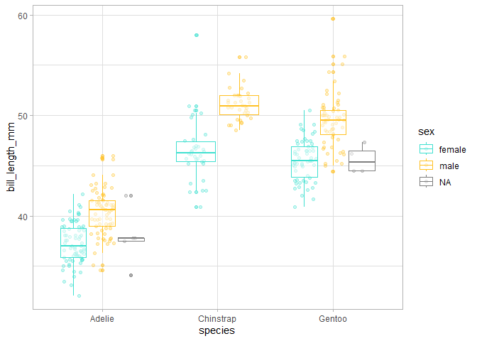
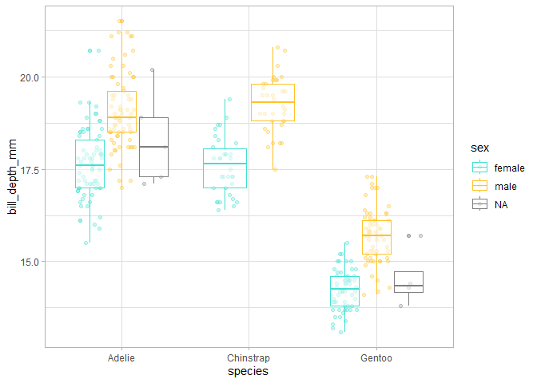
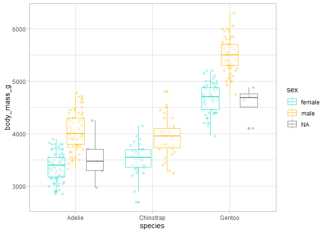
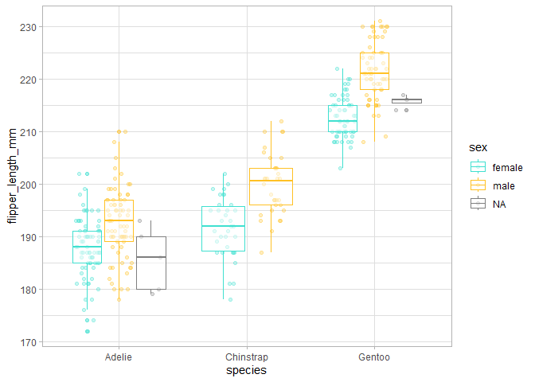
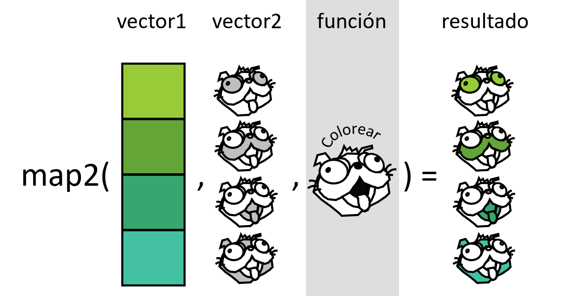

# Programación funcional en R
Julen Astigarraga y Verónica Cruz-Alonso
18/09/2024

- [<span class="toc-section-number">1</span>
  Presentación](#presentación)
  - [<span class="toc-section-number">1.1</span> Estructura del
    curso](#estructura-del-curso)
  - [<span class="toc-section-number">1.2</span> Quiénes
    somos](#quiénes-somos)
- [<span class="toc-section-number">2</span> Introducción a la
  programación en R](#introducción-a-la-programación-en-r)
  - [<span class="toc-section-number">2.1</span> Conceptos muy
    básicos](#conceptos-muy-básicos)
  - [<span class="toc-section-number">2.2</span> Tidyverse](#tidyverse)
  - [<span class="toc-section-number">2.3</span> Scoping](#scoping)
- [<span class="toc-section-number">3</span> Introducción a la
  programación funcional](#introducción-a-la-programación-funcional)
  - [<span class="toc-section-number">3.1</span> ¿Cuándo hay que usar
    una función?](#cuándo-hay-que-usar-una-función)
- [<span class="toc-section-number">4</span> Teoría sobre funciones en
  R](#teoría-sobre-funciones-en-r)
- [<span class="toc-section-number">5</span> Cómo escribir
  funciones](#sec-writefun)
  - [<span class="toc-section-number">5.1</span>
    Argumentos](#argumentos)
  - [<span class="toc-section-number">5.2</span> Valores de
    retorno](#valores-de-retorno)
- [<span class="toc-section-number">6</span> Programación orientada a
  objetos (POO)](#programación-orientada-a-objetos-poo)
- [<span class="toc-section-number">7</span> Programación
  funcional](#programación-funcional)
- [<span class="toc-section-number">8</span> Iteraciones sobre un
  argumento](#iteraciones-sobre-un-argumento)
  - [<span class="toc-section-number">8.1</span> Nuestro primer
    funcional: generando listas,
    `map()`](#nuestro-primer-funcional-generando-listas-map)
  - [<span class="toc-section-number">8.2</span> Nuestro segundo
    funcional: generando vectores,
    `map_*()`](#nuestro-segundo-funcional-generando-vectores-map_)
- [<span class="toc-section-number">9</span> Iteraciones sobre múltiples
  argumentos](#iteraciones-sobre-múltiples-argumentos)
  - [<span class="toc-section-number">9.1</span> Nuestro tercer
    funcional: dos entradas,
    `map2()`](#nuestro-tercer-funcional-dos-entradas-map2)
  - [<span class="toc-section-number">9.2</span> Nuestro cuarto
    funcional: múltiples entradas,
    `pmap()`](#nuestro-cuarto-funcional-múltiples-entradas-pmap)
- [<span class="toc-section-number">10</span> Iteraciones sin
  salida](#iteraciones-sin-salida)
  - [<span class="toc-section-number">10.1</span> Nuestro quinto
    funcional: `walk()`, `walk2()` y
    `pwalk()`](#nuestro-quinto-funcional-walk-walk2-y-pwalk)
- [<span class="toc-section-number">11</span> Operadores y otros
  funcionales](#operadores-y-otros-funcionales)
  - [<span class="toc-section-number">11.1</span> Más variantes de
    `map()`: `modify()` e `imap()`](#más-variantes-de-map-modify-e-imap)
  - [<span class="toc-section-number">11.2</span> Funcionales predicate
    y demás](#funcionales-predicate-y-demás)
- [<span class="toc-section-number">12</span> Más
  información](#más-información)
  - [<span class="toc-section-number">12.1</span>
    Paralelización](#paralelización)
  - [<span class="toc-section-number">12.2</span> Enlaces de
    interés](#enlaces-de-interés)

## Presentación

Los **objetivos** de este curso son:

- aprender a escribir funciones

- aplicar funciones en programación iterativa mediante el paquete
  {purrr} de {tidyverse}

- aprender estilos de código que facilitan su comprensión (📝)

Dentro del modelo de ciencia de datos de Hadley Wickham, Mine
Çetinkaya-Rundel y Garrett Grolemund
(<a href="#fig-datascience" class="quarto-xref">Figure 1</a>), el curso
de centra en el marco que envuelve todo el proceso, es decir, la
programación.


### Estructura del curso

<table style="width:82%;">
<colgroup>
<col style="width: 59%" />
<col style="width: 22%" />
</colgroup>
<thead>
<tr class="header">
<th>Bloques</th>
<th>Día</th>
</tr>
</thead>
<tbody>
<tr class="odd">
<td><p>Presentación del curso</p>
<p>Introducción a la programación en R</p>
<p>Introducción a la programación funcional</p></td>
<td>19/09/24</td>
</tr>
<tr class="even">
<td><p>Teoría sobre funciones en R</p>
<p>Cómo escribir funciones</p></td>
<td>19/09/24</td>
</tr>
<tr class="odd">
<td><p>Programación orientada a objetos</p>
<p>Programación funcional</p>
<p>Iteraciones sobre uno y dos argumentos</p></td>
<td>20/09/24</td>
</tr>
<tr class="even">
<td><p>Iteraciones sobre múltiples argumentos</p>
<p>Iteraciones sin salida</p>
<p>Operadores y otros funcionales</p></td>
<td>20/09/24</td>
</tr>
</tbody>
</table>

### Quiénes somos


Verónica Cruz-Alonso (veronica.cral@gmail.com) y Julen Astigarraga
(julenastigarraga@gmail.com). Coordinamos el [grupo de trabajo de
Ecoinformática](https://ecoinfaeet.github.io/website/index.html) de la
Asociación Española de Ecología Terrestre.

Y vosotros ¿quiénes sois?

<https://www.menti.com/almvj4rjaogv>

## Introducción a la programación en R


### Conceptos muy básicos

- R: lenguaje de programación dinámico (se interpreta el código en el
  momento que se ejecuta).

- RStudio: es un entorno de desarrollo integrado para programar en R.
  Tiene cuatro zonas diferenciadas: el editor de código, la consola
  (donde se ejecuta el código), el navegador del espacio de trabajo (con
  el entorno –*environment*– y el historial de comandos) y el mix de
  abajo a la derecha (Archivos, Gráficos, Paquetes, Ayuda).

- Objetos: cualquier elemento almacenado con un nombre específico.
  Pueden ser de muchos tipos: `numeric`, `integer`, `logical`,
  `data.frame`, `SpatVector`, etc.

``` r
library(tidyverse)
```

    ── Attaching core tidyverse packages ──────────────────────── tidyverse 2.0.0 ──
    ✔ dplyr     1.1.4     ✔ readr     2.1.5
    ✔ forcats   1.0.0     ✔ stringr   1.5.1
    ✔ ggplot2   3.5.1     ✔ tibble    3.2.1
    ✔ lubridate 1.9.3     ✔ tidyr     1.3.1
    ✔ purrr     1.0.2     
    ── Conflicts ────────────────────────────────────────── tidyverse_conflicts() ──
    ✖ dplyr::filter() masks stats::filter()
    ✖ dplyr::lag()    masks stats::lag()
    ℹ Use the conflicted package (<http://conflicted.r-lib.org/>) to force all conflicts to become errors

``` r
a <- c(1, 2, 3, 4)
b <- c(1, 2, 3, 4)
c <- c("hi", "hola", "hola", "hi")
d <- c(TRUE, TRUE, TRUE, FALSE, FALSE)

# el objeto numérico de longitud 4 c(1, 2, 3, 4) tiene dos nombres: "a" y "b"

mymatrix_num <- matrix(c(a, b), nrow = 4, ncol = 2)
mymatrix_num
```

         [,1] [,2]
    [1,]    1    1
    [2,]    2    2
    [3,]    3    3
    [4,]    4    4

``` r
mymatrix_cha <- matrix(c(a, b, c), nrow = 4, ncol = 3)
mymatrix_cha
```

         [,1] [,2] [,3]  
    [1,] "1"  "1"  "hi"  
    [2,] "2"  "2"  "hola"
    [3,] "3"  "3"  "hola"
    [4,] "4"  "4"  "hi"  

``` r
mytibble <- tibble(a, b, c)
mytibble
```

    # A tibble: 4 × 3
          a     b c    
      <dbl> <dbl> <chr>
    1     1     1 hi   
    2     2     2 hola 
    3     3     3 hola 
    4     4     4 hi   

``` r
mydf <- data.frame(a, b, c)

mylist <- list(a, b, c, d)
mylist
```

    [[1]]
    [1] 1 2 3 4

    [[2]]
    [1] 1 2 3 4

    [[3]]
    [1] "hi"   "hola" "hola" "hi"  

    [[4]]
    [1]  TRUE  TRUE  TRUE FALSE FALSE

``` r
mylist_from_tibble <- mytibble |> # list
  group_split(c)
mylist_from_tibble
```

    <list_of<
      tbl_df<
        a: double
        b: double
        c: character
      >
    >[2]>
    [[1]]
    # A tibble: 2 × 3
          a     b c    
      <dbl> <dbl> <chr>
    1     1     1 hi   
    2     4     4 hi   

    [[2]]
    # A tibble: 2 × 3
          a     b c    
      <dbl> <dbl> <chr>
    1     2     2 hola 
    2     3     3 hola 

``` r
mynested_tibble <- mytibble |> # data.frame with list-columns
  group_by(c) |> 
  nest()
mynested_tibble
```

    # A tibble: 2 × 2
    # Groups:   c [2]
      c     data            
      <chr> <list>          
    1 hi    <tibble [2 × 2]>
    2 hola  <tibble [2 × 2]>

💡Trabajar con listas es muy común en R. De echo el output por defecto
de `map()` son listas. Sin embargo, las listas pueden resultar a veces
desordenadas, p. ej., cuando perdemos el nombre de cada elemento de la
lista. La función
[`nest()`](https://tidyr.tidyverse.org/reference/nest.html) de {tidyr}
nos permite trabajar con listas-columnas en data frames, generando una
fila para cada grupo definido por las columnas no anidadas (es decir,
*non-nested* columns).

> Los nombres tienen objetos; los objetos no tienen nombres
>
> — Hadley Wickham ([Advanced R](https://adv-r.hadley.nz/index.html))

💡Explora los diferentes tipos de objetos
[aquí](https://rstudio-education.github.io/hopr/r-objects.html).

- Funciones: objetos de R que toman un vector de entrada y dan como
  resultado otro vector haciendo una acción concreta (funcionalidad
  específica). Son los *bloques de construcción* fundamentales en
  cualquier script de R que es un lenguaje funcional.

  

> Para comprender la computación en R, resultan útiles dos lemas:
>
> \- Todo lo que existe es un objeto.
>
> \- Todo lo que sucede es una llamada a función.
>
> — John Chambers ([Advanced R](https://adv-r.hadley.nz/index.html))

💡Más información sobre las tres verdades en R
[aquí](https://www.r-bloggers.com/2018/06/three-deep-truths-about-r/).

- Paquetes o librerias: contienen funciones reutilizables, documentación
  sobre cómo usarlas y datos de ejemplo. Son las unidades fundamentales
  de código reproducible en R.

- CRAN: the Comprehensive R Archive Network.

#### Ejercicio

1.  Elije un número y multiplicalo por 3

2.  Crea un objeto que contenga 100 valores entre 1900 y 2000

3.  Suma un número a tu objeto

4.  Multiplica tu objeto por sí mismo

📝Los nombre de los objetos deben ser descriptivos y no pueden contener
símbolos especiales (`^`, `!`, `$`, `@`, `+`, `-`, `/`, `*`).

📝R es sensible a las mayúsculas. Mejor no usarlas.

### Tidyverse

[*Tidyverse*](https://www.tidyverse.org/) es una colección de paquetes
(meta-paquete) de R desarrollado por Hadley Wickham. Contiene ocho
paquetes principales: {readr}, {tibble}, {dplyr}, {tidyr}, {stringr},
{forcats}, {ggplot2} y {purrr}. *Tidyverse* puede considerarse un
dialecto del lenguaje de programación de R y, por ello, puede resultar
difícil de aprender para gente con experiencia en el lenguaje
tradicional de R base. Sin embargo, en este curso queremos enseñar las
bases de programación utilizando *tidyverse* ya que en las secciones de
iteración utilizaremos fundamentalmente `purrr` por razones que
explicaremos más adelante.

*Tidyverse* está diseñado para respaldar las actividades de un analista
de datos humano por lo que sus estructuras de programación resultan más
lógicas para la mente humana. Todos los paquetes están diseñados para
trabajar con datos ordenados ([*tidy
data*](https://cran.r-project.org/web/packages/tidyr/vignettes/tidy-data.html)),
es decir, aquellos donde cada columna es una variable, cada fila una
observación y cada celda tiene un valor. Además, las funciones están
preparadas para concatenarse a través del operador *pipe* (`%>%` del
paquete `magrittr` o `|>` de R base), que coge lo que está en su
izquierda y lo utiliza como el primer argumento de la función que está
en su derecha. Esto permite seguir un flujo de lectura de izquierda a
derecha, más cómodo para la mayoría de la gente.

💡Los dos operador *pipe* tienen pequeñas
[diferencias](https://www.tidyverse.org/blog/2023/04/base-vs-magrittr-pipe/)
pero en general el comportamiento es el mismo.

💡Para más información sobre las diferencias entre R base y *Tidyverse*
podéis leer la nota [Tidyverse: colección de paquetes de R para la
ciencia de
datos](https://www.revistaecosistemas.net/index.php/ecosistemas/article/view/2745)

``` r
# install.packages("tidyverse")
library(tidyverse)

mivector <- c(6, 4)
mean(mivector)
```

    [1] 5

``` r
mivector |> 
  mean() # CTRL + SHIFT + M para poner un pipe
```

    [1] 5

``` r
# install.packages("palmerpenguins")
library(palmerpenguins)

penguins <- palmerpenguins::penguins
penguins
```

    # A tibble: 344 × 8
       species island    bill_length_mm bill_depth_mm flipper_length_mm body_mass_g
       <fct>   <fct>              <dbl>         <dbl>             <int>       <int>
     1 Adelie  Torgersen           39.1          18.7               181        3750
     2 Adelie  Torgersen           39.5          17.4               186        3800
     3 Adelie  Torgersen           40.3          18                 195        3250
     4 Adelie  Torgersen           NA            NA                  NA          NA
     5 Adelie  Torgersen           36.7          19.3               193        3450
     6 Adelie  Torgersen           39.3          20.6               190        3650
     7 Adelie  Torgersen           38.9          17.8               181        3625
     8 Adelie  Torgersen           39.2          19.6               195        4675
     9 Adelie  Torgersen           34.1          18.1               193        3475
    10 Adelie  Torgersen           42            20.2               190        4250
    # ℹ 334 more rows
    # ℹ 2 more variables: sex <fct>, year <int>

``` r
summary(penguins)
```

          species          island    bill_length_mm  bill_depth_mm  
     Adelie   :152   Biscoe   :168   Min.   :32.10   Min.   :13.10  
     Chinstrap: 68   Dream    :124   1st Qu.:39.23   1st Qu.:15.60  
     Gentoo   :124   Torgersen: 52   Median :44.45   Median :17.30  
                                     Mean   :43.92   Mean   :17.15  
                                     3rd Qu.:48.50   3rd Qu.:18.70  
                                     Max.   :59.60   Max.   :21.50  
                                     NA's   :2       NA's   :2      
     flipper_length_mm  body_mass_g       sex           year     
     Min.   :172.0     Min.   :2700   female:165   Min.   :2007  
     1st Qu.:190.0     1st Qu.:3550   male  :168   1st Qu.:2007  
     Median :197.0     Median :4050   NA's  : 11   Median :2008  
     Mean   :200.9     Mean   :4202                Mean   :2008  
     3rd Qu.:213.0     3rd Qu.:4750                3rd Qu.:2009  
     Max.   :231.0     Max.   :6300                Max.   :2009  
     NA's   :2         NA's   :2                                 

``` r
glimpse(penguins)
```

    Rows: 344
    Columns: 8
    $ species           <fct> Adelie, Adelie, Adelie, Adelie, Adelie, Adelie, Adel…
    $ island            <fct> Torgersen, Torgersen, Torgersen, Torgersen, Torgerse…
    $ bill_length_mm    <dbl> 39.1, 39.5, 40.3, NA, 36.7, 39.3, 38.9, 39.2, 34.1, …
    $ bill_depth_mm     <dbl> 18.7, 17.4, 18.0, NA, 19.3, 20.6, 17.8, 19.6, 18.1, …
    $ flipper_length_mm <int> 181, 186, 195, NA, 193, 190, 181, 195, 193, 190, 186…
    $ body_mass_g       <int> 3750, 3800, 3250, NA, 3450, 3650, 3625, 4675, 3475, …
    $ sex               <fct> male, female, female, NA, female, male, female, male…
    $ year              <int> 2007, 2007, 2007, 2007, 2007, 2007, 2007, 2007, 2007…

``` r
View(penguins)

# filter
penguins |> 
  filter(island == "Dream") 
```

    # A tibble: 124 × 8
       species island bill_length_mm bill_depth_mm flipper_length_mm body_mass_g
       <fct>   <fct>           <dbl>         <dbl>             <int>       <int>
     1 Adelie  Dream            39.5          16.7               178        3250
     2 Adelie  Dream            37.2          18.1               178        3900
     3 Adelie  Dream            39.5          17.8               188        3300
     4 Adelie  Dream            40.9          18.9               184        3900
     5 Adelie  Dream            36.4          17                 195        3325
     6 Adelie  Dream            39.2          21.1               196        4150
     7 Adelie  Dream            38.8          20                 190        3950
     8 Adelie  Dream            42.2          18.5               180        3550
     9 Adelie  Dream            37.6          19.3               181        3300
    10 Adelie  Dream            39.8          19.1               184        4650
    # ℹ 114 more rows
    # ℹ 2 more variables: sex <fct>, year <int>

``` r
penguins |> 
  filter(island == "Dream" & body_mass_g > 4500) # se pueden combinar criterios
```

    # A tibble: 4 × 8
      species   island bill_length_mm bill_depth_mm flipper_length_mm body_mass_g
      <fct>     <fct>           <dbl>         <dbl>             <int>       <int>
    1 Adelie    Dream            39.8          19.1               184        4650
    2 Adelie    Dream            39.6          18.8               190        4600
    3 Chinstrap Dream            52.8          20                 205        4550
    4 Chinstrap Dream            52            20.7               210        4800
    # ℹ 2 more variables: sex <fct>, year <int>

``` r
penguins |> 
  filter(island == "Dream" | body_mass_g > 4500) 
```

    # A tibble: 235 × 8
       species island    bill_length_mm bill_depth_mm flipper_length_mm body_mass_g
       <fct>   <fct>              <dbl>         <dbl>             <int>       <int>
     1 Adelie  Torgersen           39.2          19.6               195        4675
     2 Adelie  Dream               39.5          16.7               178        3250
     3 Adelie  Dream               37.2          18.1               178        3900
     4 Adelie  Dream               39.5          17.8               188        3300
     5 Adelie  Dream               40.9          18.9               184        3900
     6 Adelie  Dream               36.4          17                 195        3325
     7 Adelie  Dream               39.2          21.1               196        4150
     8 Adelie  Dream               38.8          20                 190        3950
     9 Adelie  Dream               42.2          18.5               180        3550
    10 Adelie  Dream               37.6          19.3               181        3300
    # ℹ 225 more rows
    # ℹ 2 more variables: sex <fct>, year <int>

``` r
penguins |> 
  filter(island %in% c("Dream", "Torgersen"))
```

    # A tibble: 176 × 8
       species island    bill_length_mm bill_depth_mm flipper_length_mm body_mass_g
       <fct>   <fct>              <dbl>         <dbl>             <int>       <int>
     1 Adelie  Torgersen           39.1          18.7               181        3750
     2 Adelie  Torgersen           39.5          17.4               186        3800
     3 Adelie  Torgersen           40.3          18                 195        3250
     4 Adelie  Torgersen           NA            NA                  NA          NA
     5 Adelie  Torgersen           36.7          19.3               193        3450
     6 Adelie  Torgersen           39.3          20.6               190        3650
     7 Adelie  Torgersen           38.9          17.8               181        3625
     8 Adelie  Torgersen           39.2          19.6               195        4675
     9 Adelie  Torgersen           34.1          18.1               193        3475
    10 Adelie  Torgersen           42            20.2               190        4250
    # ℹ 166 more rows
    # ℹ 2 more variables: sex <fct>, year <int>

``` r
# select
penguins |> 
  select(sex, body_mass_g)
```

    # A tibble: 344 × 2
       sex    body_mass_g
       <fct>        <int>
     1 male          3750
     2 female        3800
     3 female        3250
     4 <NA>            NA
     5 female        3450
     6 male          3650
     7 female        3625
     8 male          4675
     9 <NA>          3475
    10 <NA>          4250
    # ℹ 334 more rows

``` r
penguins |> 
  select(ends_with("mm")) # seleccionar variables que tienen un patron
```

    # A tibble: 344 × 3
       bill_length_mm bill_depth_mm flipper_length_mm
                <dbl>         <dbl>             <int>
     1           39.1          18.7               181
     2           39.5          17.4               186
     3           40.3          18                 195
     4           NA            NA                  NA
     5           36.7          19.3               193
     6           39.3          20.6               190
     7           38.9          17.8               181
     8           39.2          19.6               195
     9           34.1          18.1               193
    10           42            20.2               190
    # ℹ 334 more rows

``` r
penguins |> 
  select(ends_with(c("mm", "g"))) 
```

    # A tibble: 344 × 4
       bill_length_mm bill_depth_mm flipper_length_mm body_mass_g
                <dbl>         <dbl>             <int>       <int>
     1           39.1          18.7               181        3750
     2           39.5          17.4               186        3800
     3           40.3          18                 195        3250
     4           NA            NA                  NA          NA
     5           36.7          19.3               193        3450
     6           39.3          20.6               190        3650
     7           38.9          17.8               181        3625
     8           39.2          19.6               195        4675
     9           34.1          18.1               193        3475
    10           42            20.2               190        4250
    # ℹ 334 more rows

``` r
# se pueden utilizar todo tipo de patrones de texto: https://rstudio.github.io/cheatsheets/strings.pdf

penguins |> 
  select(sex, body_mass_g, everything()) # se puede usar para reordenar variables
```

    # A tibble: 344 × 8
       sex    body_mass_g species island    bill_length_mm bill_depth_mm
       <fct>        <int> <fct>   <fct>              <dbl>         <dbl>
     1 male          3750 Adelie  Torgersen           39.1          18.7
     2 female        3800 Adelie  Torgersen           39.5          17.4
     3 female        3250 Adelie  Torgersen           40.3          18  
     4 <NA>            NA Adelie  Torgersen           NA            NA  
     5 female        3450 Adelie  Torgersen           36.7          19.3
     6 male          3650 Adelie  Torgersen           39.3          20.6
     7 female        3625 Adelie  Torgersen           38.9          17.8
     8 male          4675 Adelie  Torgersen           39.2          19.6
     9 <NA>          3475 Adelie  Torgersen           34.1          18.1
    10 <NA>          4250 Adelie  Torgersen           42            20.2
    # ℹ 334 more rows
    # ℹ 2 more variables: flipper_length_mm <int>, year <int>

``` r
# arrange
penguins |> 
  select(sex, body_mass_g) |> 
  arrange(body_mass_g)
```

    # A tibble: 344 × 2
       sex    body_mass_g
       <fct>        <int>
     1 female        2700
     2 female        2850
     3 female        2850
     4 female        2900
     5 female        2900
     6 female        2900
     7 female        2900
     8 female        2925
     9 <NA>          2975
    10 female        3000
    # ℹ 334 more rows

``` r
penguins |> 
  select(sex, body_mass_g) |> 
  arrange(desc(body_mass_g))
```

    # A tibble: 344 × 2
       sex   body_mass_g
       <fct>       <int>
     1 male         6300
     2 male         6050
     3 male         6000
     4 male         6000
     5 male         5950
     6 male         5950
     7 male         5850
     8 male         5850
     9 male         5850
    10 male         5800
    # ℹ 334 more rows

#### Ejercicio

1.  Crea un objeto con los pingüinos de la especie Adelie y ordena la
    tabla según la longitud del ala de los individuos.

2.  Crea un objeto a partir del anterior donde selecciones la isla y las
    variables relacionadas con el pico.

3.  Crea un objeto a partir del creado en el punto 1 donde selecciones
    todo menos la especie.

``` r
# mutate
penguins |> 
  mutate(bill_volume_mm2 = (bill_length_mm * bill_depth_mm) / 2) |> 
  select(bill_volume_mm2, everything())
```

    # A tibble: 344 × 9
       bill_volume_mm2 species island bill_length_mm bill_depth_mm flipper_length_mm
                 <dbl> <fct>   <fct>           <dbl>         <dbl>             <int>
     1            366. Adelie  Torge…           39.1          18.7               181
     2            344. Adelie  Torge…           39.5          17.4               186
     3            363. Adelie  Torge…           40.3          18                 195
     4             NA  Adelie  Torge…           NA            NA                  NA
     5            354. Adelie  Torge…           36.7          19.3               193
     6            405. Adelie  Torge…           39.3          20.6               190
     7            346. Adelie  Torge…           38.9          17.8               181
     8            384. Adelie  Torge…           39.2          19.6               195
     9            309. Adelie  Torge…           34.1          18.1               193
    10            424. Adelie  Torge…           42            20.2               190
    # ℹ 334 more rows
    # ℹ 3 more variables: body_mass_g <int>, sex <fct>, year <int>

``` r
penguins |>
  mutate(female_penguin = case_when(
    sex == "female" & body_mass_g < 3600 ~ "small female",
    sex == "female" & body_mass_g >= 3600 ~ "big female",
    TRUE ~ NA)) |>
  select(female_penguin, sex, body_mass_g)
```

    # A tibble: 344 × 3
       female_penguin sex    body_mass_g
       <chr>          <fct>        <int>
     1 <NA>           male          3750
     2 big female     female        3800
     3 small female   female        3250
     4 <NA>           <NA>            NA
     5 small female   female        3450
     6 <NA>           male          3650
     7 big female     female        3625
     8 <NA>           male          4675
     9 <NA>           <NA>          3475
    10 <NA>           <NA>          4250
    # ℹ 334 more rows

``` r
# summarise
# se utiliza con funciones que resumen: n, n_distinct, mean, etc.
# ver ?summarise
penguins |> 
  summarise(
    body_min = min(body_mass_g, na.rm = TRUE),
    body_max = max(body_mass_g, na.rm = TRUE)
  )
```

    # A tibble: 1 × 2
      body_min body_max
         <int>    <int>
    1     2700     6300

``` r
penguins |> 
  group_by(sex) |> 
  summarise(body_min = min(body_mass_g, na.rm = TRUE),
  body_max = max(body_mass_g, na.rm = TRUE))
```

    # A tibble: 3 × 3
      sex    body_min body_max
      <fct>     <int>    <int>
    1 female     2700     5200
    2 male       3250     6300
    3 <NA>       2975     4875

``` r
# join: left, right, full, inner

coordinates <- tibble(island = c("Dream", "Torgersen", "Biscoe"), 
  latitude = c("64°44′S", "64°46′S", "64°36′S"),
  longitude = c("64°14′W", "64°05′W", " 63°30′W"))

penguins |> 
  left_join(coordinates, by = "island") |> 
  select(island, latitude, longitude, everything())
```

    # A tibble: 344 × 10
       island    latitude longitude species bill_length_mm bill_depth_mm
       <chr>     <chr>    <chr>     <fct>            <dbl>         <dbl>
     1 Torgersen 64°46′S  64°05′W   Adelie            39.1          18.7
     2 Torgersen 64°46′S  64°05′W   Adelie            39.5          17.4
     3 Torgersen 64°46′S  64°05′W   Adelie            40.3          18  
     4 Torgersen 64°46′S  64°05′W   Adelie            NA            NA  
     5 Torgersen 64°46′S  64°05′W   Adelie            36.7          19.3
     6 Torgersen 64°46′S  64°05′W   Adelie            39.3          20.6
     7 Torgersen 64°46′S  64°05′W   Adelie            38.9          17.8
     8 Torgersen 64°46′S  64°05′W   Adelie            39.2          19.6
     9 Torgersen 64°46′S  64°05′W   Adelie            34.1          18.1
    10 Torgersen 64°46′S  64°05′W   Adelie            42            20.2
    # ℹ 334 more rows
    # ℹ 4 more variables: flipper_length_mm <int>, body_mass_g <int>, sex <fct>,
    #   year <int>

#### Ejercicio

1.  Con el `data.frame` penguins, cuenta el número de casos que hay en
    cada isla y calcula la media de la longitud del ala en cada isla.

2.  Con el mismo `data.frame` calcula la relación entre el peso en kg y
    la longitud del ala para cada individuo.

``` r
mypenguins <- penguins |> 
  mutate(bill_volume_mm2 = (bill_length_mm * bill_depth_mm) / 2,
    female_penguin = case_when(
      sex == "female" & body_mass_g < 3600 ~ "small female",
      sex == "female" & body_mass_g >= 3600 ~ "big female",
      TRUE ~ NA)) 

write_delim(mypenguins, file = "mypenguins.csv", delim = ";")
# en file hay que especificar el directorio donde queremos que se guarde. Si no, se guardará en el directorio de trabajo (getwd())

misdatos <- read_delim(file = "mypenguins.csv")
View(misdatos)
```

### Scoping

El [*lexical scoping* (ámbito
léxico)](https://adv-r.hadley.nz/functions.html?q=lexica#lexical-scoping)
son el conjunto de normas sobre cómo los valores de las variables son
extraidos del entorno en cada lenguaje de programación, es decir, como
se asocia una variable (nombre) a un valor. En R tiene cuatro normas
básicas (*name masking, functions versus variables, a fresh start and
dynamic lookup*), pero la más importante para empezar con programación
funcional es el *name masking*. Un entendimiento más profundo del ámbito
léxico nos permite el uso más avanzado de la programación funcional.

En relación al *name masking*, el principio básico es que los nombres
definidos dentro de una función *enmascaran* los nombres definidos fuera
de la función. Pero si un nombre no está definido dentro de una función,
R buscará en un *environment* superior.

``` r
x <- 10
y <- 20

myfunction <- function() {
  x <- 1
  y <- 2
  x + y
}

myfunction()
```

    [1] 3


En general, con R base sólo podemos llamar a objetos que forman parte
del entorno (*env-variables*) aunque hay excepciones; en cambio, con
*tidyverse* es muy común llamar a las variables dentro de las tablas
(*data-variables*). Esta característica llamada [*non-standard
evaluation*](http://adv-r.had.co.nz/Computing-on-the-language.html)
simplifica el código en *tidyverse*, pero la ventaja no tiene coste cero
y tiene implicaciones en la gramática de las funciones como veremos más
adelante.

``` r
penguins |> 
  filter(island == "Dream", species == "Chinstrap") |> 
  select(flipper_length_mm)
```

    # A tibble: 68 × 1
       flipper_length_mm
                   <int>
     1               192
     2               196
     3               193
     4               188
     5               197
     6               198
     7               178
     8               197
     9               195
    10               198
    # ℹ 58 more rows

``` r
penguins[penguins$island == "Dream" & penguins$species == "Chinstrap", "flipper_length_mm"]
```

    # A tibble: 68 × 1
       flipper_length_mm
                   <int>
     1               192
     2               196
     3               193
     4               188
     5               197
     6               198
     7               178
     8               197
     9               195
    10               198
    # ℹ 58 more rows

``` r
misdatos <- data.frame(valores = 1:10)
mean(x = 1:10)
```

    [1] 5.5

``` r
mean(x = valores)
```

    Error in eval(expr, envir, enclos): object 'valores' not found

``` r
mean(x = misdatos$valores)
```

    [1] 5.5

``` r
mean(x = misdatos[,"valores"])
```

    [1] 5.5

``` r
misdatos |> 
  summarise(mean = mean(valores))
```

      mean
    1  5.5

``` r
subset(misdatos, select = valores) # R base
```

       valores
    1        1
    2        2
    3        3
    4        4
    5        5
    6        6
    7        7
    8        8
    9        9
    10      10


## Introducción a la programación funcional

La creciente disponibilidad de datos y de versatilidad de los programas
de análisis han provocado el incremento en la cantidad y complejidad de
los análisis que realizamos. Esto hace cada vez más necesaria la
eficiencia en el proceso de gestión y análisis de datos. Una de las
posibles formas para optimizar estos procesos y acortar los tiempos de
trabajo para los usuarios de R es la programación basada en funciones.
Las funciones permiten automatizar tareas comunes (por ejemplo, leer
diferentes bases de datos) simplificando el código.

Como las funciones en R son objetos, es posible llamarlas a través de
otras funciones e iterar este proceso, lo que constituye la base de la
programación funcional y convierte a R en una herramienta muy poderosa.
Las **iteraciones** sirven para realizar la misma acción a múltiples
entradas. Existen dos grandes paradigmas de iteración: la programación
orientada a objetos y la programación funcional. En este curso, nos
centraremos principalmente en la **programación funcional** y
aprenderemos a utilizar el paquete {purrr}, que proporciona funciones
para eliminar muchos bucles comunes.

``` r
df <- penguins |> 
  select(bill_length_mm, bill_depth_mm, flipper_length_mm, body_mass_g)

df_rescaled1 <- df |> 
  mutate(bill_length_mm = (bill_length_mm - min(bill_length_mm, na.rm = TRUE)) / (max(bill_length_mm, na.rm = TRUE) - min(bill_length_mm, na.rm = TRUE)),
    bill_depth_mm = (bill_depth_mm - min(bill_depth_mm, na.rm = TRUE)) / (max(bill_depth_mm, na.rm = TRUE) - min(bill_length_mm, na.rm = TRUE)),
    flipper_length_mm = (flipper_length_mm - min(flipper_length_mm, na.rm = TRUE)) / (max(flipper_length_mm, na.rm = TRUE) - min(flipper_length_mm, na.rm = TRUE)),
    body_mass_g = (body_mass_g - min(body_mass_g, na.rm = TRUE)) / (max(body_mass_g, na.rm = TRUE) - min(body_mass_g, na.rm = TRUE)))
    
View(df_rescaled1)

#
rescale01 <- function(x) {
  rng <- range(x, na.rm = TRUE)   
  (x - rng[1]) / (rng[2] - rng[1]) 
} 

df_rescaled2 <- df |> 
  mutate(bill_length_mm = rescale01(bill_length_mm),
    bill_depth_mm = rescale01(bill_depth_mm),
    flipper_length_mm = rescale01(flipper_length_mm), 
    body_mass_g = rescale01(body_mass_g))  

View(df_rescaled2)

#
df_rescaled3 <- lapply(df, rescale01)

head(df_rescaled3$bill_length_mm)
```

    [1] 0.2545455 0.2690909 0.2981818        NA 0.1672727 0.2618182

Las principales **ventajas de la programación funcional** (uso de
funciones e iteraciones) son:

- Facilidad para ver la intención del código y, por tanto, mejorar la
  **comprensión** para uno mismo, colaboradores y revisores:
  - Las funciones tienen un nombre evocativo.
  - El código queda más ordenado.
- **Rapidez** si se necesitan hacer cambios ya que las funciones son
  piezas independientes que resuelven un problema concreto.
- **Disminuye la probabilidad de error**.

### ¿Cuándo hay que usar una función?

Se recomienda seguir el principio “do not repeat yourself” ([DRY
principle](https://en.wikipedia.org/wiki/Don%27t_repeat_yourself#:~:text=%22Don't%20repeat%20yourself%22,redundancy%20in%20the%20first%20place.)):
cada unidad de conocimiento o información debe tener una representación
única, inequívoca y autoritativa en un sistema.

Escribir una función ya merece la pena cuando has copiado y pegado más
de dos veces lo mismo (don’t be WET! - Write Everything Twice). Cuantas
más veces esté repetido un código, en más sitios necesitarás
actualizarlo si hay algun cambio y más aumenta la probabilidad de error.

## Teoría sobre funciones en R

Las funciones tienen tres componentes:

- `body()` (*cuerpo*): código dentro de la función.
- `formals()`: lista de *argumentos* que controlan como se ejecuta la
  función.
- `environment()`: la estructura que alimenta el *scoping* de la
  función, es decir, el *entorno* donde se ubica la función.

``` r
body(rescale01)
```

    {
        rng <- range(x, na.rm = TRUE)
        (x - rng[1])/(rng[2] - rng[1])
    }

``` r
formals(rescale01)
```

    $x

``` r
environment(rescale01)
```

    <environment: R_GlobalEnv>

``` r
f <- function(x) {
  x + y
}

y <- 100
f(x = 10)
```

    [1] 110

``` r
y <- 1000
f(10)
```

    [1] 1010

Las **funciones primitivas** son la excepción ya que no tienen los
citados componentes. Están escritas en C en lugar de en R y sólo
aparecen en el paquete *base*. Son más eficientes pero se comportan
diferente a otras funciones, así que R Core Team intenta no crear nuevas
funciones primitivas. El resto de funciones siguen la estructura
indicada arriba.

``` r
sum
```

    function (..., na.rm = FALSE)  .Primitive("sum")

``` r
body(sum)
```

    NULL

Según el tipo de output generado hay dos tipos de funciones:

- Las **funciones de transformación** transforman el objeto que entra en
  la función (primer argumento) y devuelven otro objeto o el anterior
  modificado. Los funcionales son tipos especiales de funciones de
  transformación.

- Las **funciones secundarias** (*side-effect functions*) tienen efectos
  colaterales y ejecutan una acción, como guardar un archivo o dibujar
  un plot. Algunos ejemplos de funciones secundarias que se usan
  comunmente son: `library()`, `setwd()`, `plot()`, `write_delim()`…
  Estas funciones retornan *de forma invisible* el primer argumento, que
  no se guarda, pero puede ser usado en un *pipeline*.

En general, sintácticamente, las funciones tienen tres componentes:

- Función `function()` (primitiva)
- Argumentos: lista de entradas.
- Cuerpo: trozo de código que sigue a `function()`, tradicionalmente
  entre llaves.

``` r
nombre1_v1 <- function(x, y) {
  paste(x, y, sep = "_")
}  

nombre1_v2 <- function(x, y) paste(x, y, sep = "_")  

nombre1_v3 <- \(x, y) paste(x, y, sep = "_")  

nombre1_v1("Vero", "Cruz") 
```

    [1] "Vero_Cruz"

``` r
nombre1_v2("Vero", "Cruz") 
```

    [1] "Vero_Cruz"

``` r
nombre1_v3("Vero", "Cruz") 
```

    [1] "Vero_Cruz"

📝 Si la función tiene más de dos lineas es mejor usar llaves siempre
para que quede bien delimitada. La llave de apertura nunca debe ir sola
pero sí la de cierre (excepto con *else*). Las sangrías también ayudan
mucho a entender la jerarquía del código dentro de las funciones. En
este sentido recomendamos usar *Code \> Reindent lines/Reformat code* en
el menú de RStudio.

💡Los operadores infijos (`+`), de flujo (`for`, `if`), de subdivisión
(`[ ]`, `$`), de reemplazo (`<-`) o incluso las llaves (`{ }`) también
son funciones. La tilde invertida “\`” permite referirse a funciones o
variables que de otro modo tienen “nombre ilegales”.

``` r
3 + 2 
```

    [1] 5

``` r
`+`(3, 2)  
```

    [1] 5

``` r
for (i in 1:2) print(i) 
```

    [1] 1
    [1] 2

``` r
`for`(i, 1:2, print(i)) 
```

    [1] 1
    [1] 2

En general las funciones tienen un nombre que se ejecuta cuando se
necesita como hemos visto hasta ahora, pero esto no es obligatorio.
Algunos paquetes como {purrr} o las funciones de la familia `apply`
permiten el uso de **funciones anónimas** para iterar.

``` r
nxcaso <- lapply(penguins, function(x) length(unique(x)))

models <- penguins|>
  group_split(species) |>
  map(\(df) lm(body_mass_g ~ bill_length_mm, data = df)) 
```

📝 Mejor reservar el uso de funciones anónimas para funciones cortas y
simples. Si la función es larga, ocupa varias líneas o tenemos que
usarla con frecuencia mejor darle un nombre.

## Cómo escribir funciones

#### Ejercicio

Genera tu primera función que divida un valor siempre entre 100.

💡Atajo para escribir funciones: escribir la palabra fun + tabulador

Imaginad que para un set de datos quisieramos hacer un gráfico de
distribución de cada variable numérica, en función de otra variable
categórica que nos interese especialmente, para ver cómo se distribuye.

``` r
penguins_num <- penguins |> 
  select(species, sex, where(is.numeric))

# nos interesan las diferencias entre especie y sexo

ggplot(penguins_num, aes(x = species, y = bill_length_mm, color = sex)) +
  geom_point(position = position_jitterdodge(), alpha = 0.3) +
  geom_boxplot(alpha = 0.5) +
  scale_color_manual(values = c("turquoise", "goldenrod1")) +
  theme_light()
```



``` r
ggplot(penguins_num, aes(x = species, y = bill_depth_mm, color = sex)) +
  geom_point(position = position_jitterdodge(), alpha = 0.3) +
  geom_boxplot(alpha = 0.5) +
  scale_color_manual(values = c("turquoise", "goldenrod1")) +
  theme_light()
```



``` r
ggplot(penguins_num, aes(x = species, y = flipper_length_mm, color = sex)) +
  geom_point(position = position_jitterdodge(), alpha = 0.3) +
  geom_boxplot(alpha = 0.5) +
  scale_color_manual(values = c("turquoise", "goldenrod1")) +
  theme_light()
```


``` r
# etc
```

Hemos copiado un código más de dos veces para realizar una misma acción
(es decir, un gráfico para ver como se distribuye una variable en
función de otras dos que se mantienen constantes) así que hay que
considerar la posibilidad de que estemos necesitando una función. A
continuación vamos a seguir unos sencillos pasos para transformar
cualquier código repetido en función.

1.  Analizar el código: ¿cuáles son las partes replicadas? ¿cuantas
    entradas tenemos? ¿cuáles varían y cuáles no?

2.  Simplificar y reanalizar duplicaciones

``` r
var <- penguins_num$bill_length_mm

ggplot(penguins_num, aes(x = species, y = var, color = sex)) +
  geom_point(position = position_jitterdodge(), alpha = 0.3) +
  geom_boxplot(alpha = 0.5) +
  scale_color_manual(values = c("turquoise", "goldenrod1")) +
  theme_light()
```


``` r
var <- body_mass_g
```

    Error in eval(expr, envir, enclos): object 'body_mass_g' not found

``` r
var <- "body_mass_g"

ggplot(penguins_num, aes(x = species, y = var, color = sex)) +
  geom_point(position = position_jitterdodge(), alpha = 0.3) +
  geom_boxplot(alpha = 0.5) +
  scale_color_manual(values = c("turquoise", "goldenrod1")) +
  theme_light() +
  ylab(var) # grafico erroneo
```


``` r
ggplot(penguins_num, aes(x = species, y = .data[[var]], color = sex)) +
  geom_point(position = position_jitterdodge(), alpha = 0.3) +
  geom_boxplot(alpha = 0.5) +
  scale_color_manual(values = c("turquoise", "goldenrod1")) +
  theme_light() +
  ylab(var) # grafico correcto
```



👀 La función `ggplot` necesita argumentos (data-variable) que estén
dentro del `data.frame` que va a representar. Para poder generalizar la
función hemos guardado el nombre de la variable en un objeto (tipo
`character`), pero `ggplot` no acepta `characters`. Por ello necesitamos
utilizar una función intermedia que sí los acepte.

📝 Crear objetos con cálculos intermedios dentro de una función, es una
buena práctica porque deja más claro lo que el código está haciendo.

3.  Elegir un nombre para la función (📝). Idealmente tiene que ser
    corto y evocar lo que la función hace. En general, debe ser un verbo
    (p.ej. imputar_valores) mientras que los argumentos son sustantivos
    (p.ej. data, variable, etc.). Usar un sustantivo para una función
    está permitido si la función calcula algo muy conocido (p.ej.
    `mean()`) o si sirve para acceder a partes de un objeto (p.ej.
    `residuals()`). También se recomienda evitar verbos muy genéricos
    (p.ej. calcular) y si el nombre tiene varias palabras separarlas con
    guión bajo o mayúsculas, pero ser consistente. Si programas varias
    funciones que hacen cosas parecidas se recomienda usar el mismo
    prefijo para todas (p.ej. “str\_” en el paquete {stringr}).

Cuanto más claramente puedas expresar la intención de tu código a través
de los nombres de funciones, más fácilmente otros e incluyendo tú mismo
en el futuro podrán leer y comprender el código.

``` r
# ejemplos de nombres que no hay que usar

T <- FALSE
c <- 10
mean <- function(x) sum(x)

rm(T, c, mean)
```

4.  Enumerar los argumentos dentro de `function()` y poner el código
    simplificado dentro de las llaves.

``` r
explorar_penguins <- function (var) {
  ggplot(penguins_num, aes(x = species, y = .data[[var]], color = sex)) +
    geom_point(position = position_jitterdodge(), alpha = 0.3) +
    geom_boxplot(alpha = 0.5) +
    scale_color_manual(values = c("turquoise", "goldenrod1")) +
    theme_light() +
    ylab(var) 
}
```

📝 Utiliza comentarios (#) para explicar el razonamiento detrás de tus
funciones. Se debe evitar explicar qué se está haciendo o cómo, ya que
el propio código ya lo comunica. También se recomienda usar \# para
separar apartados (Cmd/Ctrl + Shift + R).

5.  Probar con entradas diferentes

``` r
explorar_penguins(var = "body_mass_g") 
```

    Warning: Removed 2 rows containing non-finite outside the scale range
    (`stat_boxplot()`).

    Warning: Removed 2 rows containing missing values or values outside the scale range
    (`geom_point()`).


``` r
explorar_penguins(var = "flipper_length_mm") 
```

    Warning: Removed 2 rows containing non-finite outside the scale range
    (`stat_boxplot()`).
    Removed 2 rows containing missing values or values outside the scale range
    (`geom_point()`).



``` r
explorar_penguins(var = "bill_depth_mm")
```

    Warning: Removed 2 rows containing non-finite outside the scale range
    (`stat_boxplot()`).
    Removed 2 rows containing missing values or values outside the scale range
    (`geom_point()`).


💡Puedes querer convertir estas pruebas en **test** formales. En
funciones complejas sirven para que, aunque hagas cambios, se pueda
comprobar que la funcionalidad no se ha roto. Si estás interesado mira
[este enlace](https://r-pkgs.org/testing-basics.html).

#### Ejercicio

Genera una función para estandarizar (es decir, restar la media y
dividir por la desviación típica) las variables numéricas de penguins.

### Argumentos

En general hay dos grupos: los que especifican los **datos** y los que
especifican **detalles** de la ejecución de la función. Normalmente los
que especifican datos se colocan primero y los de detalle después. Estos
últimos suelen tener valores por defecto (los más comunes), para cuando
no se especifique nada.

<!--# Ver ayuda de quantile -->

📝 Los nombres de los argumentos deben ser cortos y descriptivos. Hay
algunos comunes pero poco descriptivos que ya son conocidos para la
mayoría de los usuarios y está bien aprovecharlos:

`x, y, z`: vectores

`w`: vector de pesos

`df`: data frame

`i, j`: indices numericos, filas y columnas respectivamente

`n`: longitud o número de filas

`p`: numero de columnas

`na.rm`: valores faltantes

A la hora de ejecutar la función los argumentos se pueden
**especificar** utilizando el nombre completo, una abreviatura
unequívoca o el órden de su posición (*unnamed arguments*), siendo esta
secuencia (nombre \> abreviatura \> posición) el órden de prioridad a la
hora de hacer corresponder los argumentos con lo que se escribe.

📝 Generalmente sólo se usa el orden de posición para especificar los
primeros argumentos, los más comunes que todo el mundo conoce. Si se
cambia un argumento de detalle con valor por defecto conviene poner
siempre el nombre completo.

📝 Usar espacios antes y después de `=` y después de `,` hace mucho más
fácil identificar los argumentos de la función y, en general, todos los
componentes.

``` r
set.seed(123)
mean(rnorm(10, mean = 50, sd = 25) / 12, trim = 0.2)
```

    [1] 3.966805

``` r
set.seed(123)
mean(rnorm(10,mean=50,sd=25)/12,trim=0.2)
```

    [1] 3.966805

Hay un argumento especial llamado `…`, que captura cualquier otro
argumento que no se corresponde con los nombrados en la función. Se
utiliza para transmitir argumentos a otras funciones incluidas en
nuestra función.

``` r
?plot

plot(1:5, 1:5)

plot(1:5, 1:5, main = "Estoy usando argumentos de title()")
```

📝 Usar `…` hace que las funciones sean muy flexibles, pero hace
necesario leer cuidadosamente la documentación para poder usarlo.
Además, si se escribe mal un argumento no sale error.

``` r
sum(1, 2, 5, na.mr = TRUE)
```

    [1] 9

``` r
sum(1, 2, NA, na.mr = TRUE)
```

    [1] NA

### Valores de retorno

La última expresión ejecutada en una función es el valor de retorno. Es
el resultado de ejecutar la función, a no ser que se especifique
`invisible()`. Las funciones arrojan un sólo objeto. Si se quieren
obtener más, tendrán que agruparse en formato de lista.

<!--# Se os ocurre algún caso donde usar invisible? -->

📝 La función `return()` se usa para indicar explicitamente qué se
quiere obtener en una función. Se recomienda su uso cuando el retorno no
se espera al final de la función. P.ej. en las ramas de una estructura
`if-else`, sobre todo cuando hay alguna rama larga y compleja.

#### Ejercicio

¿Cómo generalizarías la función `explorar_penguins()` para que te
sirviera para cualquier base de datos?

## Programación orientada a objetos (POO)

> \- Todo lo que existe es un objeto.
>
> — John Chambers
>
> \- Sin embargo, no todo es orientado a objetos

En R, la programación funcional suele ser más relevante que la POO, ya
que frecuentemente se abordan problemas complejos descomponiéndolos en
funciones simples en lugar de objetos simples.

La principal razón para utilizar la POO es el polimorfismo (del latín
“muchas formas”). El polimorfismo permite a un desarrollador considerar
la interfaz de una función por separado de su implementación, lo que
facilita el uso de la misma función con diferentes tipos de entrada.
Para entender esto, probad a correr el siguiente código.

``` r
summary(penguins$bill_depth_mm)
```

       Min. 1st Qu.  Median    Mean 3rd Qu.    Max.    NA's 
      13.10   15.60   17.30   17.15   18.70   21.50       2 

``` r
summary(penguins$sex) 
```

    female   male   NA's 
       165    168     11 

Podrías pensar que `summary()` utiliza una serie de declaraciones
`if-else` según el tipo de los datos de entrada, pero en este caso solo
el autor original podría añadir nuevas implementaciones. Sin embargo, un
sistema de POO permite que cualquier desarrollador extienda la interfaz
mediante la creación de implementaciones para nuevos tipos de entrada.

En los sistemas de POO, el tipo de un objeto se denomina su clase y una
implementación específica para una clase se conoce como método. En
términos generales, una clase define las características de un objeto
(¿qué es?) y los métodos describen las acciones que ese objeto puede
realizar (¿qué hace?).

La programación orientada a objetos, utilizada por lenguajes como Java o
Python, ha sido el paradigma de programación más popular en las últimas
décadas y utiliza un estilo de programación imperativo. R base
proporciona tres sistemas de POO (S3 –que es la más utilizada-, S4 y
RC), aunque también existen otros sistemas POO proporcionados por
diferentes paquetes del CRAN.

💡Información más detallada sobre [POO](https://adv-r.hadley.nz/oo.html)
y [compromisos entre algunos sistemas de
POO](https://adv-r.hadley.nz/oo-tradeoffs.html)

En la programación imperativa las herramientas más comunes para reducir
duplicidades son los bucles *for* y los bucles *while* *for loops* y
*while loops*. Los bucles son recomendables para adentrarse en el mundo
de las iteraciones porque hacen cada iteración muy explícita para que
quede claro lo que está pasando.


Para programar un bucle es necesario definir tres partes diferentes: la
salida, la secuencia y el cuerpo.

``` r
set.seed(123)

df_ej <- data.frame(
  a = sample(1:5),
  b = sample(1:5),
  c = sample(1:5)
)

salida <- vector("double", 3)           # 1. salida
for (i in 1:3) {                        # 2. secuencia
  salida[[i]] <- first(df_ej[[i]])      # 3. cuerpo
}

salida
```

    [1] 3 3 2

``` r
# podriamos generalizar el for
salida <- vector("double", ncol(df_ej))   # 1. salida
for (i in seq_along(df_ej)) {             # 2. secuencia
  salida[[i]] <- first(df_ej[[i]])        # 3. cuerpo
}

salida
```

    [1] 3 3 2

``` r
# tambien podriamos iterar sobre filas
salida <- vector("double", nrow(df_ej)) 
for(i in 1:nrow(df_ej)) {
    salida[[i]] <- sum(df_ej[i, ])
}

salida
```

    [1]  8  6  8 13 10

1.  Salida: aquí determinamos el espacio de la salida, es decir, primero
    tenemos que crear la libreta donde vamos a ir apuntando todos los
    resultados. Esto es muy importante para la eficiencia puesto que si
    aumentamos el tamaño del *for loop* en cada iteración con `c()` u
    otra función que vaya añadiendo elementos, el bucle for será mucho
    más lento.

``` r
x <- c()
system.time(
  for(i in 1:20000) {
    x <- c(x, i)
  }
)
```

       user  system elapsed 
       0.46    0.42    0.89 

``` r
y <- vector("double", length = 20000)
system.time(
  for(i in seq_along(y)) {
    y[i] <- i
  }
)
```

       user  system elapsed 
          0       0       0 

2.  Secuencia: aquí determinamos sobre lo que queremos iterar. Cada
    ejecución del bucle *for* asignará un valor diferente de
    `seq_along(y)` a *i* .

3.  Cuerpo: aquí determinamos lo que queremos que haga cada iteración.
    Se ejecuta repetidamente, cada vez con un valor diferente para `i`.

Existen distintas [variaciones de los bucles
*for*](https://r4ds.had.co.nz/iteration.html#for-loop-variations): (i)
modificar un objeto existente en lugar de crear un nuevo; (ii) bucles
sobre nombres o valores en lugar de sobre índices; (iii) bucles cuando
desconocemos la longitud de la salida; (iv) bucles cuando desconocemos
la longitud de la secuencia de entrada, es decir, bucles *while*.

👀 Algunos [errores comunes](https://adv-r.hadley.nz/control-flow.html)
cuando se utilizan bucles *for* (ver 5.3.1 Common pitfalls).

A pesar de ser muy utilizados en R, los bucles *for* no son tan
importantes como pueden ser en otros lenguajes porque R es un lenguaje
de programación funcional. Esto significa que *es posible envolver los
bucles for en una función* y llamar a esa función en vez de utilizar el
bucle.

Existe la creencia de que los bucles *for* son lentos, pero la
desventaja real de *los bucles for es que son demasiado flexibles* y
pueden realizar muchas tareas diferentes. En cambio, cada funcional
({purrr}, `apply`) está diseñado para una tarea específica, por lo que
en cuanto lo ves en el código, inmediatamente sabes por qué se está
utilizando. Es decir, la principal ventaja es su claridad al hacer que
el código sea más fácil de escribir y de leer (ver este ejemplo avanzado
para entenderlo: <https://adv-r.hadley.nz/functionals.html>, 9.3 Purrr
style). Una vez que dominemos la programación funcional, podremos
solventar muchos problemas de iteración con menos código, más facilidad
y menos errores.

Los bucles pueden ser más explícitos en cuanto a que se ve claramente la
iteración, pero se necesita más tiempo para entender qué se está
haciendo. Por el contrario, los funcionales necesitan un paso más de
abstracción y pueden requerir tiempo hasta que los comprendamos. Lo más
importante es que soluciones el problema y poco a poco ir escribiendo
código cada vez más sencillo y elegante.

> Para ser significativamente más fiable, el código debe ser más
> transparente. En particular, las condiciones anidadas y los bucles
> deben considerarse con gran recelo. Las esctructuras de control
> complicados confunden a los programadores. El código desordenado suele
> ocultar errores.
>
> — Bjarne Stroustrup ([Advanced R](https://adv-r.hadley.nz/index.html))

## Programación funcional


En la programación funcional, las funciones están diseñadas para
realizar una única tarea específica y luego se combinan llamando a estas
funciones sucesivamente para el conjunto de datos. Una ventaja
significativa de este enfoque es que estas funciones pueden ser
reutilizadas en cualquier otro proyecto, lo que facilita la modularidad
del código. Además, cuando están bien documentadas y son fácilmente
testables, resulta sencillo comprender y mantener el programa.

R es un lenguaje de programación funcional por lo que se basa
principalmente en un estilo de resolución de problemas centrado en
funciones (<https://adv-r.hadley.nz/fp.html>). Un funcional es una
función que toma una función como entrada y devuelve un vector u otro
tipo de objeto como salida.

``` r
aleatorizacion <- function(f) {
  f(rnorm(5))
}

aleatorizacion(f = median)
```

    [1] 0.3598138

Para programar un funcional, primero, solucionamos el problema para un
elemento. Después, generamos una función que nos permita envolver la
solución en una función (como lo hicimos en
<a href="#sec-writefun" class="quarto-xref">Section 5</a>). Por último,
*aplicamos la función a todos los elementos que estamos interesados.* Es
decir, dividimos los problemas grandes en problemas más pequeños y
resolvemos cada tarea con una o más funciones.

La ventaja de utilizar {purrr} en vez de bucles *for* es que ofrece una
función (funcional) para cada uno de los problemas comunes de
manipulación de datos y, por lo tanto, cada bucle for tiene su propia
función. Por ejemplo, para iterar sobre un argumento utilizamos la
función `map()` y para iterar sobre dos argumentos la funcion `map2()`.
La familia `apply` de R base soluciona problemas similares, pero {purrr}
es más consistente y, por lo tanto, más fácil de aprender.

Iteracionar sobre un vector es tan común que el paquete {purrr}
proporciona una familia de funciones (la familia `map()`) para ello.
Recordad que los data frames son un tipo especial de lista donde cada
elemento de la lista es una columna (vector), y todas las columnas deben
tener la misma longitud (es decir, el número de filas debe ser
consistente), por lo que cualquier cálculo por columnas supone
iteracionar sobre un vector. Existe una función en {purrr} para cada
tipo de salida. Los sufijos indican el tipo de salida que queremos:

- `map()` genera una lista.
- `map_lgl()` genera un vector lógico.
- `map_int()` genera un vector de números enteros.
- `map_dbl()` genera un vector de números decimales.
- `map_chr()` genera un vector de caracteres.
- `map_vec()` genera un vector que determina automáticamente el tipo.

💡¿[Por qué está función se llama
*map*](https://adv-r.hadley.nz/functionals.html#map)?

``` r
map_int(df_ej, first)
```

    a b c 
    3 3 2 

``` r
df_ej |> 
  map_int(first)
```

    a b c 
    3 3 2 

``` r
salida <- vector("double", 3)
for (i in 1:3) {
  salida[[i]] <- first(df_ej[[i]])
}
salida
```

    [1] 3 3 2

Comparando con un bucle, el foco está en la operación que se está
ejecutando (`first()`), y no en el código necesario para iterar sobre
cada elemento y guardar la salida.

## Iteraciones sobre un argumento

`map_*()` está vectorizado sobre un argumento, p. ej. `(x)`. La función
operará en todos los elementos de `x`, es decir, cada valor si `x` es un
vector, cada columna si `x` es un `data.frame`, o cada elemento si `x`
es una lista.

### Nuestro primer funcional: generando listas, `map()`

Toma un vector y una función, llama a la función una vez por cada
elemento del vector y devuelve los resultados en una lista.
`map(1:3, f)` es equivalente a `list(f(1), f(2), f(3))`. Es el
equivalente de `lapply()` de R base.

``` r
cuadratica <- function(x) {
  x ^ 2
}

map(1:4, cuadratica)
```

    [[1]]
    [1] 1

    [[2]]
    [1] 4

    [[3]]
    [1] 9

    [[4]]
    [1] 16

``` r
lapply(X = 1:4, FUN = cuadratica)
```

    [[1]]
    [1] 1

    [[2]]
    [1] 4

    [[3]]
    [1] 9

    [[4]]
    [1] 16

``` r
# algun uso mas interesante 
glimpse(penguins)
```

    Rows: 344
    Columns: 8
    $ species           <fct> Adelie, Adelie, Adelie, Adelie, Adelie, Adelie, Adel…
    $ island            <fct> Torgersen, Torgersen, Torgersen, Torgersen, Torgerse…
    $ bill_length_mm    <dbl> 39.1, 39.5, 40.3, NA, 36.7, 39.3, 38.9, 39.2, 34.1, …
    $ bill_depth_mm     <dbl> 18.7, 17.4, 18.0, NA, 19.3, 20.6, 17.8, 19.6, 18.1, …
    $ flipper_length_mm <int> 181, 186, 195, NA, 193, 190, 181, 195, 193, 190, 186…
    $ body_mass_g       <int> 3750, 3800, 3250, NA, 3450, 3650, 3625, 4675, 3475, …
    $ sex               <fct> male, female, female, NA, female, male, female, male…
    $ year              <int> 2007, 2007, 2007, 2007, 2007, 2007, 2007, 2007, 2007…

``` r
# atajo para generar una funcion anonima:  \(nombre_del_argumento)
map(penguins, \(x) length(unique(x)))
```

    $species
    [1] 3

    $island
    [1] 3

    $bill_length_mm
    [1] 165

    $bill_depth_mm
    [1] 81

    $flipper_length_mm
    [1] 56

    $body_mass_g
    [1] 95

    $sex
    [1] 3

    $year
    [1] 3

``` r
# salida dataframe
map_df(penguins, \(x) length(unique(x)))
```

    # A tibble: 1 × 8
      species island bill_length_mm bill_depth_mm flipper_length_mm body_mass_g
        <int>  <int>          <int>         <int>             <int>       <int>
    1       3      3            165            81                56          95
    # ℹ 2 more variables: sex <int>, year <int>


#### Ejercicio

Generad un vector, una función y aplicadle la función a cada uno de los
elementos del vector utilizando `map()`.

Como hemos comentado antes, es posible envolver los bucles *for* en una
función y llamar a esa función en lugar de utilizar el bucle.

``` r
imple_map <- function(x, f, ...) {
  out <- vector("list", length(x))
  for (i in seq_along(x)) {
    out[[i]] <- f(x[[i]], ...)
  }
  out
}

imple_map(1:4, cuadratica)
```

    [[1]]
    [1] 1

    [[2]]
    [1] 4

    [[3]]
    [1] 9

    [[4]]
    [1] 16

💡Comparando las funciones de {purrr} con envolver un bucle *for* por
nuestra cuenta, las funciones de {purrr} están escritas en C para
maximizar el rendimiento, conserva los nombres y admite algunos atajos
(e.g. `\(x)`).

#### Ejercicio

Ahora que habéis entendido la lógica de `map()`, detectad las
diferencias entre las tres líneas de código siguientes. ¿Qué es lo que
hace el funcional `map()`? ¿Qué diferencias detectáis en el código? ¿Y
en la salida?

``` r
map(penguins, \(x) mean(x))
```

    Warning in mean.default(x): argument is not numeric or logical: returning NA
    Warning in mean.default(x): argument is not numeric or logical: returning NA
    Warning in mean.default(x): argument is not numeric or logical: returning NA

    $species
    [1] NA

    $island
    [1] NA

    $bill_length_mm
    [1] NA

    $bill_depth_mm
    [1] NA

    $flipper_length_mm
    [1] NA

    $body_mass_g
    [1] NA

    $sex
    [1] NA

    $year
    [1] 2008.029

``` r
map(penguins, \(x) mean(x, na.rm = T)) # opcion 1
```

    Warning in mean.default(x, na.rm = T): argument is not numeric or logical:
    returning NA

    Warning in mean.default(x, na.rm = T): argument is not numeric or logical:
    returning NA
    Warning in mean.default(x, na.rm = T): argument is not numeric or logical:
    returning NA

    $species
    [1] NA

    $island
    [1] NA

    $bill_length_mm
    [1] 43.92193

    $bill_depth_mm
    [1] 17.15117

    $flipper_length_mm
    [1] 200.9152

    $body_mass_g
    [1] 4201.754

    $sex
    [1] NA

    $year
    [1] 2008.029

``` r
map(penguins, mean, na.rm = T) # opcion 2
```

    Warning in mean.default(.x[[i]], ...): argument is not numeric or logical:
    returning NA

    Warning in mean.default(.x[[i]], ...): argument is not numeric or logical:
    returning NA
    Warning in mean.default(.x[[i]], ...): argument is not numeric or logical:
    returning NA

    $species
    [1] NA

    $island
    [1] NA

    $bill_length_mm
    [1] 43.92193

    $bill_depth_mm
    [1] 17.15117

    $flipper_length_mm
    [1] 200.9152

    $body_mass_g
    [1] 4201.754

    $sex
    [1] NA

    $year
    [1] 2008.029

Como hemos visto en el ejercicio anterior, los argumentos que varían
para cada ejecución se ponen antes de la función y los argumentos que
son los mismos para cada ejecución se ponen después (p. ej.
`na.rm = T`).


Para incluir argumentos adicionales a la función que estamos utilizando
dentro de `map()`, una opción es mediante una función anónima (ver
opción 1 del ejercicio anterior). Sin embargo, puesto que `map()`
incluye `...` entre sus argumentos, también podemos incluir los
argumentos adicionales después de la función que está dentro de `map()`
de una forma mucho más sencilla (ver opción 2 del ejercicio anterior).
Hay una pequeña diferencia entre incluir argumentos adicionales dentro
de una función anónima e incluirla directamente dentro del `map()`.
Incluirlo en una función anónima significa que se evaluará cada vez que
se ejecute la función, y no sólo una vez cuando se llame al `map()` (ver
el siguiente ejemplo).

``` r
multiplicar <- function(x, y) {
  x * y
}

input_vec <- c(4, 4, 4)

# siempre se repite el resultado
map_dbl(input_vec, multiplicar, sample(x = 1:10, 1))
```

    [1] 36 36 36

``` r
# no siempre se repite el resultado
map_dbl(input_vec, \(x) multiplicar(x, sample(x = 1:10, 1)))
```

    [1] 12 16  4

### Nuestro segundo funcional: generando vectores, `map_*()`

#### Ejercicio

Dedicadle un par de minutos a entender lo que hacen las siguientes
funciones:

``` r
map_lgl(penguins, is.numeric)
```

              species            island    bill_length_mm     bill_depth_mm 
                FALSE             FALSE              TRUE              TRUE 
    flipper_length_mm       body_mass_g               sex              year 
                 TRUE              TRUE             FALSE              TRUE 

``` r
penguins_num <- penguins[ , map_lgl(penguins, is.numeric)] 
map_dbl(penguins_num, median, na.rm = T)
```

       bill_length_mm     bill_depth_mm flipper_length_mm       body_mass_g 
                44.45             17.30            197.00           4050.00 
                 year 
              2008.00 

``` r
map_chr(penguins, class)
```

              species            island    bill_length_mm     bill_depth_mm 
             "factor"          "factor"         "numeric"         "numeric" 
    flipper_length_mm       body_mass_g               sex              year 
            "integer"         "integer"          "factor"         "integer" 

``` r
map_int(penguins, \(x) length(unique(x)))
```

              species            island    bill_length_mm     bill_depth_mm 
                    3                 3               165                81 
    flipper_length_mm       body_mass_g               sex              year 
                   56                95                 3                 3 

``` r
1:4 |> 
  map_vec(\(x) as.Date(ISOdate(x + 2024, 09, 20)))
```

    [1] "2025-09-20" "2026-09-20" "2027-09-20" "2028-09-20"

R base tiene dos funciones de la familia `apply()` que pueden devolver
vectores: `sapply()` y `vapply()`. Recomendamos evitar `sapply()` porque
intenta simplificar el resultado y elige un formato de salida por
defecto, pudiendo devolver una lista, un vector o una matriz. `vapply()`
es más seguro porque permite indicar el formato de salida con FUN.VALUE.
La principal desventaja de `vapply()` es que se necesitan especificar
más argumentos que en `map_*()`.

``` r
vapply(penguins_num, median, na.rm = T, FUN.VALUE = double(1))
```

       bill_length_mm     bill_depth_mm flipper_length_mm       body_mass_g 
                44.45             17.30            197.00           4050.00 
                 year 
              2008.00 

``` r
glimpse(penguins)
```

    Rows: 344
    Columns: 8
    $ species           <fct> Adelie, Adelie, Adelie, Adelie, Adelie, Adelie, Adel…
    $ island            <fct> Torgersen, Torgersen, Torgersen, Torgersen, Torgerse…
    $ bill_length_mm    <dbl> 39.1, 39.5, 40.3, NA, 36.7, 39.3, 38.9, 39.2, 34.1, …
    $ bill_depth_mm     <dbl> 18.7, 17.4, 18.0, NA, 19.3, 20.6, 17.8, 19.6, 18.1, …
    $ flipper_length_mm <int> 181, 186, 195, NA, 193, 190, 181, 195, 193, 190, 186…
    $ body_mass_g       <int> 3750, 3800, 3250, NA, 3450, 3650, 3625, 4675, 3475, …
    $ sex               <fct> male, female, female, NA, female, male, female, male…
    $ year              <int> 2007, 2007, 2007, 2007, 2007, 2007, 2007, 2007, 2007…

``` r
# quitamos na's
penguins_nona <- penguins |>
  drop_na()

penguins_nested <- penguins_nona |>
  group_by(species) |>
  nest() |> # nest() genera lista-columna en data frames
  mutate(
    lm_obj = map(data, \(df) lm(
      bill_length_mm ~ body_mass_g,
      data = df))
  )

# seleccionar cada elemento de la lista
penguins_nested[["lm_obj"]]
```

    [[1]]

    Call:
    lm(formula = bill_length_mm ~ body_mass_g, data = df)

    Coefficients:
    (Intercept)  body_mass_g  
       27.11291      0.00316  


    [[2]]

    Call:
    lm(formula = bill_length_mm ~ body_mass_g, data = df)

    Coefficients:
    (Intercept)  body_mass_g  
       26.53788      0.00413  


    [[3]]

    Call:
    lm(formula = bill_length_mm ~ body_mass_g, data = df)

    Coefficients:
    (Intercept)  body_mass_g  
      32.174193     0.004463  

``` r
penguins_nested |>
  pluck("lm_obj")
```

    [[1]]

    Call:
    lm(formula = bill_length_mm ~ body_mass_g, data = df)

    Coefficients:
    (Intercept)  body_mass_g  
       27.11291      0.00316  


    [[2]]

    Call:
    lm(formula = bill_length_mm ~ body_mass_g, data = df)

    Coefficients:
    (Intercept)  body_mass_g  
       26.53788      0.00413  


    [[3]]

    Call:
    lm(formula = bill_length_mm ~ body_mass_g, data = df)

    Coefficients:
    (Intercept)  body_mass_g  
      32.174193     0.004463  

## Iteraciones sobre múltiples argumentos

### Nuestro tercer funcional: dos entradas, `map2()`

`map2()` está vectorizado sobre dos argumentos, p. ej. `(x, y)`

``` r
potencia <- function(base, exponente) {
  base ^ exponente
}

set.seed(123)

x <- sample(5)
y <- sample(5)

map2(x, y, potencia)
```

    [[1]]
    [1] 27

    [[2]]
    [1] 2

    [[3]]
    [1] 25

    [[4]]
    [1] 1024

    [[5]]
    [1] 1

⚡¡Importante! La primera iteración corresponde al primer valor del
vector `x` y al primer valor del vector `y`. La segunda iteración
corresponde al segundo valor del vector `x` y al segundo valor del
vector `y`. No se hacen todas las combinaciones posibles entre ambos
vectores.



``` r
imple_map2 <- function(x, y, f, ...) {
  out <- vector("list", length(x))
  for (i in seq_along(x)) {
    out[[i]] <- f(x[[i]], y[[i]], ...)
  }
  out
}

imple_map2(x, y, potencia)
```

    [[1]]
    [1] 27

    [[2]]
    [1] 2

    [[3]]
    [1] 25

    [[4]]
    [1] 1024

    [[5]]
    [1] 1

#### Ejercicio

A partir del código que se muestra a continuación generad un
`data.frame`, agregando una columna al `data.frame` con el nombre que le
hemos asignado a cada lista.

``` r
penguins_list <- penguins |>
  group_split(species)

# asignamos nombres a las listas
names(penguins_list) <- c("p1", "p2", "p3")
```

#### Ejercicio avanzado

Calculad la correlación entre las predicciones almacenadas en la
lista-columna `pred` y `bill_length_mm`.

``` r
penguins_nested <- penguins |>
  group_by(species) |>
  nest() |> 
  mutate(
    lm_obj = map(data, \(df) lm(
      bill_length_mm ~ body_mass_g,
      data = df)),
    pred = map2(lm_obj, data,
                \(x, y) predict(x, y))
  )

# unnest()
penguins_nested |> 
  unnest(pred) |> 
  select(!c(data, lm_obj))
```

    # A tibble: 344 × 2
    # Groups:   species [3]
       species  pred
       <fct>   <dbl>
     1 Adelie   38.9
     2 Adelie   39.1
     3 Adelie   37.4
     4 Adelie   NA  
     5 Adelie   38.0
     6 Adelie   38.6
     7 Adelie   38.6
     8 Adelie   41.9
     9 Adelie   38.1
    10 Adelie   40.5
    # ℹ 334 more rows

### Nuestro cuarto funcional: múltiples entradas, `pmap()`

Toma una lista con cualquier número de argumentos de entrada.

``` r
# son analogos
map2(x, y, potencia)
```

    [[1]]
    [1] 27

    [[2]]
    [1] 2

    [[3]]
    [1] 25

    [[4]]
    [1] 1024

    [[5]]
    [1] 1

``` r
pmap(list(x, y), potencia)
```

    [[1]]
    [1] 27

    [[2]]
    [1] 2

    [[3]]
    [1] 25

    [[4]]
    [1] 1024

    [[5]]
    [1] 1

``` r
set.seed(123)

z <- sample(5)

# ?rnorm

pmap(list(n = x, mean = y, sd = z), rnorm)
```

    [[1]]
    [1] 6.718488 2.673102 2.648274

    [[2]]
    [1] 1.366165 3.561110

    [[3]]
    [1] -6.636353 10.450922  4.519062 14.641683  4.745484

    [[4]]
    [1]  5.9528517  0.8044274 10.1790530  8.3021594

    [[5]]
    [1] 3.944314

💡Si no nombramos los elementos de la lista, `pmap()` usará los
elementos de la lista en su orden para los argumentos consecutivos de la
función. De todas formas, es una buena práctica nombrarlos para que
quede muy claro lo que hará la función.

``` r
args3 <- list(mean = x, sd = y, n = z) 

args3 |> 
  pmap(rnorm)
```

    [[1]]
    [1] 0.6468533 0.7994903 2.3524038

    [[2]]
    [1] 1.6650872 0.9143009

    [[3]]
    [1] 4.829153 7.141221 4.709213 2.668910 3.362969

    [[4]]
    [1]  7.424680  2.399718 -2.557612  1.001958

    [[5]]
    [1] 0.4823572


#### Ejercicio

Transformad el `map2()` que habéis generado en el ejercicio
<a href="#sec-ejercicio-map2" class="quarto-xref">Section 9.1.1</a> a
`pmap()`.

## Iteraciones sin salida

### Nuestro quinto funcional: `walk()`, `walk2()` y `pwalk()`

Cuando queremos utilizar funciones por sus efectos secundarios (*side
effects*, p. ej. `ggsave()`) y no por su valor resultante. Lo importante
es la acción y no el valor u objeto resultante en R.

#### Ejercicio

En base a lo que dice en la definición sobre la familia `walk()`, corred
este código y entended lo que hace.

``` r
penguins_nested <- penguins |>
  group_by(species) |>
  nest()

# penguins_nested |> 
#   pluck("data") |> 
#   pluck(1)

penguins_nested_str <- penguins_nested |> 
  mutate(path = str_glue("penguins_{species}.csv"))

penguins_nested_str
```

    # A tibble: 3 × 3
    # Groups:   species [3]
      species   data               path                  
      <fct>     <list>             <glue>                
    1 Adelie    <tibble [152 × 7]> penguins_Adelie.csv   
    2 Gentoo    <tibble [124 × 7]> penguins_Gentoo.csv   
    3 Chinstrap <tibble [68 × 7]>  penguins_Chinstrap.csv

``` r
# resultado devuelto de forma invisible 
walk2(penguins_nested_str$data, penguins_nested_str$path, write_csv)

# resultado devuelto de forma visible utilizando parentesis 
(walk2(penguins_nested_str$data, penguins_nested_str$path, write_csv))
```

    [[1]]
    # A tibble: 152 × 7
       island bill_length_mm bill_depth_mm flipper_length_mm body_mass_g sex    year
       <fct>           <dbl>         <dbl>             <int>       <int> <fct> <int>
     1 Torge…           39.1          18.7               181        3750 male   2007
     2 Torge…           39.5          17.4               186        3800 fema…  2007
     3 Torge…           40.3          18                 195        3250 fema…  2007
     4 Torge…           NA            NA                  NA          NA <NA>   2007
     5 Torge…           36.7          19.3               193        3450 fema…  2007
     6 Torge…           39.3          20.6               190        3650 male   2007
     7 Torge…           38.9          17.8               181        3625 fema…  2007
     8 Torge…           39.2          19.6               195        4675 male   2007
     9 Torge…           34.1          18.1               193        3475 <NA>   2007
    10 Torge…           42            20.2               190        4250 <NA>   2007
    # ℹ 142 more rows

    [[2]]
    # A tibble: 124 × 7
       island bill_length_mm bill_depth_mm flipper_length_mm body_mass_g sex    year
       <fct>           <dbl>         <dbl>             <int>       <int> <fct> <int>
     1 Biscoe           46.1          13.2               211        4500 fema…  2007
     2 Biscoe           50            16.3               230        5700 male   2007
     3 Biscoe           48.7          14.1               210        4450 fema…  2007
     4 Biscoe           50            15.2               218        5700 male   2007
     5 Biscoe           47.6          14.5               215        5400 male   2007
     6 Biscoe           46.5          13.5               210        4550 fema…  2007
     7 Biscoe           45.4          14.6               211        4800 fema…  2007
     8 Biscoe           46.7          15.3               219        5200 male   2007
     9 Biscoe           43.3          13.4               209        4400 fema…  2007
    10 Biscoe           46.8          15.4               215        5150 male   2007
    # ℹ 114 more rows

    [[3]]
    # A tibble: 68 × 7
       island bill_length_mm bill_depth_mm flipper_length_mm body_mass_g sex    year
       <fct>           <dbl>         <dbl>             <int>       <int> <fct> <int>
     1 Dream            46.5          17.9               192        3500 fema…  2007
     2 Dream            50            19.5               196        3900 male   2007
     3 Dream            51.3          19.2               193        3650 male   2007
     4 Dream            45.4          18.7               188        3525 fema…  2007
     5 Dream            52.7          19.8               197        3725 male   2007
     6 Dream            45.2          17.8               198        3950 fema…  2007
     7 Dream            46.1          18.2               178        3250 fema…  2007
     8 Dream            51.3          18.2               197        3750 male   2007
     9 Dream            46            18.9               195        4150 fema…  2007
    10 Dream            51.3          19.9               198        3700 male   2007
    # ℹ 58 more rows

#### Ejercicio avanzado

Generad un ejemplo donde utiliceis `walk2()` o `pwalk()` para guardar
múltiples plot generados con `ggplot()`. Pista: la primera entrada será
el plot que queréis guardar y la segunda el nombre del archivo que le
queréis asignar.

## Operadores y otros funcionales

### Más variantes de `map()`: `modify()` e `imap()`

`modify()` e `imap()` también son funcionales de la familia map.
`modify()` es análogo a `map()` pero devuelve el mismo tipo de resultado
que el tipo de entrada.

`imap()` sirve para iterar sobre indices, tanto indices numéricos como
nombres. `imap(x, f)` es análogo a `map2(x, names(x), f)` cuando `x`
tiene nombres y `map2(x, seq_along(x), f)` cuando no los tiene.

``` r
# modify
map(1:4, cuadratica)
```

    [[1]]
    [1] 1

    [[2]]
    [1] 4

    [[3]]
    [1] 9

    [[4]]
    [1] 16

``` r
modify(1:4, cuadratica)
```

    [1]  1  4  9 16

``` r
# imap
map2(penguins, names(penguins), \(x, y) paste("La columna", y, "tiene", length(unique(x)), "valores unicos contando los NA's"))
```

    $species
    [1] "La columna species tiene 3 valores unicos contando los NA's"

    $island
    [1] "La columna island tiene 3 valores unicos contando los NA's"

    $bill_length_mm
    [1] "La columna bill_length_mm tiene 165 valores unicos contando los NA's"

    $bill_depth_mm
    [1] "La columna bill_depth_mm tiene 81 valores unicos contando los NA's"

    $flipper_length_mm
    [1] "La columna flipper_length_mm tiene 56 valores unicos contando los NA's"

    $body_mass_g
    [1] "La columna body_mass_g tiene 95 valores unicos contando los NA's"

    $sex
    [1] "La columna sex tiene 3 valores unicos contando los NA's"

    $year
    [1] "La columna year tiene 3 valores unicos contando los NA's"

``` r
imap(penguins, \(x, y) paste("La columna", y, "tiene", length(unique(x)), "valores unicos contando los NA's"))
```

    $species
    [1] "La columna species tiene 3 valores unicos contando los NA's"

    $island
    [1] "La columna island tiene 3 valores unicos contando los NA's"

    $bill_length_mm
    [1] "La columna bill_length_mm tiene 165 valores unicos contando los NA's"

    $bill_depth_mm
    [1] "La columna bill_depth_mm tiene 81 valores unicos contando los NA's"

    $flipper_length_mm
    [1] "La columna flipper_length_mm tiene 56 valores unicos contando los NA's"

    $body_mass_g
    [1] "La columna body_mass_g tiene 95 valores unicos contando los NA's"

    $sex
    [1] "La columna sex tiene 3 valores unicos contando los NA's"

    $year
    [1] "La columna year tiene 3 valores unicos contando los NA's"

``` r
df_ej <- data.frame(
  a = sample(1:5),
  b = sample(1:5),
  c = sample(1:5)
) 

colnames(df_ej) <- NULL

imap(df_ej, \(x, y) paste("La columna", y, "tiene", length(unique(x)), "valores unicos contando los NA's"))
```

    [[1]]
    [1] "La columna 1 tiene 5 valores unicos contando los NA's"

    [[2]]
    [1] "La columna 2 tiene 5 valores unicos contando los NA's"

    [[3]]
    [1] "La columna 3 tiene 5 valores unicos contando los NA's"

En este curso no profundizamos en `modify()` e `imap()` porque con los
demás funcionales que hemos visto podemos abordar prácticamente todos
los problemas de iteración. Sin embargo, si alguien está interesado
puede consultar <https://adv-r.hadley.nz/functionals.html>, 9.4 Map
variants.

💡Ejemplos de algunas tareas específicas con {purrr}:
<https://r4ds.hadley.nz/iteration>

### Funcionales predicate y demás

Los predicados son funciones que devuelven un solo TRUE o FALSE (p. ej.,
`is.character()`). Así, un predicado funcional aplica un predicado a
cada elemento de un vector: `keep()`, `discard()`, `some()`, `every()`,
`detect()`, `detect_index()`… Para más información ver:
<https://r4ds.had.co.nz/iteration.html>, 21.9.1 Predicate functions.

``` r
penguins |> 
  keep(is.numeric)
```

    # A tibble: 344 × 5
       bill_length_mm bill_depth_mm flipper_length_mm body_mass_g  year
                <dbl>         <dbl>             <int>       <int> <int>
     1           39.1          18.7               181        3750  2007
     2           39.5          17.4               186        3800  2007
     3           40.3          18                 195        3250  2007
     4           NA            NA                  NA          NA  2007
     5           36.7          19.3               193        3450  2007
     6           39.3          20.6               190        3650  2007
     7           38.9          17.8               181        3625  2007
     8           39.2          19.6               195        4675  2007
     9           34.1          18.1               193        3475  2007
    10           42            20.2               190        4250  2007
    # ℹ 334 more rows

``` r
penguins |> 
  discard(is.numeric)
```

    # A tibble: 344 × 3
       species island    sex   
       <fct>   <fct>     <fct> 
     1 Adelie  Torgersen male  
     2 Adelie  Torgersen female
     3 Adelie  Torgersen female
     4 Adelie  Torgersen <NA>  
     5 Adelie  Torgersen female
     6 Adelie  Torgersen male  
     7 Adelie  Torgersen female
     8 Adelie  Torgersen male  
     9 Adelie  Torgersen <NA>  
    10 Adelie  Torgersen <NA>  
    # ℹ 334 more rows

``` r
penguins |> 
  every(is.numeric)
```

    [1] FALSE

`dplyr::across()` es similar a `map()` pero en lugar de hacer algo con
cada elemento de un vector, data frame o lista, hace algo con cada
columna en un data frame.

`reduce()` es una forma útil de generalizar una función que funciona con
dos entradas (función binaria) para trabajar con cualquier número de
entradas.

``` r
penguins_scaled <- penguins |>
  mutate(across(where(is.numeric), scale))

ls <- list(
  age = tibble(name = c("Vero", "Julen"), age = c(100, 140)),
  sex = tibble(name = c("Vero", "Julen"), sex = c("F", "M")),
  height = tibble(name = c("Vero", "Julen"), height = c("180", "150"))
)

ls |> 
  reduce(full_join, by = "name")
```

    # A tibble: 2 × 4
      name    age sex   height
      <chr> <dbl> <chr> <chr> 
    1 Vero    100 F     180   
    2 Julen   140 M     150   

#### Operadores funcionales

Cuando utilizamos las funciones `map()` para repetir muchas operaciones,
aumenta la probabilidad de que una de esas operaciones falle y no
obtengamos ninguna salida. {purrr} proporciona algunos operadores
funcionales (*function operators*) en forma de adverbios para asegurar
que un error no arruine todo el proceso: `safely()`, `possibly()`,
`quietly()`. Para más información ver:
<https://r4ds.had.co.nz/iteration.html>, 21.6 Dealing with failure.

``` r
x <- list(10, "b", 3)

x |> 
  map(log)
```

    Error in `map()`:
    ℹ In index: 2.
    Caused by error:
    ! non-numeric argument to mathematical function

``` r
x |> 
  map(safely(log))
```

    [[1]]
    [[1]]$result
    [1] 2.302585

    [[1]]$error
    NULL


    [[2]]
    [[2]]$result
    NULL

    [[2]]$error
    <simpleError in .Primitive("log")(x, base): non-numeric argument to mathematical function>


    [[3]]
    [[3]]$result
    [1] 1.098612

    [[3]]$error
    NULL

``` r
x |> 
  map(safely(log)) |> 
  transpose()
```

    $result
    $result[[1]]
    [1] 2.302585

    $result[[2]]
    NULL

    $result[[3]]
    [1] 1.098612


    $error
    $error[[1]]
    NULL

    $error[[2]]
    <simpleError in .Primitive("log")(x, base): non-numeric argument to mathematical function>

    $error[[3]]
    NULL

``` r
x |> 
  map(possibly(log, NA_real_))
```

    [[1]]
    [1] 2.302585

    [[2]]
    [1] NA

    [[3]]
    [1] 1.098612

##### Ejercicio

Aplicad cualquier variante de `map()` junto con un operador funcional a
la base de datos penguins.

## Más información

### Paralelización

Se pueden emplear distintos núcleos de la CPU (*Central Processing
Unit*) para ejecutar el mismo proceso con diferentes conjuntos de datos
en paralelo, lo que acelera tareas largas. Algunas tareas son
especialmente adecuadas para la paralelización, como aquellas que son
repetitivas y tienen poca o ninguna dependencia entre sí, salvo el
origen de los datos de entrada, lo que permite dividirlas fácilmente en
tareas paralelas. Estas tareas suelen ser aquellas que pueden ser
resueltas mediante iteraciones como las que hemos visto anteriormente.
En teoría, el proceso se acelera en proporción al número de cores no,
pero en la práctica, hay que tener en cuenta otros factores como el
tiempo consumido en transferir datos a cada proceso y el tiempo dedicado
a reunir los resultados de los diferentes procesos.

R fue originalmente diseñado para ejecutarse en un solo proceso de CPU
debido a que cuando se desarrolló, las CPU en general tenían un único
núcleo y la computación paralela no era tan común o no estaba tan
desarrollada como lo está hoy en día. Por lo tanto, para aprovechar la
paralelización en R, necesitamos recurrir a paquetes adicionales. Sin
embargo, es importante tener en cuenta que estos paquetes pueden estar
limitados en su uso a casos y tipos de datos específicos.

``` r
library(parallel) # detectar numero de cores
library(future) # establecer numero de cores
library(furrr) # paralelizacion con map

detectCores()

# funcion para elevar al cubo un numero
cubo <- function(x) {
  Sys.sleep(1) # simulacion tarea computacionalmente intensiva
  return(x ^ 3)
}

# secuencial
tiempo_inicio <- Sys.time()
resultado <- map(1:10, cubo)
tiempo_final <- Sys.time()
cat("Tiempo de computación:", round(tiempo_final - tiempo_inicio, 1), "segundos")

# establecer como vamos a resolver el proceso
# aqui utilizaremos 3 nucleos pero en funcion del numero de nucleos disponibles en tu pc se puede modificar
plan(multisession, workers = 3)

# future_map para ejecutarlo paralelamente
tiempo_inicio <- Sys.time()
resultado <- future_map(1:10, cubo)
tiempo_final <- Sys.time()
cat("Tiempo de computación:", round(tiempo_final - tiempo_inicio, 1), "segundos")

# vemos que el tiempo de computacion se ha reducido casi a un 1/3 (aprox. 1/numero de cores)
```

La información aquí expuesta sobre programación paralela está mucho más
ampliamente explicada en:
<https://emf.creaf.cat/workflows/r_parallel_computing_tech_doc/>

### Enlaces de interés

- [Hands-On Programming with R
  (basics)](https://rstudio-education.github.io/hopr/basics.html)

- [R for data Science
  (functions)](https://r4ds.had.co.nz/functions.html)

- [Advanced R (functions)](https://adv-r.hadley.nz/functions.html)

- [R for data Science
  (iteration)](https://r4ds.had.co.nz/iteration.html)

- [Advanced R (functionals)](https://adv-r.hadley.nz/functionals.html)

- [purrr 1.0.0](https://www.tidyverse.org/blog/2022/12/purrr-1-0-0/)

- [Learn to purrr (Rebecca
  Barter)](https://www.rebeccabarter.com/blog/2019-08-19_purrr)

- [Style guide](http://adv-r.had.co.nz/Style.html)

- [Tidyverse: colección de paquetes de R para la ciencia de
  datos](https://www.revistaecosistemas.net/index.php/ecosistemas/article/view/2745)

- [Quince consejos para mejorar nuestro código y flujo de trabajo con
  R](https://www.revistaecosistemas.net/index.php/ecosistemas/article/view/2129)

- [Parallel computation in
  R](https://emf.creaf.cat/workflows/r_parallel_computing_tech_doc/)

- [Advanced R (Object-oriented
  programming)](https://adv-r.hadley.nz/oo.html)

Este curso está principalmente basado en la primera edición del libro [R
for Data Science](https://r4ds.had.co.nz/) de Hadley Wickham & Garrett
Grolemund y la segunda edición del libro [Advanced
R](https://adv-r.hadley.nz/index.html) de Hadley Wickham.

------------------------------------------------------------------------

<details>
<summary>
Session Info
</summary>

``` r
Sys.time()
```

    [1] "2024-09-18 09:33:47 CEST"

``` r
sessionInfo()
```

    R version 4.4.1 (2024-06-14 ucrt)
    Platform: x86_64-w64-mingw32/x64
    Running under: Windows 10 x64 (build 19045)

    Matrix products: default


    locale:
    [1] LC_COLLATE=English_United Kingdom.utf8 
    [2] LC_CTYPE=English_United Kingdom.utf8   
    [3] LC_MONETARY=English_United Kingdom.utf8
    [4] LC_NUMERIC=C                           
    [5] LC_TIME=English_United Kingdom.utf8    

    time zone: Europe/Madrid
    tzcode source: internal

    attached base packages:
    [1] stats     graphics  grDevices utils     datasets  methods   base     

    other attached packages:
     [1] palmerpenguins_0.1.1 lubridate_1.9.3      forcats_1.0.0       
     [4] stringr_1.5.1        dplyr_1.1.4          purrr_1.0.2         
     [7] readr_2.1.5          tidyr_1.3.1          tibble_3.2.1        
    [10] ggplot2_3.5.1        tidyverse_2.0.0     

    loaded via a namespace (and not attached):
     [1] bit_4.0.5         gtable_0.3.5      jsonlite_1.8.8    crayon_1.5.3     
     [5] compiler_4.4.1    tidyselect_1.2.1  parallel_4.4.1    scales_1.3.0     
     [9] yaml_2.3.9        fastmap_1.2.0     R6_2.5.1          labeling_0.4.3   
    [13] generics_0.1.3    knitr_1.48        munsell_0.5.1     pillar_1.9.0     
    [17] tzdb_0.4.0        rlang_1.1.4       utf8_1.2.4        stringi_1.8.4    
    [21] xfun_0.45         bit64_4.0.5       timechange_0.3.0  cli_3.6.3        
    [25] withr_3.0.1       magrittr_2.0.3    digest_0.6.36     grid_4.4.1       
    [29] vroom_1.6.5       rstudioapi_0.16.0 hms_1.1.3         lifecycle_1.0.4  
    [33] vctrs_0.6.5       evaluate_0.24.0   glue_1.7.0        farver_2.1.2     
    [37] fansi_1.0.6       colorspace_2.1-1  rmarkdown_2.27    tools_4.4.1      
    [41] pkgconfig_2.0.3   htmltools_0.5.8.1

</details>
