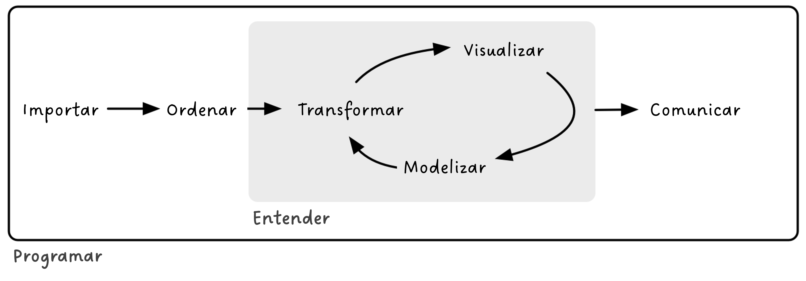
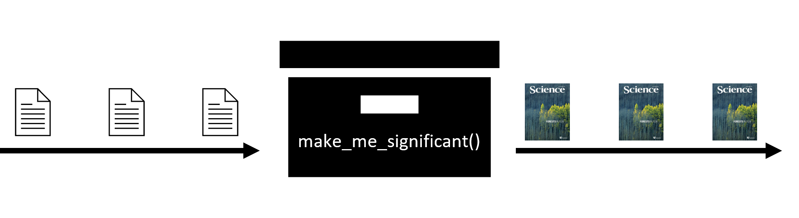
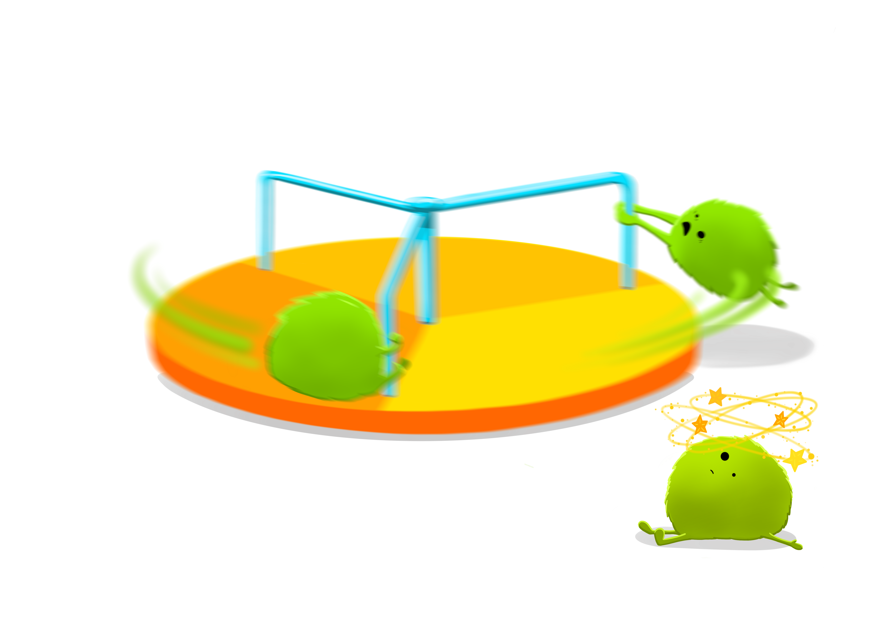
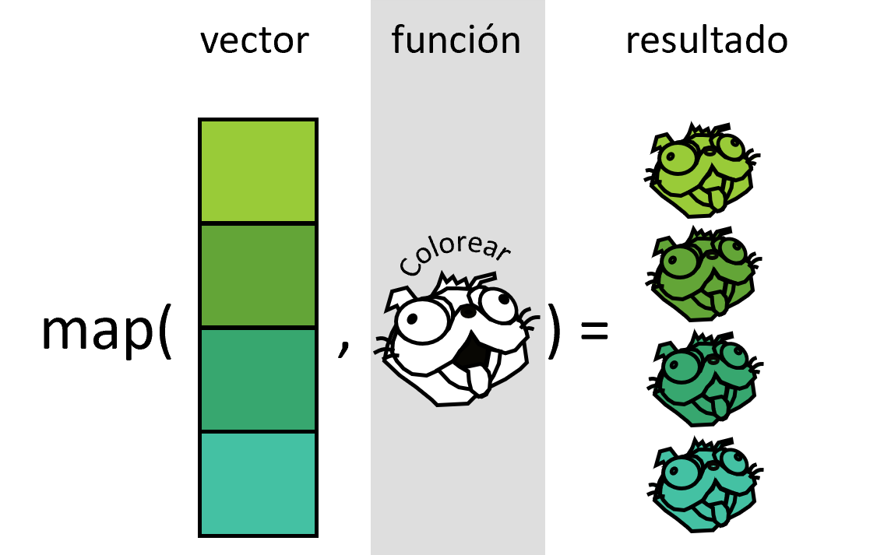
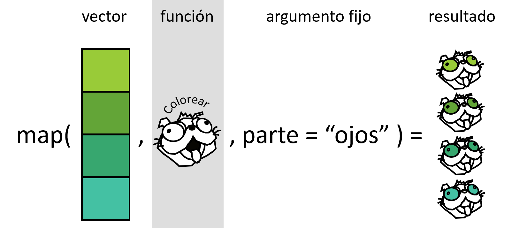
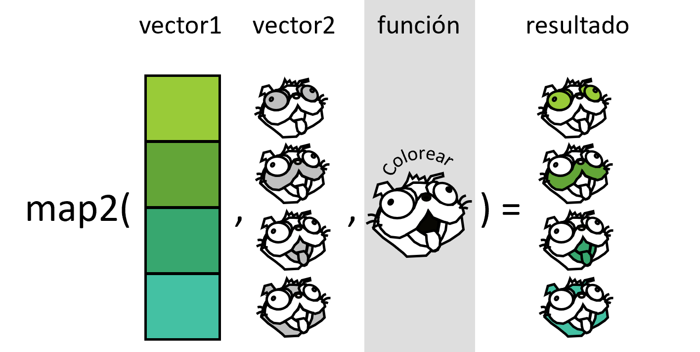
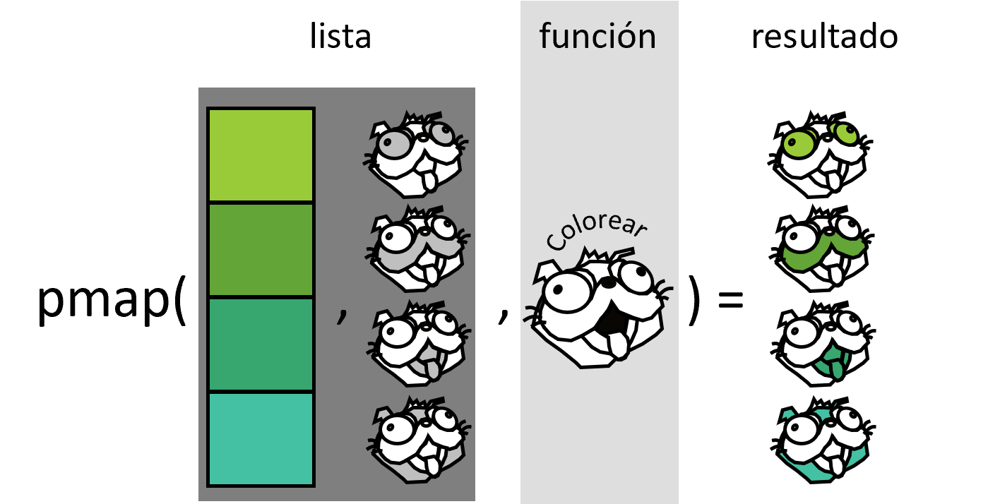

## Presentación

Los **objetivos** de este curso son:

-   aprender a escribir funciones

-   aplicar funciones en programación iterativa mediante el paquete {purrr} de {tidyverse}

-   aprender estilos de código que facilitan su comprensión (📝)

Dentro del modelo de ciencia de datos de Hadley Wickham, Mine Çetinkaya-Rundel y Garrett Grolemund (@fig-datascience), el curso de centra en el marco que envuelve todo el proceso, es decir, la programación.

{#fig-datascience}

### Estructura del curso

+------------------------------------------+----------+
| Bloques                                  | Día      |
+==========================================+==========+
| Presentación del curso                   | 19/09/24 |
|                                          |          |
| Introducción a la programación en R      |          |
|                                          |          |
| Introducción a la programación funcional |          |
+------------------------------------------+----------+
| Teoría sobre funciones en R              | 19/09/24 |
|                                          |          |
| Cómo escribir funciones                  |          |
+------------------------------------------+----------+
| Programación orientada a objetos         | 20/09/24 |
|                                          |          |
| Programación funcional                   |          |
|                                          |          |
| Iteraciones sobre uno y dos argumentos   |          |
+------------------------------------------+----------+
| Iteraciones sobre múltiples argumentos   | 20/09/24 |
|                                          |          |
| Iteraciones sin salida                   |          |
|                                          |          |
| Operadores y otros funcionales           |          |
+------------------------------------------+----------+

### Quiénes somos


Verónica Cruz-Alonso (veronica.cral\@gmail.com) y Julen Astigarraga (julenastigarraga\@gmail.com). Coordinamos el [grupo de trabajo de Ecoinformática](https://ecoinfaeet.github.io/website/index.html) de la Asociación Española de Ecología Terrestre. En [DatSciR](https://github.com/DatSciR) publicamos los materiales de los cursos que impartimos.

Y vosotros ¿quiénes sois?

<https://www.menti.com/almvj4rjaogv>

## Introducción a la programación en R

{width="362"}

### Conceptos muy básicos

-   R: lenguaje de programación dinámico (se interpreta el código en el momento que se ejecuta).

-   RStudio: es un entorno de desarrollo integrado para programar en R. Tiene cuatro zonas diferenciadas: el editor de código, la consola (donde se ejecuta el código), el navegador del espacio de trabajo (con el entorno –*environment*– y el historial de comandos) y el mix de abajo a la derecha (Archivos, Gráficos, Paquetes, Ayuda).

-   Objetos: cualquier elemento almacenado con un nombre específico. Pueden ser de muchos tipos: `numeric`, `integer`, `logical`, `data.frame`, `SpatVector`, etc.

```{r objects}

# install.packages("tidyverse")
library(tidyverse)

v1 <- c(1, 2, 3, 4)
v2 <- c(1, 2, 3, 4)
v3 <- c("hi", "hola", "hola", "hi")
v4 <- c(TRUE, TRUE, TRUE, FALSE, FALSE)

# el objeto numérico de longitud 4 c(1, 2, 3, 4) tiene dos nombres: "v1" y "v2"

mymatrix_num <- matrix(c(v1, v2), nrow = 4, ncol = 2)
mymatrix_num

mymatrix_cha <- matrix(c(v1, v2, v3), nrow = 4, ncol = 3)
mymatrix_cha

mytibble <- tibble(v1, v2, v3)
mytibble

mydf <- data.frame(v1, v2, v3)

mylist <- list(v1, v2, v3, v4)
mylist

```

> Los nombres tienen objetos; los objetos no tienen nombres
>
> --- Hadley Wickham ([Advanced R](https://adv-r.hadley.nz/index.html))

Trabajar con listas es muy común en R. De echo el output por defecto de `map()` son listas. Sin embargo, las listas pueden resultar a veces desordenadas, p. ej., cuando perdemos el nombre de cada elemento de la lista. La función [`nest()`](https://tidyr.tidyverse.org/reference/nest.html) de {tidyr} nos permite trabajar con listas-columnas en data frames, generando una fila para cada grupo definido por las columnas no anidadas (es decir, *non-nested* columns).

```{r more_objects}

mylist_from_tibble <- mytibble |> # list
  group_split(v3)
mylist_from_tibble

mynested_tibble <- mytibble |> # data.frame with list-columns
  group_by(v3) |> 
  nest()
mynested_tibble

```

💡Explora los diferentes tipos de objetos [aquí](https://rstudio-education.github.io/hopr/r-objects.html).

-   Funciones: objetos de R que toman un vector de entrada y dan como resultado otro vector haciendo una acción concreta (funcionalidad específica). Son los *bloques de construcción* fundamentales en cualquier script de R que es un lenguaje funcional.

    

> Para comprender la computación en R, resultan útiles dos lemas:
>
> \- Todo lo que existe es un objeto.
>
> \- Todo lo que sucede es una llamada a función.
>
> --- John Chambers ([Advanced R](https://adv-r.hadley.nz/index.html))

💡Más información sobre las tres verdades en R [aquí](https://www.r-bloggers.com/2018/06/three-deep-truths-about-r/).

-   Paquetes o librerias: contienen funciones reutilizables, documentación sobre cómo usarlas y datos de ejemplo. Son las unidades fundamentales de código reproducible en R.

-   CRAN: the Comprehensive R Archive Network.

#### Ejercicio

1.  Elije un número y multiplicalo por 3

2.  Crea un objeto que contenga 100 valores entre 1900 y 2000

3.  Suma un número a tu objeto

4.  Multiplica tu objeto por sí mismo

📝Los nombre de los objetos deben ser descriptivos y no pueden contener símbolos especiales (`^`, `!`, `$`, `@`, `+`, `-`, `/`, `*`).

📝R es sensible a las mayúsculas. Mejor no usarlas.

### Tidyverse

[*Tidyverse*](https://www.tidyverse.org/) es una colección de paquetes (meta-paquete) de R desarrollado por Hadley Wickham. Contiene ocho paquetes principales: {readr}, {tibble}, {dplyr}, {tidyr}, {stringr}, {forcats}, {ggplot2} y {purrr}. *Tidyverse* puede considerarse un dialecto del lenguaje de programación de R y, por ello, puede resultar difícil de aprender para gente con experiencia en el lenguaje tradicional de R base. Sin embargo, en este curso queremos enseñar las bases de programación utilizando *tidyverse* ya que en las secciones de iteración utilizaremos fundamentalmente `purrr` por razones que explicaremos más adelante.

*Tidyverse* está diseñado para respaldar las actividades de un analista de datos humano por lo que sus estructuras de programación resultan más lógicas para la mente humana. Todos los paquetes están diseñados para trabajar con datos ordenados ([*tidy data*](https://cran.r-project.org/web/packages/tidyr/vignettes/tidy-data.html)), es decir, aquellos donde cada columna es una variable, cada fila una observación y cada celda tiene un valor. Además, las funciones están preparadas para concatenarse a través del operador *pipe* (`%>%` del paquete `magrittr` o `|>` de R base), que coge lo que está en su izquierda y lo utiliza como el primer argumento de la función que está en su derecha. Esto permite seguir un flujo de lectura de izquierda a derecha, más cómodo para la mayoría de la gente.

💡Los dos operador *pipe* tienen pequeñas [diferencias](https://www.tidyverse.org/blog/2023/04/base-vs-magrittr-pipe/) pero en general el comportamiento es el mismo.

💡Para más información sobre las diferencias entre R base y *Tidyverse* podéis leer la nota [Tidyverse: colección de paquetes de R para la ciencia de datos](https://www.revistaecosistemas.net/index.php/ecosistemas/article/view/2745).

```{r pipe}

v3

length(unique(v3))

v3 |> unique() |> length()
# CTRL + SHIFT + M para poner un pipe

```

```{r primeros_tidypasos}
#| warning: false

# install.packages("palmerpenguins")
library(palmerpenguins)

penguins <- palmerpenguins::penguins
penguins

summary(penguins)
glimpse(penguins)
View(penguins)

# filter
penguins |> 
  filter(island == "Dream") 
penguins |> 
  filter(island == "Dream" & body_mass_g > 4500) # se pueden combinar criterios
penguins |> 
  filter(island == "Dream" | body_mass_g > 4500) 
penguins |> 
  filter(island %in% c("Dream", "Torgersen"))

# select
penguins |> 
  select(sex, body_mass_g)
penguins |> 
  select(ends_with("mm")) # seleccionar variables que tienen un patron
penguins |> 
  select(ends_with(c("mm", "g"))) 

# se pueden utilizar todo tipo de patrones de texto: https://rstudio.github.io/cheatsheets/strings.pdf

penguins |> 
  select(sex, body_mass_g, everything()) # se puede usar para reordenar variables

# arrange
penguins |> 
  select(sex, body_mass_g) |> 
  arrange(body_mass_g)
penguins |> 
  select(sex, body_mass_g) |> 
  arrange(desc(body_mass_g))
```

#### Ejercicio

1.  Crea un objeto con los pingüinos de la especie Adelie y ordena la tabla según la longitud del ala de los individuos.

2.  Crea un objeto a partir del anterior donde selecciones la isla y las variables relacionadas con el pico.

3.  Crea un objeto a partir del creado en el punto 1 donde selecciones todo menos la especie.

```{r segundos_tidypasos}

# mutate
penguins |> 
  mutate(bill_volume_mm2 = (bill_length_mm * bill_depth_mm) / 2) |> 
  select(bill_volume_mm2, everything())

penguins |>
  mutate(female_penguin = case_when(
    sex == "female" & body_mass_g < 3600 ~ "small female",
    sex == "female" & body_mass_g >= 3600 ~ "big female",
    TRUE ~ NA)) |>
  select(female_penguin, sex, body_mass_g)

# summarise
# se utiliza con funciones que resumen: n, n_distinct, mean, etc.
# ver ?summarise
penguins |> 
  summarise(
    body_min = min(body_mass_g, na.rm = TRUE),
    body_max = max(body_mass_g, na.rm = TRUE)
  )

penguins |> 
  group_by(sex) |> 
  summarise(body_min = min(body_mass_g, na.rm = TRUE),
  body_max = max(body_mass_g, na.rm = TRUE))

# join: left, right, full, inner

coordinates <- tibble(island = c("Dream", "Torgersen", "Biscoe"), 
  latitude = c("64°44′S", "64°46′S", "64°36′S"),
  longitude = c("64°14′W", "64°05′W", " 63°30′W"))

penguins |> 
  left_join(coordinates, by = "island") |> 
  select(island, latitude, longitude, everything())
```

#### Ejercicio

1.  Con el `data.frame` penguins, cuenta el número de casos que hay en cada isla y calcula la media de la longitud del ala en cada isla.

2.  Con el mismo `data.frame` calcula la relación entre el peso en kg y la longitud del ala para cada individuo.

```{r save_read_tidyverse}
#| eval: false

mypenguins <- penguins |> 
  mutate(bill_volume_mm2 = (bill_length_mm * bill_depth_mm) / 2,
    female_penguin = case_when(
      sex == "female" & body_mass_g < 3600 ~ "small female",
      sex == "female" & body_mass_g >= 3600 ~ "big female",
      TRUE ~ NA)) 

write_delim(mypenguins, file = "mypenguins.csv", delim = ";")
# en file hay que especificar el directorio donde queremos que se guarde. Si no, se guardará en el directorio de trabajo (getwd())

misdatos <- read_delim(file = "mypenguins.csv")
View(misdatos)

```

### Scoping

El [*lexical scoping* (ámbito léxico)](https://adv-r.hadley.nz/functions.html?q=lexica#lexical-scoping) son el conjunto de normas sobre cómo los valores de las variables son extraidos del entorno en cada lenguaje de programación, es decir, como se asocia una variable (nombre) a un valor. Un entendimiento más profundo del ámbito léxico nos permite el uso más avanzado de la programación funcional. En R tiene cuatro normas básicas (*name masking, functions versus variables, a fresh start and dynamic lookup*), pero la más importante para empezar con programación funcional es el *name masking*.

En relación al *name masking*, el principio básico es que los nombres definidos dentro de una función *enmascaran* los nombres definidos fuera de la función. Pero si un nombre no está definido dentro de una función, R buscará en un *environment* superior.

```{r lexical_scoping}

x <- 10
y <- 20

myfunction <- function() {
  x <- 1
  y <- 2
  x + y
}

myfunction()
```


En general, con R base sólo podemos llamar a objetos que forman parte del entorno (*env-variables*) aunque hay excepciones; en cambio, con *tidyverse* es muy común llamar a las variables dentro de las tablas (*data-variables*). Esta característica llamada [*non-standard evaluation*](http://adv-r.had.co.nz/Computing-on-the-language.html) simplifica el código en *tidyverse*, pero la ventaja no tiene coste cero y tiene implicaciones en la sintaxis de las funciones como veremos más adelante.

```{r name_masking}
#| warning: false
#| error: true

penguins |> 
  filter(island == "Dream", species == "Chinstrap") |> 
  select(flipper_length_mm)

penguins[penguins$island == "Dream" & penguins$species == "Chinstrap", "flipper_length_mm"]

misdatos <- data.frame(valores = 1:10)
mean(x = 1:10)
mean(x = valores)
mean(x = misdatos$valores)
mean(x = misdatos[, "valores"])

misdatos |> 
  summarise(mean = mean(valores))

subset(misdatos, select = valores) # R base
```


## Introducción a la programación funcional

La creciente disponibilidad de datos y de versatilidad de los programas de análisis han provocado el incremento en la cantidad y complejidad de los análisis que realizamos. Esto hace cada vez más necesaria la eficiencia en el proceso de gestión y análisis de datos. Una de las posibles formas para optimizar estos procesos y acortar los tiempos de trabajo para los usuarios de R es la programación basada en funciones. Las funciones permiten automatizar tareas comunes (por ejemplo, leer diferentes bases de datos) simplificando el código.

Como las funciones en R son objetos, es posible llamarlas a través de otras funciones e iterar este proceso, lo que constituye la base de la programación funcional y convierte a R en una herramienta muy poderosa. Las **iteraciones** sirven para realizar la misma acción a múltiples entradas. Existen dos grandes paradigmas de iteración: la programación orientada a objetos y la programación funcional. En este curso, nos centraremos principalmente en la **programación funcional** y aprenderemos a utilizar el paquete {purrr}, que proporciona funciones para eliminar muchos bucles comunes.

```{r ejemplo_importancia_PF}
#| warning: false

df <- penguins |> 
  select(bill_length_mm, bill_depth_mm, flipper_length_mm, body_mass_g)

df_rescaled1 <- df |> 
  mutate(bill_length_mm = (bill_length_mm - min(bill_length_mm, na.rm = TRUE)) / (max(bill_length_mm, na.rm = TRUE) - min(bill_length_mm, na.rm = TRUE)),
    bill_depth_mm = (bill_depth_mm - min(bill_depth_mm, na.rm = TRUE)) / (max(bill_depth_mm, na.rm = TRUE) - min(bill_length_mm, na.rm = TRUE)),
    flipper_length_mm = (flipper_length_mm - min(flipper_length_mm, na.rm = TRUE)) / (max(flipper_length_mm, na.rm = TRUE) - min(flipper_length_mm, na.rm = TRUE)),
    body_mass_g = (body_mass_g - min(body_mass_g, na.rm = TRUE)) / (max(body_mass_g, na.rm = TRUE) - min(body_mass_g, na.rm = TRUE)))
    
View(df_rescaled1)

#
rescale01 <- function(x) {
  rng <- range(x, na.rm = TRUE)   
  (x - rng[1]) / (rng[2] - rng[1]) 
} 

df_rescaled2 <- df |> 
  mutate(bill_length_mm = rescale01(bill_length_mm),
    bill_depth_mm = rescale01(bill_depth_mm),
    flipper_length_mm = rescale01(flipper_length_mm), 
    body_mass_g = rescale01(body_mass_g))  

View(df_rescaled2)

#
df_rescaled3 <- lapply(df, rescale01)

View(df_rescaled3)

```

Las principales **ventajas de la programación funcional** (uso de funciones e iteraciones) son:

-   Facilidad para ver la intención del código y, por tanto, mejorar la **comprensión** para uno mismo, colaboradores y revisores:
    -   Las funciones tienen un nombre evocativo.
    -   El código queda más ordenado.
-   **Rapidez** si se necesitan hacer cambios ya que las funciones son piezas independientes que resuelven un problema concreto.
-   **Disminuye la probabilidad de error**.

### ¿Cuándo hay que usar una función?

Se recomienda seguir el principio "do not repeat yourself" ([DRY principle](https://en.wikipedia.org/wiki/Don%27t_repeat_yourself#:~:text=%22Don't%20repeat%20yourself%22,redundancy%20in%20the%20first%20place.)): cada unidad de conocimiento o información debe tener una representación única, inequívoca y autoritativa en un sistema.

Escribir una función ya merece la pena cuando has copiado y pegado más de dos veces lo mismo (don't be WET! - Write Everything Twice). Cuantas más veces esté repetido un código, en más sitios necesitarás actualizarlo si hay algun cambio y más aumenta la probabilidad de error.

## Teoría sobre funciones en R

Las funciones tienen tres componentes:

-   `body()` (*cuerpo*): código dentro de la función.
-   `formals()`: lista de *argumentos* que controlan como se ejecuta la función.
-   `environment()`: la estructura que alimenta el *scoping* de la función, es decir, el *entorno* donde se ubica la función.

```{r componentes}

body(rescale01)
formals(rescale01)
environment(rescale01)

```

```{r environment}

f <- function(x) {
  x + y
}

y <- 100
f(x = 10)

y <- 1000
f(10)

```

Las **funciones primitivas** son la excepción ya que no tienen los citados componentes. Están escritas en C en lugar de en R y sólo aparecen en el paquete *base*. Son más eficientes pero se comportan diferente a otras funciones, así que R Core Team intenta no crear nuevas funciones primitivas. El resto de funciones siguen la estructura indicada arriba.

```{r funciones_primitivas}

sum
body(sum)

```

Según el tipo de output generado hay dos tipos de funciones:

-   Las **funciones de transformación** transforman el objeto que entra en la función (primer argumento) y devuelven otro objeto o el anterior modificado. Los funcionales son tipos especiales de funciones de transformación.

-   Las **funciones secundarias** (*side-effect functions*) tienen efectos colaterales y ejecutan una acción, como guardar un archivo o dibujar un plot. Algunos ejemplos de funciones secundarias que se usan comunmente son: `library()`, `setwd()`, `plot()`, `write_delim()`... Estas funciones retornan *de forma invisible* el primer argumento, que no se guarda, pero puede ser usado en un *pipeline*.

En general, sintácticamente, las funciones tienen tres componentes:

-   Función `function()` (primitiva)
-   Argumentos: lista de entradas.
-   Cuerpo: trozo de código que sigue a `function()`, tradicionalmente entre llaves.

```{r notaciones}

nombre1_v1 <- function(x, y) {
  paste(x, y, sep = "_")
}  

nombre1_v2 <- function(x, y) paste(x, y, sep = "_")  

nombre1_v3 <- \(x, y) paste(x, y, sep = "_")

nombre1_v1("Vero", "Cruz") 
nombre1_v2("Vero", "Cruz") 
nombre1_v3("Vero", "Cruz") 

```

📝 Si la función tiene más de dos lineas es mejor usar llaves siempre para que quede bien delimitada. La llave de apertura nunca debe ir sola pero sí la de cierre (excepto con *else*). Las sangrías también ayudan mucho a entender la jerarquía del código dentro de las funciones. En este sentido recomendamos usar *Code \> Reindent lines/Reformat code* (Ctrl + i; Ctrl + Shift + a) en el menú de RStudio.

💡Los operadores infijos (`+`), de flujo (`for`, `if`), de subdivisión (`[ ]`, `$`), de reemplazo (`<-`) o incluso las llaves (`{ }`) también son funciones. La tilde invertida "\`" permite referirse a funciones o variables que de otro modo tienen "nombre ilegales".

```{r nombres_ilegales}

3 + 2 
`+`(3, 2)  
for (i in 1:2) print(i) 
`for`(i, 1:2, print(i)) 
```

En general las funciones tienen un nombre que se ejecuta cuando se necesita como hemos visto hasta ahora, pero esto no es obligatorio. Algunos paquetes como {purrr} o las funciones de la familia `apply` permiten el uso de **funciones anónimas** para iterar.

```{r funciones_anonimas}

nxcaso <- lapply(penguins, function(x) length(unique(x)))

models <- penguins|>
  group_split(species) |>
  map(\(df) lm(body_mass_g ~ bill_length_mm, data = df)) 

summary(models[[1]])
```

📝 Mejor reservar el uso de funciones anónimas para funciones cortas y simples. Si la función es larga, ocupa varias líneas o tenemos que usarla con frecuencia mejor darle un nombre.

## Cómo escribir funciones {#sec-writefun}

#### Ejercicio

Genera tu primera función que divida un valor siempre entre 100.

💡Atajo para escribir funciones: escribir la palabra fun + tabulador

Imaginad que para un set de datos quisieramos hacer un gráfico de distribución de cada variable numérica, en función de otra variable categórica que nos interese especialmente, para ver cómo se distribuye.

```{r codigo_repetido_avanzado}
#| warning: false

penguins_num <- penguins |> 
  select(species, sex, where(is.numeric))

# nos interesan las diferencias entre especie y sexo

ggplot(penguins_num, aes(x = species, y = bill_length_mm, color = sex)) +
  geom_point(position = position_jitterdodge(), alpha = 0.3) +
  geom_boxplot(alpha = 0.5) +
  scale_color_manual(values = c("turquoise", "goldenrod1")) +
  theme_light()

ggplot(penguins_num, aes(x = species, y = bill_depth_mm, color = sex)) +
  geom_point(position = position_jitterdodge(), alpha = 0.3) +
  geom_boxplot(alpha = 0.5) +
  scale_color_manual(values = c("turquoise", "goldenrod1")) +
  theme_light()

ggplot(penguins_num, aes(x = species, y = flipper_length_mm, color = sex)) +
  geom_point(position = position_jitterdodge(), alpha = 0.3) +
  geom_boxplot(alpha = 0.5) +
  scale_color_manual(values = c("turquoise", "goldenrod1")) +
  theme_light()

# etc
```

Hemos copiado un código más de dos veces para realizar una misma acción (es decir, un gráfico para ver como se distribuye una variable en función de otras dos que se mantienen constantes) así que hay que considerar la posibilidad de que estemos necesitando una función. A continuación vamos a seguir unos sencillos pasos para transformar cualquier código repetido en función.

1.  Analizar el código: ¿cuáles son las partes replicadas? ¿cuantas entradas tenemos? ¿cuáles varían y cuáles no?

2.  Simplificar y reanalizar duplicaciones

```{r funcion_simplificar}
#| warning: false

var <- penguins_num$bill_length_mm

ggplot(penguins_num, aes(x = species, y = var, color = sex)) +
  geom_point(position = position_jitterdodge(), alpha = 0.3) +
  geom_boxplot(alpha = 0.5) +
  scale_color_manual(values = c("turquoise", "goldenrod1")) +
  theme_light()
 
```

```{r funcion_simplificar_2}
#| warning: false
#| error: true

var <- body_mass_g
var <- "body_mass_g"

ggplot(penguins_num, aes(x = species, y = var, color = sex)) +
  geom_point(position = position_jitterdodge(), alpha = 0.3) +
  geom_boxplot(alpha = 0.5) +
  scale_color_manual(values = c("turquoise", "goldenrod1")) +
  theme_light() +
  ylab(var) # grafico erroneo

ggplot(penguins_num, aes(x = species, y = .data[[var]], color = sex)) +
  geom_point(position = position_jitterdodge(), alpha = 0.3) +
  geom_boxplot(alpha = 0.5) +
  scale_color_manual(values = c("turquoise", "goldenrod1")) +
  theme_light() +
  ylab(var) # grafico correcto


```

👀 La función `ggplot` necesita argumentos (data-variable) que estén dentro del `data.frame` que va a representar. Para poder generalizar la función hemos guardado el nombre de la variable en un objeto (tipo `character`), pero `ggplot` no acepta `characters`. Por ello necesitamos utilizar una función intermedia que sí los acepte. Para resolver problemas comunes de programación funcional derivados de la *non-standard evaluation* de *tidyverse* [mira este enlace](https://dplyr.tidyverse.org/articles/programming.html#introduction).

3.  Elegir un nombre para la función (📝). Idealmente tiene que ser corto y evocar lo que la función hace. En general, debe ser un verbo (p. ej. imputar_valores) mientras que los argumentos son sustantivos (p. ej. data, variable, etc.). Usar un sustantivo para una función está permitido si la función calcula algo muy conocido (p. ej. `mean()`) o si sirve para acceder a partes de un objeto (p. ej. `residuals()`). También se recomienda evitar verbos muy genéricos (p. ej. calcular) y si el nombre tiene varias palabras separarlas con guión bajo o mayúsculas, pero ser consistente. Si programas varias funciones que hacen cosas parecidas se recomienda usar el mismo prefijo para todas (p. ej. "str\_" en el paquete {stringr}).

Cuanto más claramente puedas expresar la intención de tu código a través de los nombres de funciones, más fácilmente otros e incluyendo tú mismo en el futuro podrán leer y comprender el código.

```{r nombres_mal}

# ejemplos de nombres que no hay que usar

T <- FALSE
c <- 10
mean <- function(x) sum(x)

rm(T, c, mean)

```

4.  Enumerar los argumentos dentro de `function()` y poner el código simplificado dentro de las llaves.

```{r funcion_escribir}

explorar_penguins <- function (var) {
  ggplot(penguins_num, aes(x = species, y = .data[[var]], color = sex)) +
    geom_point(position = position_jitterdodge(), alpha = 0.3) +
    geom_boxplot(alpha = 0.5) +
    scale_color_manual(values = c("turquoise", "goldenrod1")) +
    theme_light() +
    ylab(var) 
}

```

📝 Utiliza comentarios (#) para explicar el razonamiento detrás de tus funciones. Se debe evitar explicar qué se está haciendo o cómo, ya que el propio código ya lo comunica. También se recomienda usar \# para separar apartados (Cmd/Ctrl + Shift + R).

📝 Crear objetos con cálculos intermedios dentro de una función, es una buena práctica porque deja más claro lo que el código está haciendo.

5.  Probar con entradas diferentes

```{r funcion_pruebas}

explorar_penguins(var = "body_mass_g") 
explorar_penguins(var = "flipper_length_mm") 
explorar_penguins(var = "bill_depth_mm")

```

💡Puedes querer convertir estas pruebas en **test** formales. En funciones complejas sirven para que, aunque hagas cambios, se pueda comprobar que la funcionalidad no se ha roto. Si estás interesado mira [este enlace](https://r-pkgs.org/testing-basics.html).

#### Ejercicio

Genera una función para estandarizar (es decir, restar la media y dividir por la desviación típica) las variables numéricas de penguins.

### Argumentos

En general hay dos grupos: los que especifican los **datos** y los que especifican **detalles** de la ejecución de la función. Normalmente los que especifican datos se colocan primero y los de detalle después. Estos últimos suelen tener valores por defecto (los más comunes), para cuando no se especifique nada.

<!--# Ver ayuda de quantile -->

📝 Los nombres de los argumentos deben ser cortos y descriptivos. Hay algunos comunes pero poco descriptivos que ya son conocidos para la mayoría de los usuarios y está bien aprovecharlos:

`x, y, z`: vectores

`w`: vector de pesos

`df`: data frame

`i, j`: indices numericos, filas y columnas respectivamente

`n`: longitud o número de filas

`p`: numero de columnas

`na.rm`: valores faltantes

A la hora de ejecutar la función los argumentos se pueden **especificar** utilizando el nombre completo, una abreviatura unequívoca o el órden de su posición (*unnamed arguments*), siendo esta secuencia (nombre \> abreviatura \> posición) el órden de prioridad a la hora de hacer corresponder los argumentos con lo que se escribe.

📝 Generalmente sólo se usa el orden de posición para especificar los primeros argumentos, los más comunes que todo el mundo conoce. Si se cambia un argumento de detalle con valor por defecto conviene poner siempre el nombre completo.

📝 Usar espacios antes y después de `=` y después de `,` hace mucho más fácil identificar los argumentos de la función y, en general, todos los componentes.

```{r espacios}

set.seed(123)
mean(rnorm(10, mean = 50, sd = 25) / 12, trim = 0.2)

set.seed(123)
mean(rnorm(10,mean=50,sd=25)/12,trim=0.2)

```

Hay un argumento especial llamado `…`, que captura cualquier otro argumento que no se corresponde con los nombrados en la función. Se utiliza para transmitir argumentos a otras funciones incluidas en nuestra función.

```{r argumento_dotdotdot}
#| eval: false

?plot

plot(1:5, 1:5)

plot(1:5, 1:5, main = "Estoy usando argumentos de title()")

```

📝 Usar `…` hace que las funciones sean muy flexibles, pero hace necesario leer cuidadosamente la documentación para poder usarlo. Además, si se escribe mal un argumento no sale error.

```{r dotdotdot_flexibilidad}

sum(1, 2, 5, na.mr = TRUE)
sum(1, 2, NA, na.mr = TRUE)

```

### Valores de retorno

La última expresión ejecutada en una función es el valor de retorno. Es el resultado de ejecutar la función, a no ser que se especifique `invisible()`. Las funciones arrojan un sólo objeto. Si se quieren obtener más, tendrán que agruparse en formato de lista.

<!--# Se os ocurre algún caso donde usar invisible? -->

📝 La función `return()` se usa para indicar explicitamente qué se quiere obtener en una función. Se recomienda su uso cuando el retorno no se espera al final de la función. P. ej. en las ramas de una estructura `if-else`, sobre todo cuando hay alguna rama larga y compleja.

#### Ejercicio

¿Cómo generalizarías la función `explorar_penguins()` para que te sirviera para cualquier base de datos?

## Programación orientada a objetos (POO) e iteración utilizando bucles

> \- Todo lo que existe es un objeto.
>
> --- John Chambers
>
> \- Sin embargo, no todo es orientado a objetos

En R, la programación funcional suele ser más relevante que la POO, ya que frecuentemente se abordan problemas complejos descomponiéndolos en funciones simples en lugar de objetos simples.

La principal razón para utilizar la POO es el polimorfismo (del latín "muchas formas"). El polimorfismo permite a un desarrollador considerar la interfaz de una función por separado de su implementación, lo que facilita el uso de la misma función con diferentes tipos de entrada. Para entender esto, probad a correr el siguiente código.

```{r polimorfismo}

summary(penguins$bill_depth_mm)
summary(penguins$sex) 
```

Podrías pensar que `summary()` utiliza una serie de declaraciones `if-else` según el tipo de los datos de entrada, pero en este caso solo el autor original podría añadir nuevas implementaciones. Sin embargo, un sistema de POO permite que cualquier desarrollador extienda la interfaz mediante la creación de implementaciones para nuevos tipos de entrada.

En los sistemas de POO, el tipo de un objeto se denomina su clase y una implementación específica para una clase se conoce como método. En términos generales, una clase define las características de un objeto (¿qué es?) y los métodos describen las acciones que ese objeto puede realizar (¿qué hace?).

La programación orientada a objetos, utilizada por lenguajes como Java o Python, ha sido el paradigma de programación más popular en las últimas décadas y utiliza un estilo de programación imperativo. R base proporciona tres sistemas de POO (S3 –que es el más utilizado-, S4 y RC), aunque también existen otros sistemas de POO proporcionados por diferentes paquetes del CRAN.

💡Información más detallada sobre [POO](https://adv-r.hadley.nz/oo.html) y [compromisos entre algunos sistemas de POO](https://adv-r.hadley.nz/oo-tradeoffs.html).

En la programación imperativa las herramientas más comunes para reducir duplicidades son los bucles *for* y los bucles *while* (*for loops* y *while loops*). Los bucles son recomendables para adentrarse en el mundo de las iteraciones porque hacen cada iteración muy explícita para que quede claro lo que está pasando.



Para programar un bucle es necesario definir tres partes diferentes: la salida, la secuencia y el cuerpo.

```{r for}

set.seed(123)

df_ej <- data.frame(
  a = sample(1:5),
  b = sample(1:5),
  c = sample(1:5)
)

salida <- vector("double", 3)           # 1. salida
for (i in 1:3) {                        # 2. secuencia
  salida[[i]] <- first(df_ej[[i]])      # 3. cuerpo
}

salida

# podriamos generalizar el for
salida <- vector("double", ncol(df_ej))   # 1. salida
for (i in seq_along(df_ej)) {             # 2. secuencia
  salida[[i]] <- first(df_ej[[i]])        # 3. cuerpo
}

salida

# tambien podriamos iterar sobre filas
salida <- vector("double", nrow(df_ej)) 
for(i in 1:nrow(df_ej)) {
    salida[[i]] <- sum(df_ej[i, ])
}

salida

```

1.  Salida: aquí determinamos el espacio de la salida, es decir, primero tenemos que crear la libreta donde vamos a ir apuntando todos los resultados. Esto es muy importante para la eficiencia puesto que si aumentamos el tamaño del *for loop* en cada iteración con `c()` u otra función que vaya añadiendo elementos, el bucle *for* será mucho más lento.

```{r optimizacion}

x <- c()
system.time(
  for(i in 1:20000) {
    x <- c(x, i)
  }
)

y <- vector("double", length = 20000)
system.time(
  for(i in seq_along(y)) {
    y[i] <- i
  }
)

```

2.  Secuencia: aquí determinamos sobre lo que queremos iterar. Cada ejecución del bucle *for* asignará un valor diferente de `seq_along(y)` a *i* .

3.  Cuerpo: aquí determinamos lo que queremos que haga cada iteración. Se ejecuta repetidamente, cada vez con un valor diferente para `i`.

Existen distintas [variaciones de los bucles *for*](https://r4ds.had.co.nz/iteration.html#for-loop-variations): (i) modificar un objeto existente en lugar de crear uno nuevo; (ii) bucles sobre nombres o valores en lugar de sobre índices; (iii) bucles cuando desconocemos la longitud de la salida; (iv) bucles cuando desconocemos la longitud de la secuencia de entrada, es decir, bucles *while*.

👀 Algunos [errores comunes](https://adv-r.hadley.nz/control-flow.html) cuando se utilizan bucles *for* (ver 5.3.1 Common pitfalls).

A pesar de ser muy utilizados en R, los bucles *for* no son tan importantes como pueden ser en otros lenguajes porque R es un lenguaje de programación funcional. Esto significa que *es posible envolver los bucles for en una función* y llamar a esa función en vez de utilizar el bucle.

Existe la creencia de que los bucles *for* son lentos, pero la desventaja real de *los bucles for es que son demasiado flexibles* y pueden realizar muchas tareas diferentes. En cambio, cada funcional ({purrr}, `apply`) está diseñado para una tarea específica, por lo que en cuanto lo ves en el código, inmediatamente sabes por qué se está utilizando. Es decir, la principal ventaja es su claridad al hacer que el código sea más fácil de escribir y de leer (ver este ejemplo avanzado para entenderlo: <https://adv-r.hadley.nz/functionals.html>, 9.3 Purrr style). Una vez que dominemos la programación funcional, podremos solventar muchos problemas de iteración con menos código, más facilidad y menos errores.

Los bucles pueden ser más explícitos en cuanto a que se ve claramente la iteración, pero se necesita más tiempo para entender qué se está haciendo. Por el contrario, los funcionales necesitan un paso más de abstracción y pueden requerir tiempo hasta que los comprendamos. Lo más importante es que soluciones el problema y poco a poco ir escribiendo código cada vez más sencillo y elegante.

> Para ser significativamente más fiable, el código debe ser más transparente. En particular, las condiciones anidadas y los bucles deben considerarse con gran recelo. Las esctructuras de control complicados confunden a los programadores. El código desordenado suele ocultar errores.
>
> --- Bjarne Stroustrup ([Advanced R](https://adv-r.hadley.nz/index.html))

## Programación funcional


En la programación funcional, las funciones están diseñadas para realizar una única tarea específica y luego se combinan llamando a estas funciones sucesivamente para el conjunto de datos. Una ventaja significativa de este enfoque es que estas funciones pueden ser reutilizadas en cualquier otro proyecto, lo que facilita la modularidad del código. Además, cuando están bien documentadas y son fácilmente testables, resulta sencillo comprender y mantener el programa.

R es un lenguaje de programación funcional por lo que se basa principalmente en un estilo de resolución de problemas centrado en funciones (<https://adv-r.hadley.nz/fp.html>).

Un funcional es una función que toma una función como entrada y devuelve un vector u otro tipo de objeto como salida.

```{r ejemplo_funcional}

aleatorizacion <- function(f) {
  f(rnorm(5))
}

aleatorizacion(f = median)

```

Para programar un funcional, primero, solucionamos el problema para un elemento. Después, generamos una función que nos permita envolver la solución en una función (como lo hicimos en @sec-writefun). Por último, *aplicamos la función a todos los elementos que estamos interesados.* Es decir, dividimos los problemas grandes en problemas más pequeños y resolvemos cada tarea con una o más funciones.

La ventaja de utilizar {purrr} en vez de bucles *for* es que ofrece una función (funcional) para cada uno de los problemas comunes de manipulación de datos y, por lo tanto, cada bucle for tiene su propia función. Por ejemplo, para iterar sobre un argumento utilizamos la función `map()` y para iterar sobre dos argumentos la funcion `map2()`. La familia `apply` de R base soluciona problemas similares, pero {purrr} es más consistente y, por lo tanto, más fácil de aprender.

Iterar sobre un vector es tan común que el paquete {purrr} proporciona una familia de funciones (la familia `map()`) para ello. Existe una función en {purrr} para cada tipo de salida. Los sufijos indican el tipo de salida que queremos:

-   `map()` genera una lista.
-   `map_lgl()` genera un vector lógico.
-   `map_int()` genera un vector de números enteros.
-   `map_dbl()` genera un vector de números decimales.
-   `map_chr()` genera un vector de caracteres.
-   `map_vec()` genera un vector que determina automáticamente el tipo.

<!--# V: Creo que este parrafito a continuación rompia el flujo de infromación de lo que pone encima y por eso lo he separado -->

Recordad que los data.frame son un tipo especial de lista donde cada elemento de la lista es una columna (vector), y todas las columnas deben tener la misma longitud (es decir, el número de filas debe ser consistente), por lo que cualquier cálculo por columnas supone iteracionar sobre un vector.

💡¿[Por qué está función se llama *map*](https://adv-r.hadley.nz/functionals.html#map)?

```{r map_foco}

map_int(df_ej, first)

df_ej |> 
  map_int(first)

salida <- vector("double", 3)
for (i in 1:3) {
  salida[[i]] <- first(df_ej[[i]])
}
salida

```

Comparando con un bucle, el foco está en la operación que se está ejecutando (`first()`), y no en el código necesario para iterar sobre cada elemento y guardar la salida.

## Iteraciones sobre un argumento

`map_*()` está vectorizado sobre un argumento, p. ej. `(x)`. La función operará en todos los elementos de `x`, es decir, cada valor si `x` es un vector, cada columna si `x` es un `data.frame`, o cada elemento si `x` es una lista.

### Nuestro primer funcional: generando listas, `map()`

Toma un vector y una función, llama a la función una vez por cada elemento del vector y devuelve los resultados en una lista. `map(1:3, f)` es equivalente a `list(f(1), f(2), f(3))`. Es el equivalente de `lapply()` de R base.

```{r map_ejemplo}

cuadratica <- function(x) {
  x ^ 2
}

map(.x = 1:4, .f = cuadratica)

lapply(X = 1:4, FUN = cuadratica)

# algun uso mas interesante 
glimpse(penguins)

# atajo para generar una funcion anonima:  \(nombre_del_argumento)
map(.x = penguins, .f = \(x) length(unique(x)))

# salida dataframe
map_df(.x = penguins, .f = \(x) length(unique(x)))

```



#### Ejercicio

Generad un vector, una función y aplicadle la función a cada uno de los elementos del vector utilizando `map()`.

Como hemos comentado antes, es posible envolver los bucles *for* en una función y llamar a esa función en lugar de utilizar el bucle.

```{r map_implementacion}

imple_map <- function(x, f, ...) {
  out <- vector("list", length(x))
  for (i in seq_along(x)) {
    out[[i]] <- f(x[[i]], ...)
  }
  out
}

imple_map(1:4, cuadratica)

```

💡Algunas ventajas de las funciones de {purrr} frente a envolver un bucle *for* por nuestra cuenta en una función son que las funciones de {purrr} están escritas en C para maximizar el rendimiento, que conservan los nombres en la iteración y que admiten algunos atajos (p. ej. `\(x)`).

#### Ejercicio

Ahora que habéis entendido la lógica de `map()`, detectad las diferencias entre las tres líneas de código siguientes. ¿Qué es lo que hace el funcional `map()`? ¿Qué diferencias detectáis en el código? ¿Y en la salida?

```{r argumentos_adicionales}

map(penguins, \(x) mean(x))
map(penguins, \(x) mean(x, na.rm = T)) # opcion 1
map(penguins, mean, na.rm = T) # opcion 2

```

Como hemos visto en el ejercicio anterior, los argumentos que varían para cada ejecución se ponen antes de la función y los argumentos que son los mismos para cada ejecución se ponen después (p. ej. `na.rm = T`).



Para incluir argumentos adicionales a la función que estamos utilizando dentro de `map()`, una opción es mediante una función anónima (ver opción 1 del ejercicio anterior). Sin embargo, puesto que `map()` incluye `...` entre sus argumentos, también podemos incluir los argumentos adicionales después de la función que está dentro de `map()` de una forma mucho más sencilla (ver opción 2 del ejercicio anterior). Hay una pequeña diferencia entre incluir argumentos adicionales dentro de una función anónima e incluirla directamente dentro del `map()`. Incluirlo en una función anónima significa que se evaluará cada vez que se ejecute la función, y no sólo una vez cuando se llame al `map()` (ver el siguiente ejemplo).

```{r argumentos_adicionales_evaluacion}

multiplicar <- function(x, y) {
  x * y
}

input_vec <- c(4, 4, 4)

# siempre se repite el resultado
map_dbl(input_vec, multiplicar, y = sample(x = 1:10, 1))

# no siempre se repite el resultado
map_dbl(input_vec, \(x) multiplicar(x, y = sample(x = 1:10, 1)))

```

### Nuestro segundo funcional: generando vectores, `map_*()`

#### Ejercicio

Dedicadle un par de minutos a entender lo que hacen las siguientes funciones:

```{r map_vectores}

map_lgl(penguins, is.numeric)
penguins_num <- penguins[ , map_lgl(penguins, is.numeric)] 
map_dbl(penguins_num, median, na.rm = T)
map_chr(penguins, class)
map_int(penguins, \(x) length(unique(x)))
1:4 |> 
  map_vec(\(x) as.Date(ISOdate(x + 2024, 09, 25)))

```

R base tiene dos funciones de la familia `apply()` que pueden devolver vectores: `sapply()` y `vapply()`. Recomendamos evitar `sapply()` porque intenta simplificar el resultado y elige un formato de salida por defecto, pudiendo devolver una lista, un vector o una matriz. `vapply()` es más seguro porque permite indicar el formato de salida con FUN.VALUE. La principal desventaja de `vapply()` es que se necesitan especificar más argumentos que en `map_*()`.

```{r vapply}

vapply(penguins_num, median, na.rm = T, FUN.VALUE = double(1))

```

```{r map_ejemplo_avanzado}

glimpse(penguins)

# quitamos valores NA
penguins_nona <- penguins |>
  drop_na()

penguins_nested <- penguins_nona |>
  group_by(species) |>
  nest() |> # nest() genera lista-columna en data frames
  mutate(
    lm_obj = map(data, \(df) lm(
      bill_length_mm ~ body_mass_g,
      data = df))
  )

# seleccionar cada elemento de la lista
penguins_nested[["lm_obj"]]

penguins_nested$lm_obj

penguins_nested |>
  pluck("lm_obj")

```

## Iteraciones sobre múltiples argumentos

### Nuestro tercer funcional: dos entradas, `map2()`

`map2()` está vectorizado sobre dos argumentos, p. ej. `(x, y)`

```{r map2_ejemplo}

potencia <- function(base, exponente) {
  base ^ exponente
}

set.seed(123)

x <- sample(5)
y <- sample(5)

map2(x, y, potencia)

```

⚡¡Importante! La primera iteración corresponde al primer valor del vector `x` y al primer valor del vector `y`. La segunda iteración corresponde al segundo valor del vector `x` y al segundo valor del vector `y`. No se hacen todas las combinaciones posibles entre ambos vectores.



```{r map2_implementacion}

imple_map2 <- function(x, y, f, ...) {
  out <- vector("list", length(x))
  for (i in seq_along(x)) {
    out[[i]] <- f(x[[i]], y[[i]], ...)
  }
  out
}

imple_map2(x, y, potencia)

```

#### Ejercicio {#sec-ejercicio-map2}

A partir del código que se muestra a continuación generad un `data.frame`, agregando una columna al `data.frame` con el nombre que le hemos asignado a cada lista.

```{r map_2_ejercicio}

penguins_list <- penguins |>
  group_split(species)

# asignamos nombres a las listas
names(penguins_list) <- c("p1", "p2", "p3")

```

#### Ejercicio avanzado 🤯

Calculad la correlación entre las predicciones almacenadas en la lista-columna `pred` y `bill_length_mm`.

```{r map2_ejemplo_avanzado}

penguins_nested <- penguins |>
  group_by(species) |>
  nest() |> 
  mutate(
    lm_obj = map(data, \(df) lm(
      bill_length_mm ~ body_mass_g,
      data = df)),
    pred = map2(lm_obj, data,
                \(x, y) predict(x, y))
  )

# unnest()
penguins_nested |> 
  unnest(pred) |> 
  select(!c(data, lm_obj))

```

### Nuestro cuarto funcional: múltiples entradas, `pmap()`

Toma una lista con cualquier número de argumentos de entrada.

```{r pmap_ejemplo}

# son analogos
map2(x, y, potencia)

pmap(list(x, y), potencia)

set.seed(123)

z <- sample(5)

# ?rnorm

pmap(list(n = x, mean = y, sd = z), rnorm)

```

💡Si no nombramos los elementos de la lista, `pmap()` usará los elementos de la lista en su orden para los argumentos consecutivos de la función. De todas formas, es una buena práctica nombrarlos para que quede muy claro qué hará la función.

```{r pmap_ejemplo_pipe}

args3 <- list(mean = x, sd = y, n = z) 

args3 |> 
  pmap(rnorm)

```



#### Ejercicio

Transformad el `map2()` que habéis generado en el ejercicio @sec-ejercicio-map2 a `pmap()`.

## Iteraciones sin salida

### Nuestro quinto funcional: `walk()`, `walk2()` y `pwalk()`

Cuando queremos utilizar funciones por sus efectos secundarios (*side effects*, p. ej. `ggsave()`) y no por su valor resultante. Lo importante es la acción y no el valor u objeto resultante en R.

#### Ejercicio

En base a lo que dice en la definición sobre la familia `walk()`, corred este código y entended lo que hace.

```{r walk_ejercicio}

penguins_nested <- penguins |>
  group_by(species) |>
  nest()

# penguins_nested |> 
#   pluck("data") |> 
#   pluck(1)

penguins_nested_str <- penguins_nested |> 
  mutate(path = str_glue("penguins_{species}.csv"))

penguins_nested_str

# resultado devuelto de forma invisible 
walk2(penguins_nested_str$data, penguins_nested_str$path, write_csv)

# resultado devuelto de forma visible utilizando parentesis 
(walk2(penguins_nested_str$data, penguins_nested_str$path, write_csv))

```

#### Ejercicio avanzado🤯

Generad un ejemplo donde utiliceis `walk2()` o `pwalk()` para guardar múltiples plot generados con `ggplot()`. Pista: la primera entrada será el plot que queréis guardar y la segunda el nombre del archivo que le queréis asignar.

## Operadores y otros funcionales

### Más variantes de `map()`: `modify()` e `imap()`

`modify()` e `imap()` también son funcionales de la familia map. `modify()` es análogo a `map()` pero devuelve el mismo tipo de resultado que el tipo de entrada.

`imap()` sirve para iterar sobre indices, tanto indices numéricos como nombres. `imap(x, f)` es análogo a `map2(x, names(x), f)` cuando `x` tiene nombres y `map2(x, seq_along(x), f)` cuando no los tiene.

```{r modify_imap}

# modify
map(1:4, cuadratica)

modify(1:4, cuadratica)


# imap
map2(penguins, names(penguins), \(x, y) paste("La columna", y, "tiene", length(unique(x)), "valores unicos contando los NA's"))

imap(penguins, \(x, y) paste("La columna", y, "tiene", length(unique(x)), "valores unicos contando los NA's"))

df_ej <- data.frame(
  a = sample(1:5),
  b = sample(1:5),
  c = sample(1:5)
) 

colnames(df_ej) <- NULL

imap(df_ej, \(x, y) paste("La columna", y, "tiene", length(unique(x)), "valores unicos contando los NA's"))

```

En este curso no profundizamos en `modify()` e `imap()` porque con los demás funcionales que hemos visto podemos abordar prácticamente todos los problemas de iteración. Sin embargo, si alguien está interesado puede consultar <https://adv-r.hadley.nz/functionals.html>, 9.4 Map variants.

💡Ejemplos de algunas tareas específicas con {purrr}: <https://r4ds.hadley.nz/iteration>

### Funcionales predicate y demás

Los predicados son funciones que devuelven un solo TRUE o FALSE (p. ej., `is.character()`). Así, un predicado funcional aplica un predicado a cada elemento de un vector: `keep()`, `discard()`, `some()`, `every()`, `detect()`, `detect_index()`... Para más información ver: <https://r4ds.had.co.nz/iteration.html>, 21.9.1 Predicate functions.

```{r ejemplo_predicado_funcional}

penguins |> 
  keep(is.numeric)

penguins |> 
  discard(is.numeric)

penguins |> 
  every(is.numeric)

```

`dplyr::across()` es similar a `map()` pero en lugar de hacer algo con cada elemento de un vector, data.frame o lista, hace algo con cada columna en un data.frame.

`reduce()` es una forma útil de generalizar una función que funciona con dos entradas (función binaria) para trabajar con cualquier número de entradas.

```{r extra}

penguins_scaled <- penguins |>
  mutate(across(where(is.numeric), scale))

ls <- list(
  age = tibble(name = c("Vero", "Julen"), age = c(100, 140)),
  sex = tibble(name = c("Vero", "Julen"), sex = c("F", "M")),
  height = tibble(name = c("Vero", "Julen"), height = c("180", "150"))
)

ls |> 
  reduce(full_join, by = "name")

# equivalente a hacer

ls[["age"]] |> 
  full_join(ls[["sex"]]) |> 
  full_join(ls[["height"]])

```

#### Operadores funcionales

Cuando utilizamos las funciones `map()` para repetir muchas operaciones, aumenta la probabilidad de que una de esas operaciones falle y no obtengamos ninguna salida. {purrr} proporciona algunos operadores funcionales (*function operators*) en forma de adverbios como `safely()`, `possibly()` o `quietly()` para asegurar que un error no arruine todo el proceso. Para más información ver: <https://r4ds.had.co.nz/iteration.html>, 21.6 Dealing with failure.

```{r ejemplo_operador_funcional}
#| error: true

x <- list(10, "b", 3)

x |> 
  map(log)

x |> 
  map(safely(log))

x |> 
  map(safely(log)) |> 
  transpose()

x |> 
  map(possibly(log, NA_real_))

```

#### Ejercicio

Aplicad cualquier variante de `map()` junto con un operador funcional a la base de datos penguins.

## Más información

### Paralelización

Se pueden emplear distintos núcleos de la CPU (*Central Processing Unit*) para ejecutar el mismo proceso con diferentes conjuntos de datos en paralelo, lo que acelera tareas largas. Algunas tareas son especialmente adecuadas para la paralelización, como aquellas que son repetitivas y tienen poca o ninguna dependencia entre sí, salvo el origen de los datos de entrada, lo que permite dividirlas fácilmente en tareas paralelas. Estas tareas suelen ser aquellas que pueden ser resueltas mediante iteraciones como las que hemos visto anteriormente. En teoría, el proceso se acelera en proporción al número de cores, pero en la práctica, hay que tener en cuenta otros factores como el tiempo consumido en transferir datos a cada proceso y el tiempo dedicado a reunir los resultados de los diferentes procesos.

R fue originalmente diseñado para ejecutarse en un solo proceso de CPU debido a que cuando se desarrolló, las CPU en general tenían un único núcleo y la computación paralela no era tan común o no estaba tan desarrollada como lo está hoy en día. Por lo tanto, para aprovechar la paralelización en R, necesitamos recurrir a paquetes adicionales. Sin embargo, es importante tener en cuenta que estos paquetes pueden estar limitados en su uso a casos y tipos de datos específicos.

```{r paralelizacion}
#| eval: false

library(parallel) # detectar numero de cores
library(future) # establecer numero de cores
library(furrr) # paralelizacion con map

detectCores()

# funcion para elevar al cubo un numero
cubo <- function(x) {
  Sys.sleep(1) # simulacion tarea computacionalmente intensiva
  return(x ^ 3)
}

# secuencial
tiempo_inicio <- Sys.time()
resultado <- map(1:10, cubo)
tiempo_final <- Sys.time()
cat("Tiempo de computación:", round(tiempo_final - tiempo_inicio, 1), "segundos")

# establecer como vamos a resolver el proceso
# aqui utilizaremos 3 nucleos pero en funcion del numero de nucleos disponibles en tu pc se puede modificar
plan(multisession, workers = 3)

# future_map para ejecutarlo paralelamente
tiempo_inicio <- Sys.time()
resultado <- future_map(1:10, cubo)
tiempo_final <- Sys.time()
cat("Tiempo de computación:", round(tiempo_final - tiempo_inicio, 1), "segundos")

# vemos que el tiempo de computacion se ha reducido casi a un 1/3 (aprox. 1/numero de cores)

```

La información aquí expuesta sobre programación paralela está mucho más explicada en: <https://emf.creaf.cat/workflows/r_parallel_computing_tech_doc/>

### Enlaces de interés

-   [Hands-On Programming with R (basics)](https://rstudio-education.github.io/hopr/basics.html)

-   [R for data Science (functions)](https://r4ds.had.co.nz/functions.html)

-   [Advanced R (functions)](https://adv-r.hadley.nz/functions.html)

-   [R for data Science (iteration)](https://r4ds.had.co.nz/iteration.html)

-   [Advanced R (functionals)](https://adv-r.hadley.nz/functionals.html)

-   [purrr 1.0.0](https://www.tidyverse.org/blog/2022/12/purrr-1-0-0/)

-   [Learn to purrr (Rebecca Barter)](https://www.rebeccabarter.com/blog/2019-08-19_purrr)

-   [Style guide](http://adv-r.had.co.nz/Style.html)

-   [Tidyverse: colección de paquetes de R para la ciencia de datos](https://www.revistaecosistemas.net/index.php/ecosistemas/article/view/2745)

-   [Quince consejos para mejorar nuestro código y flujo de trabajo con R](https://www.revistaecosistemas.net/index.php/ecosistemas/article/view/2129)

-   [Parallel computation in R](https://emf.creaf.cat/workflows/r_parallel_computing_tech_doc/)

-   [Advanced R (Object-oriented programming)](https://adv-r.hadley.nz/oo.html)

Este curso está basado principalmente en la primera edición del libro [R for Data Science](https://r4ds.had.co.nz/) de Hadley Wickham & Garrett Grolemund y la segunda edición del libro [Advanced R](https://adv-r.hadley.nz/index.html) de Hadley Wickham.

------------------------------------------------------------------------

<details>

<summary>Session Info</summary>

```{r session_info}
Sys.time()
sessionInfo()
```

</details>
