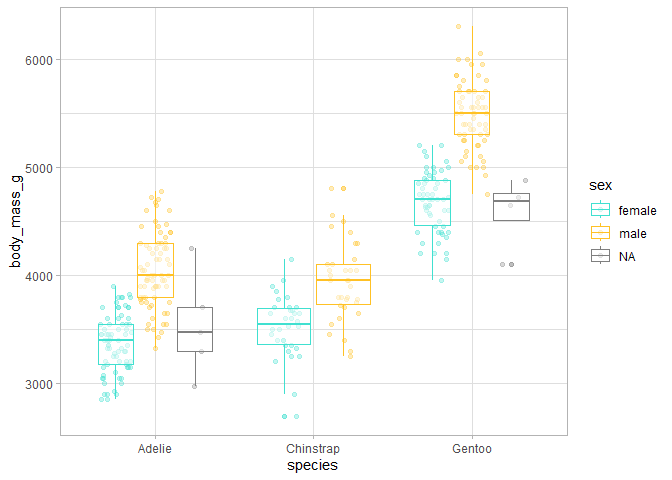
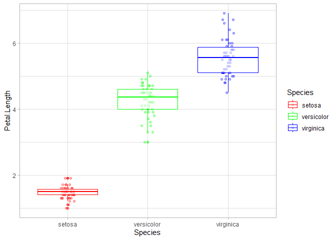

# Functional Programming with R
Julen Astigarraga y Verónica Cruz-Alonso
27/05/2024

- [2.2.1 Exercise](#221-exercise)
- [2.2.2 Exercise](#222-exercise)
- [5.0.1 Exercise](#501-exercise)
- [5.0.2 Exercise](#502-exercise)
- [5.2.1 Exercise](#521-exercise)

## 2.2.1 Exercise

1.  With the penguins dataset, create an object with individuals of the
    Adelie species and arrange the `data.frame` according to flipper
    length.

2.  Create an object from the previous one where you select the island
    and the variables related to the bill.

3.  Create an object from the one created in step 1 where you select
    everything except the species.

``` r
library(palmerpenguins)
library(tidyverse)
```

    ── Attaching packages ─────────────────────────────────────── tidyverse 1.3.2 ──
    ✔ ggplot2 3.4.2     ✔ purrr   1.0.1
    ✔ tibble  3.2.1     ✔ dplyr   1.1.2
    ✔ tidyr   1.3.0     ✔ stringr 1.5.0
    ✔ readr   2.1.2     ✔ forcats 0.5.1

    Warning: package 'ggplot2' was built under R version 4.2.3

    Warning: package 'tibble' was built under R version 4.2.3

    Warning: package 'tidyr' was built under R version 4.2.3

    Warning: package 'purrr' was built under R version 4.2.3

    Warning: package 'dplyr' was built under R version 4.2.3

    Warning: package 'stringr' was built under R version 4.2.3

    ── Conflicts ────────────────────────────────────────── tidyverse_conflicts() ──
    ✖ dplyr::filter() masks stats::filter()
    ✖ dplyr::lag()    masks stats::lag()

``` r
# 1
adelie <- penguins |> 
  filter(species == "Adelie") |> 
  arrange(flipper_length_mm)

# 2
adelie_subset <- adelie |> 
  select(island, contains("bill"))

# 3
adelie2 <- adelie |> 
  select(-species)
```

## 2.2.2 Exercise

1.  With the penguins dataset, count the number of cases on each island
    and calculate the mean flipper length for each island.

2.  Calculate the ratio between the weight in kg and the flipper length
    for each individual.

``` r
# 1
penguins |> 
  group_by(island) |> 
  summarise(
    n = n(),
    mean_flipper_length = mean(flipper_length_mm, na.rm = TRUE)
  )
```

    # A tibble: 3 × 3
      island        n mean_flipper_length
      <fct>     <int>               <dbl>
    1 Biscoe      168                210.
    2 Dream       124                193.
    3 Torgersen    52                191.

``` r
# 2
penguins |> 
  mutate(mass_by_length = (body_mass_g / 1000) / flipper_length_mm) |> 
  select(mass_by_length)
```

    # A tibble: 344 × 1
       mass_by_length
                <dbl>
     1         0.0207
     2         0.0204
     3         0.0167
     4        NA     
     5         0.0179
     6         0.0192
     7         0.0200
     8         0.0240
     9         0.0180
    10         0.0224
    # ℹ 334 more rows

## 5.0.1 Exercise

Create your first function that fulfills the functionality of dividing
any value by 100.

``` r
divide_by_100 <- function(x) {
  x / 100
}

divide_by_100(30)
```

    [1] 0.3

## 5.0.2 Exercise

Create a function to standardize (i.e., subtract the mean and divide by
the standard deviation) the numerical variables of the penguins dataset.

``` r
# R base
standardise <- function(x, my.na.rm) {
  (x - mean(x, na.rm = my.na.rm)) / sd(x, na.rm = my.na.rm)
}

standardise(penguins$bill_length_mm, my.na.rm = T)
```

      [1] -0.88320467 -0.80993901 -0.66340769          NA -1.32279862 -0.84657184
      [7] -0.91983750 -0.86488825 -1.79902541 -0.35202864 -1.12131806 -1.12131806
     [13] -0.51687637 -0.97478674 -1.70744334 -1.34111504 -0.95647033 -0.26044656
     [19] -1.74407616  0.38062795 -1.12131806 -1.13963448 -1.46932994 -1.04805240
     [25] -0.93815391 -1.57922843 -0.60845845 -0.62677486 -1.10300165 -0.62677486
     [31] -0.80993901 -1.23121655 -0.80993901 -0.55350920 -1.37774787 -0.86488825
     [37] -0.93815391 -0.31539581 -1.15795089 -0.75498976 -1.35943145 -0.57182562
     [43] -1.45101353  0.03261607 -1.26784938 -0.79162259 -0.51687637 -1.17626731
     [49] -1.45101353 -0.29707939 -0.79162259 -0.70004052 -1.63417768 -0.35202864
     [55] -1.72575975 -0.46192713 -0.90152108 -0.60845845 -1.35943145 -1.15795089
     [61] -1.50596277 -0.48024354 -1.15795089 -0.51687637 -1.37774787 -0.42529430
     [67] -1.54259560 -0.51687637 -1.46932994 -0.38866147 -1.90892390 -0.77330618
     [73] -0.79162259  0.34399512 -1.54259560 -0.20549732 -0.55350920 -1.23121655
     [79] -1.41438070 -0.33371222 -1.70744334 -0.18718091 -1.32279862 -1.61586126
     [85] -1.21290014 -0.48024354 -1.39606428 -1.28616579 -1.02973599 -0.91983750
     [91] -1.50596277 -0.51687637 -1.81734182 -0.79162259 -1.41438070 -0.57182562
     [97] -1.06636882 -0.66340769 -1.98218956 -0.13223166 -1.63417768 -0.53519279
    [103] -1.13963448 -1.12131806 -1.10300165 -0.77330618 -0.97478674 -1.04805240
    [109] -1.06636882 -0.13223166 -1.06636882  0.30736229 -0.77330618 -0.31539581
    [115] -0.79162259 -0.22381374 -0.97478674 -1.21290014 -1.50596277 -0.51687637
    [121] -1.41438070 -1.13963448 -0.68172411 -0.46192713 -1.59754485 -0.60845845
    [127] -0.93815391 -0.44361071 -0.90152108  0.03261607 -0.99310316 -0.15054808
    [133] -1.30448221 -1.17626731 -1.06636882 -0.51687637 -1.52427919 -0.68172411
    [139] -1.26784938 -0.77330618 -0.68172411 -0.60845845 -2.16535371 -0.59014203
    [145] -1.21290014 -0.90152108 -0.86488825 -1.34111504 -1.45101353 -1.12131806
    [151] -1.45101353 -0.44361071  0.39894437  1.11328455  0.87517115  1.11328455
    [157]  0.67369059  0.47221003  0.27072946  0.50884286 -0.11391525  0.52715927
    [163] -0.55350920  0.93012040  0.28904588  0.82022191  0.34399512  0.98506964
    [169] -0.35202864  0.96675323  0.41726078  0.87517115  1.14991738  0.21578022
    [175]  0.47221003  0.43557720 -0.18718091  0.39894437  0.10588173  0.71032342
    [181]  0.78358908  1.11328455  0.61874135 -0.20549732  0.21578022  2.87166037
    [187]  0.94843681  0.82022191 -0.24213015  0.08756532  0.01429966  0.87517115
    [193] -0.22381374  1.04001889  0.25241305  1.04001889  1.20486662 -0.05896600
    [199]  0.28904588  1.20486662  0.17914739  0.23409663  0.49052644  0.83853832
    [205]  0.21578022  1.13160096  0.47221003  0.19746381 -0.02233317  0.28904588
    [211] -0.13223166  1.18655021  0.25241305  0.41726078  0.32567871  1.90089038
    [217]  0.34399512  1.07665172  0.41726078  1.02170247 -0.07728242  1.24149945
    [223]  0.69200701  0.45389361  0.78358908  0.47221003  0.45389361  0.85685474
    [229]  0.65537418  1.31476511  0.23409663  0.23409663  0.94843681  1.57119492
    [235]  0.63705776  1.11328455  0.17914739  1.25981586 -0.09559883  1.35139794
    [241]  0.65537418  1.49792926  0.65537418  1.51624567  0.28904588  1.02170247
    [247]  0.10588173  1.25981586  1.00338606  0.54547569  0.82022191  1.31476511
    [253]  0.83853832  2.19395302  0.60042493  0.94843681  0.61874135  0.52715927
    [259] -0.40697788  1.73604265 -0.11391525  0.76527266  1.20486662  1.07665172
    [265] -0.07728242  1.38803077  0.41726078  2.04742170  0.10588173  0.89348757
    [271]  0.60042493          NA  0.52715927  1.18655021  0.23409663  1.09496813
    [277]  0.47221003  1.11328455  1.35139794  0.27072946  1.60782775  0.23409663
    [283]  0.39894437  1.35139794  0.38062795  1.35139794  0.49052644  1.42466360
    [289]  0.56379210  1.47961284  0.36231154  1.20486662  1.16823379  2.57859773
    [295]  0.45389361  0.96675323 -0.27876298  0.83853832 -0.13223166  1.22318303
    [301]  0.50884286  1.47961284  1.20486662  1.02170247  0.45389361  1.62614416
    [307] -0.55350920  1.88257397 -0.26044656  1.29644869  1.05833530  0.65537418
    [313]  0.67369059  1.47961284  0.54547569  1.75435906  0.93012040  0.41726078
    [319]  1.27813228  0.28904588  1.27813228  1.25981586  1.13160096  0.93012040
    [325]  1.38803077  1.07665172  0.76527266  1.36971435  0.32567871  1.24149945
    [331] -0.26044656  1.51624567  0.23409663  0.98506964  1.14991738  0.30736229
    [337]  1.46129643  0.52715927  0.32567871  2.17563660 -0.07728242  1.04001889
    [343]  1.25981586  1.14991738

``` r
# Tidyverse
standardise_tidy <- function(x, my.na.rm) {
  ({{ x }} - mean({{ x }}, na.rm = my.na.rm)) / sd({{ x }}, na.rm = my.na.rm)
} 

penguins |> 
  mutate(st_bill_length = standardise_tidy(x = bill_length_mm, my.na.rm = T)) |> 
  select(bill_length_mm, st_bill_length)
```

    # A tibble: 344 × 2
       bill_length_mm st_bill_length
                <dbl>          <dbl>
     1           39.1         -0.883
     2           39.5         -0.810
     3           40.3         -0.663
     4           NA           NA    
     5           36.7         -1.32 
     6           39.3         -0.847
     7           38.9         -0.920
     8           39.2         -0.865
     9           34.1         -1.80 
    10           42           -0.352
    # ℹ 334 more rows

## 5.2.1 Exercise

How would you generalize the function `explore_penguins()` so you can
use any data frame as input?

``` r
penguins_num <- penguins |> 
  select(species, sex, where(is.numeric))

explore_penguins <-
  function(var) {
    ggplot(penguins_num, aes(x = species, y = .data[[var]], color = sex)) +
      geom_point(position = position_jitterdodge(), alpha = 0.3) +
      geom_boxplot(alpha = 0.5) +
      scale_color_manual(values = c("turquoise", "goldenrod1")) +
      theme_light() +
      ylab(var)
  }

explore_penguins("body_mass_g")
```

    Warning: Removed 2 rows containing non-finite values (`stat_boxplot()`).

    Warning: Removed 2 rows containing missing values (`geom_point()`).



``` r
explore_df <- function(df, x_var, y_var, color) {
  ggplot(data = df, aes(x = .data[[x_var]], y = .data[[y_var]], color = .data[[color]])) + 
    geom_point(position = position_jitterdodge(), alpha = 0.3) +
    geom_boxplot(alpha = 0.5) + 
    scale_color_manual(values = rainbow(n = length(unique(df[[color]])))) +
    theme_light() + 
    ylab(y_var)
}

explore_df(df = iris, # iris es un dataset cargado en RStudio por defecto
           y_var = "Petal.Length",
           x_var = "Species",
           color = "Species")
```



<details>
<summary>
Session Info
</summary>

``` r
Sys.time()
```

    [1] "2024-05-27 19:11:17 CEST"

``` r
sessionInfo()
```

    R version 4.2.2 (2022-10-31 ucrt)
    Platform: x86_64-w64-mingw32/x64 (64-bit)
    Running under: Windows 10 x64 (build 19045)

    Matrix products: default

    locale:
    [1] LC_COLLATE=English_United Kingdom.utf8 
    [2] LC_CTYPE=English_United Kingdom.utf8   
    [3] LC_MONETARY=English_United Kingdom.utf8
    [4] LC_NUMERIC=C                           
    [5] LC_TIME=English_United Kingdom.utf8    

    attached base packages:
    [1] stats     graphics  grDevices utils     datasets  methods   base     

    other attached packages:
     [1] forcats_0.5.1        stringr_1.5.0        dplyr_1.1.2         
     [4] purrr_1.0.1          readr_2.1.2          tidyr_1.3.0         
     [7] tibble_3.2.1         ggplot2_3.4.2        tidyverse_1.3.2     
    [10] palmerpenguins_0.1.1

    loaded via a namespace (and not attached):
     [1] tidyselect_1.2.0    xfun_0.39           haven_2.5.0        
     [4] gargle_1.2.0        colorspace_2.1-0    vctrs_0.6.3        
     [7] generics_0.1.3      htmltools_0.5.3     yaml_2.3.5         
    [10] utf8_1.2.3          rlang_1.1.1         pillar_1.9.0       
    [13] withr_2.5.0         glue_1.6.2          DBI_1.1.3          
    [16] dbplyr_2.2.1        modelr_0.1.8        readxl_1.4.0       
    [19] lifecycle_1.0.3     munsell_0.5.0       gtable_0.3.3       
    [22] cellranger_1.1.0    rvest_1.0.2         evaluate_0.18      
    [25] labeling_0.4.2      knitr_1.40.1        tzdb_0.3.0         
    [28] fastmap_1.1.0       fansi_1.0.4         broom_1.0.0        
    [31] backports_1.4.1     scales_1.2.1        googlesheets4_1.0.0
    [34] jsonlite_1.8.0      farver_2.1.1        fs_1.5.2           
    [37] hms_1.1.1           digest_0.6.29       stringi_1.7.12     
    [40] grid_4.2.2          cli_3.6.1           tools_4.2.2        
    [43] magrittr_2.0.3      crayon_1.5.2        pkgconfig_2.0.3    
    [46] ellipsis_0.3.2      xml2_1.3.3          reprex_2.0.1       
    [49] googledrive_2.0.0   lubridate_1.8.0     assertthat_0.2.1   
    [52] rmarkdown_2.16      httr_1.4.3          rstudioapi_0.13    
    [55] R6_2.5.1            compiler_4.2.2     

</details>
