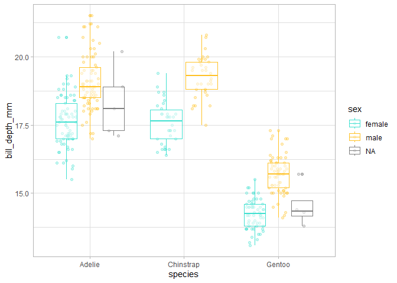

# Functional Programming with R
Julen Astigarraga and Verónica Cruz-Alonso
31/05/2024

- [<span class="toc-section-number">1</span>
  Introduction](#introduction)
  - [<span class="toc-section-number">1.1</span> Course
    structure](#course-structure)
  - [<span class="toc-section-number">1.2</span> Who we
    are?](#who-we-are)
- [<span class="toc-section-number">2</span> Introduction to programming
  in tidyverse](#introduction-to-programming-in-tidyverse)
  - [<span class="toc-section-number">2.1</span> Basic
    concepts](#basic-concepts)
  - [<span class="toc-section-number">2.2</span> Tidyverse](#tidyverse)
  - [<span class="toc-section-number">2.3</span> Scoping](#scoping)
- [<span class="toc-section-number">3</span> Introduction to Functional
  Programming](#introduction-to-functional-programming)
  - [<span class="toc-section-number">3.1</span> When do we have to use
    a function?](#when-do-we-have-to-use-a-function)
- [<span class="toc-section-number">4</span> Theory on functions in
  R](#theory-on-functions-in-r)
- [<span class="toc-section-number">5</span> How to write
  functions](#sec-writefun)
  - [<span class="toc-section-number">5.1</span> Arguments](#arguments)
  - [<span class="toc-section-number">5.2</span> Return
    values](#return-values)
- [<span class="toc-section-number">6</span> Object-oriented programming
  (OOP)](#object-oriented-programming-oop)
- [<span class="toc-section-number">7</span> Functional
  programming](#functional-programming)
- [<span class="toc-section-number">8</span> Iterations over one
  argument](#iterations-over-one-argument)
  - [<span class="toc-section-number">8.1</span> Our first functional:
    generating lists,
    `map()`](#our-first-functional-generating-lists-map)
  - [<span class="toc-section-number">8.2</span> Our second functional:
    generating vectors,
    `map_*()`](#our-second-functional-generating-vectors-map_)
- [<span class="toc-section-number">9</span> Iterations over multiple
  arguments](#iterations-over-multiple-arguments)
  - [<span class="toc-section-number">9.1</span> Our third functional:
    two inputs, `map2()`](#our-third-functional-two-inputs-map2)
  - [<span class="toc-section-number">9.2</span> Our fourth functional:
    multiple inputs,
    `pmap()`](#our-fourth-functional-multiple-inputs-pmap)
- [<span class="toc-section-number">10</span> Iterations without
  output](#iterations-without-output)
  - [<span class="toc-section-number">10.1</span> Our fifth functional:
    `walk()`, `walk2()` and
    `pwalk()`](#our-fifth-functional-walk-walk2-and-pwalk)
- [<span class="toc-section-number">11</span> Function operators and
  other functionals](#function-operators-and-other-functionals)
  - [<span class="toc-section-number">11.1</span> More variants of
    `map()`: `modify()` and
    `imap()`](#more-variants-of-map-modify-and-imap)
  - [<span class="toc-section-number">11.2</span> Predicate functionals
    and more useful stuff](#predicate-functionals-and-more-useful-stuff)
- [<span class="toc-section-number">12</span> Further
  information](#further-information)
  - [<span class="toc-section-number">12.1</span>
    Parallelization](#parallelization)
  - [<span class="toc-section-number">12.2</span> More information about
    Object-Oriented Programming (OOP)](#sec-OOP)
  - [<span class="toc-section-number">12.3</span> Links of
    interest](#links-of-interest)

## Introduction

The objectives of this course are:

- to learn how to write functions

- to apply functions in iterations using the library {purrr} from
  {tidyverse}

- to learn coding styles that facilitate script understanding (📝)

Within the model of the tools needed in a typical data science project
of Wickham and Grolemund
(<a href="#fig-datascience" class="quarto-xref">Figure 1</a>), this
course focuses in the envelope wrapping all the other tools, that is,
programming.


### Course structure

<table style="width:97%;">
<colgroup>
<col style="width: 75%" />
<col style="width: 22%" />
</colgroup>
<thead>
<tr class="header">
<th>Blocks</th>
<th>Day</th>
</tr>
</thead>
<tbody>
<tr class="odd">
<td><p>Course introduction</p>
<p>Refresh of tidyverse</p>
<p>Introduction to Functional Programming</p></td>
<td>27/05/24</td>
</tr>
<tr class="even">
<td><p>Theory of functions in R</p>
<p>How to write functions. Arguments and return values</p></td>
<td>27/05/24</td>
</tr>
<tr class="odd">
<td><p>Object-Oriented Programming</p>
<p>Functional Programming</p>
<p>Iterations over one argument</p></td>
<td>31/05/24</td>
</tr>
<tr class="even">
<td><p>Iterations over multiple arguments</p>
<p>Iterations without output</p>
<p>Function operators and other functionals</p></td>
<td>31/05/24</td>
</tr>
</tbody>
</table>

### Who we are?


We coordinate the [Ecoinformatics Working
Group](https://ecoinfaeet.github.io/website/index.html) of the Spanish
Association of Terrestrial Ecology (AEET).

And you… who are you?

<https://www.menti.com/alsrpp5991gr>

## Introduction to programming in tidyverse

### Basic concepts

- Object: any element associated to a name. There are many different
  types: `numeric`, `integer`, `logical`, `data.frame`, `SpatVector`,
  etc.

``` r
library(tidyverse)
```

    Warning: package 'ggplot2' was built under R version 4.3.3

    Warning: package 'tidyr' was built under R version 4.3.3

    Warning: package 'readr' was built under R version 4.3.2

    Warning: package 'purrr' was built under R version 4.3.2

    Warning: package 'dplyr' was built under R version 4.3.2

    Warning: package 'stringr' was built under R version 4.3.2

    Warning: package 'lubridate' was built under R version 4.3.2

    ── Attaching core tidyverse packages ──────────────────────── tidyverse 2.0.0 ──
    ✔ dplyr     1.1.4     ✔ readr     2.1.5
    ✔ forcats   1.0.0     ✔ stringr   1.5.1
    ✔ ggplot2   3.5.0     ✔ tibble    3.2.1
    ✔ lubridate 1.9.3     ✔ tidyr     1.3.1
    ✔ purrr     1.0.2     
    ── Conflicts ────────────────────────────────────────── tidyverse_conflicts() ──
    ✖ dplyr::filter() masks stats::filter()
    ✖ dplyr::lag()    masks stats::lag()
    ℹ Use the conflicted package (<http://conflicted.r-lib.org/>) to force all conflicts to become errors

``` r
a <- c(1, 2, 3, 4)
b <- c(1, 2, 3, 4)
c <- c("hi", "hola", "hola", "hi")
d <- c(TRUE, TRUE, TRUE, FALSE, FALSE)

mymatrix_num <- matrix(c(a, b), nrow = 4, ncol = 2)
mymatrix_num
```

         [,1] [,2]
    [1,]    1    1
    [2,]    2    2
    [3,]    3    3
    [4,]    4    4

``` r
mymatrix_cha <- matrix(c(a, b, c), nrow = 4, ncol = 3)
mymatrix_cha
```

         [,1] [,2] [,3]  
    [1,] "1"  "1"  "hi"  
    [2,] "2"  "2"  "hola"
    [3,] "3"  "3"  "hola"
    [4,] "4"  "4"  "hi"  

``` r
mytibble <- tibble(a, b, c)
mytibble
```

    # A tibble: 4 × 3
          a     b c    
      <dbl> <dbl> <chr>
    1     1     1 hi   
    2     2     2 hola 
    3     3     3 hola 
    4     4     4 hi   

``` r
mydf <- data.frame(a, b, c)

mylist <- list(a, b, c, d)
mylist
```

    [[1]]
    [1] 1 2 3 4

    [[2]]
    [1] 1 2 3 4

    [[3]]
    [1] "hi"   "hola" "hola" "hi"  

    [[4]]
    [1]  TRUE  TRUE  TRUE FALSE FALSE

``` r
mylist_from_tibble <- mytibble |> # list
  group_split(c)
mylist_from_tibble
```

    <list_of<
      tbl_df<
        a: double
        b: double
        c: character
      >
    >[2]>
    [[1]]
    # A tibble: 2 × 3
          a     b c    
      <dbl> <dbl> <chr>
    1     1     1 hi   
    2     4     4 hi   

    [[2]]
    # A tibble: 2 × 3
          a     b c    
      <dbl> <dbl> <chr>
    1     2     2 hola 
    2     3     3 hola 

``` r
mynested_tibble <- mytibble |> # data.frame with list-columns
  group_by(c) |> 
  nest()
mynested_tibble
```

    # A tibble: 2 × 2
    # Groups:   c [2]
      c     data            
      <chr> <list>          
    1 hi    <tibble [2 × 2]>
    2 hola  <tibble [2 × 2]>

> Names have objects; objects don’t have names
>
> — Hadley Wickham ([Advanced R](https://adv-r.hadley.nz/index.html))

In the example above, the length 4 numeric vector `c(1, 2, 3, 4)`
(object) has two names: “a” and “b”.

💡By doing `mean(x = a)` we link the value of “a” with the name “x” as
well. This link is called a *promise* in R: it is a promise to provide
the value of “a”, if “x” is ever needed within the `sum()` function.

📝Object names should be descriptive and can not have some special
characters (`^`, `!`, `$`, `@`, `+`, `-`, `/`, `*`).

📝R is sensitive to capital letters. In general, it is better to avoid
them.

- Functions: objects in R that take an input and give an output doing a
  specific action (specific functionality). Functions are the
  fundamental *building blocks* in R which is a functional programming
  language.

  

> To understand computation in R, this two truths are very useful:
>
> \- Everything that exist in R in an object.
>
> \- Everything that happen in R is the result of a function call.
>
> — John Chambers ([Advanced R](https://adv-r.hadley.nz/index.html))

- Libraries or packages: hold reusable functions, documentation on how
  to use them and example data. They are the fundamental units of
  reproducible code in R.

💡More info about Three Deep Truths About R
[here](https://www.r-bloggers.com/2018/06/three-deep-truths-about-r/).

### Tidyverse

[*Tidyverse*](https://www.tidyverse.org/) is a collection of R packages
(meta-package) initially developed by Hadley Wickham. It contains eight
main packages: `readr`, `tibble`, `dplyr`, `tidyr`, `stringr`,
`forcats`, `ggplot2` and `purrr`. *Tidyverse* can be considered a
dialect of the R programming language, and as such, it may be difficult
to learn for people with experience in base R. However, it is important
to know the basics of programming using *Tidyverse* for this course due
to consistency with the sections on iteration where we will primarily
use {purrr}.

*Tidyverse* is designed to support the activities of a human data
analyst, making its programming structures more logical for the human
mind. All the packages are designed to work with [*tidy
data*](https://cran.r-project.org/web/packages/tidyr/vignettes/tidy-data.html)
meaning data where each column is a variable, each row is an
observation, and each cell has a value. Additionally, the functions are
prepared to be concatenated using the *pipe* operator (`%>%` from
{magrittr} package or `|>` from base R), which takes what is on its left
and uses it as the first argument of the function on its right. This
allows for a left-to-right reading flow, which is more comfortable for
most people.

💡The two pipe operators have small
[differences](https://www.tidyverse.org/blog/2023/04/base-vs-magrittr-pipe/)
but in general their behaviour is the same.

``` r
myvector <- c(6, 4)
mean(myvector)
```

    [1] 5

``` r
myvector |> 
  mean() # CTRL+SHIFT+M - shortcut for the pipe
```

    [1] 5

``` r
length(unique(myvector)) # vs
```

    [1] 2

``` r
myvector |> unique() |> length()
```

    [1] 2

``` r
library(palmerpenguins)

penguins <- palmerpenguins::penguins
penguins
```

    # A tibble: 344 × 8
       species island    bill_length_mm bill_depth_mm flipper_length_mm body_mass_g
       <fct>   <fct>              <dbl>         <dbl>             <int>       <int>
     1 Adelie  Torgersen           39.1          18.7               181        3750
     2 Adelie  Torgersen           39.5          17.4               186        3800
     3 Adelie  Torgersen           40.3          18                 195        3250
     4 Adelie  Torgersen           NA            NA                  NA          NA
     5 Adelie  Torgersen           36.7          19.3               193        3450
     6 Adelie  Torgersen           39.3          20.6               190        3650
     7 Adelie  Torgersen           38.9          17.8               181        3625
     8 Adelie  Torgersen           39.2          19.6               195        4675
     9 Adelie  Torgersen           34.1          18.1               193        3475
    10 Adelie  Torgersen           42            20.2               190        4250
    # ℹ 334 more rows
    # ℹ 2 more variables: sex <fct>, year <int>

``` r
summary(penguins)
```

          species          island    bill_length_mm  bill_depth_mm  
     Adelie   :152   Biscoe   :168   Min.   :32.10   Min.   :13.10  
     Chinstrap: 68   Dream    :124   1st Qu.:39.23   1st Qu.:15.60  
     Gentoo   :124   Torgersen: 52   Median :44.45   Median :17.30  
                                     Mean   :43.92   Mean   :17.15  
                                     3rd Qu.:48.50   3rd Qu.:18.70  
                                     Max.   :59.60   Max.   :21.50  
                                     NA's   :2       NA's   :2      
     flipper_length_mm  body_mass_g       sex           year     
     Min.   :172.0     Min.   :2700   female:165   Min.   :2007  
     1st Qu.:190.0     1st Qu.:3550   male  :168   1st Qu.:2007  
     Median :197.0     Median :4050   NA's  : 11   Median :2008  
     Mean   :200.9     Mean   :4202                Mean   :2008  
     3rd Qu.:213.0     3rd Qu.:4750                3rd Qu.:2009  
     Max.   :231.0     Max.   :6300                Max.   :2009  
     NA's   :2         NA's   :2                                 

``` r
View(penguins)

# filter
penguins |> 
  filter(island == "Dream") 
```

    # A tibble: 124 × 8
       species island bill_length_mm bill_depth_mm flipper_length_mm body_mass_g
       <fct>   <fct>           <dbl>         <dbl>             <int>       <int>
     1 Adelie  Dream            39.5          16.7               178        3250
     2 Adelie  Dream            37.2          18.1               178        3900
     3 Adelie  Dream            39.5          17.8               188        3300
     4 Adelie  Dream            40.9          18.9               184        3900
     5 Adelie  Dream            36.4          17                 195        3325
     6 Adelie  Dream            39.2          21.1               196        4150
     7 Adelie  Dream            38.8          20                 190        3950
     8 Adelie  Dream            42.2          18.5               180        3550
     9 Adelie  Dream            37.6          19.3               181        3300
    10 Adelie  Dream            39.8          19.1               184        4650
    # ℹ 114 more rows
    # ℹ 2 more variables: sex <fct>, year <int>

``` r
penguins |> 
  filter(island == "Dream" & body_mass_g > 4500) # Combining criteria
```

    # A tibble: 4 × 8
      species   island bill_length_mm bill_depth_mm flipper_length_mm body_mass_g
      <fct>     <fct>           <dbl>         <dbl>             <int>       <int>
    1 Adelie    Dream            39.8          19.1               184        4650
    2 Adelie    Dream            39.6          18.8               190        4600
    3 Chinstrap Dream            52.8          20                 205        4550
    4 Chinstrap Dream            52            20.7               210        4800
    # ℹ 2 more variables: sex <fct>, year <int>

``` r
penguins |> 
  filter(island %in% c("Dream", "Torgersen"))
```

    # A tibble: 176 × 8
       species island    bill_length_mm bill_depth_mm flipper_length_mm body_mass_g
       <fct>   <fct>              <dbl>         <dbl>             <int>       <int>
     1 Adelie  Torgersen           39.1          18.7               181        3750
     2 Adelie  Torgersen           39.5          17.4               186        3800
     3 Adelie  Torgersen           40.3          18                 195        3250
     4 Adelie  Torgersen           NA            NA                  NA          NA
     5 Adelie  Torgersen           36.7          19.3               193        3450
     6 Adelie  Torgersen           39.3          20.6               190        3650
     7 Adelie  Torgersen           38.9          17.8               181        3625
     8 Adelie  Torgersen           39.2          19.6               195        4675
     9 Adelie  Torgersen           34.1          18.1               193        3475
    10 Adelie  Torgersen           42            20.2               190        4250
    # ℹ 166 more rows
    # ℹ 2 more variables: sex <fct>, year <int>

``` r
# select
penguins |> 
  select(sex, body_mass_g)
```

    # A tibble: 344 × 2
       sex    body_mass_g
       <fct>        <int>
     1 male          3750
     2 female        3800
     3 female        3250
     4 <NA>            NA
     5 female        3450
     6 male          3650
     7 female        3625
     8 male          4675
     9 <NA>          3475
    10 <NA>          4250
    # ℹ 334 more rows

``` r
penguins |> 
  select(ends_with(c("mm", "g"))) # select variables with a text pattern
```

    # A tibble: 344 × 4
       bill_length_mm bill_depth_mm flipper_length_mm body_mass_g
                <dbl>         <dbl>             <int>       <int>
     1           39.1          18.7               181        3750
     2           39.5          17.4               186        3800
     3           40.3          18                 195        3250
     4           NA            NA                  NA          NA
     5           36.7          19.3               193        3450
     6           39.3          20.6               190        3650
     7           38.9          17.8               181        3625
     8           39.2          19.6               195        4675
     9           34.1          18.1               193        3475
    10           42            20.2               190        4250
    # ℹ 334 more rows

``` r
penguins |> 
  select(sex, body_mass_g, everything()) # use select to reorder variables
```

    # A tibble: 344 × 8
       sex    body_mass_g species island    bill_length_mm bill_depth_mm
       <fct>        <int> <fct>   <fct>              <dbl>         <dbl>
     1 male          3750 Adelie  Torgersen           39.1          18.7
     2 female        3800 Adelie  Torgersen           39.5          17.4
     3 female        3250 Adelie  Torgersen           40.3          18  
     4 <NA>            NA Adelie  Torgersen           NA            NA  
     5 female        3450 Adelie  Torgersen           36.7          19.3
     6 male          3650 Adelie  Torgersen           39.3          20.6
     7 female        3625 Adelie  Torgersen           38.9          17.8
     8 male          4675 Adelie  Torgersen           39.2          19.6
     9 <NA>          3475 Adelie  Torgersen           34.1          18.1
    10 <NA>          4250 Adelie  Torgersen           42            20.2
    # ℹ 334 more rows
    # ℹ 2 more variables: flipper_length_mm <int>, year <int>

``` r
# arrange
penguins |> 
  select(sex, body_mass_g) |> 
  arrange(body_mass_g)
```

    # A tibble: 344 × 2
       sex    body_mass_g
       <fct>        <int>
     1 female        2700
     2 female        2850
     3 female        2850
     4 female        2900
     5 female        2900
     6 female        2900
     7 female        2900
     8 female        2925
     9 <NA>          2975
    10 female        3000
    # ℹ 334 more rows

``` r
penguins |> 
  select(sex, body_mass_g) |> 
  arrange(desc(body_mass_g))
```

    # A tibble: 344 × 2
       sex   body_mass_g
       <fct>       <int>
     1 male         6300
     2 male         6050
     3 male         6000
     4 male         6000
     5 male         5950
     6 male         5950
     7 male         5850
     8 male         5850
     9 male         5850
    10 male         5800
    # ℹ 334 more rows

#### Exercise

1.  With the penguins dataset, create an object with individuals of the
    Adelie species and arrange the `data.frame` according to flipper
    length.

2.  Create an object from the previous one where you select the island
    and the variables related to the bill.

3.  Create an object from the one created in step 1 where you select
    everything except the species.

``` r
# mutate
penguins |> 
  mutate(bill_volume_mm2 = (bill_length_mm * bill_depth_mm) / 2) |> 
  select(bill_volume_mm2, everything())
```

    # A tibble: 344 × 9
       bill_volume_mm2 species island bill_length_mm bill_depth_mm flipper_length_mm
                 <dbl> <fct>   <fct>           <dbl>         <dbl>             <int>
     1            366. Adelie  Torge…           39.1          18.7               181
     2            344. Adelie  Torge…           39.5          17.4               186
     3            363. Adelie  Torge…           40.3          18                 195
     4             NA  Adelie  Torge…           NA            NA                  NA
     5            354. Adelie  Torge…           36.7          19.3               193
     6            405. Adelie  Torge…           39.3          20.6               190
     7            346. Adelie  Torge…           38.9          17.8               181
     8            384. Adelie  Torge…           39.2          19.6               195
     9            309. Adelie  Torge…           34.1          18.1               193
    10            424. Adelie  Torge…           42            20.2               190
    # ℹ 334 more rows
    # ℹ 3 more variables: body_mass_g <int>, sex <fct>, year <int>

``` r
penguins |>
  mutate(female_penguin = case_when(
    sex == "female" & body_mass_g < 3600 ~ "small female",
    sex == "female" & body_mass_g >= 3600 ~ "big female",
    TRUE ~ NA)) |>
  select(female_penguin, sex, body_mass_g)
```

    # A tibble: 344 × 3
       female_penguin sex    body_mass_g
       <chr>          <fct>        <int>
     1 <NA>           male          3750
     2 big female     female        3800
     3 small female   female        3250
     4 <NA>           <NA>            NA
     5 small female   female        3450
     6 <NA>           male          3650
     7 big female     female        3625
     8 <NA>           male          4675
     9 <NA>           <NA>          3475
    10 <NA>           <NA>          4250
    # ℹ 334 more rows

``` r
# summarise
# it is used with summary functions: n, n_distinct, mean, etc.
# see ?summarise

penguins |> 
  summarise(
    body_min = min(body_mass_g, na.rm = TRUE),
    body_max = max(body_mass_g, na.rm = TRUE)
  )
```

    # A tibble: 1 × 2
      body_min body_max
         <int>    <int>
    1     2700     6300

``` r
penguins |> 
  group_by(sex) |> 
  summarise(body_min = min(body_mass_g, na.rm = TRUE),
  body_max = max(body_mass_g, na.rm = TRUE))
```

    # A tibble: 3 × 3
      sex    body_min body_max
      <fct>     <int>    <int>
    1 female     2700     5200
    2 male       3250     6300
    3 <NA>       2975     4875

``` r
# join: left, right, full, inner

coordinates <- tibble(island = c("Dream", "Torgersen", "Biscoe"), 
  latitude = c("64°44′S", "64°46′S", "64°36′S"),
  longitude = c("64°14′W", "64°05′W", " 63°30′W"))

penguins |> 
  left_join(coordinates, by = "island") |> 
  select(island, latitude, longitude, everything())
```

    # A tibble: 344 × 10
       island    latitude longitude species bill_length_mm bill_depth_mm
       <chr>     <chr>    <chr>     <fct>            <dbl>         <dbl>
     1 Torgersen 64°46′S  64°05′W   Adelie            39.1          18.7
     2 Torgersen 64°46′S  64°05′W   Adelie            39.5          17.4
     3 Torgersen 64°46′S  64°05′W   Adelie            40.3          18  
     4 Torgersen 64°46′S  64°05′W   Adelie            NA            NA  
     5 Torgersen 64°46′S  64°05′W   Adelie            36.7          19.3
     6 Torgersen 64°46′S  64°05′W   Adelie            39.3          20.6
     7 Torgersen 64°46′S  64°05′W   Adelie            38.9          17.8
     8 Torgersen 64°46′S  64°05′W   Adelie            39.2          19.6
     9 Torgersen 64°46′S  64°05′W   Adelie            34.1          18.1
    10 Torgersen 64°46′S  64°05′W   Adelie            42            20.2
    # ℹ 334 more rows
    # ℹ 4 more variables: flipper_length_mm <int>, body_mass_g <int>, sex <fct>,
    #   year <int>

#### Exercise

1.  With the penguins dataset, count the number of cases on each island
    and calculate the mean flipper length for each island.

2.  Calculate the ratio between the weight in kg and the flipper length
    for each individual.

### Scoping

[Scoping](https://adv-r.hadley.nz/functions.html?q=lexica#lexical-scoping)
is the set of rules that govern how to look up the value of a symbol in
the environment in each programming language. R uses *lexical scoping*
and there are four basic rules: name masking, functions versus
variables, a fresh start and dynamic lookup. A deeper understanding of
scoping will help us to use more advanced functional programming tools.

In relation to name masking, the basic principle of lexical scoping is
that names defined inside a function mask names defined outside a
function.

``` r
x <- 10
y <- 20

myfunction <- function() {
  x <- 1
  y <- 2
  x + y
}

myfunction()
```

    [1] 3


In general, with base R, we can only call objects that are part of the
environment (env-variables); however, with *tidyverse*, we can also call
variables within tables (data-variables). This feature called *data
masking* simplifies the code in *tidyverse*, but the advantage does not
come for free and has implications for the grammar of the functions as
we will see later.

``` r
penguins |> filter(island == "Dream", species == "Chinstrap") 
```

    # A tibble: 68 × 8
       species   island bill_length_mm bill_depth_mm flipper_length_mm body_mass_g
       <fct>     <fct>           <dbl>         <dbl>             <int>       <int>
     1 Chinstrap Dream            46.5          17.9               192        3500
     2 Chinstrap Dream            50            19.5               196        3900
     3 Chinstrap Dream            51.3          19.2               193        3650
     4 Chinstrap Dream            45.4          18.7               188        3525
     5 Chinstrap Dream            52.7          19.8               197        3725
     6 Chinstrap Dream            45.2          17.8               198        3950
     7 Chinstrap Dream            46.1          18.2               178        3250
     8 Chinstrap Dream            51.3          18.2               197        3750
     9 Chinstrap Dream            46            18.9               195        4150
    10 Chinstrap Dream            51.3          19.9               198        3700
    # ℹ 58 more rows
    # ℹ 2 more variables: sex <fct>, year <int>

``` r
penguins[penguins$island == "Dream" & penguins$species == "Chinstrap", ]
```

    # A tibble: 68 × 8
       species   island bill_length_mm bill_depth_mm flipper_length_mm body_mass_g
       <fct>     <fct>           <dbl>         <dbl>             <int>       <int>
     1 Chinstrap Dream            46.5          17.9               192        3500
     2 Chinstrap Dream            50            19.5               196        3900
     3 Chinstrap Dream            51.3          19.2               193        3650
     4 Chinstrap Dream            45.4          18.7               188        3525
     5 Chinstrap Dream            52.7          19.8               197        3725
     6 Chinstrap Dream            45.2          17.8               198        3950
     7 Chinstrap Dream            46.1          18.2               178        3250
     8 Chinstrap Dream            51.3          18.2               197        3750
     9 Chinstrap Dream            46            18.9               195        4150
    10 Chinstrap Dream            51.3          19.9               198        3700
    # ℹ 58 more rows
    # ℹ 2 more variables: sex <fct>, year <int>

``` r
mean(x = 1:10)
```

    [1] 5.5

``` r
mean(x = values)
```

    Error in eval(expr, envir, enclos): object 'values' not found

``` r
mydata <- tibble(values = 1:10)
mean(x = values)
```

    Error in eval(expr, envir, enclos): object 'values' not found

``` r
mean(x = mydata$values)
```

    [1] 5.5

``` r
mydata |> 
  summarise(mean = mean(values))
```

    # A tibble: 1 × 1
       mean
      <dbl>
    1   5.5


## Introduction to Functional Programming

The growing availability of data and the versatility of analysis
software have led to an increase in the quantity and complexity of the
analyses we conduct in biological sciences. This makes efficiency in the
process of data management and analysis increasingly necessary. One
possible way to optimize these processes and reduce work time for R
users is function-based programming. Functions allow the automation of
common tasks (for example, reading different databases), simplifying the
code.

A function can be called through another function and the process can be
iterated, making R a very powerful tool. Iterations are used to perform
the same action on multiple inputs. There are two main paradigms of
iteration: object-oriented programming (OOP) and functional programming
(FP). In this workshop, we will primarily focus on functional
programming and learn to use the {purrr} package, which provides
functions to eliminate many common loops.

``` r
df <- penguins |> 
  select(bill_length_mm, bill_depth_mm, flipper_length_mm, body_mass_g)

df_rescaled1 <- df |> 
  mutate(bill_length_mm = (bill_length_mm - min(bill_length_mm, na.rm = TRUE)) / (max(bill_length_mm, na.rm = TRUE) - min(bill_length_mm, na.rm = TRUE)),
    bill_depth_mm = (bill_depth_mm - min(bill_depth_mm, na.rm = TRUE)) / (max(bill_depth_mm, na.rm = TRUE) - min(bill_length_mm, na.rm = TRUE)),
    flipper_length_mm = (flipper_length_mm - min(flipper_length_mm, na.rm = TRUE)) / (max(flipper_length_mm, na.rm = TRUE) - min(flipper_length_mm, na.rm = TRUE)),
    body_mass_g = (body_mass_g - min(body_mass_g, na.rm = TRUE)) / (max(body_mass_g, na.rm = TRUE) - min(body_mass_g, na.rm = TRUE)))
    
View(df_rescaled1)

#
rescale01 <- function(x) {
  rng <- range(x, na.rm = TRUE)   
  (x - rng[1]) / (rng[2] - rng[1]) 
} 

df_rescaled2 <- df |> 
  mutate(bill_length_mm = rescale01(bill_length_mm),
    bill_depth_mm = rescale01(bill_depth_mm),
    flipper_length_mm = rescale01(flipper_length_mm), 
    body_mass_g = rescale01(body_mass_g))  

View(df_rescaled2)

#
df_rescaled3 <- lapply(df, rescale01)

head(df_rescaled3$bill_length_mm)
```

    [1] 0.2545455 0.2690909 0.2981818        NA 0.1672727 0.2618182

The main advantages of functional programming (use of functions and
iterations) are:

1.  Ease of understanding the code’s intent, thereby improving
    comprehension for oneself, collaborators, and reviewers:

    - Functions have evocative names.

    - The code is more organized.

2.  Speed in making changes, as functions are independent pieces that
    solve a specific problem.

3.  Reduction of error probability.

### When do we have to use a function?

It is recommended to follow the “do not repeat yourself” principle ([DRY
principle](https://en.wikipedia.org/wiki/Don%27t_repeat_yourself#:~:text=%22Don't%20repeat%20yourself%22,redundancy%20in%20the%20first%20place.)):
each unit of knowledge or information should have a single, unambiguous,
and authoritative representation within a system.

Writing a function is worthwhile when you have copied and pasted the
same code more than twice (don’t be WET! - Write Everything Twice). The
more times a piece of code is repeated in different places, the more you
will need to update it if there is a change, and the higher the
likelihood of errors.

## Theory on functions in R

Functions have three components:

- `body()`: the code inside the function.
- `formals()`: the list of arguments that control how the function is
  executed.
- `environment()`: the structure that supports the *scoping* of the
  function, i.e., the environment where the function is located.

``` r
body(rescale01)
```

    {
        rng <- range(x, na.rm = TRUE)
        (x - rng[1])/(rng[2] - rng[1])
    }

``` r
formals(rescale01)
```

    $x

``` r
environment(rescale01)
```

    <environment: R_GlobalEnv>

**Primitive functions** are the exception as they do not have the
aforementioned components. They are written in C instead of R and only
appear in the base package. They are more efficient but behave
differently from other functions, so the R Core Team tries not to create
new primitive functions. The rest of the functions follow the structure
outlined above.

``` r
sum
```

    function (..., na.rm = FALSE)  .Primitive("sum")

``` r
body(sum)
```

    NULL

According to the type of output, there are two types of functions:

- **Transformation functions**: transform the object that enters the
  function (the first argument) and return another object or the
  original one with modifications. Functionals are special types of
  transformation functions.

- **Side-effect functions**: have side effects and perform an action,
  such as saving a file or drawing a plot. Some commonly used examples
  are: `library()`, `setwd()`, `plot()`, `write_delim()`… These
  functions invisibly return the output, which is not saved but can be
  used in a pipeline.

In general, syntactically, functions have three components:

- The function `function()` (primitive)
- Arguments: list of inputs.
- Body: the piece of code that follows `function()`, traditionally
  enclosed in curly braces.

``` r
name1_v1 <- function(x, y) {
  paste(x, y, sep = "_")
}  

name1_v2 <- function(x, y) paste(x, y, sep = "_")  

name1_v3 <- \(x, y) paste(x, y, sep = "_")  

name1_v1("Vero", "Cruz") 
```

    [1] "Vero_Cruz"

``` r
name1_v2("Vero", "Cruz") 
```

    [1] "Vero_Cruz"

``` r
name1_v3("Vero", "Cruz") 
```

    [1] "Vero_Cruz"

📝If the function has more than two lines, it is better to always use
curly braces to clearly delimit it. The opening brace should never be
alone, but the closing one should be (except with `else`). Indentation
also greatly helps to understand the hierarchy of the code within
functions. In this regard, we recommend using *Code \> Reindent
lines/Reformat code* in the RStudio menu.

💡Infix operators (`+`), flow control operators (`for`, `if`),
subsetting operators (`[ ]`, `$`), assignment operators (`<-`) or even
curly braces (`{ }`) are also functions. The backtick “\`” allows to
refer to functions or variables that otherwise have “illegal” names.

``` r
3 + 2 
```

    [1] 5

``` r
`+`(3, 2)  
```

    [1] 5

``` r
for (i in 1:2) print(i) 
```

    [1] 1
    [1] 2

``` r
`for`(i, 1:2, print(i)) 
```

    [1] 1
    [1] 2

In general, functions have a name that is executed when needed, as we
have seen so far, but this is not mandatory. Some packages, such as
{purrr}, or functions from the `apply` family, allow the use of
anonymous functions for iteration.

``` r
nxcase <- lapply(penguins, function(x) length(unique(x)))

models <- penguins|>
  group_split(species) |>
  map(\(df) lm(body_mass_g ~ bill_length_mm, data = df)) 
```

📝It is better to reserve the use of anonymous functions for short and
simple functions. If the function is long, spans multiple lines or we
need to use it many times it is better to give it a name.

## How to write functions

#### Exercise

Create your first function that fulfills the functionality of dividing
any value by 100.

💡Shortcut to write functions: write word “fun” + tab.

Imagine that for a dataset we want to visualize the distribution for
each numerical variable, based on other categorical variables that
particularly interests us.

``` r
penguins_num <- penguins |> 
  select(species, sex, where(is.numeric))

# we are interested in differences among species and between sexes 

ggplot(penguins_num, aes(x = species, y = bill_length_mm, color = sex)) +
  geom_point(position = position_jitterdodge(), alpha = 0.3) +
  geom_boxplot(alpha = 0.5) +
  scale_color_manual(values = c("turquoise", "goldenrod1")) +
  theme_light()
```


``` r
ggplot(penguins_num, aes(x = species, y = bill_depth_mm, color = sex)) +
  geom_point(position = position_jitterdodge(), alpha = 0.3) +
  geom_boxplot(alpha = 0.5) +
  scale_color_manual(values = c("turquoise", "goldenrod1")) +
  theme_light()
```


``` r
ggplot(penguins_num, aes(x = species, y = flipper_length_mm, color = sex)) +
  geom_point(position = position_jitterdodge(), alpha = 0.3) +
  geom_boxplot(alpha = 0.5) +
  scale_color_manual(values = c("turquoise", "goldenrod1")) +
  theme_light()
```


``` r
# etc
```

We have copied a code more than twice to perform the same action (i.e.,
a plot to see how a variable is distributed based on two others that
remain constant), so we should consider the possibility that we need a
function. Next, we will follow some simple steps to transform any
repeated code into a function.

1.  Analyze the code: what are the replicated parts? How many inputs do
    we have? Which inputs vary and which do not?

2.  Simplify and reanalyze duplications.

``` r
var <- penguins_num$bill_length_mm

ggplot(penguins_num, aes(x = species, y = var, color = sex)) +
  geom_point(position = position_jitterdodge(), alpha = 0.3) +
  geom_boxplot(alpha = 0.5) +
  scale_color_manual(values = c("turquoise", "goldenrod1")) +
  theme_light()
```


``` r
var <- body_mass_g
```

    Error in eval(expr, envir, enclos): object 'body_mass_g' not found

``` r
var <- "body_mass_g"

ggplot(penguins_num, aes(x = species, y = .data[[var]], color = sex)) +
  geom_point(position = position_jitterdodge(), alpha = 0.3) +
  geom_boxplot(alpha = 0.5) +
  scale_color_manual(values = c("turquoise", "goldenrod1")) +
  theme_light() +
  ylab(var)
```


👀 `ggplot()` needs arguments (data-variables) that are within the data
frame it will represent. To generalize the function, we have associated
the name of the variable (of type character) to the name “var”, but
`ggplot()` does not accept characters. Therefore, we need to use an
intermediate function that does accept them.

📝 Creating objects with intermediate calculations within a function is
good practice because it makes the code clearer about what the function
is doing. It is common when the function contains if/else statements.

3.  Choose a name for the function (📝). Ideally, it should be short and
    evoke what the function does. In general, it should be a verb
    (e.g. impute_values) and the argument names are nouns (e.g. “data”,
    “variable”, etc.). Using a noun for a function is allowed if the
    function calculates something well-known (e.g. `mean()`) or if it
    serves to access parts of an object (e.g. `residuals()`). It is also
    recommended to avoid very generic verbs (e.g. “calculate”), and if
    the name has multiple words, to separate them with an underscore, a
    dot or use camelCase, but be consistent. If you program several
    function that do similar things, it is recommended to use the same
    prefix for all of them (e.g. “str\_” in {stringr} package).

    The more clearly you can express the intention of your code through
    function names, the more easily others, including yourself in the
    future, will be able to read and understand the code.

``` r
# examples of names to avoid

T <- FALSE
c <- 10
mean <- function(x) sum(x)

rm(T, c, mean)
```

4.  Enumerate the arguments within `function()` and put the simplified
    code inside the curly braces.

``` r
explore_penguins <- function (var) {
  ggplot(penguins_num, aes(x = species, y = .data[[var]], color = sex)) +
    geom_point(position = position_jitterdodge(), alpha = 0.3) +
    geom_boxplot(alpha = 0.5) +
    scale_color_manual(values = c("turquoise", "goldenrod1")) +
    theme_light() +
    ylab(var) 
}
```

📝 Use comments (#) to explain the reasoning behind your functions.
Avoid explaining what the function is doing or how, as the code itself
already communicates that. It is also recommended to use \# to separate
sections (Cmd/Ctrl + Shift + R).

5.  Try with different inputs.

``` r
explore_penguins(var = "body_mass_g") 
```

    Warning: Removed 2 rows containing non-finite outside the scale range
    (`stat_boxplot()`).

    Warning: Removed 2 rows containing missing values or values outside the scale range
    (`geom_point()`).


``` r
explore_penguins(var = "flipper_length_mm") 
```

    Warning: Removed 2 rows containing non-finite outside the scale range
    (`stat_boxplot()`).
    Removed 2 rows containing missing values or values outside the scale range
    (`geom_point()`).


``` r
explore_penguins(var = "bill_depth_mm")
```

    Warning: Removed 2 rows containing non-finite outside the scale range
    (`stat_boxplot()`).
    Removed 2 rows containing missing values or values outside the scale range
    (`geom_point()`).



💡You may want to convert these tests into formal tests. In complex
functions, tests are useful to ensure that even if you make changes, the
functionality has not been broken. If you’re interested, check out this
link: <https://r-pkgs.org/testing-basics.html>

#### Exercise

Create a function to standardize (i.e., subtract the mean and divide by
the standard deviation) the numerical variables of the penguins dataset.

### Arguments

In general, there are two groups: those that specify the **data** and
those that specify **details** of the function’s execution. Typically,
those specifying data come first, followed by detail arguments. The
latter group often has default values (the most common ones), for when
nothing is specified.

<!--# See quantile() help -->

📝 The argument names should be short and descriptive. There are some
names commonly used but non descriptive that are already known to most
users, and it’s fine to take advantage of them.

- `x, y, z`: vectors

- `w`: vector of weights

- `df`: data frame

- `i, j`: numerical indices, rows and columns, respectively

- `n`: length or row numbers

- `p`: column number

- `na.rm`: not available values

When executing the function, arguments can be specified using the full
name, a unequivocal abbreviation, or the order of their position
(*unnamed* arguments), with this sequence (name \> abbreviation \>
position) being the priority order when matching arguments with what is
written.

📝 Generally, only positional order is used to specify the first
arguments, the most common ones that everyone knows. If a default value
for a detail argument is changed, it is advisable to always use the full
name of the argument.

📝Using spaces before and after `=` and after `,` makes it much easier
to identify the arguments of the function and, in general, all
components.

``` r
set.seed(123)
mean(rnorm(10, mean = 50, sd = 25) / 12, trim = 0.2)
```

    [1] 3.966805

``` r
set.seed(123)
mean(rnorm(10,mean=50,sd=25)/12,trim=0.2)
```

    [1] 3.966805

There is a special argument called `…`, which captures any other
argument that does not correspond to those named in the function. It is
used to pass arguments to other functions in our function.

``` r
?plot

plot(1:5, 1:5)

plot(1:5, 1:5, main = "I am using an argument of title()")
```

📝 Using `…` make functions being very flexible, but it makes necessary
to carefully read the function documentation to use it. In addition, if
there is a typo in an argument name, we don’t get an error message.

``` r
sum(1, 2, 5, na.mr = TRUE)
```

    [1] 9

``` r
sum(1, 2, NA, na.mr = TRUE)
```

    [1] NA

### Return values

The last expression executed in a function is the return value. It is
the result of executing the function, unless `invisible()` is specified.
Functions return only one object. If you want to obtain more, they must
be grouped in one list.

<!--# Can you thik of any case where using invisible() would be useful? -->

📝 The function `return()` is used to explicity show what do you want to
get from a function. It is recommended to use it when the return is not
expected at the end of the function. For example, in the branches of an
if/else structure, especially if there is a long and complex branch.

#### Exercise

How would you generalize the function `explore_penguins()` so you can
use any data frame as input?

## Object-oriented programming (OOP)

Most people tend to program imperatively. In imperative programming,
scripts tend to be long and gradually change the state of the program.
This often involves the use of temporary databases that are modified
throughout the analysis process. As a result, it can be more difficult
to understand what is being done in each step of the script.
Object-oriented programming, used by languages, such as Java or Python,
has been the most popular programming paradigm in recent decades and
uses an imperative programming style.

``` r
mypenguins <- penguins |> 
  mutate(
    bill_volume_mm2 = (bill_length_mm * bill_depth_mm) / 2,
    female_penguin = case_when(
      sex == "female" & body_mass_g < 3600 ~ "small female",
      sex == "female" & body_mass_g >= 3600 ~ "big female",
      TRUE ~ NA)
  ) 

mypenguins |> 
  group_by(female_penguin) |> 
  summarise(body_mass_mean = mean(body_mass_g))
```

    # A tibble: 3 × 2
      female_penguin body_mass_mean
      <chr>                   <dbl>
    1 big female              4338.
    2 small female            3277.
    3 <NA>                      NA 

In imperative programming the most common tools to reduce duplications
are *for loops* and *while loops*. *loops* are recommended to delve into
the world of iterations because they make each iteration very explicit
so it is clear what is happening.


Programming a loop needs to define three different parts: the output,
the sequence and the body.

``` r
set.seed(123)

df_sam <- data.frame(
  a = sample(1:5),
  b = sample(1:5),
  c = sample(1:5)
)

output <- vector("double", 3)           # 1. output
for (i in 1:3) {                        # 2. sequence
  output[[i]] <- first(df_sam[[i]])     # 3. body
}

output
```

    [1] 3 3 2

``` r
# we could generalize the for loop
output <- vector("double", ncol(df_sam))   # 1. output
for (i in seq_along(df_sam)) {             # 2. sequence
  output[[i]] <- first(df_sam[[i]])        # 3. body
}

output
```

    [1] 3 3 2

1.  Output: here we determine the output space, i.e., first we have to
    create the “notebook” where we are going to write down all the
    results. This is very important for efficiency since if we increase
    the size of the output in each iteration with `c()` or another
    function that adds elements, the *for loop* will be much slower.

``` r
x <- c()
system.time(
  for(i in 1:20000) {
    x <- c(x, i)
  }
)
```

       user  system elapsed 
       0.32    0.15    0.49 

``` r
y <- vector("double", length = 20000)
system.time(
  for(i in seq_along(y)) {
    y[i] <- i
  }
)
```

       user  system elapsed 
          0       0       0 

2.  Sequence: here we determine what we want to iterate on. Each
    execution of the *for loop* will assign a different value of
    `seq_along(y)` to *i*.

3.  Body: Here we determine what we want each iteration to do. The
    action is executed repeatedly, each time with a different value for
    *i*.

There are different [variations of for
loops](https://r4ds.had.co.nz/iteration.html#for-loop-variations): (i)
modifying an existing object instead of creating a new one; (ii) loops
over names or values instead of indices; (iii) loops when we do not know
the length of the output; (iv) loops when we do not know the length of
the input sequence, i.e., *while* loops.

👀 Some [common pitfalls](https://adv-r.hadley.nz/control-flow.html)
when using *for* loops (see 5.3.1 Common pitfalls).

Despite being widely used in R, *for* loops are not as important as they
may be in other languages because R is a functional programming
language. This means that *it is possible to wrap for loops in a
function* and call that function instead of using the loop.

There is a belief that *for loops* are slow, but the real disadvantage
of *for loops is that they are too flexible* and may execute many
different tasks. Instead, each functional ({purrr}, `apply`) is designed
for a specific task, so as soon as you see it in the code, you
immediately know why it’s being used. That is, the main advantage is its
clarity by making the code easier to write and read (see this advanced
example to understand it: <https://adv-r.hadley.nz/functionals.html>,
9.3 Purrr style). Once we master functional programming, we will be able
to solve many iteration problems with less code, more ease, and fewer
errors.

Loops can be more explicit in the sense that you see the iteration
clearly, but it takes more time to understand what you are doing. On the
contrary, functionals require one more step of abstraction and may
require time until we understand them. The most important thing is that
you solve the problem and little by little write increasingly simpler
and more elegant code. See
<a href="#sec-OOP" class="quarto-xref">Section 12.2</a> for more
information on object-oriented programming.

> To become significantly more reliable, code must become more
> transparent. In particular, nested conditions and loops must be viewed
> with great suspicion. Complicated control flows confuse programmers.
> Messy code often hides bugs.
>
> — Bjarne Stroustrup ([Advanced R](https://adv-r.hadley.nz/index.html))

## Functional programming


In functional programming, functions are designed to perform a single
specific task and are then combined by calling these functions
successively for the data set. A significant advantage of this approach
is that these functions can be reused in any other project, facilitating
code modularity. Furthermore, when they are well documented and easily
testable, it is easy to understand and maintain the program.

R is a functional programming language so it relies primarily on a
function-centric problem-solving style
(<https://adv-r.hadley.nz/fp.html>). A functional is a function that
takes a function as input and returns a vector or other type of object
as output.

``` r
randomization <- function(f) {
  f(rnorm(5))
}

randomization(f = median)
```

    [1] 0.3598138

To program a functional, first, we solve the problem for an element.
Next, we generate a function that allows us to wrap the solution in a
function (as we did in
<a href="#sec-writefun" class="quarto-xref">Section 5</a>). Finally, we
*apply the function to all the elements we are interested in.* That is,
we divide large problems into smaller problems and solve each task with
one or more functions.

The advantage of using {purrr} instead of *for* loops is that it
provides a function (functional) for each of the common data
manipulation problems, and therefore each *for* loop has its own
function. For example, to iterate over one argument we use the `map()`
function and to iterate over two arguments we use the `map2()` function.
The base R `apply` family solves similar problems, but {purrr} is more
consistent and therefore easier to learn.

Iterating over one vector (i.e. vector of values or vector of elements
in a list) is so common that the {purrr} package provides a family of
functions (the `map()` family) for it. Remember that data frames are
lists of vectors of the same length, so any calculation by rows or
columns involves iterating over a vector. There is a function in {purrr}
for each type of output. The suffixes indicate the type of output we
want:

- `map()` generates a list.
- `map_lgl()` generates a logical vector.
- `map_int()` generates a vector of integers.
- `map_dbl()` generates a vector of decimal numbers.
- `map_chr()` generates a character vector.
- `map_vec()` generates a vector automatically determining the type.

💡¿[Why is this function called
*map*](https://adv-r.hadley.nz/functionals.html#map)?

``` r
map_int(df_sam, first)
```

    a b c 
    3 3 2 

``` r
df_sam |> 
  map_int(first)
```

    a b c 
    3 3 2 

``` r
output <- vector("double", 3)
for (i in 1:3) {
  output[[i]] <- first(df_sam[[i]])
}
output
```

    [1] 3 3 2

Compared to a loop, the focus is on the operation being executed
(`first()`), and not on the code needed to iterate over each element and
save the output.

## Iterations over one argument

`map_*()` is vectorized over one argument, e.g. `(x)`. The function will
operate on all elements of `x`, i.e., each value if `x` is a vector,
each column if `x` is a `data.frame`, each group if `x` is a grouped
`data.frame`, or each element if `x` is a list.

### Our first functional: generating lists, `map()`

It takes a vector and a function, calls the function once for each
element of the vector, and returns the results in a list. `map(1:3, f)`
is equivalent to `list(f(1), f(2), f(3))`. It is the equivalent of base
R’s `lapply()`.

``` r
quadratic <- function(x) {
  x ^ 2
}

map(1:4, quadratic)
```

    [[1]]
    [1] 1

    [[2]]
    [1] 4

    [[3]]
    [1] 9

    [[4]]
    [1] 16

``` r
lapply(X = 1:4, FUN = quadratic)
```

    [[1]]
    [1] 1

    [[2]]
    [1] 4

    [[3]]
    [1] 9

    [[4]]
    [1] 16

``` r
# some more interesting use
glimpse(penguins)
```

    Rows: 344
    Columns: 8
    $ species           <fct> Adelie, Adelie, Adelie, Adelie, Adelie, Adelie, Adel…
    $ island            <fct> Torgersen, Torgersen, Torgersen, Torgersen, Torgerse…
    $ bill_length_mm    <dbl> 39.1, 39.5, 40.3, NA, 36.7, 39.3, 38.9, 39.2, 34.1, …
    $ bill_depth_mm     <dbl> 18.7, 17.4, 18.0, NA, 19.3, 20.6, 17.8, 19.6, 18.1, …
    $ flipper_length_mm <int> 181, 186, 195, NA, 193, 190, 181, 195, 193, 190, 186…
    $ body_mass_g       <int> 3750, 3800, 3250, NA, 3450, 3650, 3625, 4675, 3475, …
    $ sex               <fct> male, female, female, NA, female, male, female, male…
    $ year              <int> 2007, 2007, 2007, 2007, 2007, 2007, 2007, 2007, 2007…

``` r
# shortcut to generate an anonymous function: \(name_of_the_argument)
map(penguins, \(x) length(unique(x)))
```

    $species
    [1] 3

    $island
    [1] 3

    $bill_length_mm
    [1] 165

    $bill_depth_mm
    [1] 81

    $flipper_length_mm
    [1] 56

    $body_mass_g
    [1] 95

    $sex
    [1] 3

    $year
    [1] 3

``` r
# output dataframe
map_df(penguins, \(x) length(unique(x)))
```

    # A tibble: 1 × 8
      species island bill_length_mm bill_depth_mm flipper_length_mm body_mass_g
        <int>  <int>          <int>         <int>             <int>       <int>
    1       3      3            165            81                56          95
    # ℹ 2 more variables: sex <int>, year <int>


#### Exercise

Generate a vector, a function and apply the function to each of the
elements of the vector using `map()`.

As said before, it is possible to wrap *for loops* in a function and
call that function instead of using the loop.

``` r
imple_map <- function(x, f, ...) {
  out <- vector("list", length(x))
  for (i in seq_along(x)) {
    out[[i]] <- f(x[[i]], ...)
  }
  out
}

imple_map(1:4, quadratic)
```

    [[1]]
    [1] 1

    [[2]]
    [1] 4

    [[3]]
    [1] 9

    [[4]]
    [1] 16

💡Comparing {purrr} functions with wrapping a *for* loop on your own,
{purrr} functions are written in C to maximize performance, preserve
names, and support some shortcuts (e.g. `\(x)`).

#### Exercise

Now that you have understood the logic of `map()`, spot the differences
between the following three lines of code. What does the `map()`
functional do? What differences do you detect in the code? And at the
output?

``` r
map(penguins, \(x) mean(x))
```

    Warning in mean.default(x): argument is not numeric or logical: returning NA

    Warning in mean.default(x): argument is not numeric or logical: returning NA

    Warning in mean.default(x): argument is not numeric or logical: returning NA

    $species
    [1] NA

    $island
    [1] NA

    $bill_length_mm
    [1] NA

    $bill_depth_mm
    [1] NA

    $flipper_length_mm
    [1] NA

    $body_mass_g
    [1] NA

    $sex
    [1] NA

    $year
    [1] 2008.029

``` r
map(penguins, \(x) mean(x, na.rm = T)) # option 1
```

    Warning in mean.default(x, na.rm = T): argument is not numeric or logical:
    returning NA

    Warning in mean.default(x, na.rm = T): argument is not numeric or logical:
    returning NA

    Warning in mean.default(x, na.rm = T): argument is not numeric or logical:
    returning NA

    $species
    [1] NA

    $island
    [1] NA

    $bill_length_mm
    [1] 43.92193

    $bill_depth_mm
    [1] 17.15117

    $flipper_length_mm
    [1] 200.9152

    $body_mass_g
    [1] 4201.754

    $sex
    [1] NA

    $year
    [1] 2008.029

``` r
map(penguins, mean, na.rm = T) # option 2
```

    Warning in mean.default(.x[[i]], ...): argument is not numeric or logical:
    returning NA

    Warning in mean.default(.x[[i]], ...): argument is not numeric or logical:
    returning NA

    Warning in mean.default(.x[[i]], ...): argument is not numeric or logical:
    returning NA

    $species
    [1] NA

    $island
    [1] NA

    $bill_length_mm
    [1] 43.92193

    $bill_depth_mm
    [1] 17.15117

    $flipper_length_mm
    [1] 200.9152

    $body_mass_g
    [1] 4201.754

    $sex
    [1] NA

    $year
    [1] 2008.029

As we have seen in the previous exercise, if we wanted to pass
additional arguments to the function we are using within `map()`, one
option would be through an anonymous function (see option 1 of the
previous exercise). However, since `map()` includes `...` among its
arguments, we can also include the additional arguments after the
function inside `map()` in a much simpler way (see option 2 of the
previous exercise).

### Our second functional: generating vectors, `map_*()`

#### Exercise

Take a couple of minutes to understand what the following functions do:

``` r
map_lgl(penguins, is.numeric)
```

              species            island    bill_length_mm     bill_depth_mm 
                FALSE             FALSE              TRUE              TRUE 
    flipper_length_mm       body_mass_g               sex              year 
                 TRUE              TRUE             FALSE              TRUE 

``` r
penguins_num <- penguins[ , map_lgl(penguins, is.numeric)] 
map_dbl(penguins_num, median, na.rm = T)
```

       bill_length_mm     bill_depth_mm flipper_length_mm       body_mass_g 
                44.45             17.30            197.00           4050.00 
                 year 
              2008.00 

``` r
map_chr(penguins, class)
```

              species            island    bill_length_mm     bill_depth_mm 
             "factor"          "factor"         "numeric"         "numeric" 
    flipper_length_mm       body_mass_g               sex              year 
            "integer"         "integer"          "factor"         "integer" 

``` r
map_int(penguins, \(x) length(unique(x)))
```

              species            island    bill_length_mm     bill_depth_mm 
                    3                 3               165                81 
    flipper_length_mm       body_mass_g               sex              year 
                   56                95                 3                 3 

``` r
1:4 |> 
  map_vec(\(x) as.Date(ISOdate(x + 2024, 05, 13)))
```

    [1] "2025-05-13" "2026-05-13" "2027-05-13" "2028-05-13"

Arguments that vary for each run are written before the function, and
arguments that are the same for each run are written after the function
(e.g. `na.rm = T`).


Base R has two functions from the `apply()` family that can return
vectors: `sapply()` and `vapply()`. We recommend avoiding `sapply()`
because it tries to simplify the result and chooses a default output
format, potentially returning a list, a vector or a matrix. `vapply()`
is safer because it allows you to indicate the output format with
FUN.VALUE. The main disadvantage of `vapply()` is that we need to
specify more arguments than in `map_*()`.

``` r
vapply(penguins_num, median, na.rm = T, FUN.VALUE = double(1))
```

       bill_length_mm     bill_depth_mm flipper_length_mm       body_mass_g 
                44.45             17.30            197.00           4050.00 
                 year 
              2008.00 

``` r
map_dbl(penguins_num, median, na.rm = T)
```

       bill_length_mm     bill_depth_mm flipper_length_mm       body_mass_g 
                44.45             17.30            197.00           4050.00 
                 year 
              2008.00 

Working with lists is very common in R. In fact the default output of
`map()` is lists. However, lists can sometimes be messy, e.g., when we
lose the name of each element in the list. The function
[`nest()`](https://tidyr.tidyverse.org/reference/nest.html) of {tidyr}
allows us to work with list-columns in data frames, generating a row for
each group defined by the non-nested columns.

``` r
glimpse(penguins)
```

    Rows: 344
    Columns: 8
    $ species           <fct> Adelie, Adelie, Adelie, Adelie, Adelie, Adelie, Adel…
    $ island            <fct> Torgersen, Torgersen, Torgersen, Torgersen, Torgerse…
    $ bill_length_mm    <dbl> 39.1, 39.5, 40.3, NA, 36.7, 39.3, 38.9, 39.2, 34.1, …
    $ bill_depth_mm     <dbl> 18.7, 17.4, 18.0, NA, 19.3, 20.6, 17.8, 19.6, 18.1, …
    $ flipper_length_mm <int> 181, 186, 195, NA, 193, 190, 181, 195, 193, 190, 186…
    $ body_mass_g       <int> 3750, 3800, 3250, NA, 3450, 3650, 3625, 4675, 3475, …
    $ sex               <fct> male, female, female, NA, female, male, female, male…
    $ year              <int> 2007, 2007, 2007, 2007, 2007, 2007, 2007, 2007, 2007…

``` r
# remove na's
penguins_nona <- penguins |>
  drop_na()

penguins_nested <- penguins_nona |>
  group_by(species) |>
  nest() |> # nest() generates list-columns in the data frames
  mutate(
    lm_obj = map(data, \(df) lm(
      bill_length_mm ~ body_mass_g,
      data = df))
  )

# select each item in the list
penguins_nested[["lm_obj"]]
```

    [[1]]

    Call:
    lm(formula = bill_length_mm ~ body_mass_g, data = df)

    Coefficients:
    (Intercept)  body_mass_g  
       27.11291      0.00316  


    [[2]]

    Call:
    lm(formula = bill_length_mm ~ body_mass_g, data = df)

    Coefficients:
    (Intercept)  body_mass_g  
       26.53788      0.00413  


    [[3]]

    Call:
    lm(formula = bill_length_mm ~ body_mass_g, data = df)

    Coefficients:
    (Intercept)  body_mass_g  
      32.174193     0.004463  

``` r
penguins_nested |>
  pluck("lm_obj")
```

    [[1]]

    Call:
    lm(formula = bill_length_mm ~ body_mass_g, data = df)

    Coefficients:
    (Intercept)  body_mass_g  
       27.11291      0.00316  


    [[2]]

    Call:
    lm(formula = bill_length_mm ~ body_mass_g, data = df)

    Coefficients:
    (Intercept)  body_mass_g  
       26.53788      0.00413  


    [[3]]

    Call:
    lm(formula = bill_length_mm ~ body_mass_g, data = df)

    Coefficients:
    (Intercept)  body_mass_g  
      32.174193     0.004463  

## Iterations over multiple arguments

### Our third functional: two inputs, `map2()`

`map2()` is vectorized over two arguments, e.g. `(x, y)`

``` r
power <- function(base, exponent) {
 base ^ exponent
}

set.seed(123)

x <- sample(5)
y <- sample(5)

map2(x, y, power)
```

    [[1]]
    [1] 27

    [[2]]
    [1] 2

    [[3]]
    [1] 25

    [[4]]
    [1] 1024

    [[5]]
    [1] 1

⚡¡Important! The first iteration corresponds to the first value of the
vector `x` and the first value of the vector `y`. The second iteration
corresponds to the second value of the vector `x` and the second value
of the vector `y`. Not all possible combinations are made between both
vectors.


``` r
imple_map2 <- function(x, y, f, ...) {
  out <- vector("list", length(x))
  for (i in seq_along(x)) {
    out[[i]] <- f(x[[i]], y[[i]], ...)
  }
  out
}

imple_map2(x, y, power)
```

    [[1]]
    [1] 27

    [[2]]
    [1] 2

    [[3]]
    [1] 25

    [[4]]
    [1] 1024

    [[5]]
    [1] 1

#### Exercise

From the code shown below, generate a `data.frame`, adding a column to
the `data.frame` with the name that we have assigned to each list.

``` r
penguins_list <- penguins |>
  group_split(species)

# we assign names to lists
names(penguins_list) <- c("p1", "p2", "p3")
```

#### Advanced exercise

Calculate the correlation between the predictions stored in the
list-column `pred` and `bill_length_mm`.

``` r
penguins_nested <- penguins |>
  group_by(species) |>
  nest() |> 
  mutate(
    lm_obj = map(data, \(df) lm(
      bill_length_mm ~ body_mass_g,
      data = df)),
    pred = map2(lm_obj, data,
                \(x, y) predict(x, y))
  )

# unnest()
penguins_nested |> 
  unnest(pred) |> 
  select(!c(data, lm_obj))
```

    # A tibble: 344 × 2
    # Groups:   species [3]
       species  pred
       <fct>   <dbl>
     1 Adelie   38.9
     2 Adelie   39.1
     3 Adelie   37.4
     4 Adelie   NA  
     5 Adelie   38.0
     6 Adelie   38.6
     7 Adelie   38.6
     8 Adelie   41.9
     9 Adelie   38.1
    10 Adelie   40.5
    # ℹ 334 more rows

### Our fourth functional: multiple inputs, `pmap()`

Takes a list with any number of input arguments.

``` r
# they are equivalent
map2(x, y, power)
```

    [[1]]
    [1] 27

    [[2]]
    [1] 2

    [[3]]
    [1] 25

    [[4]]
    [1] 1024

    [[5]]
    [1] 1

``` r
pmap(list(x, y), power)
```

    [[1]]
    [1] 27

    [[2]]
    [1] 2

    [[3]]
    [1] 25

    [[4]]
    [1] 1024

    [[5]]
    [1] 1

``` r
set.seed(123)

z <- sample(5)

# ?rnorm

pmap(list(n = x, mean = y, sd = z), rnorm)
```

    [[1]]
    [1] 6.718488 2.673102 2.648274

    [[2]]
    [1] 1.366165 3.561110

    [[3]]
    [1] -6.636353 10.450922  4.519062 14.641683  4.745484

    [[4]]
    [1]  5.9528517  0.8044274 10.1790530  8.3021594

    [[5]]
    [1] 3.944314

💡If we do not name the list elements, `pmap()` will use the list
elements in their order for consecutive arguments to the function. In
any case, it is a good practice to name them so that it is very clear
what the function will do.

``` r
args3 <- list(mean = x, sd = y, n = z) 

args3 |> 
  pmap(rnorm)
```

    [[1]]
    [1] 0.6468533 0.7994903 2.3524038

    [[2]]
    [1] 1.6650872 0.9143009

    [[3]]
    [1] 4.829153 7.141221 4.709213 2.668910 3.362969

    [[4]]
    [1]  7.424680  2.399718 -2.557612  1.001958

    [[5]]
    [1] 0.4823572


#### Exercise

Transform the `map2()` that you have generated in the exercise
<a href="#sec-exercise-map2" class="quarto-xref">Section 9.1.1</a> to
`pmap()`.

## Iterations without output

### Our fifth functional: `walk()`, `walk2()` and `pwalk()`

*Walk* family functionals are used when we want to use functions for
their side effects (e.g. `ggsave()`) and not for their return value.
What is important is the action and not the return value or object in R.

#### Exercise

Based on what it says in the definition about the `walk()` family, run
this code and understand what it does.

``` r
penguins_nested <- penguins |>
  group_by(species) |>
  nest()

# penguins_nested |> 
#   pluck("data") |> 
#   pluck(1)

penguins_nested_str <- penguins_nested |> 
  mutate(path = str_glue("penguins_{species}.csv"))

penguins_nested_str
```

    # A tibble: 3 × 3
    # Groups:   species [3]
      species   data               path                  
      <fct>     <list>             <glue>                
    1 Adelie    <tibble [152 × 7]> penguins_Adelie.csv   
    2 Gentoo    <tibble [124 × 7]> penguins_Gentoo.csv   
    3 Chinstrap <tibble [68 × 7]>  penguins_Chinstrap.csv

``` r
walk2(penguins_nested_str$data, penguins_nested_str$path, write_csv)
```

#### Advanced exercise

Generate an example where you use `walk2()` or `pwalk()` to save
multiple plots generated with `ggplot()`. Hint: the first entry will be
the plot you want to save and the second the name of the file you want
to give it.

## Function operators and other functionals

### More variants of `map()`: `modify()` and `imap()`

`modify()` and `imap()` are also map family functions. `modify()` is
analogous to `map()` but returns the same output type as the input type.

`imap()` is used to iterate over indexes, both numeric indexes and
names. `imap(x, f)` is analogous to `map2(x, names(x), f)` when `x` has
names and `map2(x, seq_along(x), f)` when it does not.

``` r
# modify
map(1:4, quadratic)
```

    [[1]]
    [1] 1

    [[2]]
    [1] 4

    [[3]]
    [1] 9

    [[4]]
    [1] 16

``` r
modify(1:4, quadratic)
```

    [1]  1  4  9 16

``` r
# imap
map2(penguins, names(penguins), \(x, y) paste("The column", y, "has", length(unique(x)), "unique values counting NA's"))
```

    $species
    [1] "The column species has 3 unique values counting NA's"

    $island
    [1] "The column island has 3 unique values counting NA's"

    $bill_length_mm
    [1] "The column bill_length_mm has 165 unique values counting NA's"

    $bill_depth_mm
    [1] "The column bill_depth_mm has 81 unique values counting NA's"

    $flipper_length_mm
    [1] "The column flipper_length_mm has 56 unique values counting NA's"

    $body_mass_g
    [1] "The column body_mass_g has 95 unique values counting NA's"

    $sex
    [1] "The column sex has 3 unique values counting NA's"

    $year
    [1] "The column year has 3 unique values counting NA's"

``` r
imap(penguins, \(x, y) paste("The column", y, "has", length(unique(x)), "unique values counting NA's"))
```

    $species
    [1] "The column species has 3 unique values counting NA's"

    $island
    [1] "The column island has 3 unique values counting NA's"

    $bill_length_mm
    [1] "The column bill_length_mm has 165 unique values counting NA's"

    $bill_depth_mm
    [1] "The column bill_depth_mm has 81 unique values counting NA's"

    $flipper_length_mm
    [1] "The column flipper_length_mm has 56 unique values counting NA's"

    $body_mass_g
    [1] "The column body_mass_g has 95 unique values counting NA's"

    $sex
    [1] "The column sex has 3 unique values counting NA's"

    $year
    [1] "The column year has 3 unique values counting NA's"

``` r
df_sam <- data.frame(
  a = sample(1:5),
  b = sample(1:5),
  c = sample(1:5)
) 

colnames(df_sam) <- NULL

imap(df_sam, \(x, y) paste("The column", y, "has", length(unique(x)), "unique values counting NA's"))
```

    [[1]]
    [1] "The column 1 has 5 unique values counting NA's"

    [[2]]
    [1] "The column 2 has 5 unique values counting NA's"

    [[3]]
    [1] "The column 3 has 5 unique values counting NA's"

In this course we do not delve into `modify()` and `imap()` because with
the other functionals we have seen we can address practically all
iteration problems. However, if anyone is interested you can check out
<https://adv-r.hadley.nz/functionals.html>, 9.4 Map variants.

💡Examples of some specific tasks with {purrr}:
<https://r4ds.hadley.nz/iteration>

### Predicate functionals and more useful stuff

Predicates are functions that return a single TRUE or FALSE (e.g.,
`is.character()`). Thus, a functional predicate applies a predicate to
each element of a vector: `keep()`, `discard()`, `some()`, `every()`,
`detect()`, `detect_index()` … For more information see:
<https://r4ds.had.co.nz/iteration.html>, 21.9.1 Predicate functions.

``` r
penguins |> 
  keep(is.numeric)
```

    # A tibble: 344 × 5
       bill_length_mm bill_depth_mm flipper_length_mm body_mass_g  year
                <dbl>         <dbl>             <int>       <int> <int>
     1           39.1          18.7               181        3750  2007
     2           39.5          17.4               186        3800  2007
     3           40.3          18                 195        3250  2007
     4           NA            NA                  NA          NA  2007
     5           36.7          19.3               193        3450  2007
     6           39.3          20.6               190        3650  2007
     7           38.9          17.8               181        3625  2007
     8           39.2          19.6               195        4675  2007
     9           34.1          18.1               193        3475  2007
    10           42            20.2               190        4250  2007
    # ℹ 334 more rows

``` r
penguins |> 
  discard(is.numeric)
```

    # A tibble: 344 × 3
       species island    sex   
       <fct>   <fct>     <fct> 
     1 Adelie  Torgersen male  
     2 Adelie  Torgersen female
     3 Adelie  Torgersen female
     4 Adelie  Torgersen <NA>  
     5 Adelie  Torgersen female
     6 Adelie  Torgersen male  
     7 Adelie  Torgersen female
     8 Adelie  Torgersen male  
     9 Adelie  Torgersen <NA>  
    10 Adelie  Torgersen <NA>  
    # ℹ 334 more rows

``` r
penguins |> 
  every(is.numeric)
```

    [1] FALSE

`dplyr::across()` is similar to `map()` but instead of doing something
with each element of a vector, data frame or list, it does something
only with each column in a data frame.

`reduce()` is a useful way to generalize a function that works with two
inputs (binary function) to work with any number of inputs.

``` r
penguins_scaled <- penguins |>
  mutate(across(where(is.numeric), scale))

ls <- list(
  age = tibble(name = c("Vero", "Julen", "Monchi"), age = c(100, 140, 200)),
  sex = tibble(name = c("Vero", "Julen", "Monchi"), sex = c("F", "M", "M")),
  height = tibble(name = c("Vero", "Julen", "Monchi"), height = c("180", "150", "500"))
)

ls |> 
  reduce(full_join, by = "name")
```

    # A tibble: 3 × 4
      name     age sex   height
      <chr>  <dbl> <chr> <chr> 
    1 Vero     100 F     180   
    2 Julen    140 M     150   
    3 Monchi   200 M     500   

#### Function operators

When we use `map()` functions to repeat many operations, the probability
that one of those operations fails increases and we will not get any
output. {purrr} provides some function operators in the form of adverbs
to ensure that an error doesn’t ruin the entire process: `safely()`,
`possibly()`, `quietly()`. For more information see:
<https://r4ds.had.co.nz/iteration.html>, 21.6 Dealing with failure.

``` r
x <- list(10, "b", 3)

x |> 
  map(log)
```

    Error in `map()`:
    ℹ In index: 2.
    Caused by error:
    ! non-numeric argument to mathematical function

``` r
x |> 
  map(safely(log))
```

    [[1]]
    [[1]]$result
    [1] 2.302585

    [[1]]$error
    NULL


    [[2]]
    [[2]]$result
    NULL

    [[2]]$error
    <simpleError in .Primitive("log")(x, base): non-numeric argument to mathematical function>


    [[3]]
    [[3]]$result
    [1] 1.098612

    [[3]]$error
    NULL

``` r
x |> 
  map(safely(log)) |> 
  transpose()
```

    $result
    $result[[1]]
    [1] 2.302585

    $result[[2]]
    NULL

    $result[[3]]
    [1] 1.098612


    $error
    $error[[1]]
    NULL

    $error[[2]]
    <simpleError in .Primitive("log")(x, base): non-numeric argument to mathematical function>

    $error[[3]]
    NULL

``` r
x |> 
  map(possibly(log, NA_real_))
```

    [[1]]
    [1] 2.302585

    [[2]]
    [1] NA

    [[3]]
    [1] 1.098612

#### Exercise

Use any variant of `map()` along with a function operator to the
penguins database.

## Further information

### Parallelization

Different CPU cores (*Central Processing Unit*) can be used to run the
same process with different sets of data in parallel, speeding up long
tasks. Some tasks are particularly well suited for parallelization, such
as, those that are repetitive and have little or no dependence on each
other, other than the source of the input data, allowing them to be
easily split into parallel tasks. These tasks are usually those that can
be solved through iterations like those we have seen previously. In
theory, the process speeds up in proportion to the number of cores, but
in practice, other factors must be taken into account, such as, the time
consumed in transferring data to each process and the time spent
gathering the results of the different processes.

R was originally designed to run on a single CPU process because when it
was developed, CPUs generally had a single core and parallel computing
was not as common or developed as it is today. Therefore, to take
advantage of parallelization in R, we need to resort to additional
packages. However, it is important to note that these packages may be
limited in their use to specific cases and data types.

``` r
library(parallel) # detect number of cores
library(future) # set number of cores
library(furrr) # parallelization with map

detectCores()

# function to cube a number
cube <- function(x) {
  Sys.sleep(1) # simulation of a computationally intensive task
  return(x ^ 3)
}

# sequential
time_initial <- Sys.time()
output <- map(1:10, cube)
time_final <- Sys.time()
cat("Computing time:", round(time_final - time_initial, 1), "seconds")

# establish how we are going to resolve the process
# here we will use 3 cores but depending on the number of cores available on your computer it can be modified
plan(multisession, workers = 3)

# future_map to run in parallel
time_initial <- Sys.time()
output <- future_map(1:10, cube)
time_final <- Sys.time()
cat("Computing time:", round(time_final - time_initial, 1), "seconds\n")

# we see that the computing time has been reduced by almost 1/3 (approx. 1/number of cores)
```

The information presented here about parallel programming is explained
in more detail in:
<https://emf.creaf.cat/workflows/r_parallel_computing_tech_doc/>

### More information about Object-Oriented Programming (OOP)

> \- Everything that exists is an object.
>
> — John Chambers
>
> \- However, not everything is object-oriented

In R, functional programming is often more relevant than OOP, as complex
problems are often addressed by decomposing them into simple functions
rather than simple objects.

The main reason for using OOP is *polymorphism* (from the Latin “many
forms”). Polymorphism allows a developer to consider a function’s
interface separately from its implementation, making it easier to use
the same function with different input types. To understand this, try
running the following code:

``` r
summary(penguins$bill_depth_mm)
```

       Min. 1st Qu.  Median    Mean 3rd Qu.    Max.    NA's 
      13.10   15.60   17.30   17.15   18.70   21.50       2 

``` r
summary(penguins$sex)
```

    female   male   NA's 
       165    168     11 

You might think that `summary()` uses a series of `if-else` statements
depending on the type of the input data, but in this case only the
original author could add new implementations. However, an OOP system
allows any developer to extend the interface by creating implementations
for new input types.

In OOP systems, the type of an object is called its *class*, and a
specific implementation for a class is known as a *method*. Broadly
speaking, a class defines the characteristics of an object (what is it?)
and methods describe the actions that object can perform (what does it
do?).

Base R provides three OOP systems (S3 –which is the most used-, S4 and
RC), although there are also other OOP systems provided by different
CRAN packages.

``` r
library(sloop)
```

    Warning: package 'sloop' was built under R version 4.3.3

``` r
is.object(1:5) # base object but not object oriented
```

    [1] FALSE

``` r
otype(1:5) # base object
```

    [1] "base"

``` r
attr(1:5, "class") # without class
```

    NULL

``` r
is.object(penguins) # object-oriented
```

    [1] TRUE

``` r
otype(penguins) # S3
```

    [1] "S3"

``` r
attr(penguins, "class") # with clase
```

    [1] "tbl_df"     "tbl"        "data.frame"

``` r
ftype(summary) # generic function S3
```

    [1] "S3"      "generic"

``` r
# a generic function defines the interface, which uses a different implementation (method) depending on the class of the argument. Remember the idea of polymorphism that we have seen before ;)
```

💡More detailed information on [OOP](https://adv-r.hadley.nz/oo.html)
and [trade-offs between some OOP
systems](https://adv-r.hadley.nz/oo-tradeoffs.html)

### Links of interest

- [Hands-On Programming with R
  (basics)](https://rstudio-education.github.io/hopr/basics.html)

- [R for data Science
  (functions)](https://r4ds.had.co.nz/functions.html)

- [Advanced R (functions)](https://adv-r.hadley.nz/functions.html)

- [Tidy evaluation to program functions with
  tidyverse](https://cran.r-project.org/web/packages/dplyr/vignettes/programming.html)

- [R for data Science
  (iteration)](https://r4ds.had.co.nz/iteration.html)

- [Advanced R (functionals)](https://adv-r.hadley.nz/functionals.html)

- [purrr 1.0.0](https://www.tidyverse.org/blog/2022/12/purrr-1-0-0/)

- [Learn to purrr (Rebecca
  Barter)](https://www.rebeccabarter.com/blog/2019-08-19_purrr)

- [Style guide](http://adv-r.had.co.nz/Style.html)

- [Parallel computation in
  R](https://emf.creaf.cat/workflows/r_parallel_computing_tech_doc/)

- [Advanced R (Object-oriented
  programming)](https://adv-r.hadley.nz/oo.html)

This course is primarily based on the first edition of the book [R for
Data Science](https://r4ds.had.co.nz/) by Hadley Wickham & Garrett
Grolemund and the second edition of the book [Advanced
R](https:%20//adv-r.hadley.nz/index.html) by Hadley Wickham.

------------------------------------------------------------------------

<details>
<summary>
Session Info
</summary>

``` r
Sys.time()
```

    [1] "2024-05-31 19:26:40 CEST"

``` r
sessionInfo()
```

    R version 4.3.1 (2023-06-16 ucrt)
    Platform: x86_64-w64-mingw32/x64 (64-bit)
    Running under: Windows 11 x64 (build 22631)

    Matrix products: default


    locale:
    [1] LC_COLLATE=English_United States.utf8 
    [2] LC_CTYPE=English_United States.utf8   
    [3] LC_MONETARY=English_United States.utf8
    [4] LC_NUMERIC=C                          
    [5] LC_TIME=English_United States.utf8    

    time zone: Europe/Paris
    tzcode source: internal

    attached base packages:
    [1] stats     graphics  grDevices utils     datasets  methods   base     

    other attached packages:
     [1] sloop_1.0.1          palmerpenguins_0.1.1 lubridate_1.9.3     
     [4] forcats_1.0.0        stringr_1.5.1        dplyr_1.1.4         
     [7] purrr_1.0.2          readr_2.1.5          tidyr_1.3.1         
    [10] tibble_3.2.1         ggplot2_3.5.0        tidyverse_2.0.0     

    loaded via a namespace (and not attached):
     [1] utf8_1.2.4        generics_0.1.3    stringi_1.8.3     hms_1.1.3        
     [5] digest_0.6.35     magrittr_2.0.3    evaluate_0.23     grid_4.3.1       
     [9] timechange_0.3.0  fastmap_1.1.1     jsonlite_1.8.8    fansi_1.0.6      
    [13] scales_1.3.0      codetools_0.2-19  cli_3.6.1         rlang_1.1.3      
    [17] crayon_1.5.2      bit64_4.0.5       munsell_0.5.0     withr_3.0.0      
    [21] yaml_2.3.8        tools_4.3.1       parallel_4.3.1    tzdb_0.4.0       
    [25] colorspace_2.1-0  vctrs_0.6.5       R6_2.5.1          lifecycle_1.0.4  
    [29] bit_4.0.5         vroom_1.6.5       pkgconfig_2.0.3   pillar_1.9.0     
    [33] gtable_0.3.4      glue_1.7.0        xfun_0.42         tidyselect_1.2.1 
    [37] rstudioapi_0.15.0 knitr_1.45        farver_2.1.1      htmltools_0.5.7  
    [41] rmarkdown_2.26    labeling_0.4.3    compiler_4.3.1   

</details>
