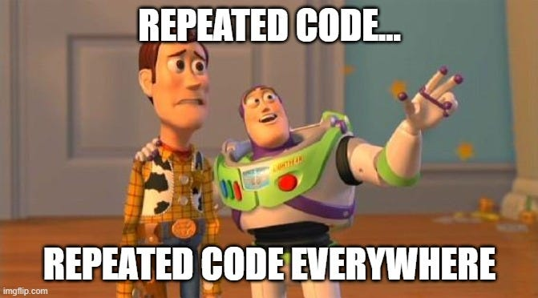
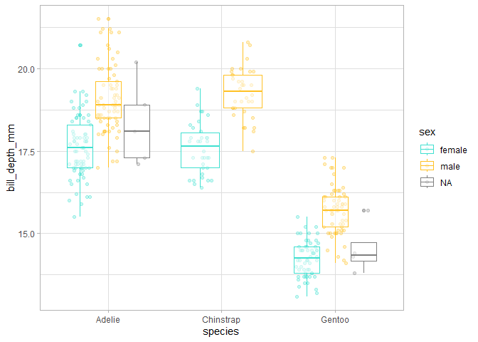

# Functional Programming with R
Julen Astigarraga and Verónica Cruz-Alonso
27/05/2024

- [<span class="toc-section-number">1</span>
  Introduction](#introduction)
  - [<span class="toc-section-number">1.1</span> Course
    structure](#course-structure)
  - [<span class="toc-section-number">1.2</span> Who we
    are?](#who-we-are)
- [<span class="toc-section-number">2</span> Introduction to programming
  in tidyverse](#introduction-to-programming-in-tidyverse)
  - [<span class="toc-section-number">2.1</span> Basic
    concepts](#basic-concepts)
  - [<span class="toc-section-number">2.2</span> Tidyverse](#tidyverse)
  - [<span class="toc-section-number">2.3</span> Scoping](#scoping)
- [<span class="toc-section-number">3</span> Introduction to Functional
  Programming](#introduction-to-functional-programming)
  - [<span class="toc-section-number">3.1</span> When do we have to use
    a function?](#when-do-we-have-to-use-a-function)
- [<span class="toc-section-number">4</span> Theory on functions in
  R](#theory-on-functions-in-r)
- [<span class="toc-section-number">5</span> How to write
  functions](#how-to-write-functions)
  - [<span class="toc-section-number">5.1</span> Arguments](#arguments)
  - [<span class="toc-section-number">5.2</span> Return
    values](#return-values)

## Introduction

The objectives of this course are:

- to learn how to write functions

- to apply functions in iterations using the library {purrr} from
  {tidyverse}

- to learn coding styles that facilitate script understanding (📝)

Within the model of the tools needed in a typical data science project
of Wickham and Grolemund
(<a href="#fig-datascience" class="quarto-xref">Figure 1</a>), this
course focuses in the envelope wrapping all the other tools, that is,
programming.


### Course structure

<table style="width:96%;">
<colgroup>
<col style="width: 75%" />
<col style="width: 20%" />
</colgroup>
<thead>
<tr class="header">
<th>Blocks</th>
<th>Day</th>
</tr>
</thead>
<tbody>
<tr class="odd">
<td><p>Course introduction</p>
<p>Refresh of tidyverse</p>
<p>Introduction to Functional Programming</p></td>
<td>27/05/24</td>
</tr>
<tr class="even">
<td><p>Theory of functions in R</p>
<p>How to write functions. Arguments and return values</p></td>
<td>27/05/24</td>
</tr>
<tr class="odd">
<td><p>Object-Oriented Programming</p>
<p>Functional Programming</p>
<p>Iterations over one argument</p></td>
<td>31/05/24</td>
</tr>
<tr class="even">
<td><p>Iterations over multiple arguments</p>
<p>Iterations without output</p>
<p>Functional operators and other functionals</p></td>
<td>31/05/24</td>
</tr>
</tbody>
</table>

### Who we are?



We coordinate the [Ecoinformatics Working
Group](https://ecoinfaeet.github.io/website/index.html) of the Spanish
Association of Terrestrial Ecology (AEET).

And you… who are you?

<https://www.menti.com/alsrpp5991gr>

## Introduction to programming in tidyverse

### Basic concepts

- Object: any element associated to a name. There are many different
  types: `numeric`, `integer`, `logical`, `data.frame`, `SpatVector`,
  etc.

``` r
library(tidyverse)
```

    ── Attaching packages ─────────────────────────────────────── tidyverse 1.3.2 ──
    ✔ ggplot2 3.4.2     ✔ purrr   1.0.1
    ✔ tibble  3.2.1     ✔ dplyr   1.1.2
    ✔ tidyr   1.3.0     ✔ stringr 1.5.0
    ✔ readr   2.1.2     ✔ forcats 0.5.1

    Warning: package 'ggplot2' was built under R version 4.2.3

    Warning: package 'tibble' was built under R version 4.2.3

    Warning: package 'tidyr' was built under R version 4.2.3

    Warning: package 'purrr' was built under R version 4.2.3

    Warning: package 'dplyr' was built under R version 4.2.3

    Warning: package 'stringr' was built under R version 4.2.3

    ── Conflicts ────────────────────────────────────────── tidyverse_conflicts() ──
    ✖ dplyr::filter() masks stats::filter()
    ✖ dplyr::lag()    masks stats::lag()

``` r
a <- c(1, 2, 3, 4)
b <- c(1, 2, 3, 4)
c <- c("hi", "hola", "hola", "hi")
d <- c(TRUE, TRUE, TRUE, FALSE, FALSE)

mymatrix_num <- matrix(c(a, b), nrow = 4, ncol = 2)
mymatrix_num
```

         [,1] [,2]
    [1,]    1    1
    [2,]    2    2
    [3,]    3    3
    [4,]    4    4

``` r
mymatrix_cha <- matrix(c(a, b, c), nrow = 4, ncol = 3)
mymatrix_cha
```

         [,1] [,2] [,3]  
    [1,] "1"  "1"  "hi"  
    [2,] "2"  "2"  "hola"
    [3,] "3"  "3"  "hola"
    [4,] "4"  "4"  "hi"  

``` r
mytibble <- tibble(a, b, c)
mytibble
```

    # A tibble: 4 × 3
          a     b c    
      <dbl> <dbl> <chr>
    1     1     1 hi   
    2     2     2 hola 
    3     3     3 hola 
    4     4     4 hi   

``` r
mylist <- list(a, b, c, d)
mylist
```

    [[1]]
    [1] 1 2 3 4

    [[2]]
    [1] 1 2 3 4

    [[3]]
    [1] "hi"   "hola" "hola" "hi"  

    [[4]]
    [1]  TRUE  TRUE  TRUE FALSE FALSE

``` r
mylist_from_tibble <- mytibble |> # list
  group_split(c)
mylist_from_tibble
```

    <list_of<
      tbl_df<
        a: double
        b: double
        c: character
      >
    >[2]>
    [[1]]
    # A tibble: 2 × 3
          a     b c    
      <dbl> <dbl> <chr>
    1     1     1 hi   
    2     4     4 hi   

    [[2]]
    # A tibble: 2 × 3
          a     b c    
      <dbl> <dbl> <chr>
    1     2     2 hola 
    2     3     3 hola 

``` r
mynested_tibble <- mytibble |> # data.frame with list-columns
  group_by(c) |> 
  nest()
mynested_tibble
```

    # A tibble: 2 × 2
    # Groups:   c [2]
      c     data            
      <chr> <list>          
    1 hi    <tibble [2 × 2]>
    2 hola  <tibble [2 × 2]>

> Names have objects; objects don’t have names
>
> — Hadley Wickham ([Advanced R](https://adv-r.hadley.nz/index.html))

In the example above, the length 4 numeric vector `c(1, 2, 3, 4)`
(object) have two names: “a” and “b”. By doing `mean(x = a)` we link the
value of “a” with the name “x” as well. This link is called a *promise*
in R: it is a promise to provide the value of “a”, if “x” is ever needed
within the `sum()` function.

📝Object names should be descriptive and can not have some special
characters (`^`, `!`, `$`, `@`, `+`, `-`, `/`, `*`).

📝R is sensitive to capital letters. In general, it is better to avoid
them.

- Functions: objects in R that take an input and give an output doing a
  specific action (specific functionality). Functions are the
  fundamental *building blocks* in R which is a functional programming
  language.

  

> To understand computation in R, this two truths are very useful:
>
> \- Everything that exist in R in an object.
>
> \- Everything that happen in R is the result of a function call.
>
> — John Chambers ([Advanced R](https://adv-r.hadley.nz/index.html))

- Libraries or packages: hold reusable functions, documentation on how
  to use them and example data. They are the fundamental units of
  reproducible code in R.

💡More info about Three Deep Truths About R
[here](https://www.r-bloggers.com/2018/06/three-deep-truths-about-r/).

### Tidyverse

[*Tidyverse*](https://www.tidyverse.org/) is a collection of R packages
(meta-package) initially developed by Hadley Wickham. It contains eight
main packages: `readr`, `tibble`, `dplyr`, `tidyr`, `stringr`,
`forcats`, `ggplot2` and `purrr`. *Tidyverse* can be considered a
dialect of the R programming language, and as such, it may be difficult
to learn for people with experience in base R. However, it is important
to know the basics of programming using *Tidyverse* for this course due
to consistency with the sections on iteration where we will primarily
use {purrr}.

*Tidyverse* is designed to support the activities of a human data
analyst, making its programming structures more logical for the human
mind. All the packages are designed to work with [*tidy
data*](https://cran.r-project.org/web/packages/tidyr/vignettes/tidy-data.html)
meaning data where each column is a variable, each row is an
observation, and each cell has a value. Additionally, the functions are
prepared to be concatenated using the *pipe* operator (`%>%` from
{magrittr} package or `|>` from base R), which takes what is on its left
and uses it as the first argument of the function on its right. This
allows for a left-to-right reading flow, which is more comfortable for
most people.

💡The two pipe operators have small
[differences](https://www.tidyverse.org/blog/2023/04/base-vs-magrittr-pipe/)
but in general their behaviour is the same.

``` r
myvector <- c(6, 4)
mean(myvector)
```

    [1] 5

``` r
myvector |> 
  mean() # CTRL+SHIFT+M - shortcut for the pipe
```

    [1] 5

``` r
length(unique(myvector)) # vs
```

    [1] 2

``` r
myvector |> unique() |> length()
```

    [1] 2

``` r
penguins <- palmerpenguins::penguins
penguins
```

    # A tibble: 344 × 8
       species island    bill_length_mm bill_depth_mm flipper_length_mm body_mass_g
       <fct>   <fct>              <dbl>         <dbl>             <int>       <int>
     1 Adelie  Torgersen           39.1          18.7               181        3750
     2 Adelie  Torgersen           39.5          17.4               186        3800
     3 Adelie  Torgersen           40.3          18                 195        3250
     4 Adelie  Torgersen           NA            NA                  NA          NA
     5 Adelie  Torgersen           36.7          19.3               193        3450
     6 Adelie  Torgersen           39.3          20.6               190        3650
     7 Adelie  Torgersen           38.9          17.8               181        3625
     8 Adelie  Torgersen           39.2          19.6               195        4675
     9 Adelie  Torgersen           34.1          18.1               193        3475
    10 Adelie  Torgersen           42            20.2               190        4250
    # ℹ 334 more rows
    # ℹ 2 more variables: sex <fct>, year <int>

``` r
summary(penguins)
```

          species          island    bill_length_mm  bill_depth_mm  
     Adelie   :152   Biscoe   :168   Min.   :32.10   Min.   :13.10  
     Chinstrap: 68   Dream    :124   1st Qu.:39.23   1st Qu.:15.60  
     Gentoo   :124   Torgersen: 52   Median :44.45   Median :17.30  
                                     Mean   :43.92   Mean   :17.15  
                                     3rd Qu.:48.50   3rd Qu.:18.70  
                                     Max.   :59.60   Max.   :21.50  
                                     NA's   :2       NA's   :2      
     flipper_length_mm  body_mass_g       sex           year     
     Min.   :172.0     Min.   :2700   female:165   Min.   :2007  
     1st Qu.:190.0     1st Qu.:3550   male  :168   1st Qu.:2007  
     Median :197.0     Median :4050   NA's  : 11   Median :2008  
     Mean   :200.9     Mean   :4202                Mean   :2008  
     3rd Qu.:213.0     3rd Qu.:4750                3rd Qu.:2009  
     Max.   :231.0     Max.   :6300                Max.   :2009  
     NA's   :2         NA's   :2                                 

``` r
View(penguins)

# filter
penguins |> 
  filter(island == "Dream") 
```

    # A tibble: 124 × 8
       species island bill_length_mm bill_depth_mm flipper_length_mm body_mass_g
       <fct>   <fct>           <dbl>         <dbl>             <int>       <int>
     1 Adelie  Dream            39.5          16.7               178        3250
     2 Adelie  Dream            37.2          18.1               178        3900
     3 Adelie  Dream            39.5          17.8               188        3300
     4 Adelie  Dream            40.9          18.9               184        3900
     5 Adelie  Dream            36.4          17                 195        3325
     6 Adelie  Dream            39.2          21.1               196        4150
     7 Adelie  Dream            38.8          20                 190        3950
     8 Adelie  Dream            42.2          18.5               180        3550
     9 Adelie  Dream            37.6          19.3               181        3300
    10 Adelie  Dream            39.8          19.1               184        4650
    # ℹ 114 more rows
    # ℹ 2 more variables: sex <fct>, year <int>

``` r
penguins |> 
  filter(island == "Dream" & body_mass_g > 4500) # Combining criteria
```

    # A tibble: 4 × 8
      species   island bill_length_mm bill_depth_mm flipper_length_mm body_mass_g
      <fct>     <fct>           <dbl>         <dbl>             <int>       <int>
    1 Adelie    Dream            39.8          19.1               184        4650
    2 Adelie    Dream            39.6          18.8               190        4600
    3 Chinstrap Dream            52.8          20                 205        4550
    4 Chinstrap Dream            52            20.7               210        4800
    # ℹ 2 more variables: sex <fct>, year <int>

``` r
penguins |> 
  filter(island %in% c("Dream", "Torgersen"))
```

    # A tibble: 176 × 8
       species island    bill_length_mm bill_depth_mm flipper_length_mm body_mass_g
       <fct>   <fct>              <dbl>         <dbl>             <int>       <int>
     1 Adelie  Torgersen           39.1          18.7               181        3750
     2 Adelie  Torgersen           39.5          17.4               186        3800
     3 Adelie  Torgersen           40.3          18                 195        3250
     4 Adelie  Torgersen           NA            NA                  NA          NA
     5 Adelie  Torgersen           36.7          19.3               193        3450
     6 Adelie  Torgersen           39.3          20.6               190        3650
     7 Adelie  Torgersen           38.9          17.8               181        3625
     8 Adelie  Torgersen           39.2          19.6               195        4675
     9 Adelie  Torgersen           34.1          18.1               193        3475
    10 Adelie  Torgersen           42            20.2               190        4250
    # ℹ 166 more rows
    # ℹ 2 more variables: sex <fct>, year <int>

``` r
# select
penguins |> 
  select(sex, body_mass_g)
```

    # A tibble: 344 × 2
       sex    body_mass_g
       <fct>        <int>
     1 male          3750
     2 female        3800
     3 female        3250
     4 <NA>            NA
     5 female        3450
     6 male          3650
     7 female        3625
     8 male          4675
     9 <NA>          3475
    10 <NA>          4250
    # ℹ 334 more rows

``` r
penguins |> 
  select(ends_with(c("mm", "g"))) # select variables with a text pattern
```

    # A tibble: 344 × 4
       bill_length_mm bill_depth_mm flipper_length_mm body_mass_g
                <dbl>         <dbl>             <int>       <int>
     1           39.1          18.7               181        3750
     2           39.5          17.4               186        3800
     3           40.3          18                 195        3250
     4           NA            NA                  NA          NA
     5           36.7          19.3               193        3450
     6           39.3          20.6               190        3650
     7           38.9          17.8               181        3625
     8           39.2          19.6               195        4675
     9           34.1          18.1               193        3475
    10           42            20.2               190        4250
    # ℹ 334 more rows

``` r
penguins |> 
  select(sex, body_mass_g, everything()) # use select to reorder variables
```

    # A tibble: 344 × 8
       sex    body_mass_g species island    bill_length_mm bill_depth_mm
       <fct>        <int> <fct>   <fct>              <dbl>         <dbl>
     1 male          3750 Adelie  Torgersen           39.1          18.7
     2 female        3800 Adelie  Torgersen           39.5          17.4
     3 female        3250 Adelie  Torgersen           40.3          18  
     4 <NA>            NA Adelie  Torgersen           NA            NA  
     5 female        3450 Adelie  Torgersen           36.7          19.3
     6 male          3650 Adelie  Torgersen           39.3          20.6
     7 female        3625 Adelie  Torgersen           38.9          17.8
     8 male          4675 Adelie  Torgersen           39.2          19.6
     9 <NA>          3475 Adelie  Torgersen           34.1          18.1
    10 <NA>          4250 Adelie  Torgersen           42            20.2
    # ℹ 334 more rows
    # ℹ 2 more variables: flipper_length_mm <int>, year <int>

``` r
# arrange
penguins |> 
  select(sex, body_mass_g) |> 
  arrange(body_mass_g)
```

    # A tibble: 344 × 2
       sex    body_mass_g
       <fct>        <int>
     1 female        2700
     2 female        2850
     3 female        2850
     4 female        2900
     5 female        2900
     6 female        2900
     7 female        2900
     8 female        2925
     9 <NA>          2975
    10 female        3000
    # ℹ 334 more rows

``` r
penguins |> 
  select(sex, body_mass_g) |> 
  arrange(desc(body_mass_g))
```

    # A tibble: 344 × 2
       sex   body_mass_g
       <fct>       <int>
     1 male         6300
     2 male         6050
     3 male         6000
     4 male         6000
     5 male         5950
     6 male         5950
     7 male         5850
     8 male         5850
     9 male         5850
    10 male         5800
    # ℹ 334 more rows

#### Exercise

1.  With the penguins dataset, create an object with individuals of the
    Adelie species and arrange the `data.frame` according to flipper
    length.

2.  Create an object from the previous one where you select the island
    and the variables related to the bill.

3.  Create an object from the one created in step 1 where you select
    everything except the species.

``` r
# mutate
penguins |> 
  mutate(bill_volume_mm2 = (bill_length_mm * bill_depth_mm) / 2) |> 
  select(bill_volume_mm2, everything())
```

    # A tibble: 344 × 9
       bill_volume_mm2 species island bill_length_mm bill_depth_mm flipper_length_mm
                 <dbl> <fct>   <fct>           <dbl>         <dbl>             <int>
     1            366. Adelie  Torge…           39.1          18.7               181
     2            344. Adelie  Torge…           39.5          17.4               186
     3            363. Adelie  Torge…           40.3          18                 195
     4             NA  Adelie  Torge…           NA            NA                  NA
     5            354. Adelie  Torge…           36.7          19.3               193
     6            405. Adelie  Torge…           39.3          20.6               190
     7            346. Adelie  Torge…           38.9          17.8               181
     8            384. Adelie  Torge…           39.2          19.6               195
     9            309. Adelie  Torge…           34.1          18.1               193
    10            424. Adelie  Torge…           42            20.2               190
    # ℹ 334 more rows
    # ℹ 3 more variables: body_mass_g <int>, sex <fct>, year <int>

``` r
penguins |>
  mutate(female_penguin = case_when(
    sex == "female" & body_mass_g < 3600 ~ "small female",
    sex == "female" & body_mass_g >= 3600 ~ "big female",
    TRUE ~ NA)) |>
  select(female_penguin, sex, body_mass_g)
```

    # A tibble: 344 × 3
       female_penguin sex    body_mass_g
       <chr>          <fct>        <int>
     1 <NA>           male          3750
     2 big female     female        3800
     3 small female   female        3250
     4 <NA>           <NA>            NA
     5 small female   female        3450
     6 <NA>           male          3650
     7 big female     female        3625
     8 <NA>           male          4675
     9 <NA>           <NA>          3475
    10 <NA>           <NA>          4250
    # ℹ 334 more rows

``` r
# summarise
# it is used with summary functions: n, n_distinct, mean, etc.
# see ?summarise

penguins |> 
  summarise(
    body_min = min(body_mass_g, na.rm = TRUE),
    body_max = max(body_mass_g, na.rm = TRUE)
  )
```

    # A tibble: 1 × 2
      body_min body_max
         <int>    <int>
    1     2700     6300

``` r
penguins |> 
  group_by(sex) |> 
  summarise(body_min = min(body_mass_g, na.rm = TRUE),
  body_max = max(body_mass_g, na.rm = TRUE))
```

    # A tibble: 3 × 3
      sex    body_min body_max
      <fct>     <int>    <int>
    1 female     2700     5200
    2 male       3250     6300
    3 <NA>       2975     4875

``` r
# join: left, right, full, inner

coordinates <- tibble(island = c("Dream", "Torgersen", "Biscoe"), 
  latitude = c("64°44′S", "64°46′S", "64°36′S"),
  longitude = c("64°14′W", "64°05′W", " 63°30′W"))

penguins |> 
  left_join(coordinates, by = "island") |> 
  select(island, latitude, longitude, everything())
```

    # A tibble: 344 × 10
       island    latitude longitude species bill_length_mm bill_depth_mm
       <chr>     <chr>    <chr>     <fct>            <dbl>         <dbl>
     1 Torgersen 64°46′S  64°05′W   Adelie            39.1          18.7
     2 Torgersen 64°46′S  64°05′W   Adelie            39.5          17.4
     3 Torgersen 64°46′S  64°05′W   Adelie            40.3          18  
     4 Torgersen 64°46′S  64°05′W   Adelie            NA            NA  
     5 Torgersen 64°46′S  64°05′W   Adelie            36.7          19.3
     6 Torgersen 64°46′S  64°05′W   Adelie            39.3          20.6
     7 Torgersen 64°46′S  64°05′W   Adelie            38.9          17.8
     8 Torgersen 64°46′S  64°05′W   Adelie            39.2          19.6
     9 Torgersen 64°46′S  64°05′W   Adelie            34.1          18.1
    10 Torgersen 64°46′S  64°05′W   Adelie            42            20.2
    # ℹ 334 more rows
    # ℹ 4 more variables: flipper_length_mm <int>, body_mass_g <int>, sex <fct>,
    #   year <int>

#### Exercise

1.  With the penguins dataset, count the number of cases on each island
    and calculate the mean flipper length for each island.

2.  Calculate the ratio between the weight in kg and the flipper length
    for each individual.

### Scoping

[Scoping](https://adv-r.hadley.nz/functions.html?q=lexica#lexical-scoping)
is the set of rules that govern how to look up the value of a symbol in
the environment in each programming language. R uses *lexical scoping*
and there are four basic rules: name masking, functions versus
variables, a fresh start and dynamic lookup. A deeper understanding of
scoping will help us to use more advanced functional programming tools.

In relation to name masking, the basic principle of lexical scoping is
that names defined inside a function mask names defined outside a
function.

``` r
x <- 10
y <- 20

myfunction <- function() {
  x <- 1
  y <- 2
  x + y
}

myfunction()
```

    [1] 3


In general, with base R, we can only call objects that are part of the
environment (env-variables); however, with *tidyverse*, we can also call
variables within tables (data-variables). This feature called *data
masking* simplifies the code in *tidyverse*, but the advantage does not
come for free and has implications for the grammar of the functions as
we will see later.

``` r
penguins |> filter(island == "Dream", species == "Chinstrap") 
```

    # A tibble: 68 × 8
       species   island bill_length_mm bill_depth_mm flipper_length_mm body_mass_g
       <fct>     <fct>           <dbl>         <dbl>             <int>       <int>
     1 Chinstrap Dream            46.5          17.9               192        3500
     2 Chinstrap Dream            50            19.5               196        3900
     3 Chinstrap Dream            51.3          19.2               193        3650
     4 Chinstrap Dream            45.4          18.7               188        3525
     5 Chinstrap Dream            52.7          19.8               197        3725
     6 Chinstrap Dream            45.2          17.8               198        3950
     7 Chinstrap Dream            46.1          18.2               178        3250
     8 Chinstrap Dream            51.3          18.2               197        3750
     9 Chinstrap Dream            46            18.9               195        4150
    10 Chinstrap Dream            51.3          19.9               198        3700
    # ℹ 58 more rows
    # ℹ 2 more variables: sex <fct>, year <int>

``` r
penguins[penguins$island == "Dream" & penguins$species == "Chinstrap", ]
```

    # A tibble: 68 × 8
       species   island bill_length_mm bill_depth_mm flipper_length_mm body_mass_g
       <fct>     <fct>           <dbl>         <dbl>             <int>       <int>
     1 Chinstrap Dream            46.5          17.9               192        3500
     2 Chinstrap Dream            50            19.5               196        3900
     3 Chinstrap Dream            51.3          19.2               193        3650
     4 Chinstrap Dream            45.4          18.7               188        3525
     5 Chinstrap Dream            52.7          19.8               197        3725
     6 Chinstrap Dream            45.2          17.8               198        3950
     7 Chinstrap Dream            46.1          18.2               178        3250
     8 Chinstrap Dream            51.3          18.2               197        3750
     9 Chinstrap Dream            46            18.9               195        4150
    10 Chinstrap Dream            51.3          19.9               198        3700
    # ℹ 58 more rows
    # ℹ 2 more variables: sex <fct>, year <int>

``` r
mean(x = 1:10)
```

    [1] 5.5

``` r
mean(x = values)
```

    Error in mean(x = values): object 'values' not found

``` r
mydata <- tibble(values = 1:10)
mean(x = values)
```

    Error in mean(x = values): object 'values' not found

``` r
mean(x = mydata$values)
```

    [1] 5.5

``` r
misdatos |> 
  summarise(mean = mean(values))
```

    Error in summarise(misdatos, mean = mean(values)): object 'misdatos' not found


## Introduction to Functional Programming

The growing availability of data and the versatility of analysis
software have led to an increase in the quantity and complexity of the
analyses we conduct in biological sciences. This makes efficiency in the
process of data management and analysis increasingly necessary. One
possible way to optimize these processes and reduce work time for R
users is function-based programming. Functions allow the automation of
common tasks (for example, reading different databases), simplifying the
code.

A function can be called through another function and the process can be
iterated, making R a very powerful tool. Iterations are used to perform
the same action on multiple inputs. There are two main paradigms of
iteration: object-oriented programming (OOP) and functional programming
(FP). In this workshop, we will primarily focus on functional
programming and learn to use the {purrr} package, which provides
functions to eliminate many common loops.

``` r
df <- penguins |> 
  select(bill_length_mm, bill_depth_mm, flipper_length_mm, body_mass_g)

df_rescaled1 <- df |> 
  mutate(bill_length_mm = (bill_length_mm - min(bill_length_mm, na.rm = TRUE)) / (max(bill_length_mm, na.rm = TRUE) - min(bill_length_mm, na.rm = TRUE)),
    bill_depth_mm = (bill_depth_mm - min(bill_depth_mm, na.rm = TRUE)) / (max(bill_depth_mm, na.rm = TRUE) - min(bill_length_mm, na.rm = TRUE)),
    flipper_length_mm = (flipper_length_mm - min(flipper_length_mm, na.rm = TRUE)) / (max(flipper_length_mm, na.rm = TRUE) - min(flipper_length_mm, na.rm = TRUE)),
    body_mass_g = (body_mass_g - min(body_mass_g, na.rm = TRUE)) / (max(body_mass_g, na.rm = TRUE) - min(body_mass_g, na.rm = TRUE)))
    
View(df_rescaled1)

#
rescale01 <- function(x) {
  rng <- range(x, na.rm = TRUE)   
  (x - rng[1]) / (rng[2] - rng[1]) 
} 

df_rescaled2 <- df |> 
  mutate(bill_length_mm = rescale01(bill_length_mm),
    bill_depth_mm = rescale01(bill_depth_mm),
    flipper_length_mm = rescale01(flipper_length_mm), 
    body_mass_g = rescale01(body_mass_g))  

View(df_rescaled2)

#
df_rescaled3 <- lapply(df, rescale01)

head(df_rescaled3$bill_length_mm)
```

    [1] 0.2545455 0.2690909 0.2981818        NA 0.1672727 0.2618182

The main advantages of functional programming (use of functions and
iterations) are:

1.  Ease of understanding the code’s intent, thereby improving
    comprehension for oneself, collaborators, and reviewers:

    - Functions have evocative names.

    - The code is more organized.

2.  Speed in making changes, as functions are independent pieces that
    solve a specific problem.

3.  Reduction of error probability.

### When do we have to use a function?

It is recommended to follow the “do not repeat yourself” principle ([DRY
principle](https://en.wikipedia.org/wiki/Don%27t_repeat_yourself#:~:text=%22Don't%20repeat%20yourself%22,redundancy%20in%20the%20first%20place.)):
each unit of knowledge or information should have a single, unambiguous,
and authoritative representation within a system.

Writing a function is worthwhile when you have copied and pasted the
same code more than twice (don’t be WET! - Write Everything Twice). The
more times a piece of code is repeated in different places, the more you
will need to update it if there is a change, and the higher the
likelihood of errors.

## Theory on functions in R

Functions have three components:

- `body()`: the code inside the function.
- `formals()`: the list of arguments that control how the function is
  executed.
- `environment()`: the structure that supports the *scoping* of the
  function, i.e., the environment where the function is located.

``` r
body(rescale01)
```

    {
        rng <- range(x, na.rm = TRUE)
        (x - rng[1])/(rng[2] - rng[1])
    }

``` r
formals(rescale01)
```

    $x

``` r
environment(rescale01)
```

    <environment: R_GlobalEnv>

``` r
f <- function(x) {
  x + y
}

y <- 100
f(x = 10)
```

    [1] 110

``` r
y <- 1000
f(10)
```

    [1] 1010

**Primitive functions** are the exception as they do not have the
aforementioned components. They are written in C instead of R and only
appear in the base package. They are more efficient but behave
differently from other functions, so the R Core Team tries not to create
new primitive functions. The rest of the functions follow the structure
outlined above.

``` r
sum
```

    function (..., na.rm = FALSE)  .Primitive("sum")

``` r
body(sum)
```

    NULL

According to the type of output, there are two types of functions:

- **Transformation functions**: transform the object that enters the
  function (the first argument) and return another object or the
  original one with modifications. Functionals are special types of
  transformation functions.

- **Side-effect functions**: have side effects and perform an action,
  such as saving a file or drawing a plot. Some commonly used examples
  are: `library()`, `setwd()`, `plot()`, `write_delim()`… These
  functions invisibly return the output, which is not saved but can be
  used in a pipeline.

In general, syntactically, functions have three components:

- The function `function()` (primitive)
- Arguments: list of inputs.
- Body: the piece of code that follows `function()`, traditionally
  enclosed in curly braces.

``` r
name1_v1 <- function(x, y) {
  paste(x, y, sep = "_")
}  

name1_v2 <- function(x, y) paste(x, y, sep = "_")  

name1_v3 <- \(x, y) paste(x, y, sep = "_")  

name1_v1("Vero", "Cruz") 
```

    [1] "Vero_Cruz"

``` r
name1_v2("Vero", "Cruz") 
```

    [1] "Vero_Cruz"

``` r
name1_v3("Vero", "Cruz") 
```

    [1] "Vero_Cruz"

📝If the function has more than two lines, it is better to always use
curly braces to clearly delimit it. The opening brace should never be
alone, but the closing one should be (except with `else`). Indentation
also greatly helps to understand the hierarchy of the code within
functions. In this regard, we recommend using *Code \> Reindent
lines/Reformat code* in the RStudio menu.

💡Infix operators (`+`), flow control operators (`for`, `if`),
subsetting operators (`[ ]`, `$`), assignment operators (`<-`) or even
curly braces (`{ }`) are also functions. The backtick “\`” allows to
refer to functions or variables that otherwise have “illegal” names.

``` r
3 + 2 
```

    [1] 5

``` r
`+`(3, 2)  
```

    [1] 5

``` r
for (i in 1:2) print(i) 
```

    [1] 1
    [1] 2

``` r
`for`(i, 1:2, print(i)) 
```

    [1] 1
    [1] 2

In general, functions have a name that is executed when needed, as we
have seen so far, but this is not mandatory. Some packages, such as
{purrr}, or functions from the `apply` family, allow the use of
anonymous functions for iteration.

``` r
nxcase <- lapply(penguins, function(x) length(unique(x)))

models <- penguins|>
  group_split(species) |>
  map(\(df) lm(body_mass_g ~ bill_length_mm, data = df)) 
```

📝It is better to reserve the use of anonymous functions for short and
simple functions. If the function is long, spans multiple lines or we
need to use it many times it is better to give it a name.

## How to write functions

#### Exercise

Create your first function that fulfills the functionality of dividing
any value by 100.

💡Shortcut to write functions: write word “fun” + tab.

Imagine that for a dataset we want to visualize the distribution for
each numerical variable, based on other categorical variables that
particularly interests us.

``` r
penguins_num <- penguins |> 
  select(species, sex, where(is.numeric))

# we are interested in differences among species and between sexes 

ggplot(penguins_num, aes(x = species, y = bill_length_mm, color = sex)) +
  geom_point(position = position_jitterdodge(), alpha = 0.3) +
  geom_boxplot(alpha = 0.5) +
  scale_color_manual(values = c("turquoise", "goldenrod1")) +
  theme_light()
```


``` r
ggplot(penguins_num, aes(x = species, y = bill_depth_mm, color = sex)) +
  geom_point(position = position_jitterdodge(), alpha = 0.3) +
  geom_boxplot(alpha = 0.5) +
  scale_color_manual(values = c("turquoise", "goldenrod1")) +
  theme_light()
```


``` r
ggplot(penguins_num, aes(x = species, y = flipper_length_mm, color = sex)) +
  geom_point(position = position_jitterdodge(), alpha = 0.3) +
  geom_boxplot(alpha = 0.5) +
  scale_color_manual(values = c("turquoise", "goldenrod1")) +
  theme_light()
```


``` r
# etc
```

We have copied a code more than twice to perform the same action (i.e.,
a plot to see how a variable is distributed based on two others that
remain constant), so we should consider the possibility that we need a
function. Next, we will follow some simple steps to transform any
repeated code into a function.

1.  Analyze the code: what are the replicated parts? How many inputs do
    we have? Which inputs vary and which do not?

2.  Simplify and reanalyze duplications.

``` r
var <- penguins_num$bill_length_mm

ggplot(penguins_num, aes(x = species, y = var, color = sex)) +
  geom_point(position = position_jitterdodge(), alpha = 0.3) +
  geom_boxplot(alpha = 0.5) +
  scale_color_manual(values = c("turquoise", "goldenrod1")) +
  theme_light()
```


``` r
var <- body_mass_g
```

    Error in eval(expr, envir, enclos): object 'body_mass_g' not found

``` r
var <- "body_mass_g"

ggplot(penguins_num, aes(x = species, y = .data[[var]], color = sex)) +
  geom_point(position = position_jitterdodge(), alpha = 0.3) +
  geom_boxplot(alpha = 0.5) +
  scale_color_manual(values = c("turquoise", "goldenrod1")) +
  theme_light() +
  ylab(var)
```


👀 `ggplot()` needs arguments (data-variables) that are within the data
frame it will represent. To generalize the function, we have associated
the name of the variable (of type character) to the name “var”, but
`ggplot()` does not accept characters. Therefore, we need to use an
intermediate function that does accept them.

📝 Creating objects with intermediate calculations within a function is
good practice because it makes the code clearer about what the function
is doing. It is common when the function contains if/else statements.

3.  Choose a name for the function (📝). Ideally, it should be short and
    evoke what the function does. In general, it should be a verb
    (e.g. impute_values) and the argument names are nouns (e.g. “data”,
    “variable”, etc.). Using a noun for a function is allowed if the
    function calculates something well-known (e.g. `mean()`) or if it
    serves to access parts of an object (e.g. `residuals()`). It is also
    recommended to avoid very generic verbs (e.g. “calculate”), and if
    the name has multiple words, to separate them with an underscore, a
    dot or use camelCase, but be consistent. If you program several
    function that do similar things, it is recommended to use the same
    prefix for all of them (e.g. “str\_” in {stringr} package).

    The more clearly you can express the intention of your code through
    function names, the more easily others, including yourself in the
    future, will be able to read and understand the code.

``` r
# examples of names to avoid

T <- FALSE
c <- 10
mean <- function(x) sum(x)

rm(T, c, mean)
```

4.  Enumerate the arguments within `function()` and put the simplified
    code inside the curly braces.

``` r
explore_penguins <- function (var) {
  ggplot(penguins_num, aes(x = species, y = .data[[var]], color = sex)) +
    geom_point(position = position_jitterdodge(), alpha = 0.3) +
    geom_boxplot(alpha = 0.5) +
    scale_color_manual(values = c("turquoise", "goldenrod1")) +
    theme_light() +
    ylab(var) 
}
```

📝 Use comments (#) to explain the reasoning behind your functions.
Avoid explaining what the function is doing or how, as the code itself
already communicates that. It is also recommended to use \# to separate
sections (Cmd/Ctrl + Shift + R).

5.  Try with different inputs.

``` r
explore_penguins(var = "body_mass_g") 
```

    Warning: Removed 2 rows containing non-finite values (`stat_boxplot()`).

    Warning: Removed 2 rows containing missing values (`geom_point()`).


``` r
explore_penguins(var = "flipper_length_mm") 
```

    Warning: Removed 2 rows containing non-finite values (`stat_boxplot()`).
    Removed 2 rows containing missing values (`geom_point()`).


``` r
explore_penguins(var = "bill_depth_mm")
```

    Warning: Removed 2 rows containing non-finite values (`stat_boxplot()`).
    Removed 2 rows containing missing values (`geom_point()`).



💡You may want to convert these tests into formal tests. In complex
functions, tests are useful to ensure that even if you make changes, the
functionality has not been broken. If you’re interested, check out this
link: <a href="#0" class="uri">https://r-pkgs.org/testing-bas</a>

#### Exercise

Create a function to standardize (i.e., subtract the mean and divide by
the standard deviation) the numerical variables of the penguins dataset.

### Arguments

In general, there are two groups: those that specify the **data** and
those that specify **details** of the function’s execution. Typically,
those specifying data come first, followed by detail arguments. The
latter group often has default values (the most common ones), for when
nothing is specified.

<!--# See quantile() help -->

📝 The argument names should be short and descriptive. There are some
names commonly used but non descriptive that are already known to most
users, and it’s fine to take advantage of them.

- `x, y, z`: vectors

- `w`: vector of weights

- `df`: data frame

- `i, j`: numerical indices, rows and columns, respectively

- `n`: length or row numbers

- `p`: column number

- `na.rm`: not available values

When executing the function, arguments can be specified using the full
name, a unequivocal abbreviation, or the order of their position
(*unnamed* arguments), with this sequence (name \> abbreviation \>
position) being the priority order when matching arguments with what is
written.

📝 Generally, only positional order is used to specify the first
arguments, the most common ones that everyone knows. If a default value
for a detail argument is changed, it is advisable to always use the full
name of the argument.

📝Using spaces before and after `=` and after `,` makes it much easier
to identify the arguments of the function and, in general, all
components.

``` r
set.seed(123)
mean(rnorm(10, mean = 50, sd = 25) / 12, trim = 0.2)
```

    [1] 3.966805

``` r
set.seed(123)
mean(rnorm(10,mean=50,sd=25)/12,trim=0.2)
```

    [1] 3.966805

There is a special argument called `…`, which captures any other
argument that does not correspond to those named in the function. It is
used to pass arguments to other functions in our function.

``` r
?plot

plot(1:5, 1:5)

plot(1:5, 1:5, main = "I am using an argument of title()")
```

📝 Using `…` make functions being very flexible, but it makes necessary
to carefully read the function documentation to use it. In addition, if
there is a typo in an argument name, we don’t get an error message.

``` r
sum(1, 2, 5, na.mr = TRUE)
```

    [1] 9

``` r
sum(1, 2, NA, na.mr = TRUE)
```

    [1] NA

### Return values

The last expression executed in a function is the return value. It is
the result of executing the function, unless `invisible()` is specified.
Functions return only one object. If you want to obtain more, they must
be grouped in one list.

<!--# Can you thik of any case where using invisible() would be useful? -->

📝 The function `return()` is used to explicity show what do you want to
get from a function. It is recommended to use it when the return is not
expected at the end of the function. For example, in the branches of an
if/else structure, especially if there is a long and complex branch.

#### Exercise

How would you generalize the function `explore_penguins()` so you can
use any data frame as input?

<details>
<summary>
Session Info
</summary>

``` r
Sys.time()
```

    [1] "2024-05-27 12:22:12 CEST"

``` r
sessionInfo()
```

    R version 4.2.2 (2022-10-31 ucrt)
    Platform: x86_64-w64-mingw32/x64 (64-bit)
    Running under: Windows 10 x64 (build 19045)

    Matrix products: default

    locale:
    [1] LC_COLLATE=English_United Kingdom.utf8 
    [2] LC_CTYPE=English_United Kingdom.utf8   
    [3] LC_MONETARY=English_United Kingdom.utf8
    [4] LC_NUMERIC=C                           
    [5] LC_TIME=English_United Kingdom.utf8    

    attached base packages:
    [1] stats     graphics  grDevices utils     datasets  methods   base     

    other attached packages:
    [1] forcats_0.5.1   stringr_1.5.0   dplyr_1.1.2     purrr_1.0.1    
    [5] readr_2.1.2     tidyr_1.3.0     tibble_3.2.1    ggplot2_3.4.2  
    [9] tidyverse_1.3.2

    loaded via a namespace (and not attached):
     [1] tidyselect_1.2.0     xfun_0.39            haven_2.5.0         
     [4] gargle_1.2.0         colorspace_2.1-0     vctrs_0.6.3         
     [7] generics_0.1.3       htmltools_0.5.3      yaml_2.3.5          
    [10] utf8_1.2.3           rlang_1.1.1          pillar_1.9.0        
    [13] withr_2.5.0          glue_1.6.2           DBI_1.1.3           
    [16] palmerpenguins_0.1.1 dbplyr_2.2.1         modelr_0.1.8        
    [19] readxl_1.4.0         lifecycle_1.0.3      munsell_0.5.0       
    [22] gtable_0.3.3         cellranger_1.1.0     rvest_1.0.2         
    [25] evaluate_0.18        labeling_0.4.2       knitr_1.40.1        
    [28] tzdb_0.3.0           fastmap_1.1.0        fansi_1.0.4         
    [31] broom_1.0.0          backports_1.4.1      scales_1.2.1        
    [34] googlesheets4_1.0.0  jsonlite_1.8.0       farver_2.1.1        
    [37] fs_1.5.2             hms_1.1.1            digest_0.6.29       
    [40] stringi_1.7.12       grid_4.2.2           cli_3.6.1           
    [43] tools_4.2.2          magrittr_2.0.3       crayon_1.5.2        
    [46] pkgconfig_2.0.3      ellipsis_0.3.2       xml2_1.3.3          
    [49] reprex_2.0.1         googledrive_2.0.0    lubridate_1.8.0     
    [52] assertthat_0.2.1     rmarkdown_2.16       httr_1.4.3          
    [55] rstudioapi_0.13      R6_2.5.1             compiler_4.2.2      

</details>
